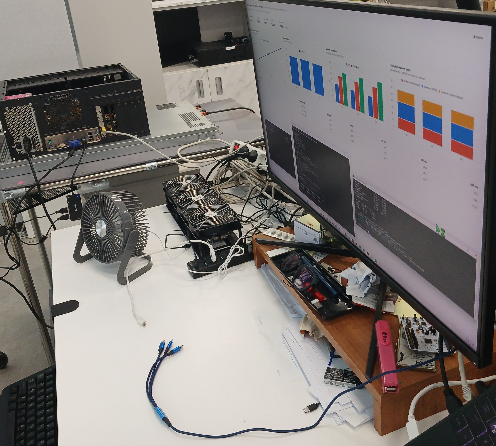
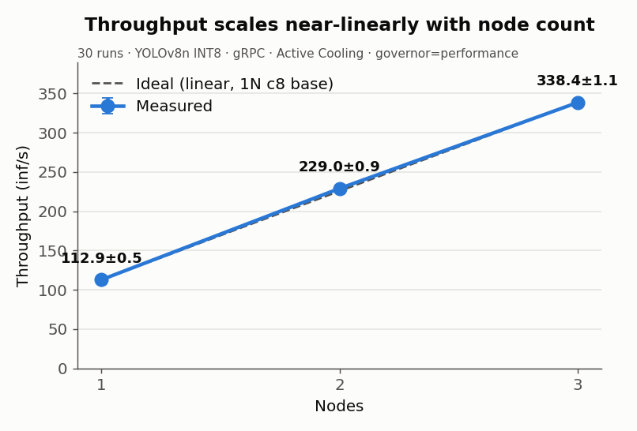

# NPUDure

*[한국어 README](README.ko.md)*

> **The name.** *Dure* (두레) was a Korean village labour cooperative — farming
> households pooling their hands so that work none of them could finish alone
> got finished together. Cheap NPUs are pooled here for the same reason.
>
> **The project started out as NPUForge.** Only the name changed — same
> project, same code, same measurements. The crate names, source identifiers
> and recorded results still read `npuforge`, and are left that way on
> purpose: the 421 measurements were taken under that name, and the record
> should keep the name it was recorded under.

**Do three 6 TOPS NPUs actually give you 18?**

NPUDure is an open-source distributed inference runtime in Rust that spreads
independent inference requests across several low-cost edge NPUs over ordinary
Ethernet and standard gRPC — no custom transport, no RDMA, no kernel bypass.

We ran **421 valid hardware measurements, with zero inference errors in the
valid runs**, to find out where scale-out performance actually goes.

Short answer: **it scales.** The interesting part is everything that almost
stopped it.

---



*The actual rig the measurements came from. Scheduler host on the left,
three NanoPi R76S boards with their cooling fans in the centre, and the
dashboard mid-run on the right. Twenty photographs are in
[`results/photos-public/`](results/photos-public/).*

## Results

Three NanoPi R76S boards (Rockchip RK3576, 6 TOPS each), YOLOv8n INT8,
2.5 GbE per node, a separate x86 scheduler (Dell PowerEdge R620, dual Xeon
E5-2630L, 24 threads, 10 GbE) — the three-node traffic converges there, so
2.5 GbE is not enough.

**Thread count on the scheduler host matters more than clock speed.** We
found this the hard way when the host was replaced: a faster-per-core
8-thread desktop produced 7.5% *less* throughput than the 24-thread server,
because the load generator shares that CPU with the scheduler. Sixteen
threads or more is what we would recommend
([§3.3.4](docs/02-HARDWARE-SETUP.md)).

Photographs of the actual rig are in
[`results/photos-public/`](results/photos-public/). Host specifications are
in [`docs/hosts/`](docs/hosts/).

> **The scheduler host was replaced on 2026-08-26.** All 421 measurements
> come from the R620 above and stand as recorded. The replacement host
> yields a different baseline; see
> [`docs/infrastructure.md`](docs/infrastructure.md) §3.2.1.

| | Result | Report |
|---|---|---|
| **Near-linear scale-out** | **3.00×** — 112.9 / 229.0 / 338.4 inf/s (30 runs) | [S2](docs/experiments/S2_GRPC_BASELINE.md) |
| **Tuned transport** | **387.2 inf/s** (+13.3%) — but efficiency fell 98.9% → **95.3%** | [S3.8](docs/experiments/S3_8_OPTIMIZED_SCALEOUT.md) |
| Where the loss went | **in the tail** — p50 flat, p99 **+36%** | [S3.9a](docs/experiments/S3_9A_SCALEOUT_PROFILE.md) |
| Sustained load | active cooling −1.9% vs fanless −11.3% over 31 min | [S0](docs/experiments/S0_SUSTAINED_LOAD.md) |
| Scheduling | a herding bug in our own defaults; fixing it cut p99 **−37%** | [S0-C](docs/experiments/S0_C_POLICY_AB.md) |
| **io_uring** | **not implemented — the measurement argued against it** | [S3.9b](docs/experiments/S3_9B_NODE_RESIDUAL.md) |

> **Absolute throughput and scaling efficiency move in opposite directions.**
> Tuning the transport bought 13.3% more throughput and cost 3.6 points of
> scaling efficiency. Quoting either number alone hides the trade-off, so this
> repository always reports both — with the measurement conditions attached.

**Start here → [`docs/experiments/README.md`](docs/experiments/README.md)** —
the experiment ledger: what each experiment asked, what was ruled out and
under which conditions, and every raw dataset mapped to its experiment.

---

## Four things we did not expect

### 1. Optimizing outside the operating point inverted our conclusion

Comparing connection counts at a fixed high load told us that more connections
wreck tail latency. That measurement was correct — and useless, because the
load we picked was **overload for every configuration under test**. Re-measured
at the operating point, the same change *improved* tail latency by 18.8%.

The sign of the conclusion flipped. We kept the overload data, relabelled it
"overload behaviour", and stopped using it for operating decisions.

### 2. Same temperature, different results

We assumed thermal heterogeneity came from boards running at different
temperatures. It doesn't. Across three fanless experiments, peak SoC
temperature was nearly identical (**~86 °C**) while the observed node-latency
spread ranged from **1.10× to 2.40×**. Temperature alone did not determine it.

What tracked the spread was how far clock throttling *diverged* between
boards — and thermal control targets temperature, not divergence. **Thermal
control was not a deterministic way to reproduce the heterogeneity**, so
heating longer did not help.

We then built a deterministic fixture with CPU frequency caps that reproduces
any spread from 1.12× to 3.93× on demand.

### 3. Our scheduler was herding on stale state

Load-aware policies *collapsed* throughput by 55–58% against round-robin.
The policies were not wrong; they were deciding on heartbeat state that was
already out of date, so every scheduler instance picked the same "idle" node
at the same moment. After switching to a locally-tracked in-flight counter,
adaptive scheduling cut p99 latency by 37% and evened per-node latency spread
from 1.33× to 1.00×.

This was a bug in our default configuration. It took a policy A/B to find it.

### 4. We planned io_uring, measured, and didn't build it

The plan said: profile CPU, measure syscall and copy cost, then implement
io_uring. We did the first two.

```
transport cost          16.35 CPU-ms per request
  user   9.37 ms (57%)  serialization, user-space copy, HTTP/2 framing
  kernel 6.99 ms (43%)  syscall entry, TCP stack, copy_to_user

network syscalls        ~165 per request
syscall entry           ~0.17 ms = 1.0% of transport cost
board CPU under load    48.9% idle, no core saturated
```

Even assuming io_uring eliminates a 1.2 MB copy in both directions, the total
reachable slice is about 8% of transport cost — and recovering it buys nothing,
because **CPU here is a cost, not a constraint.** Reducing consumption of an
unsaturated resource does not raise throughput.

We recorded the decision in the spec rather than the commit log.

---

## Figures

| | |
|---|---|
|  |  |
| **3.00× near-linear** (S2) | **+13.3% absolute, 98.9 → 95.3% efficiency** (S3.8) |
|  |  |
| **Cooling decides sustained throughput** (S0) | **Round-robin's tail is unpredictable when nodes differ** (S0-C) |

Regenerate: `python scripts/make-experiment-figures.py`

---

## Limitations — read these first

We would rather you find these here than in the comments.

- **Three nodes.** Whether these conclusions hold at four or more is unmeasured.
- **Small repetition counts.** Most configurations are 3–4 runs. Percentile
  differences have small SD and are usable; **throughput differences under 1%
  were never used to rank anything.**
- **Percentiles are run-level averages, not pooled.** This dilutes each run's
  worst window, so tail numbers read low. Valid for comparing conditions,
  invalid as "the p99 of this system".
- **The residual 16.1% is not explained.** Local direct inference reaches
  161.5 inf/s; the operating point reaches 135.5. It looks like path latency
  rather than CPU cost — the 1.2 MB payload alone costs ~8.2 ms round trip on
  a 2.5 GbE link — but we did not pin it down.
- **`perf` is unavailable on these boards** (vendor kernel), so there is no
  symbol-level profile. The CPU split comes from `/proc/PID/stat`.
- **No authentication, no TLS.** gRPC is plaintext and node registration is
  unverified. This is scoped for a trusted private network, not a hostile one --
  a boundary, not a defect.
- **Most detailed documentation is in Korean.** This file and the figures are
  the English entry point.

---

## What this is, and isn't

**Is:** data-parallel distribution of independent requests, load-aware
scheduling, automatic exclusion and re-admission of failed nodes, per-stage
latency breakdown, reproducible benchmarks with raw data published.

**Isn't:** making several NPUs look like one device, reducing the latency of a
*single* request, layer-wise model partitioning or LLM tensor parallelism, or
general-purpose orchestration.

---

## Try it without hardware

The Mock backend is a design requirement, not a convenience. The full workspace
builds and tests on x86 without the RKNN SDK.

### Prerequisites

| | |
|---|---|
| **Rust** | stable toolchain (`rust-toolchain.toml` pins the channel) |
| **protoc** | **required** — the gRPC definitions are compiled at build time |
| Network | crates.io access. Dependencies are version-pinned by `Cargo.lock` but not vendored |

```bash
# protoc — pick your platform
sudo apt install protobuf-compiler     # Ubuntu / Debian
sudo dnf install protobuf-compiler     # Rocky / RHEL / Fedora
brew install protobuf                  # macOS
winget install protobuf                # Windows
```

Without `protoc` the build stops at `npuforge-proto` with an explicit
message naming the missing tool — it does not fail silently.

```bash
git clone https://github.com/seongkyounyoo/npudure.git
cd npudure

cargo test --workspace         # passes without the RKNN SDK

cargo run -p npuforge-scheduler -- --config configs/scheduler.example.toml
cargo run -p npuforge-node      -- --config configs/mock/node-01.toml
```

The three mock nodes in `configs/mock/` are deliberately given different speeds
and error rates, so the difference between round-robin and ECT shows up
locally.

### On real hardware

```bash
export RKNN_SDK_PATH=/path/to/rknn/include
export RKNN_LIB_PATH=/path/to/rknn/lib
cargo build-node    # --release --target aarch64-unknown-linux-gnu --features rknn
```

The `rknn` feature is off by default. A binary built without it fails loudly at
startup if given an RKNN config, rather than silently falling back.

> **Reproducibility, honestly stated.** The measurement harnesses in `scripts/`
> are written against this specific four-machine setup (three boards plus a
> scheduler host, reachable by SSH alias). They are published so the *method*
> is inspectable and the raw data is checkable — not as a turnkey suite that
> will run elsewhere unchanged.

---

## Scheduling policies

| id | policy | note |
|---|---|---|
| `round-robin` | Round Robin | comparison baseline |
| `least-queue` | Least Queue | shortest queue wins |
| `ect` | Estimated Completion Time | **default** |

```text
ECT = ((queue_depth + in_flight + 1) × EWMA_inference
       + EWMA_network + thermal_penalty + error_penalty) / load_factor
```

All three share the same candidate filter. If the filters differed, a policy
A/B would be measuring the filters instead of the policies.

Under heterogeneity, `least-queue` and `ect` both work and neither dominates:
ECT is slightly ahead on throughput, LQ slightly ahead on tail. The default
stays `ect`. Whether that is right at strong heterogeneity is **still open** —
[S0-D](docs/experiments/S0_D_CAPACITY_HETERO.md) built the fixture to answer it
and we deliberately stopped there.

---

## How this project measures

The methodology is the part most likely to be useful to you, whatever hardware
you have. Full list in
[`docs/experiments/README.md`](docs/experiments/README.md) §4.

- **Optimize at the operating point, not in the overload region.** A fixed-load
  comparison can show overload behaviour rather than a configuration effect.
- **Exclusion is conditional.** A ruled-out bottleneck reopens when conditions
  change. Every verdict carries the conditions it was reached under.
- **Decision rules are fixed before the results arrive** and are not moved to
  fit them. When a rule fails to fire, that is also a result.
- **Turn silent failures loud.** Node count is verified by probe traffic, not
  by process existence. Config injection is verified by reading it back.
- **Instruments can be measuring the wrong quantity.** Ours did on six
  documented occasions during this campaign — each named in
  [`docs/experiments/README.md`](docs/experiments/README.md) §4.13.
  Moving a threshold to fit results and fixing a broken instrument are
  different acts; we document which one we did.
- **Derived numbers that humans maintain will diverge.** Run totals and
  percentages are computed by scripts, with the source recorded.

---

## Documentation

| | |
|---|---|
| **[`docs/experiments/README.md`](docs/experiments/README.md)** | **Experiment ledger — start here.** Questions, exclusions, raw-data map, methodology |
| [`adrs/`](adrs/README.md) | 28 architecture decision records |
| [`docs/experiments/`](docs/experiments/) | 12 experiment reports (S2 · S3 · S3.5–3.9b · S0-A–D) |
| [`docs/GLOSSARY.md`](docs/GLOSSARY.md) | Terminology, experiment ID scheme, pre-registered rules |
| [`docs/01-TECHSPEC.md`](docs/01-TECHSPEC.md) | Architecture, protocol, config schema, benchmark design |

Most are Korean. The experiment reports lead with tables and figures, which
survive machine translation reasonably well.

---

## License

[Apache License 2.0](LICENSE).

The RKNN Runtime and SDK are not included; install them from the vendor. Model
files and datasets follow their own upstream licenses.
