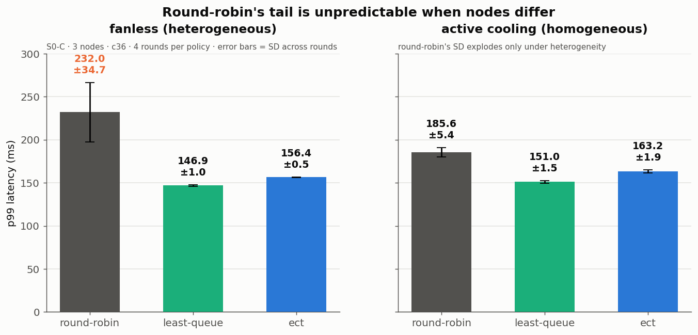
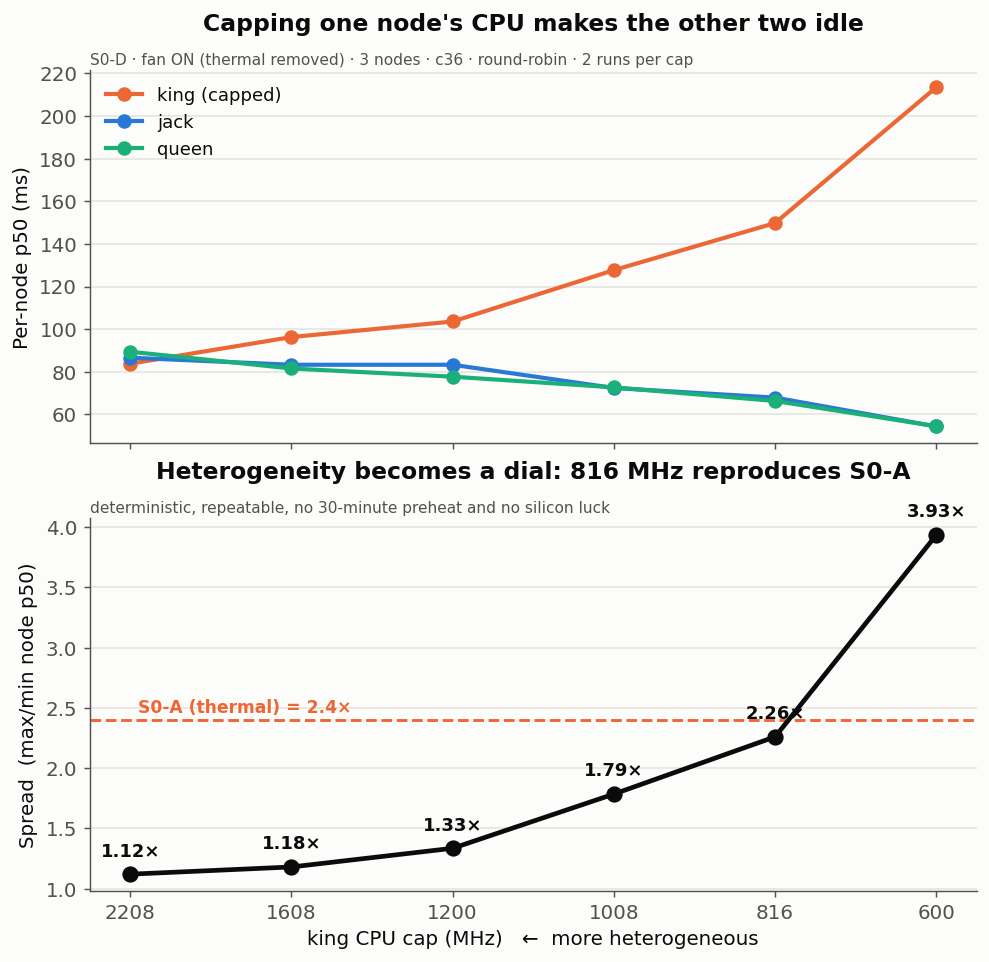
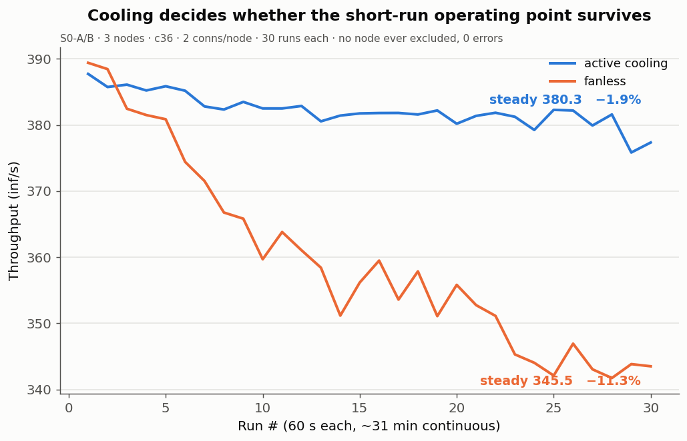
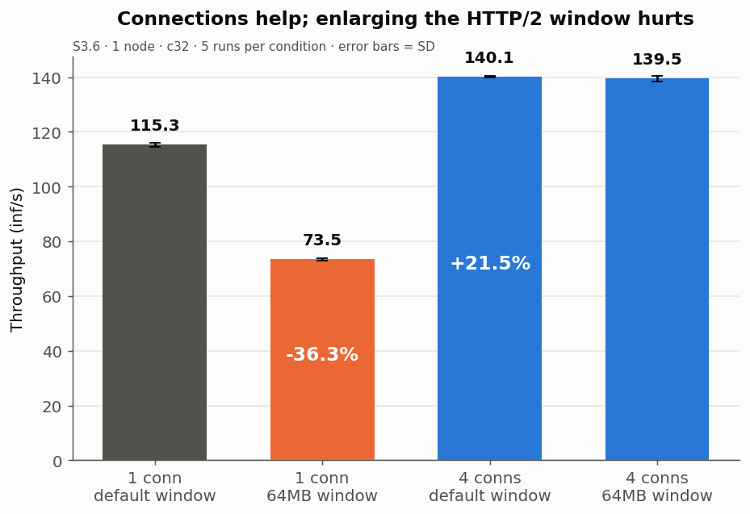
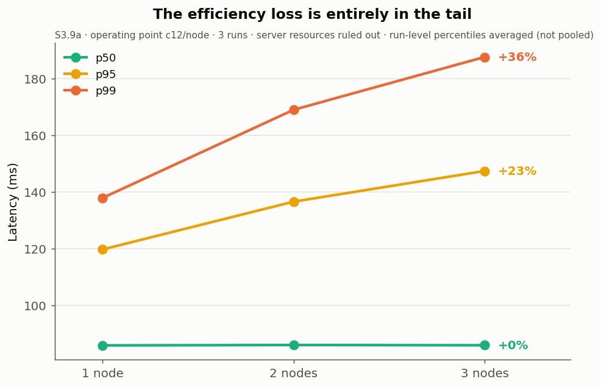
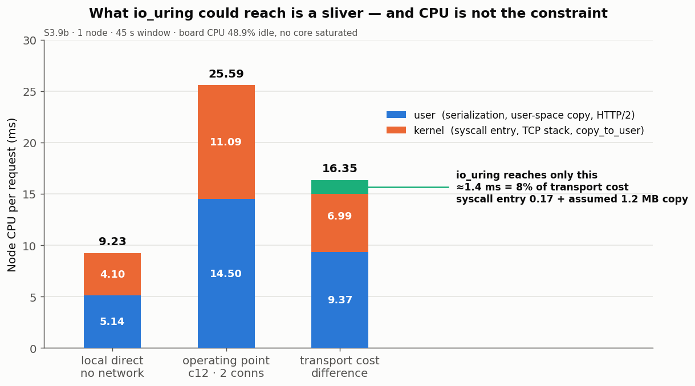

<a id="index"></a>

# NPUDure documentation bundle

> **This file is generated. Do not edit it directly.**
> It concatenates the 27 source documents under `docs/` for reading,
> printing and review.
> If something needs fixing, fix the source and regenerate.
>
> ```bash
> python scripts/build-docs-bundle.py $(git log -1 --format=%cs -- docs/)
> ```
>
> - Generated as of: **2026-09-04** (the last commit date for `docs/`)
> - Links between files have been rewritten to in-document anchors
> - Links pointing outside `docs/` (`../results/...`) are left as they are
> - **Session handoff notes (`handoff-*.md`) and launch-preparation documents
>   (`public/`) are excluded.** They are not research output
>
> The architecture decision records are a separate bundle — [`adrs/ALL.md`](../adrs/ALL.md)

## Contents

- [NPUDure Product Requirements Document](#00-prd)  ·  `docs/00-PRD.md`
- [NPUDure Technical Specification](#01-techspec)  ·  `docs/01-TECHSPEC.md`
- [NPUDure Hardware Setup Guide](#02-hardware-setup)  ·  `docs/02-HARDWARE-SETUP.md`
- [NPUDure Development Requirements](#03-development-requirements)  ·  `docs/03-DEVELOPMENT-REQUIREMENTS.md`
- [FAQ](#faq)  ·  `docs/FAQ.md`
- [Glossary](#glossary)  ·  `docs/GLOSSARY.md`
- [NPUDure infrastructure status](#infrastructure)  ·  `docs/infrastructure.md`
- [NPUDure Environment Matrix](#environment-matrix)  ·  `docs/environment-matrix.md`
- [Host inventory](#hosts-readme)  ·  `docs/hosts/README.md`
- [Host inventory — server](#hosts-server-i7-4790-20260826)  ·  `docs/hosts/server-i7-4790-20260826.md`
- [Host inventory — Dell PowerEdge R620 (the old scheduler server)](#hosts-server-xeon-e5-2630l-20260826)  ·  `docs/hosts/server-xeon-e5-2630l-20260826.md`
- [Experiment Ledger](#experiments-readme)  ·  `docs/experiments/README.md`
- [S0-C — Scheduling Policy A/B (fanless)](#experiments-s0-c-policy-ab)  ·  `docs/experiments/S0_C_POLICY_AB.md`
- [S0-D — Capacity Heterogeneity (deterministic)](#experiments-s0-d-capacity-hetero)  ·  `docs/experiments/S0_D_CAPACITY_HETERO.md`
- [S0 — Sustained Load (condition A fanless / condition B active cooling)](#experiments-s0-sustained-load)  ·  `docs/experiments/S0_SUSTAINED_LOAD.md`
- [S2 — gRPC Multi-node Scaling Baseline](#experiments-s2-grpc-baseline)  ·  `docs/experiments/S2_GRPC_BASELINE.md`
- [S3.5 — Transport Cost Profiling](#experiments-s3-5-transport-profile)  ·  `docs/experiments/S3_5_TRANSPORT_PROFILE.md`
- [S3.6 — HTTP/2 Window × Connections-per-Node A/B](#experiments-s3-6-h2-channel-ab)  ·  `docs/experiments/S3_6_H2_CHANNEL_AB.md`
- [S3.7 — Connection Tuning (a: sweep, b: concurrency, c: RPS)](#experiments-s3-7-connection-tuning)  ·  `docs/experiments/S3_7_CONNECTION_TUNING.md`
- [S3.8 — Optimized gRPC Scale-out](#experiments-s3-8-optimized-scaleout)  ·  `docs/experiments/S3_8_OPTIMIZED_SCALEOUT.md`
- [S3.9a — Scale-out Efficiency Loss Profiling](#experiments-s3-9a-scaleout-profile)  ·  `docs/experiments/S3_9A_SCALEOUT_PROFILE.md`
- [S3.9b — Node-side Residual Cost Profiling](#experiments-s3-9b-node-residual)  ·  `docs/experiments/S3_9B_NODE_RESIDUAL.md`
- [S3 — Per-configuration Saturation](#experiments-s3-saturation)  ·  `docs/experiments/S3_SATURATION.md`
- [NPUDure measurement results — first pass](#results)  ·  `docs/RESULTS.md`
- [NPUDure Technical Discussion Log](#discuss)  ·  `docs/discuss.md`
- [NPUDure board work log](#board-worklog)  ·  `docs/board-worklog.md`
- [NPUDure status](#todo)  ·  `docs/TODO.md`

---

<a id="00-prd"></a>

# NPUDure Product Requirements Document

*[한국어 원문](00-PRD.ko.md)*

- Document: `00-PRD.md`
- Document version: v0.2
- Project: NPUDure
- Project type: an open-source distributed edge NPU inference runtime
- Language: Rust
- Target platform: Linux / RK3576-based edge devices
- Target talk: FOSS for All Conference, November 2026
- Target public release: NPUDure v0.1
- Status: Draft
- Written: 2026-08-05
- Last modified: 2026-08-06 (body)
- 2026-08-27: banner pointing at the final state added only. **The body stays as the planning baseline**
- Related documents:
  - `01-TECHSPEC.md`
  - `02-HARDWARE-SETUP.md`
  - `03-DEVELOPMENT-REQUIREMENTS.md`
  - `environment-matrix.md`

> ## ⚠️ This document is **the Phase 1 planning baseline**
>
> The research questions, schedule and candidate features written here were
> **fixed before measurement began.** Editing a plan after the fact erases "what
> was expected and what missed", so it stays.
>
> **What actually closed and what is still open is not here.**
>
> | What | Where |
> |---|---|
> | Final experiment state | [`experiments/README.md`](#experiments-readme) §5–§7 |
> | The io_uring verdict (**not adopted**) | [`01-TECHSPEC.md`](#01-techspec) §15 |
> | Settled figures | [`RESULTS.md`](#results) · [`experiments/`](experiments) |
>
> In particular, the **io_uring** this document carries as a comparison
> experiment **was decided against.** S3.9b measured the recoverable share at
> ≈8% and it was excluded on that basis.

---

# 0. Document roles and priority

Where documents state different values, the following priority applies.

| Domain | Normative document |
|---|---|
| Goals, non-goals, functional requirements, success criteria | `00-PRD.md` |
| Repository structure, protocol, config schema, scheduling algorithm, error codes | `01-TECHSPEC.md` |
| Physical setup, network, power, cooling, experimental conditions | `02-HARDWARE-SETUP.md` |
| Development environment, tooling, deployment automation, licensing | `03-DEVELOPMENT-REQUIREMENTS.md` |
| Version combinations and hash pinning | `environment-matrix.md` |

This document covers only "why" and "what".

Algorithm formulas, crate names, configuration keys and identifier strings are
not written here; they reference `01-TECHSPEC.md`. Not duplicating the same
content across two documents is the only way to maintain document consistency.

---

# 1. Project overview

NPUDure is a Rust-based open-source runtime for operating several low-cost edge
NPU devices as a single distributed inference resource.

The first implementation connects three 6 TOPS-class RK3576 NPU devices over a
network and measures how far actual inference throughput scales at two and three
devices against one.

This project does not aim simply to add up each device's nominal TOPS. Its
central goal is to quantitatively measure and analyse the losses arising in a
real application environment from network latency, memory copies, request
scheduling, preprocessing and postprocessing, and node failure.

---

# 2. Problem statement

Edge AI devices are generally operated independently. Even with several devices,
their NPU resources are not unified, so a situation arises where some devices
are overloaded while others sit idle.

Also, the TOPS figure a manufacturer provides is a theoretical maximum
throughput of computation, and does not directly represent a real model's
end-to-end inference performance.

For example, connecting three 6 TOPS NPUs may not reach 18 TOPS in practice
because of the following.

- Network data transfer latency
- Input and output buffer copies
- Image decoding and preprocessing cost
- NPU input memory conversion
- CPU execution of unsupported operators
- Imbalanced request distribution
- Per-node temperature and performance variance
- Insufficient concurrent requests
- Request failures from a failed node
- A central scheduler bottleneck

There is a shortage of public software and experimental material that verifies,
in a reproducible form, the scaling efficiency, cost efficiency and failure
tolerance that appear when several low-cost NPUs are actually connected.

---

# 3. Project goals

## 3.1 Core goals

NPUDure v0.1's core goals are as follows.

1. Configure three RK3576-based NPU nodes as one inference cluster.
2. Have a Rust-based central scheduler distribute inference requests to each
   node.
3. Compare actual throughput and latency across single-, 2- and 3-node
   configurations.
4. Implement dynamic request distribution that accounts for node state and
   queues.
5. Automatically exclude a failed node and re-admit it after recovery.
6. Provide a dashboard for checking system performance and state in real time.
7. Publish the installation method, source code, experimental conditions and
   benchmark results.
8. Present a working demo and the experimental results at the FOSS for All
   Conference, November 2026.

## 3.2 Research goals

The aim is to answer the following questions experimentally.

- By how much does the actual throughput of three 6 TOPS NPUs increase against a
  single device?
- What level is the scaling efficiency as node count rises?
- How much difference is there between plain round robin and load-based
  scheduling?
- What proportion of total latency do the network and memory copies account for?
- Is there a meaningful difference between Tokio-based and io_uring-based
  network handling?
- How does the bottleneck shift with input size and concurrent request count?
- How do service throughput and latency change when a node fails?
- Under what conditions is a low-cost multi-NPU configuration favourable against
  a single high-performance edge accelerator?

---

# 4. Non-goals

NPUDure v0.1 does not aim at the following.

- Hardware-level integration making several NPUs appear as one physical NPU
- Reducing a single inference request's latency in proportion to node count
- Splitting one large model layer-wise across several nodes
- Implementing tensor and pipeline parallelism for large language models
- Kubernetes-level general-purpose cluster orchestration
- Supporting every NPU manufacturer and runtime
- Guaranteeing a fully copy-free data path
- Commercial SLAs and security certification
- Wide-area distributed inference over the internet
- Mobile and Windows client support
- Final-product-level user management and billing

v0.1 concentrates on the data-parallel structure of several NPU nodes handling
independent inference requests in parallel.

---

# 5. Target users

## 5.1 Primary users

### Edge AI developers

Users building multi-camera or multi-request inference systems with low-cost ARM
boards and NPUs.

### Embedded Linux developers

Users interested in Linux networking, device drivers, NPU runtimes and
Rust-based systems software.

### AI systems researchers

Researchers experimenting with distributed edge inference performance, latency,
energy efficiency and scalability.

### Industrial AI solution developers

Developers processing multiple video or sensor streams on site — factories,
equipment, access control systems, CCTV.

## 5.2 Secondary users

- Rust developers
- RK3576 board users
- Open-source contributors
- Graduate students and research labs
- Industrial gateway manufacturers
- Edge AI platform vendors

---

# 6. Main usage scenarios

## 6.1 Multi-image inference

A user sends several images to NPUDure and the scheduler distributes the
requests to available NPU nodes.

```text
Client
  -> Scheduler
      -> NPU Node 1
      -> NPU Node 2
      -> NPU Node 3
```

Each node performs inference independently and returns the result to the
scheduler.

## 6.2 Multi-camera analysis

Frames arriving from several cameras are spread across the NPU nodes.

Expected application areas:

- Factory safety monitoring
- Equipment anomaly detection
- Access headcount analysis
- Object detection
- Defect inspection
- Multi-CCTV analysis

## 6.3 Handling a node failure

If a node stops during cluster operation, the scheduler automatically excludes it
from the request targets.

Once the node is healthy again, it is re-admitted to the cluster after a set
number of successful health checks.

## 6.4 Performance comparison

A user can compare the following configurations with the same model and dataset.

- A single node
- 2 nodes
- 3 nodes
- Round robin scheduling
- Load-based scheduling
- Tokio-based network handling
- io_uring-based network handling
- Before and after data copy optimization

---

# 7. Core functional requirements

## FR-01. NPU node registration

Each NPU node has to register its information with the central scheduler at
startup.

Registration information:

- Node ID
- IP address
- Port
- Device type
- NPU type
- NPU core count
- Model list
- Model version
- Runtime version
- Memory capacity
- Software version

## FR-02. Health checks

The scheduler has to check each node's state periodically.

State categories:

- Registering
- Healthy
- Busy
- Degraded
- Unreachable
- Recovering
- Draining
- Disabled

`Draining` and `Disabled` are states an operator switches to explicitly and are
defined in FR-15.

The transition conditions and thresholds are defined in `01-TECHSPEC.md` §9.

Health check information:

- Response time
- Current queue length
- Recent inference success rate
- CPU utilisation
- Memory utilisation
- NPU utilisation
- Device temperature
- Recent errors

## FR-03. The inference request API

A client has to be able to submit inference requests over a network API.

Request information:

- Request ID
- Model ID
- Input data
- Input format
- Priority
- Request deadline
- Tracing information

Response information:

- Request ID
- Result data
- The node that handled it
- Wait time
- Preprocessing time
- Inference time
- Postprocessing time
- Total processing time
- Error code

## FR-04. Round robin scheduling

The default scheduler has to distribute requests sequentially to healthy nodes.

Round robin serves as the comparison baseline for the other scheduling policies.

## FR-05. Load-based scheduling

The scheduler has to be able to distribute requests based on each node's queue
length and recent processing time.

Basic calculation inputs:

- Current queue length
- Requests being processed
- Moving average inference time
- Moving average network time
- Recent error rate
- Node temperature
- Node state

The policy types, score formula, and configuration and CLI identifiers are
defined in `01-TECHSPEC.md` §10.

In this document, "load-based scheduling" is a prose umbrella term for the
non-round-robin policies and is not used as a configuration value or CLI
argument.

## FR-06. Automatic exclusion of a failed node

A node has to be excluded from request distribution when any of the following
holds.

- Consecutive health check failures
- Inference request deadline exceeded
- Error rate above threshold
- Temperature above threshold
- Abnormal runtime termination

## FR-07. Automatic node re-admission

An excluded node that passes consecutive health checks has to transition through
Recovering back to Healthy.

Immediately after recovery, only limited requests are assigned so that stability
can be confirmed.

## FR-08. Retries

A failed inference request has to be retryable a limited number of times on
another healthy node.

Request ID-based duplicate handling has to be managed to prevent problems from
duplicate execution.

## FR-09. Model management

The scheduler has to be able to determine which models each node can run.

In v0.1 the following take priority over automatic model file deployment.

- Model identification
- Version checking
- Model load state checking
- Per-model request routing
- Model mismatch detection

## FR-10. Metrics collection

The system has to collect the following metrics.

- Total requests/sec
- Per-node requests/sec
- Total FPS
- Per-node FPS
- p50 latency
- p95 latency
- p99 latency
- Error rate
- Retry rate
- Per-node queue length
- CPU utilisation
- Memory utilisation
- NPU utilisation
- Network send and receive volume
- Temperature
- Node availability

## FR-11. A live dashboard

A user has to be able to check system state through a web browser.

Main dashboard views:

- Overall cluster state
- Per-node state
- Total throughput
- Per-node throughput
- Latency distribution
- Current queue length
- Failure and recovery events
- System configuration
- Benchmark execution state

## FR-12. A benchmark execution tool

A CLI tool has to be provided for repeating experiments under identical
conditions.

Example CLI options:

```bash
npuforge-bench \
  --model yolov8n \
  --dataset ./dataset \
  --concurrency 16 \
  --duration 300 \
  --scheduler ect
```

The exact argument list and policy identifiers follow `01-TECHSPEC.md` §10.0 and
`03-DEVELOPMENT-REQUIREMENTS.md` §3.1.

Output formats:

- Console summary
- JSON
- CSV

## FR-13. Per-stage latency measurement

Each request has to record the following times separately.

- Client transmission
- Scheduler queue
- Scheduler routing
- Node reception
- Decode
- Preprocess
- NPU input preparation
- NPU inference
- Postprocess
- Result transmission
- End-to-end latency

## FR-14. Event logs

The following events have to be recorded as structured logs.

- Node registration
- Node connection closed
- Health check failure
- Failed node excluded
- Node recovered
- Request retried
- Deadline exceeded
- Model mismatch
- Scheduler policy changed

## FR-15. Node drain and disable

An operator has to be able to exclude a node from request distribution without
physically stopping it.

- **Drain**: stop assigning new requests and wait for in-flight requests to
  complete.
- **Disable**: exclude from candidates immediately.
- **Enable**: return it to the candidates.

The official benchmarks' 1-, 2- and 3-node comparisons are performed with these
functions, not by cutting power or killing processes.

The experimental conditions only hold if power, temperature, network and
equipment placement stay identical when node count changes. The detailed
rationale follows `02-HARDWARE-SETUP.md` §12.3.

The forced termination and network disconnection in the failure experiments
(§11.6) are separate, and exist to verify the automatic detection behaviour.

---

# 8. Non-functional requirements

## NFR-01. Performance

- A 3-node scaling efficiency of 80% or better — total throughput of 2.4× a
  single node — is the first target.
- A 3-node scaling efficiency of 85% or better is the final target.
- Under normal load, the scheduler's own CPU utilisation must not become the
  system's bottleneck.
- Routing overhead arising in the central scheduler targets 5% or less of total
  latency.

Scaling efficiency is calculated as:

```text
scaling efficiency =
3-node total throughput /
(single-node throughput x 3)
```

The figures in this section are **targets, not success conditions.**

Missing a target is not in itself a failure. The criterion for judging success
follows §12.1.

## NFR-02. Reliability

- A single node's failure must not lead to a full service outage.
- A failed node has to be excluded from request distribution within a configured
  time of detection.
- Failed requests have to be retryable on another node.
- Recovery after a node restart has to happen without manual intervention.

## NFR-03. Reproducibility

- All benchmark conditions have to be storable as configuration files.
- The model, dataset, runtime, kernel and board information used has to be
  recorded.
- Experiments have to be repeatable under identical conditions.
- Raw results have to be preserved as JSON or CSV.

## NFR-04. Portability

The core scheduler must not depend directly on a particular NPU runtime.

The NPU runtime is separated behind a backend interface.

```text
InferenceBackend
  |- RKNN Backend
  |- CPU Mock Backend
  \- Future Backend
```

## NFR-05. Security

v0.1 assumes a closed local network environment.

Minimum requirements:

- Request size limits
- Validation of malformed input
- A node registration token
- Restricted management API access
- No sensitive information in the logs

TLS and user authentication are optional features, but become mandatory on
exposure to an external network.

## NFR-06. Open-source quality

- Apply a clear license.
- Provide installation and execution instructions in the README.
- Provide sample configuration files.
- Provide at least one reproducible demo scenario.
- Provide unit tests for the main modules.
- Set up GitHub Actions or an equivalent CI.

---

# 9. Technical composition

## 9.1 Overall structure

```text
+----------------------+
| Benchmark Client     |
| Demo Web Client      |
+----------+-----------+
           |
           v
+----------------------+
| NPUDure Scheduler    |
|                      |
| . API Gateway        |
| . Node Registry      |
| . Health Monitor     |
| . Load Scheduler     |
| . Metrics Collector  |
+------+------+--------+
       |      |
       v      v
+----------+ +----------+ +----------+
| Node 01  | | Node 02  | | Node 03  |
| RK3576   | | RK3576   | | RK3576   |
| RKNN NPU | | RKNN NPU | | RKNN NPU |
+----------+ +----------+ +----------+
```

## 9.2 Main components

### npuforge-scheduler

The central scheduler.

Main responsibilities:

- Receiving API requests
- Node registration and state management
- Request scheduling
- Retrying failed requests
- Metrics collection
- Event recording

### npuforge-node

The inference agent running on each RK3576 board.

Main responsibilities:

- Loading the RKNN model
- Receiving inference requests
- Preprocessing
- NPU inference
- Postprocessing
- Reporting state and metrics

### npuforge-bench

The performance measurement CLI.

Main responsibilities:

- Generating concurrent requests
- Sending test data repeatedly
- Configuring the load pattern
- Storing results
- Computing basic statistics

### npuforge-dashboard

A web UI displaying cluster state and experimental results.

### npuforge-common

Contains the shared data models, error codes and configuration structures.

### npuforge-mock-backend

A software backend for verifying scheduling, failure detection, recovery, the
dashboard and CI integration tests without a real NPU.

Inference time, variance, error rate and queue limits are adjustable through
configuration.

An external user has to be able to run NPUDure's core structure without RK3576
hardware, so it is treated as an essential component rather than an extra.

The full crate list and their exact names are defined in `01-TECHSPEC.md` §4.

---

# 10. Technology choices

## 10.1 Rust

Why Rust:

- Memory safety for long-running systems software
- Implementing asynchronous network servers
- Low runtime overhead
- Implementing structured concurrency
- FFI integration with the C-based RKNN API
- A high degree of fit with Linux open-source projects

## 10.2 Tokio

Tokio is the default network runtime for v0.1.

The Tokio implementation serves as the performance baseline, and is compared
against an io_uring-based implementation if an actual bottleneck is confirmed.

## 10.3 io_uring

io_uring is not a required feature but a comparison experiment.

Conditions for applying it:

- Network or system call overhead is a measurable bottleneck
- The concurrent request count is high enough
- A comparable experiment against the ordinary Tokio implementation can be
  constructed

## 10.4 Zero-copy

Zero-copy is not a marketing term; it is evaluated by whether the actual copy
count falls.

v0.1 analyses the following path.

```text
Network Buffer
-> User Buffer
-> Decode Buffer
-> Preprocess Buffer
-> NPU Input Buffer
```

Each section is checked for copies, and only removable copies are optimized.

Complete zero-copy is not guaranteed.

## 10.5 RKNN

RK3576 NPU execution uses the RKNN Runtime in the initial version.

To minimise RKNN dependence, the inference backend interface is separated into
its own layer.

---

# 11. Experiment design

## 11.1 Basic experimental setup

- Three identical RK3576 boards
- The same OS and kernel
- The same RKNN Runtime
- The same model
- The same input data
- A 2.5GbE wired network
- The same power and cooling conditions

The detailed physical conditions follow `02-HARDWARE-SETUP.md`.

## 11.2 Node count comparison

- 1 node
- 2 nodes
- 3 nodes

Metrics measured:

- requests/sec
- FPS
- p50
- p95
- p99
- Error rate
- CPU utilisation
- Memory utilisation
- Network usage
- Power consumption
- Temperature

## 11.3 Concurrent request count

The default concurrency conditions are four steps at 4× intervals.

- 1
- 4
- 16
- 64

The concurrency axis multiplies with node count, policy and repetition count, so
each additional step raises total measurement time by hours.

Always calculate the total time before adding an axis. The concurrencies applied
per scenario are defined in `01-TECHSPEC.md` §20.2.

## 11.4 Scheduler comparison

- Round Robin
- Least Queue
- Estimated Completion Time

The three policies' score formulas and their configuration and CLI identifiers
are defined in `01-TECHSPEC.md` §10.

## 11.5 Network implementation comparison

- Tokio TCP or gRPC
- Tokio + a buffer pool
- io_uring
- io_uring + applicable copy optimizations

## 11.6 Failure experiments

- Forcibly killing a node process
- Disconnecting the network cable
- Performance degradation from high temperature
- Model loading failure
- Request processing delay
- Node recovery and re-admission

## 11.7 Cost comparison

Includes the following.

- Hardware purchase cost
- Power consumption
- Cost per throughput
- Cost per FPS
- Operational complexity
- Equipment count
- Number of failure points

---

# 12. Success criteria

## 12.1 Required success criteria

Success is defined not as "did a particular number come out" but as **"can it be
measured and explained."**

In a project whose purpose is measurement, setting a result value as a success
condition creates an incentive to choose experimental conditions favourably when
the target does not come out. That collides head-on with reproducibility, this
project's central value.

So the performance targets sit in §8 NFR-01, and whether they were achieved is
reported as a result rather than as a success condition.

NPUDure v0.1 is judged successful when the following hold.

- Three RK3576 NPU nodes connected
- Single-, 2- and 3-node inference working
- 1/2/3-node scaling factor and scaling efficiency measured, with a quantitative
  account of the bottleneck if the target is missed
- Service continuing when a node fails
- Automatic exclusion and recovery of a failed node
- p50, p95 and p99 measured
- The live status dashboard working
- Source published on GitHub
- Installation and execution documentation published
- Reproducible benchmarks published
- Presentation material and demo ready for the FOSS for All Conference

## 12.2 Recommended success criteria

- 3-node scaling efficiency of 85% or better
- A meaningful improvement from load-based scheduling over round robin
- A quantitative account of io_uring's effect
- Analysis of the data copy count and its cost
- Minimised request failure rate during a node failure
- An automated installation script
- Docker- or systemd-based execution support
- A CPU Mock backend provided
- Documentation sufficient for an external contributor to reproduce the work

## 12.2.1 Thermal characterisation

The NanoPi R76S on hand is a fanless board. No active cooling is added and
**thermal throttling is included in what gets measured.**

Measured results:

- The gap between peak FPS and sustained FPS
- The onset of throttling
- Steady-state temperature and the degradation rate

The TOPS a vendor publishes is instantaneous performance, and there is barely any
public material on a fanless edge device's sustained performance. Measuring that
gap connects directly to this project's problem statement (§2), that "the TOPS
figure does not represent actual throughput".

But **thermal characteristics and scaling efficiency are reported separately.**
Mixed together, there is no way to tell whether a throughput drop came from
scheduling or from temperature.

The detailed design follows `01-TECHSPEC.md` §20.2 S0, and the physical
conditions `02-HARDWARE-SETUP.md` §9.

## 12.3 Results that are meaningful even in failure

The following are also counted as valid technical outcomes.

- io_uring producing no meaningful performance improvement
- Zero-copy applying to only a limited scope
- The NPU or preprocessing, rather than the network, being confirmed as the
  primary bottleneck
- Three-node scaling efficiency being lower than expected
- A single high-performance device being more favourable on cost

Even then, presenting the bottleneck's cause and the conditions of application
quantitatively has value as a talk and as a research result.

---

# 13. Demo scenarios for the talk

## Demo 1. Single node versus three nodes

Compare single-node and three-node throughput live, using the same video or
image dataset.

Displayed:

- Single-node FPS
- Total 3-node FPS
- Scaling factor
- Scaling efficiency
- p95 latency

## Demo 2. Live load distribution

Show requests being distributed across the nodes on the dashboard.

Displayed:

- Per-node queue
- Per-node throughput
- Per-node temperature
- Per-node state
- Request routing status

## Demo 3. Node failure

During three-node operation, kill one node's process or cut its network.

Expected behaviour:

1. Health check failure
2. The failed node automatically excluded
3. Requests redistributed to the remaining two nodes
4. Service continues
5. The node restarts
6. Automatic re-admission after confirming health

## Demo 4. Scheduler comparison

Compare throughput and latency between the round robin and ECT policies.

---

# 14. Schedule

## August 2026

- Write the PRD
- Write the technical specification
- Create the project repository
- Organise the development environment
- Verify single RK3576 RKNN inference
- Minimal Rust FFI validation

## September 2026

- Implement the NPU node agent
- Implement the central scheduler
- Connect single, 2 and 3 nodes
- Implement round robin
- Implement the basic benchmark tool
- Secure preliminary results

## October 2026

- Implement the Least Queue and ECT schedulers
- Implement health checks
- Failed node exclusion and recovery
- Request retries
- Metrics collection
- Implement the dashboard
- Settle the Tokio baseline performance
- Decide whether to apply io_uring

## 1–15 November 2026

- The io_uring comparison experiment
- Data copy analysis
- Final benchmarks
- Cost and power analysis
- Code cleanup
- Write the GitHub documentation
- Stabilise the demo

## 16–22 November 2026

- Feature freeze
- Write the presentation material
- Record the demo video
- Rehearse the talk
- Prepare a backup video in case of failure

## 28 November 2026

- The FOSS for All Conference talk
- NPUDure v0.1 published

---

# 15. Main risks and responses

## Risk 1. RKNN Rust FFI instability

Response:

- Write a minimal C wrapper.
- Isolate the unsafe region in a separate module.
- Manage input and output buffer lifetimes explicitly.
- Run unit tests and repeated inference tests.

## Risk 2. Low performance gain at three nodes

Response:

- Measure NPU computation and preprocessing time separately.
- Compare input data sizes.
- Adjust the concurrent request count.
- Measure network and scheduler overhead.
- Use a negative result as bottleneck analysis material.

## Risk 3. io_uring having little effect

Response:

- Keep Tokio as the default implementation.
- Separate io_uring into an experimental branch.
- If there is no effect, write up the conditions of application and the cause as
  a result.

## Risk 4. Zero-copy implementation difficulty

Response:

- Exclude complete zero-copy from the success criteria.
- Prioritise the buffer pool and memory reuse.
- Measure the reduction in copy count itself.

## Risk 5. Insufficient time before the talk

Response:

- Limit the required demo scope.
- Prioritise benchmark reproducibility over feature completeness.
- Forbid feature additions after 15 November.
- Prepare a recorded video against a live demo failure.

## Risk 6. Scope creep

Response:

v0.1 declines the following requests.

- LLM model parallelism
- Kubernetes integration
- Multi-manufacturer NPU support
- A cloud management service
- A user account system
- Automatic model conversion
- General-purpose AI platform features

---

# 16. Open-source publication plan

## Repository structure

Defined in `01-TECHSPEC.md` §4.

## Published artefacts

- The full source code
- Build instructions
- Installation instructions
- Sample configuration
- Guidance on the test data
- Benchmark execution instructions
- Raw benchmark results
- Architecture documentation
- Known limitations
- Presentation material
- The demo video

## License candidates

Under consideration:

- Apache License 2.0
- MIT License

Considering the patent clause and the potential for corporate use, Apache
License 2.0 is the preferred candidate.

---

# 17. Future extensions

Features that can be considered after v0.1:

- A Hailo backend
- A Jetson TensorRT backend
- An OpenVINO backend
- Automatic model deployment
- Multi-model scheduling
- SLA-based scheduling
- Energy-optimizing scheduling
- Direct camera stream input
- Distributed tracing
- A WebAssembly client
- A Kubernetes device plugin
- Wide-area edge node integration
- Per-request LLM distribution
- An adaptive scheduling algorithm for the doctoral thesis

---

# 18. Final product definition

NPUDure v0.1 is not a product that physically combines three 6 TOPS NPUs into a
single 18 TOPS NPU.

NPUDure is an open-source distributed inference runtime that efficiently
distributes independent inference requests across several edge NPUs, measures
actual performance and bottlenecks, and keeps the service running through node
failures.

The project's core value lies not in a high TOPS figure but in the following.

- Verifying actual scaling efficiency
- Quantitative analysis of the bottleneck
- Comparing throughput against cost
- A fault-tolerant structure
- A reproducible open-source experiment
- Integrating Linux, Rust and edge AI technologies

---

# 19. The talk's core message

> Connecting three 6 TOPS NPUs does not automatically make 18 TOPS.
> NPUDure is an open-source project that measures where that difference arises
> and works out the conditions under which it actually scales.

The talk title:

> **Do three 6 TOPS NPUs really make 18 TOPS?**

---

<a id="01-techspec"></a>

# NPUDure Technical Specification

*[한국어 원문](01-TECHSPEC.ko.md)*

> ## ⚠️ This document is **normative in part and a planning baseline in part**
>
> The structure, protocol and configuration schema are current. The **schedule
> and candidate features** (S5, the November io_uring comparison and so on) are
> plans made before measuring, and are left as they were. Editing a plan after
> the fact erases "what was expected and what missed", so it stays.
>
> **What actually closed and what is still open is not here.**
>
> | What | Where |
> |---|---|
> | Final experiment state | [`experiments/README.md`](#experiments-readme) §5–§7 |
> | The io_uring verdict (**not adopted**) | **§15 of this document** |
> | Settled figures | [`RESULTS.md`](#results) · [`experiments/`](experiments) |
>
> In particular, the **io_uring** this document carries as a comparison
> experiment **was decided against.** S3.9b measured the recoverable share at
> ≈8% and it was excluded on that basis.

- Document: `01-TECHSPEC.md`
- Project: NPUDure
- Document version: v0.2
- Target release: NPUDure v0.1
- Target talk: FOSS for All Conference, November 2026
- Written: 2026-08-05
- Last modified: 2026-08-06 (body)
- 2026-08-27: banner pointing at the final state added only. **The body stays as the planning baseline**
- Status: Draft
- Related documents:
  - `00-PRD.md`
  - `02-HARDWARE-SETUP.md`
  - `03-DEVELOPMENT-REQUIREMENTS.md`
  - `environment-matrix.md`

This document is normative for repository structure, protocol, configuration
schema, scheduling algorithm and error codes. Where values in those areas differ
from another document, this one wins. Physical setup and experimental conditions
follow `02-HARDWARE-SETUP.md`.

---

# 1. Purpose

This document defines NPUDure v0.1's implementation structure, component
responsibilities, communication protocol, data models, scheduling, failure
handling, metrics collection, benchmarking method and deployment structure.

NPUDure v0.1 is a Rust-based open-source runtime operating up to three RK3576
6 TOPS NPU nodes as one distributed inference cluster.

The document's goals are:

1. Let a developer begin implementation without further interpretation.
2. Make the functional scope and non-functional requirements technically
   concrete.
3. Define a reference implementation against which performance can be compared.
4. Secure reproducibility for the talk demo and the research benchmarks.
5. Isolate RKNN-dependent code so other NPU backends can be added later.

---

# 2. Design principles

## 2.1 Data parallelism first

NPUDure v0.1 does not split one model across several nodes.

Each node holds the same entire model and handles different inference requests
independently.

```text
Request A -> Node 1
Request B -> Node 2
Request C -> Node 3
```

The goal is not reducing single-request latency but raising total throughput and
tolerating failure.

## 2.2 Measurable optimization

io_uring, buffer pools, memory reuse and zero-copy are not goals by name.

Every optimization has to satisfy the following.

- A reference implementation exists
- It can be compared under identical experimental conditions
- At least one of throughput, latency, CPU utilisation or copy count is measured
- The result is recorded even when the effect is absent or negative

## 2.3 A simple central scheduler

v0.1 uses a central scheduler structure.

Distributed consensus, leader election and multi-scheduler high availability are
not implemented.

```text
Client
   |
   v
Scheduler
   |-- Node 1
   |-- Node 2
   \-- Node 3
```

## 2.4 Backend separation

Direct RKNN Runtime calls are isolated in the `npuforge-rknn` crate.

The scheduler and node agent use only the common `InferenceBackend` interface.

## 2.5 Reproducibility first

Every experiment has to store the following alongside its results.

- Git commit hash
- OS and kernel version
- RKNN Runtime version
- Model identifier and hash
- Input dataset hash
- Node count
- Network configuration
- Scheduling policy
- Concurrency
- Test duration
- Temperature and power conditions
- The raw measurements

---

# 3. Overall architecture

## 3.1 Logical structure

```text
+-----------------------------------------------------------+
| Clients                                                   |
|                                                           |
|  +----------------+  +----------------+  +-------------+  |
|  | Demo Web Client|  | Benchmark CLI  |  | API Client  |  |
|  +-------+--------+  +-------+--------+  +------+------+  |
+----------+-------------------+------------------+---------+
           |                   |                  |
           +-------------------+------------------+
                               |
                               v
+-----------------------------------------------------------+
| NPUDure Scheduler                                         |
|                                                           |
|  API Gateway                                              |
|  Node Registry                                            |
|  Scheduler Engine                                         |
|  Retry Manager                                            |
|  Health Monitor                                           |
|  Metrics Collector                                        |
|  Event Logger                                             |
+--------------+----------------+----------------+----------+
               |                |                |
               v                v                v
      +----------------+ +----------------+ +----------------+
      | NPUDure Node 1 | | NPUDure Node 2 | | NPUDure Node 3 |
      | RK3576 / RKNN  | | RK3576 / RKNN  | | RK3576 / RKNN  |
      +----------------+ +----------------+ +----------------+
```

## 3.2 Physical setup

The reference hardware is:

- Three RK3576-based NanoPi R76S or equivalent boards
- The same OS, kernel and RKNN Runtime installed on every node
- Wired Ethernet
- The central scheduler running on a separate x86 or ARM Linux machine
- The network is **2.5GbE for workers / 10GbE for aggregation** (rationale below)

### Rationale for the network baseline

**Revised 2026-08-12.** The previous version said "3 nodes at 150 FPS × 1.23 MB
≈ 1.5 Gbps, so 2.5GbE suffices". Two things were wrong — (a) 150 FPS assumed a
**total** across three nodes, whereas measurement puts **one** node at
157.2 inf/s on INT8, and (b) **the output direction was never calculated.** The
figures below are recomputed from measurements.

One input payload is `640 × 640 × 3 = 1,228,800 byte`.

```text
                     per node        3-node total
INT8  157.2 inf/s    1.545 Gbps      4.636 Gbps
FP16   84.3 inf/s    0.829 Gbps      2.486 Gbps
```

**Even FP16's three-node total exceeds a single 2.5GbE link (effectively about
2.35 Gbps).**

That is, **it is the aggregation link, not the worker links, that fills up
first.** Each node uses only its own link (at most 1.545 Gbps), but the three
nodes' traffic converges in front of the scheduler.

- **Worker links: 2.5GbE** — sufficient at 1.545 Gbps per node
- **Aggregation link: 10GbE** — this is the real constraint
- The scheduler host needs a **PCIe slot** for a 10G SFP+ NIC

The response direction uses the link too. The node returns raw tensors without
postprocessing, so with `want_float=1` the response is 3.96× the request and
three-node RX reaches 18.38 Gbps. Even 10G is insufficient. That problem was
solved by switching to `want_float=0` (§16.2, `02-HARDWARE-SETUP.md` §3.3.2,
`adrs/012-want-float-zero-blob-v2.md`).

Taking 1GbE as the baseline would mean measuring link saturation rather than NPU
scaling efficiency under large-input conditions. That does not fit this
project's measurement purpose.

But 1GbE is not removed; it is kept as a **comparison condition** for §20.2's S5
and S6. Presenting "the network is the bottleneck" and "it is not" side by side
has value as a bottleneck-analysis result.

Detailed rationale and topology:
`adrs/014-10g-aggregation-separate-scheduler.md`.

### Constraint on scheduler placement

Official benchmarks do **not** run the scheduler on an RK3576 node.

Loading the scheduler onto one node alone gives the three nodes different
experimental conditions and distorts the 1/2/3-node comparison. Detailed
rationale follows `02-HARDWARE-SETUP.md` §2.1.

For simple development and portable demos it may run on one of the nodes, but
values measured that way are not used as official performance figures.

## 3.3 Process composition

### Scheduler Host

- `npuforge-scheduler`
- `npuforge-dashboard`
- Prometheus
- Optionally Grafana

### NPU Node

- `npuforge-node`
- RKNN Runtime
- Model files
- Hardware metrics collector

### Benchmark Host

- `npuforge-bench`
- Test datasets
- Results directory

---

# 4. Repository structure

```text
npuforge/
├── Cargo.toml
├── Cargo.lock
├── LICENSE
├── README.md              (English - default)
├── README.ko.md           (Korean)
├── rust-toolchain.toml
├── crates/
│   ├── npuforge-common/
│   │   ├── src/
│   │   │   ├── config.rs
│   │   │   ├── error.rs
│   │   │   ├── model.rs
│   │   │   ├── protocol.rs
│   │   │   ├── telemetry.rs
│   │   │   └── lib.rs
│   │   └── Cargo.toml
│   ├── npuforge-proto/
│   │   ├── proto/
│   │   │   └── npuforge.proto
│   │   ├── build.rs
│   │   ├── src/lib.rs
│   │   └── Cargo.toml
│   ├── npuforge-scheduler/
│   │   ├── src/
│   │   │   ├── api/
│   │   │   ├── health/
│   │   │   ├── registry/
│   │   │   ├── retry/
│   │   │   ├── scheduler/
│   │   │   ├── telemetry/
│   │   │   ├── state.rs
│   │   │   └── main.rs
│   │   └── Cargo.toml
│   ├── npuforge-node/
│   │   ├── src/
│   │   │   ├── backend/
│   │   │   ├── health/
│   │   │   ├── inference/
│   │   │   ├── metrics/
│   │   │   ├── model_manager/
│   │   │   ├── worker/
│   │   │   └── main.rs
│   │   └── Cargo.toml
│   ├── npuforge-rknn/
│   │   ├── include/
│   │   ├── native/
│   │   │   ├── rknn_wrapper.c
│   │   │   └── rknn_wrapper.h
│   │   ├── src/
│   │   │   ├── ffi.rs
│   │   │   ├── backend.rs
│   │   │   ├── buffer.rs
│   │   │   ├── error.rs
│   │   │   └── lib.rs
│   │   ├── build.rs
│   │   └── Cargo.toml
│   ├── npuforge-bench/
│   │   ├── src/
│   │   │   ├── load.rs
│   │   │   ├── output.rs
│   │   │   ├── scenario.rs
│   │   │   ├── statistics.rs
│   │   │   └── main.rs
│   │   └── Cargo.toml
│   └── npuforge-mock-backend/
│       ├── src/lib.rs
│       └── Cargo.toml
├── dashboard/
│   ├── src/
│   ├── public/
│   └── package.json
├── configs/
│   ├── scheduler.example.toml
│   ├── node.example.toml
│   └── benchmark.example.toml
├── deploy/
│   ├── systemd/
│   ├── docker/
│   └── scripts/
├── scripts/
├── tools/
│   └── model-converter/
├── examples/
│   ├── image-classification/
│   └── object-detection/
├── benchmarks/
│   ├── scenarios/
│   ├── results/
│   └── analysis/
├── docs/
│   ├── 00-PRD.md
│   ├── 01-TECHSPEC.md
│   ├── 02-HARDWARE-SETUP.md
│   ├── 03-DEVELOPMENT-REQUIREMENTS.md
│   ├── environment-matrix.md
│   ├── quick-start.md
│   ├── rknn-installation.md
│   ├── model-conversion.md
│   ├── benchmark-guide.md
│   ├── deployment-guide.md
│   ├── failure-demo.md
│   ├── performance-analysis.md
│   └── troubleshooting.md
└── .github/
    └── workflows/
```

## 4.1 Distinguishing scripts from deploy

The two directories are divided so their roles do not overlap.

| Directory | Purpose | Examples |
|---|---|---|
| `scripts/` | operational automation run by developers and experimenters | `build-arm64.sh`, `deploy-all.sh`, `run-benchmark.sh`, `check-versions.sh` |
| `deploy/` | artefacts installed onto target machines, and their installers | systemd units, Dockerfiles, `install-node.sh` |

The full list of `scripts/` follows `03-DEVELOPMENT-REQUIREMENTS.md` §4.3.

The composition of `tools/model-converter/` follows
`03-DEVELOPMENT-REQUIREMENTS.md` §2.1.

---

# 5. Technology stack

## 5.1 Rust

- Rust Stable
- Edition 2024 under consideration
- The minimum supported Rust version is pinned after initial project validation
- A workspace-based multi-crate layout

## 5.2 Async runtime

Reference implementation:

- Tokio
- tonic gRPC
- axum for the management API
- tower middleware

Experimental implementation:

- A separate io_uring-based transport, or a specific data transfer path
- `tokio-uring` or a direct wrapper if needed
- The reference and experimental implementations separated by feature flags

## 5.3 Serialization

- Internal RPC: Protocol Buffers
- Configuration: TOML
- Structured logs: JSON
- Benchmark results: JSON Lines and CSV
- Management API: JSON

## 5.4 Observability

- tracing
- tracing-subscriber
- the metrics or prometheus crate
- A Prometheus endpoint
- OpenTelemetry is optional in v0.1

## 5.5 Web dashboard

Choose one of the following.

Preferred:

- React or a simple TypeScript SPA
- Using the scheduler's REST API with WebSocket/SSE

Simplified:

- Rust + askama or minijinja
- An htmx-based UI

Since the talk schedule takes priority, the choice is made on implementation
speed rather than features.

---

# 6. Components in detail

## 6.1 npuforge-common

Provides the shared types and configuration.

Main types:

```rust
pub type NodeId = String;
pub type RequestId = uuid::Uuid;
pub type ModelId = String;
pub type ModelVersion = String;
```

Main modules:

- `config`: the TOML configuration structures
- `error`: the shared error codes
- `model`: model identification and metadata
- `protocol`: shared request/response data models
- `telemetry`: metric types

Dependencies are kept minimal.

## 6.2 npuforge-proto

Contains the gRPC service definitions and generated code.

Services:

- `SchedulerService`
- `NodeService`
- `ControlService`

Protocol changes reserve fields rather than deleting them, for version
compatibility.

## 6.3 npuforge-scheduler

The central control component.

Responsibilities:

- Receiving external inference requests
- Node registration and removal
- Health checks
- Scheduling
- Retries
- Timeouts
- Metric aggregation
- Event emission
- Providing the dashboard API

Internal state is kept in memory in the initial version.

Items needing persistence:

- Benchmark results
- Event logs
- Configuration snapshots

PostgreSQL is not required for v0.1.

## 6.4 npuforge-node

Runs on each NPU device.

Responsibilities:

- Registering with the scheduler
- Model loading
- Handling inference requests
- Preprocessing and postprocessing
- Managing the local work queue
- Reporting metrics
- Reporting status
- Graceful shutdown

The node's internal worker count is configurable, subject to model and RKNN
Runtime constraints.

## 6.5 npuforge-rknn

The crate dedicated to RKNN Runtime integration.

Responsibilities:

- The C API FFI
- A safe Rust wrapper
- Creating and releasing model contexts
- Input and output buffer management
- Invoking inference
- Error conversion
- Querying model metadata

`unsafe` code is confined inside this crate.

## 6.6 npuforge-bench

The load generation and statistics tool.

Responsibilities:

- Fixed concurrency
- Gradual load ramp
- Fixed request count
- Fixed duration tests
- Cycling through input data
- Storing results
- Summary statistics
- Failure rate calculation

---

# 7. APIs and communication protocol

## 7.1 The external inference API

The reference API is gRPC.

### Infer

```protobuf
rpc Infer(InferRequest) returns (InferResponse);
```

Example structures:

```protobuf
message InferRequest {
  string request_id = 1;
  string model_id = 2;
  bytes payload = 3;
  string input_format = 4;
  int32 priority = 5;
  int64 deadline_unix_ms = 6;
  map<string, string> metadata = 7;
}

message InferResponse {
  string request_id = 1;
  string node_id = 2;
  bytes result = 3;
  string result_format = 4;
  Timing timing = 5;
  string error_code = 6;
  string error_message = 7;
}
```

### BatchInfer

Optional in v0.1.

Client-side batching and node-internal batching have to be distinguished.

## 7.2 The node registration API

```protobuf
rpc RegisterNode(RegisterNodeRequest) returns (RegisterNodeResponse);
rpc Heartbeat(HeartbeatRequest) returns (HeartbeatResponse);
rpc DeregisterNode(DeregisterNodeRequest) returns (DeregisterNodeResponse);
```

Information passed at registration:

```protobuf
message NodeDescriptor {
  string node_id = 1;
  string hostname = 2;
  string address = 3;
  string device_type = 4;
  string npu_type = 5;
  uint32 npu_core_count = 6;
  uint64 memory_bytes = 7;
  string agent_version = 8;
  string runtime_version = 9;
  repeated ModelDescriptor models = 10;
}
```

## 7.3 The node inference API

Called by the scheduler on a node.

```protobuf
service NodeService {
  rpc Infer(NodeInferRequest) returns (NodeInferResponse);
  rpc Health(HealthRequest) returns (HealthResponse);
  rpc ListModels(ListModelsRequest) returns (ListModelsResponse);
  rpc Warmup(WarmupRequest) returns (WarmupResponse);
}
```

## 7.4 The management API

Provided over REST.

Examples:

```text
GET  /api/v1/cluster
GET  /api/v1/nodes
GET  /api/v1/nodes/{node_id}
GET  /api/v1/models
GET  /api/v1/metrics/summary
GET  /api/v1/events
POST /api/v1/scheduler/policy
POST /api/v1/nodes/{node_id}/drain
POST /api/v1/nodes/{node_id}/enable
```

## 7.5 The metrics API

```text
GET /metrics
```

Exposed in Prometheus format.

---

# 8. Main data models

## 8.1 NodeRecord

```rust
pub struct NodeRecord {
    pub descriptor: NodeDescriptor,
    pub state: NodeState,
    pub last_heartbeat_at: Instant,
    pub consecutive_health_failures: u32,
    pub consecutive_health_successes: u32,
    pub queue_depth: u32,
    pub in_flight: u32,
    pub ewma_inference_ms: f64,
    pub ewma_network_ms: f64,
    pub error_rate: f64,
    pub temperature_c: Option<f64>,
    pub cpu_percent: Option<f64>,
    pub memory_percent: Option<f64>,
    pub npu_percent: Option<f64>,
}
```

## 8.2 NodeState

```rust
pub enum NodeState {
    Registering,
    Healthy,
    Busy,
    Degraded,
    Unreachable,
    Recovering,
    Draining,
    Disabled,
}
```

## 8.3 InferenceTask

```rust
pub struct InferenceTask {
    pub request_id: RequestId,
    pub model_id: ModelId,
    pub payload: bytes::Bytes,
    pub input_format: InputFormat,
    pub priority: i32,
    pub deadline: Option<Instant>,
    pub created_at: Instant,
    pub attempt: u32,
    pub max_attempts: u32,
}
```

## 8.4 TimingBreakdown

```rust
pub struct TimingBreakdown {
    pub scheduler_queue_us: u64,
    pub scheduler_route_us: u64,
    pub network_to_node_us: u64,
    pub node_queue_us: u64,
    pub decode_us: u64,
    pub preprocess_us: u64,
    pub npu_input_us: u64,
    pub inference_us: u64,
    pub postprocess_us: u64,
    pub network_to_client_us: u64,
    pub end_to_end_us: u64,
}
```

---

# 9. The node state machine

## 9.1 State transitions

```text
Registering
   | registration success
   v
Healthy --------------\
   | high load        | manual drain
   v                  v
Busy                Draining
   | errors           | queue empty
   v                  v
Degraded            Disabled
   | health fail
   v
Unreachable
   | health success
   v
Recovering
   | consecutive success
   \---------------> Healthy
```

## 9.2 Default thresholds

Initial defaults:

- Heartbeat interval: 2 s
- Health timeout: 1 s
- 3 consecutive failures: `Unreachable`
- 3 consecutive successes: `Recovering` to `Healthy`
- Queue length above threshold: `Busy`
- Recent error rate above 10%: `Degraded`
- Temperature at or above 80 °C: `Degraded`
- Temperature at or above 90 °C: excluded from scheduling

Every value has to be configurable.

---

# 10. Scheduling

## 10.0 Policy identifiers

The policy identifiers are fixed at the following three. The configuration file,
CLI arguments, metric labels, logs and dashboard all use **the same strings**.

| Identifier | Policy | Purpose |
|---|---|---|
| `round-robin` | Round Robin | comparison baseline |
| `least-queue` | Least Queue | intermediate comparison |
| `ect` | Estimated Completion Time | recommended default |

```rust
#[derive(Debug, Clone, Copy, PartialEq, Eq, serde::Serialize, serde::Deserialize)]
#[serde(rename_all = "kebab-case")]
pub enum SchedulingPolicyKind {
    RoundRobin,
    LeastQueue,
    Ect,
}
```

Identifiers are parsed only through the Rust enum and serde; string comparisons
are not scattered through the code.

Notations such as `queue-aware`, `estimated-completion-time` and `queue_aware`
are not used. "Load-based scheduling" and "queue-aware" are used only as prose
umbrella terms for the non-`round-robin` policies, never as identifiers.

## 10.1 The scheduler interface

```rust
pub trait SchedulingPolicy: Send + Sync {
    fn select_node(
        &self,
        task: &InferenceTask,
        candidates: &[NodeSnapshot],
    ) -> Result<NodeId, ScheduleError>;
}
```

## 10.2 Round Robin

The reference implementation.

Conditions:

- Only `Healthy` and `Busy` states are candidates
- Only nodes with the requested model loaded are candidates
- `Draining`, `Disabled` and `Unreachable` are excluded

Advantages:

- Simple to implement
- Provides a comparison baseline

Disadvantages:

- Does not reflect per-node processing speed or queue state

## 10.3 Least Queue

Selects the node with the smallest queue.

On a tie, the following apply in order:

1. Lower in-flight count
2. Lower mean inference time
3. Node ID ordering

## 10.4 Estimated Completion Time

The recommended policy.

Estimated cost:

```text
ECT =
((queue_depth + in_flight + 1) x EWMA_inference_time
 + EWMA_network_time
 + thermal_penalty
 + error_penalty)
/ load_factor
```

The node with the lowest score is selected.

### Why `+ 1`

It counts not only waiting requests but the request being assigned right now.

ECT estimates "when will this request finish", so its own inference time has to
be included. Also, if a node with an empty queue scores 0, the `load_factor`
correction below is neutralised.

### Why `load_factor`

A per-state weight.

| State | load_factor |
|---|---:|
| Healthy | 1.0 |
| Busy | 1.0 |
| Degraded | 0.5 |
| Recovering | 0.25 |
| Otherwise | 0.0 (excluded from candidates) |

A `Recovering` node has an empty queue, so on score alone it always wins. Taking
the full load right after recovery risks failing again from the same cause, so
PRD FR-07's "assign only limited requests" requirement is implemented as a
single score rather than a separate counter.

### Tie-breaking

On equal scores, decided by lexicographic Node ID. If tie-breaking wavers, the
results of repeated experiments under identical conditions differ and
reproducibility breaks.

### A shared candidate filter

All three policies pass through the same candidate filter.

- Must be in an `is_schedulable()` state
- Must hold the requested model in a `Ready` state
- Temperature must be below `disable_temperature_c`

If the filters differed per policy, §20.2's S3 policy comparison would measure
filter differences rather than policy differences.

## 10.5 Priority

v0.1 supports a simple integer priority.

- 0: normal
- 10: high
- −10: low

Wait-time-based aging may be applied to prevent starvation.

## 10.6 Deadline

For requests carrying a deadline, nodes whose estimated completion time exceeds
the deadline may be excluded from the candidates.

If no node can meet the deadline, one of the following is chosen.

- Return `DEADLINE_UNSATISFIABLE` immediately
- Send best-effort to the fastest node

The default policy is best-effort.

---

# 11. Request handling flow

## 11.1 The normal flow

```text
1.  Client sends an Infer request
2.  Scheduler validates the request
3.  Request ID generated or validated
4.  Candidate nodes queried
5.  Scheduling policy executed
6.  Request sent to the selected node
7.  Node enqueues it locally
8.  Preprocessing
9.  RKNN inference
10. Postprocessing
11. Node returns the result
12. Scheduler records metrics
13. Response to the client
```

## 11.2 The failure flow

```text
1. Node call fails or times out
2. Failure cause classified
3. Retryability checked
4. attempt incremented
5. Failed node temporarily excluded from candidates
6. Another node selected
7. Retry
8. Error returned once the maximum is exceeded
```

## 11.3 Duplicate handling

Inference requests have no side effects in principle, so retrying is possible.

The scheduler keeps a short-TTL Request ID cache to detect duplicate
submissions.

v0.1 does not require implementing a result cache as well.

---

# 12. Retries and timeouts

## 12.1 Kinds of timeout

- Client request timeout
- Scheduler queue timeout
- Node RPC timeout
- Node local queue timeout
- Inference timeout

## 12.2 Retryable errors

- Network connection failure
- Node timeout
- Transient runtime errors
- Node overloaded
- Node unavailable

## 12.3 Non-retryable errors

- Invalid input
- Unsupported model
- Unsupported input format
- Model version mismatch
- Payload size exceeded
- Authentication failure

## 12.4 Defaults

- Maximum retries: 1
- Node RPC timeout: configured per model
- Overall request timeout: 5 s
- Retry backoff: a short delay in the 10–100 ms range

Given the real-time inference character, long exponential backoff is not used.

---

# 13. Model management

## 13.1 The model directory

Each node specifies its model directory in the configuration file.

```text
/opt/npuforge/models/
├── yolov8n/
│   ├── model.rknn
│   ├── model.toml
│   └── labels.txt
└── mobilenet_v3/
    ├── model.rknn
    └── model.toml
```

## 13.2 Model metadata

Example:

```toml
id = "yolov8n"
version = "1.0.0"
backend = "rknn"
model_file = "model.rknn"
input_width = 640
input_height = 640
input_channels = 3
input_format = "rgb8"
output_format = "yolo-detections"
sha256 = "..."
```

## 13.3 Model states

```rust
pub enum ModelState {
    Unloaded,
    Loading,
    Ready,
    Failed,
    Draining,
}
```

## 13.4 Warmup

A per-model warmup count is configurable at node startup.

By default 3 are performed before real requests are accepted.

Warmup results are excluded from benchmarks.

---

# 14. The RKNN backend

## 14.1 The InferenceBackend interface

```rust
#[async_trait::async_trait]
pub trait InferenceBackend: Send + Sync {
    async fn load_model(
        &self,
        spec: &ModelSpec,
    ) -> Result<Box<dyn LoadedModel>, BackendError>;

    fn backend_name(&self) -> &'static str;
    fn runtime_version(&self) -> Result<String, BackendError>;
}

#[async_trait::async_trait]
pub trait LoadedModel: Send + Sync {
    async fn infer(
        &self,
        input: InferenceInput,
    ) -> Result<InferenceOutput, BackendError>;

    fn model_info(&self) -> &LoadedModelInfo;
}
```

If the RKNN call itself blocks, `spawn_blocking` or a dedicated worker thread is
used.

## 14.2 The C wrapper

A minimal C wrapper keeps Rust from coupling tightly to the RKNN headers.

The wrapper's responsibilities:

- Context creation and release
- Model load
- Input set
- Run
- Output get
- Output release
- Simplifying error codes

## 14.3 Memory lifetimes

Safety rules:

- The RKNN context is managed by RAII
- Output buffer release is guaranteed in Drop
- Raw pointers are not exposed outside the FFI module
- Input buffers live until the inference call returns
- **Confirmed 2026-08-11.** Individual calls in RKNN Runtime 2.3.0 are
  thread-safe.
- **But the `inputs_set → run → outputs_get` sequence is not atomic.** Several
  threads using the same context produce **100% wrong results with 0 API
  errors** (4 threads × 50, 200/200 mismatched). See the correction in
  `environment-matrix.md` §3.1.
- Therefore **as many contexts are created as there are concurrent executions,
  each occupied one at a time.** `npuforge-rknn`'s `ContextPool` handles this,
  and `RknnContext::infer` takes `&mut self` so the compiler blocks concurrent
  calls.

## 14.4 Buffer pool

The recommended v0.1 implementation:

- Buffer pools by input size
- Reusing output structures
- Reusing image decoding buffers
- Minimising per-request Vec reallocation

Benchmark before and after applying the buffer pool.

---

# 15. io_uring and data copy optimization

> ## ⛔ Verdict: **not adopted** (2026-08-21, S3.9b)
>
> Measuring steps 2 and 3 of §15.1 (CPU profile, syscall and copy cost) at the
> operating point, **two of §15.3's non-applicability conditions actually
> fired.**
>
> | §15.3 condition | Measured |
> |---|---|
> | gRPC serialization is the larger bottleneck | **fired.** user 9.37 > kernel 6.99 ms/req — the majority of transport cost is serialization and user-space copies |
> | Improvement under 5% | **fired.** Syscall entry is **1.0%** of transport cost, and 8% under the most generous assumption (eliminating the 1.2 MB copy in both directions) |
>
> And more fundamentally — **board CPU is not the constraint.** It is 48.9% idle
> under load and no core is saturated. Even the hottest, cpu0 (softirq 68.3%),
> gave a **−0.2% null** when spread with RPS (S3.5 §4.3).
> Reducing usage of an unsaturated resource does not raise throughput.
>
> ```text
> Question   Does io_uring recover the remaining 16.1%?
> Answer     No. What it targets is 1% (8% generously), and CPU is not the constraint.
> ```
>
> The status is **"refuted by measurement", not "necessity unproven".**
> Every measurement item in §15.4 has been filled in.
> → [`experiments/S3_9B_NODE_RESIDUAL.md`](#experiments-s3-9b-node-residual)
>
> §15.1–15.4 below remain as **the plan used on the way to that verdict.**
> They reopen if conditions change (if shrinking the payload makes CPU the
> constraint, for instance) — exclusions are conditional
> (`experiments/README.md` §4.5).

## 15.1 Staged application

1. The Tokio/gRPC reference implementation
2. Measure the CPU profile
3. Confirm network syscall and copy cost
4. Apply a buffer pool
5. Experiment with io_uring
6. Consider registered buffers or zero-copy where possible

## 15.2 Candidate scopes

- Benchmark Client → Scheduler
- Scheduler → Node
- Receiving large image payloads
- Reading file-based datasets
- Storing results

## 15.3 Possible non-applicability

io_uring may not be applied under the following conditions.

- NPU inference occupies most of the total time
- The input data is small
- gRPC serialization is the larger bottleneck
- A final copy into the RKNN input buffer is unavoidable
- The improvement is under 5% against the implementation complexity

## 15.4 Measurement items

- syscalls/request
- context switches/request
- CPU cycles/request
- memory copies/request
- requests/sec
- p95 latency
- CPU utilization

---

# 16. Configuration files

## 16.1 Scheduler configuration

`configs/scheduler.example.toml`

```toml
[server]
grpc_listen = "0.0.0.0:50051"
http_listen = "0.0.0.0:8080"
metrics_listen = "0.0.0.0:9090"
max_payload_bytes = 10485760

[scheduler]
policy = "ect"
request_timeout_ms = 5000
node_rpc_timeout_ms = 3000
max_retries = 1

[health]
heartbeat_interval_ms = 2000
health_timeout_ms = 1000
failure_threshold = 3
recovery_threshold = 3

[thresholds]
busy_queue_depth = 8
degraded_error_rate = 0.10
degraded_temperature_c = 80.0
disable_temperature_c = 90.0

[telemetry]
json_log = true
log_level = "info"
prometheus = true
```

## 16.2 Node configuration

`configs/node.example.toml`

```toml
[node]
id = "king"
scheduler_address = "http://10.20.0.10:50051"
listen = "0.0.0.0:51001"
advertise_address = "10.20.0.21:51001"

[worker]
worker_count = 8          # measured, settled. environment-matrix.md §3.1
max_queue_depth = 32
queue_timeout_ms = 3000
want_float = false        # whether to dequantize the output. Default false

[backend]
type = "rknn"
runtime_library = "/usr/lib/librknnrt.so"

[models]
directory = "/opt/npuforge/models"
preload = ["yolov8n"]
warmup_runs = 3

[telemetry]
json_log = true
log_level = "info"
prometheus = true
heartbeat_interval_ms = 1000
temperature_path = "/sys/class/thermal/thermal_zone0/temp"
```

`worker_count` and `max_queue_depth` go under `[worker]`, not `[node]`.

With `want_float = false` the node returns the model's native dtype as-is (int8
for an INT8 model). The basis for the `false` default is not throughput but
**the network** — with `true` the output is 3.96× the input, and at three-node
saturation the scheduler's RX reaches 18.38 Gbps
(`02-HARDWARE-SETUP.md` §3.3.2). So that the receiver can dequantize, **the
response blob is v2 and carries `qnt_type`, `scale` and `zero_point` per
tensor.** As a side effect throughput rises too, by INT8 +17.3% / FP16 +15.7%.

`[node]` covers only node identity and addressing, with execution concurrency
split into a separate section. Differences between nodes should be limited to
the three values in `[node]` (`id`, `advertise_address`, hostname), and this
separation makes configuration diff verification simple.

The example IPs use `10.20.0.0/24`, the official range in
`02-HARDWARE-SETUP.md` §3.2.

## 16.3 Benchmark configuration

`configs/benchmark.example.toml`

```toml
[target]
scheduler_address = "http://10.20.0.10:50051"
model_id = "yolov8n"

[load]
mode = "fixed-duration"
duration_seconds = 300
concurrency = 16
request_timeout_ms = 5000

[data]
directory = "./datasets/coco-sample"
shuffle = true
repeat = true

[output]
directory = "./benchmarks/results"
formats = ["jsonl", "csv"]
```

---

# 17. Metrics

## 17.1 Scheduler metrics

```text
npuforge_requests_total
npuforge_requests_in_flight
npuforge_requests_failed_total
npuforge_requests_retried_total
npuforge_request_latency_seconds
npuforge_scheduler_queue_seconds
npuforge_scheduler_route_seconds
npuforge_nodes_total
npuforge_nodes_healthy
npuforge_nodes_unreachable
npuforge_node_queue_depth
npuforge_node_in_flight
npuforge_node_error_rate
```

## 17.2 Node metrics

```text
npuforge_node_requests_total
npuforge_node_inference_seconds
npuforge_node_preprocess_seconds
npuforge_node_postprocess_seconds
npuforge_node_temperature_celsius
npuforge_node_cpu_percent
npuforge_node_memory_percent
npuforge_node_npu_percent
npuforge_node_network_rx_bytes_total
npuforge_node_network_tx_bytes_total
```

## 17.3 Labels

Permitted labels:

- node_id
- model_id
- status
- scheduler_policy
- error_code

Request ID is not used as a metric label.

---

# 18. Logs and events

## 18.1 Log format

Structured JSON logs by default.

```json
{
  "timestamp": "2026-09-12T10:00:00.000Z",
  "level": "INFO",
  "component": "scheduler",
  "event": "request_completed",
  "request_id": "550e8400-e29b-41d4-a716-446655440000",
  "node_id": "queen",
  "model_id": "yolov8n",
  "latency_ms": 31.2
}
```

## 18.2 Main events

- scheduler_started
- node_registered
- node_state_changed
- model_loaded
- request_received
- request_scheduled
- request_completed
- request_failed
- request_retried
- node_removed
- node_recovered
- benchmark_started
- benchmark_completed

---

# 19. Dashboard

## 19.1 Required views

### Cluster Overview

- Total node count
- Healthy/Busy/Degraded/Unreachable counts
- Total throughput
- p50/p95/p99
- Error rate
- The current scheduler policy

### Node View

- Node ID
- State
- Queue length
- in-flight
- FPS
- Mean inference time
- Temperature
- CPU/RAM/NPU utilisation
- Recent errors

### Benchmark View

- The current scenario
- Elapsed time
- Target concurrency
- Live throughput
- Latency
- Success/failure counts
- Per-node distribution ratio

### Event Timeline

- Failure detection
- Node exclusion
- Recovery
- Policy changes

## 19.2 Live transport

SSE or WebSocket.

Considering demo stability for the talk, SSE is looked at first.

---

# 20. Benchmark design

## 20.1 The reference model

The v0.1 default model is a lightweight object detection model with stable RKNN
conversion and real-time performance.

Leading candidates:

- YOLOv8n
- MobileNet-family classification models

The final model is selected on the following conditions.

- Runs identically on all three nodes
- Minimal CPU fallback
- Fixed input size
- Results are verifiable
- Licensing and distribution terms are clear

## 20.2 Test scenarios

### Fixing the axes

Measurement combinations grow multiplicatively, so the axes are fixed first.

```text
default concurrency axis: 1, 4, 16, 64   (4 steps at 4x intervals)
default node count axis : 1, 2, 3
reference policy        : ect
comparison point        : concurrency 16, 3 nodes
repetitions             : 5
```

Concurrency uses **4 steps at 4× intervals** rather than 7 steps at 2×. Four
steps suffice for seeing the shape of the scaling curve, and adding steps raises
the total measurement time to an infeasible level (see §20.3).

Policy and implementation comparisons are not repeated across the whole
concurrency axis but performed at **a single point, concurrency 16 with 3
nodes**. That point is where the nodes begin to saturate but the queues do not
run away, and it can be adjusted from preliminary results.

The 5 repetitions are not reduced. Reproducibility is this project's central
output, so if time has to be cut, the number of axes is cut rather than the
repetitions.

### S0. Thermal characterisation (a prerequisite, two conditions)

The NanoPi R76S is a fanless board, so thermal throttling occurs under sustained
load. Every other scenario's thresholds and cooldown times come from this
result, so **it goes first.**

**Two cooling conditions are each measured** (`02-HARDWARE-SETUP.md` §9.1).

| Condition | Cooling | Purpose |
|---|---|---|
| **S0-A** | fanless | sustained performance in a real edge deployment |
| **S0-B** | 3 identical fans | the ceiling without throttling |

The difference between the two results is **"the effect of cooling on scaling
efficiency"**, which is itself material for the talk.

- Node count: 1 (the other two nodes confirm reproducibility)
- Concurrency: fixed at 16
- Duration: **1,800 s** (30 min). Until steady-state temperature is reached
- Temperature thresholds: disabled (`disable_temperature_c` set very high during
  measurement)
- Sampling: 1-second intervals
- **Premise: the three nodes' physical placement is uniform.** In the 2026-08-10
  measurement, placement differences alone produced a 19 °C spread between nodes

Measured items:

```text
temperature curve over time
FPS curve over time
throttling onset (the point where FPS falls 5% or more below steady state)
peak FPS (before throttling)
sustained FPS (steady state)
degradation = 1 - (sustained FPS / peak FPS)
steady-state temperature
time to return to idle
CPU/NPU frequency changes
```

Outputs:

- The settled `degraded_temperature_c` / `disable_temperature_c` for use in all
  later scenarios
- The settled cooldown time
- **The peak vs sustained performance gap** — a figure absent from vendor spec
  sheets, and one of the talk's central materials

Performed on all three nodes to check unit-to-unit variance. If the variance is
large, later per-node comparisons have to account for it.

### S1. Single-node baseline

- Node count: 1
- Concurrency: 1, 4, 16, 64
- Policy: `round-robin`
- Purpose: measure single-node maximum throughput and secure the denominator for
  the scaling factor
- Premise: uses the thresholds and cooldown settled in S0

### S2. Scalability

- Node count: 1, 2, 3
- Concurrency: 1, 4, 16, 64
- Policy: `ect`
- Purpose: measure scale-out efficiency
- Note: 60 runs combined with S1

### S3. Scheduler comparison

- Policies: `round-robin`, `least-queue`, `ect`
- Node count: fixed at 3
- Concurrency: fixed at 16
- Purpose: confirm throughput and p95 differences between policies

### S4. Failure handling

- Three nodes operating normally
- One node force-killed
- Failure detection
- Operating on two nodes
- Node recovery
- Re-admission

### S5. Network implementation comparison

- Implementations: Tokio/gRPC, Tokio/gRPC + buffer pool, an experimental
  io_uring implementation, copy optimization applied
- Node count: fixed at 3
- Concurrency: 16, 64
- Purpose: quantify the effect of optimizing the network path

### S6. Input size comparison

- Inputs: small JPEG, large JPEG, raw RGB
- Node count: fixed at 3
- Concurrency: fixed at 16
- Link: 2.5GbE baseline, with a 1GbE comparison added for the raw RGB condition
- Purpose: confirm how the bottleneck moves with input size, and secure the
  basis for the network baseline (§3.2)

## 20.3 Experiment duration

Each run consists of:

- Warmup: 30 s
- Measurement: 300 s
- Cooldown between repetitions: **at most 180 s**, or until the starting
  temperature is reached, whichever comes first
- Repetitions: 5

```text
1 run ~ 30 + 300 + 180 = 510 s ~ 8.5 min  (worst case at the cooldown cap)
```

On a fanless board 60 seconds of cooldown is insufficient. The cap is 180 s, and
when the cap is hit the actual starting temperature is recorded with the result.
Waiting indefinitely would break the total budget and is not permitted.

The exact cooldown value is settled from S0's measurement of the time to return
to idle.

## 20.4 Total measurement time budget

The total is calculated before the axes are fixed.

| Scenario | Combinations | Runs | Duration |
|---|---|---:|---:|
| **S0-A** (fanless) | 3 nodes × 1,800 s + cooldown | 3 | about 1.8 h |
| **S0-B** (cooled) | 3 nodes × 1,800 s + cooldown | 3 | about 1.8 h |
| S1 + S2 | 3 nodes × 4 concurrencies × 5 repetitions | 60 | about 8.5 h |
| S3 | 3 policies × 5 repetitions | 15 | about 2.1 h |
| S4 | failure scenario × 5 repetitions | 5 | about 0.7 h |
| S5 | 4 implementations × 2 concurrencies × 5 repetitions | 40 | about 5.7 h |
| S6 | 3 inputs × 5 repetitions + 5 for the 1GbE comparison | 20 | about 2.8 h |
| **Total** | | **146** | **about 23.4 h** |

**S1–S6 are performed under one cooling condition only.** Repeating all of it
under both would come to 46 hours and be infeasible.

**The default measurement condition is decided after seeing S0's results.** If
fanless throttling is severe enough to contaminate scaling-efficiency
measurement, the cooled condition becomes the default and fanless is presented
through S0's results alone.

The decision to stay fanless raised cooldown from 60 to 180 seconds and the
total budget from 16 to 22 hours. Assuming unattended overnight runs between
1 and 15 November it is still manageable, but the margin has shrunk. If S0's
actual time to return to idle comes in below 180 seconds, the budget is
recalculated.

For reference, putting concurrency on 7 steps (1/2/4/8/16/32/64) and running S2
and S3 over the full combination would make those two scenarios alone 315 runs
and about 45 hours — infeasible.

### Requirements for unattended execution

Sixteen hours in total cannot be run interactively.

`run-benchmark.sh` has to satisfy the following.

- Take the scenario list from a file and execute in sequence
- Handle cooldown and thermal stabilisation between runs automatically
- Record and continue rather than aborting everything when an individual run
  fails
- Flush the raw results immediately at the end of each run
- Collect the reproducibility metadata (§2.5) automatically
- Be resumable from the point of interruption

## 20.5 Result calculations

### Scaling factor

```text
scale_factor(N) =
throughput(N nodes) / throughput(1 node)
```

### Scaling efficiency

```text
scale_efficiency(N) =
throughput(N nodes) /
(throughput(1 node) x N)
```

### Throughput per cost

```text
cost_efficiency =
throughput / total_hardware_cost
```

### Throughput per energy

```text
energy_efficiency =
requests / watt-hour
```

## 20.6 Statistics

- Mean
- Median
- Standard deviation
- p50
- p95
- p99
- Minimum/maximum
- A 95% confidence interval where possible

---

# 21. Error codes

Examples:

```text
NPF-0000 OK
NPF-1001 INVALID_REQUEST
NPF-1002 PAYLOAD_TOO_LARGE
NPF-1003 UNSUPPORTED_INPUT_FORMAT
NPF-1101 MODEL_NOT_FOUND
NPF-1102 MODEL_VERSION_MISMATCH
NPF-1201 NO_AVAILABLE_NODE
NPF-1202 DEADLINE_UNSATISFIABLE
NPF-1301 NODE_TIMEOUT
NPF-1302 NODE_UNAVAILABLE
NPF-1303 NODE_OVERLOADED
NPF-1401 BACKEND_ERROR
NPF-1402 INFERENCE_FAILED
NPF-1501 INTERNAL_ERROR
```

Error codes are kept stable in the external API.

---

# 22. Security

The v0.1 baseline premise is a trusted local network.

Minimum implementation:

- A maximum payload size limit
- Input format validation
- A node registration token
- A management API token
- No raw images or sensitive data in the logs
- Directory traversal prevention
- A model path allowlist
- The processes run as a dedicated non-root user

Optional implementation:

- mTLS
- TLS
- API keys
- Model signature verification

---

# 23. Deployment

## 23.1 systemd

The default deployment method.

Services:

```text
npuforge-scheduler.service
npuforge-node.service
npuforge-dashboard.service
```

## 23.2 Docker

The scheduler and dashboard can support Docker.

The node defaults to a host installation, because of the RKNN Runtime and device
access.

## 23.3 Installation scripts

```bash
./deploy/scripts/install-scheduler.sh
./deploy/scripts/install-node.sh
./deploy/scripts/install-dashboard.sh
```

The scripts are written to be idempotent.

---

# 24. Test strategy

## 24.1 Unit tests

- Scheduling score calculation
- State transitions
- Retry decisions
- Configuration parsing
- Error conversion
- Statistics calculation

## 24.2 Integration tests

Using the Mock backend.

Scenarios:

- Registering 3 mock nodes
- Differing processing speeds
- Differing error rates
- Node failure
- Recovery
- Timeout
- Retry

## 24.3 Hardware tests

Performed on real RK3576 hardware.

- Model loading
- Repeated inference stability
- One hour of sustained load
- Temperature rise
- Network disconnection
- Forced process termination
- Automatic registration after restart

## 24.4 CI

GitHub Actions:

- fmt
- clippy
- unit tests
- mock integration tests
- build
- dependency audit

RKNN hardware tests are separated onto a self-hosted runner or run manually.

---

# 25. Performance profiling

Candidate tools:

- perf
- flamegraph
- bpftrace
- strace
- sar
- pidstat
- ethtool
- iperf3
- tcpdump
- valgrind massif, used sparingly if needed

Measurement steps:

1. Scheduler CPU flamegraph
2. Node CPU flamegraph
3. Network throughput
4. Syscall frequency
5. Context switches
6. Memory allocation
7. Copy sections
8. NPU inference time
9. Temperature and throttling

---

# 26. Development milestones

## M0. Repository and environment

Completion criteria:

- Rust workspace created
- Basic CI
- Document structure
- License
- Mock backend working

## M1. Single-node inference

Completion criteria:

- RKNN FFI
- Model loading
- Inference on one image
- Repeated inference
- Timing measurement

## M2. Remote inference

Completion criteria:

- Scheduler → Node gRPC
- Single-node remote inference
- Error handling
- Basic metrics

## M3. Multiple nodes

Completion criteria:

- 3 nodes registered
- Round Robin
- 1/2/3-node benchmarks

## M4. Dynamic scheduling

Completion criteria:

- Least Queue
- ECT
- Policy comparison

## M5. Failure recovery

Completion criteria:

- Health checks
- Automatic exclusion
- Request retries
- Automatic re-admission

## M6. Dashboard

Completion criteria:

- Live node state
- Throughput
- Latency
- Failure events

## M7. Optimization experiments

Completion criteria:

- Buffer pool
- Profile results
- The io_uring adoption decision
- Comparison against the reference implementation if adopted

## M8. Talk release

Completion criteria:

- The v0.1 tag
- README
- Installation scripts
- Raw benchmark data
- Presentation material
- A demo video

---

# 27. Schedule

## August 2026

- `00-PRD.md`
- `01-TECHSPEC.md`
- Repository initialisation
- Mock backend
- Minimal Rust-RKNN FFI validation

## September 2026

- Single-node remote inference
- 3 nodes registered
- Round Robin
- The benchmark CLI
- Preliminary results

## October 2026

- Least Queue and ECT scheduling
- Health checks
- Failure exclusion and recovery
- Metrics
- Dashboard
- Baseline performance settled

## 1–15 November 2026

- Profiling
- Buffer optimization
- io_uring experiments
- Final benchmarks
- Documentation

## 16–22 November 2026

- Feature freeze
- Presentation material
- Demo video
- Rehearsal

## 28 November 2026

- The FOSS for All Conference talk
- NPUDure v0.1 published

---

# 28. Scope control

The following are not added before the November talk.

- Kubernetes integration
- Multi-scheduler HA
- PostgreSQL-based state storage
- User accounts
- Billing
- Automatic model conversion
- Automatic model deployment
- LLM tensor parallelism
- Model layer partitioning
- Hailo/Jetson backends
- WAN clusters
- A mobile app
- Complex permission management

Additional requests move to the v0.2 backlog.

---

# 29. Demo composition for the talk

## 29.1 Main screen

- The NPUDure logo and version
- Node 1/2/3 state
- Per-node FPS
- Total FPS
- p95 latency
- Scaling factor
- Scaling efficiency
- Temperature
- Queue length

## 29.2 Demo sequence

1. Run a single node
2. Add a second node
3. Add a third node
4. Confirm the throughput increase
5. Compare Round Robin against ECT
6. Kill Node 2's process
7. Automatic exclusion
8. Service continues on two nodes
9. Restart Node 2
10. Automatic re-admission

## 29.3 Fallbacks

- A recording of the same scenario
- Pre-generated benchmark results
- A local simulation that works without a network
- Mock backend mode

---

# 30. Definition of done

NPUDure v0.1 is considered complete when all of the following hold.

- Three RK3576 NPU nodes operating
- The Rust scheduler operating
- Single/2/3-node benchmarks
- Three-node scaling factor and scaling efficiency measured, with cause analysis
  if the target is missed
- Round Robin, Least Queue and ECT compared
- Automatic node failure detection
- Failed nodes excluded
- Service continues
- Automatic node re-admission
- p50/p95/p99 provided
- Raw results published
- Installation documentation published
- Published on GitHub
- A stable demo suitable for the talk
- Ready for the FOSS for All Conference talk, November 2026

---

# 31. Final technical definition

NPUDure is not a technology for physically combining several edge NPUs.

NPUDure is a Linux/Rust-based open-source distributed inference runtime that
spreads independent inference requests across several NPU nodes, schedules those
requests according to each node's load and state, keeps the service running when
a failure occurs, and measures real performance loss and scaling efficiency
reproducibly.

---

<a id="02-hardware-setup"></a>

# NPUDure Hardware Setup Guide

*[한국어 원문](02-HARDWARE-SETUP.ko.md)*

- Document: `02-HARDWARE-SETUP.md`
- Project: NPUDure
- Document version: v0.2
- Target release: NPUDure v0.1
- Target talk: FOSS for All Conference, November 2026
- Written: 2026-08-05
- Last modified: 2026-08-06
- Status: Draft
- Related documents:
  - `00-PRD.md`
  - `01-TECHSPEC.md`
  - `03-DEVELOPMENT-REQUIREMENTS.md`
  - `environment-matrix.md`

This document is normative for physical setup, network, power, cooling and
experimental conditions. Where values in those areas differ from another
document, this one wins.

---

# 1. Recommended configuration

All three NanoPi R76S are configured as identical NPU Workers.

The central scheduler, dashboard and benchmark client run on **a separate
server.** **It has to have a PCIe slot** — a 10G NIC goes in it (§3.3.2).

```text
              +----------------------------+
              | Benchmark / Scheduler      |
              | Server (PCIe slot required)|
              |                            |
              | . NPUDure Scheduler        |
              | . Benchmark Client         |
              | . Dashboard                |
              | . Prometheus               |
              +-------------+--------------+
                            | 10GbE (SFP+ DAC)   <- aggregation
                  +---------v----------+
                  | 2.5G / 10G Switch  |
                  +----+-----+-----+---+
                       |2.5G |2.5G |2.5G
               +-------v+ +--v----+ +v------+
               | KING   | | QUEEN | | JACK  |
               | Worker | | Worker| | Worker|
               | 6 TOPS | | 6 TOPS| | 6 TOPS|
               +--------+ +-------+ +-------+
```

**Worker links are 2.5G and only aggregation is 10G.** At most 1.545 Gbps per
node means 2.5G suffices, and the scheduler end where the three converge becomes
the bottleneck. The basis is §3.3.2.

Core principles:

```text
3 NanoPi = identical Workers
a separate Linux PC = Scheduler
2.5GbE = the inference network
identical OS, kernel, RKNN, model
independent power
identical cooling
all benchmarks recorded centrally
```

---

# 2. Roles by machine

| Machine | Role | Note |
|---|---|---|
| Linux PC | Scheduler | receiving requests and selecting nodes |
| Linux PC | Benchmark Client | generating load and storing results |
| Linux PC | Dashboard | live throughput and failure display |
| Linux PC | Metrics Server | Prometheus and optionally Grafana |
| KING | NPU Worker | RKNN inference |
| QUEEN | NPU Worker | RKNN inference |
| JACK | NPU Worker | RKNN inference |

## 2.1 Why all three NanoPi are Workers

Running the scheduler and an NPU worker together on one NanoPi causes the
following.

- CPU and network load rise on that node alone.
- The three nodes' experimental conditions differ.
- The 1-node, 2-node and 3-node comparison can be distorted.
- Separating a scheduler bottleneck from an NPU bottleneck becomes hard.
- It becomes hard to describe it as a like-for-like comparison in a talk.

So official benchmarks keep the three as completely symmetric workers.

For simple development or a portable demo the scheduler may run on KING, but not
for official performance figures.

---

# 3. Network configuration

## 3.1 Recommended topology

A star topology centred on a **2.5G/10G switch.** Workers are 2.5G and only the
scheduler uplink is 10G (§3.3.2).

Required equipment:

- **One 2.5G/10G switch** — ≥ 4 × 2.5G ports + an SFP+ uplink
- **One scheduler server** — a PCIe slot is required
- **One 10G NIC (PCIe, SFP+)** — e.g. Intel X520
- **One SFP+ DAC cable** — server ↔ switch
- Three CAT5e cables — switch ↔ nodes (Cat5e suffices for 2.5G)
- Three NanoPi R76S

```text
Linux PC ---+
KING ------+
QUEEN ------+-- 2.5GbE Switch
JACK ------+
```

## 3.2 IP address plan

An example of the dedicated NPUDure inference network:

```text
Network     : 10.20.0.0/24
Scheduler   : 10.20.0.10
KING        : 10.20.0.21
QUEEN       : 10.20.0.22
JACK        : 10.20.0.23
```

Hostnames:

```text
npuforge-scheduler
npuforge-king
npuforge-queen
npuforge-jack
```

An `/etc/hosts` example:

```text
10.20.0.10  npuforge-scheduler
10.20.0.21  npuforge-king
10.20.0.22  npuforge-queen
10.20.0.23  npuforge-jack
```

## 3.3 Separating the management network (required)

The NanoPi R76S has **two 2.5GbE ports.** Separating the management network is
therefore possible at no extra cost, and is treated as the default rather than
an option.

```text
port 1 -> the existing office/home network   = management network
           SSH, apt, binary deployment, log collection

port 2 -> the dedicated switch               = inference network
           inference traffic only. Nothing else
```

The management network is separated not for convenience but to **prevent
measurement contamination.** SSH sessions, `apt` downloads and log transfers
mixed into the inference network produce unexplained spikes in the network
latency figures.

Port names differ by board and kernel, so always check.

```bash
ip -br a
for n in /sys/class/net/e*; do
  echo "$(basename $n): speed=$(cat $n/speed 2>/dev/null) mac=$(cat $n/address)"
done
```

Which port is used for the inference network **has to be the same on all three
nodes.** It is recorded per node in `environment-matrix.md` §8.

## 3.3.1 Staged build-out

Development proceeds before the inference-network switch arrives.

| Stage | Management network | Inference network | Possible work |
|---|---|---|---|
| Current | the existing 1G hub | none | board setup, RKNN validation, single node |
| Interim | the existing 1G hub | shared 1G hub | all of M2–M5 (gRPC, 3 nodes, failure recovery) |
| Final | the existing 1G hub | dedicated 2.5GbE switch | official benchmarks |

**Everything up to M5 can be developed on the interim stage.** Link speed does
not affect functional correctness; 2.5GbE is needed only for official
performance figures.

On JPEG input, 1GbE has sufficient bandwidth (see the rationale calculation in
§3.1). Only the raw RGB input scenario saturates 1GbE first.

## 3.3.2 The scheduler host's link speed — **10G required** (revised 2026-08-12)

The scheduler host is where all three nodes' traffic converges. Calculating once
measured throughput was available confirmed that **2.5GbE is insufficient.**

One raw RGB input is `640 × 640 × 3 = 1,228,800 byte`.

```text
                    per node         3-node total
INT8  157.2 inf/s   1.545 Gbps       4.636 Gbps
FP16   84.3 inf/s   0.829 Gbps       2.486 Gbps
```

**Even FP16's three-node total of 2.486 Gbps exceeds a single 2.5GbE link
(effectively about 2.35 Gbps).** INT8 exceeds it by nearly double at 4.636 Gbps.

That is, **it is the aggregation link, not the worker links, that fills up
first.**

### The revised topology

```text
        Benchmark / Scheduler Server
                    |
                  10GbE          <- aggregation. This is the point
                    |
            2.5G / 10G Switch
              |-- 2.5G -- king
              |-- 2.5G -- queen
              \-- 2.5G -- jack
```

- **The worker links stay at 2.5G.** At most 1.545 Gbps per node, which suffices
- **Only the aggregation link** is raised to 10G
- The switch is a model with 2.5G ports plus a 10G (SFP+) uplink

### What is needed

| Item | Specification | Note |
|---|---|---|
| Scheduler host | **a server with a PCIe slot** | a laptop cannot take a 10G card |
| ┗ CPU | **16 threads or more recommended** | measured 2026-08-26. §3.3.4 |
| 10G NIC | PCIe, SFP+ (e.g. Intel X520) | |
| DAC cable | SFP+ Direct Attach | cheaper than optics and suited to short runs |
| Switch | ≥ 4 × 2.5G ports + an SFP+ uplink | |

> **The previous version (obtain a 2.5GbE NIC) is discarded.** That calculation
> predated per-node measured throughput. The principle of not using values
> measured without the required equipment as official figures stands.

## 3.3.3 Measured network values to record before M3

These are **measurements**, not calculations. Taken from interface counters on
`dealer` (or the new scheduler server).

| Condition | What to record |
|---|---|
| A single request | scheduler TX bytes / RX bytes |
| 1-node saturation | TX Gbps / RX Gbps |
| 3-node saturation | total TX / RX Gbps |

An example method:

```bash
# interface counter snapshot -> load -> snapshot again
IF=enp3s0
read t0 r0 <<< "$(awk -v i=$IF '$1==i":"{print $10, $2}' /proc/net/dev)"
# ... load ...
read t1 r1 <<< "$(awk -v i=$IF '$1==i":"{print $10, $2}' /proc/net/dev)"
echo "TX $(( (t1-t0)*8/1000000 )) Mb   RX $(( (r1-r0)*8/1000000 )) Mb"
```

If these values differ substantially from the calculation (1.545 Gbps/node of
input), **the calculation's premise is wrong.** S2 does not proceed before
establishing which is right.

---

## 3.3.4 The scheduler host's CPU — **thread count decides throughput** (2026-08-26)

§3.3.2 covered **bandwidth only.** Actually swapping the host showed that
**CPU narrowed first.**

| | Old server | New server |
|---|---|---|
| Host | Dell PowerEdge R620 | ASUS H81M-K desktop |
| CPU | Xeon E5-2630L ×2 · **24 threads** · 2.0–2.5 GHz | Core i7-4790 · **8 threads** · 3.6–4.0 GHz |
| 10G NIC | **the same Intel X550T card** (moved across) | |
| Server CPU during measurement | 42% | **82.2%** |
| **Throughput** | **~391 inf/s** | **~360 inf/s** (−7.5%) |
| Error rate | 0 | 0 |

**Single-thread performance is clearly better on the new server and throughput
still fell.** The scheduler workload is governed not by single-request latency
but by **concurrent-stream throughput.**

### Why CPU narrows first

```text
scheduler          45.3%  ~ 3.6 cores
other (bench+kernel) 36.9%  ~ 2.9 cores
────────────────────────────────
total              82.2%  (of 8 threads)
```

**The bench client runs on the same host as the scheduler.** One CPU divides
its time between sending to and receiving from three nodes and generating the
load. On 24 threads the same work was 42%.

The application queue is empty under both conditions (`scheduler_queue` 0.00 ms
· `scheduler_route` 0.01 ms). What narrowed is not the queue but **the host's
CPU.**

### If you are following along

| | |
|---|---|
| **Recommended** | 16 threads or more |
| Minimum | 8 threads also **works correctly with 0 errors.** Only the throughput baseline differs |
| How to check | watch server CPU utilisation during measurement. Above 80% and the host is the constraint |
| Alternative | run the bench on another host. But that host also has to be on 10G |

**If you use lower specifications, lay a new baseline on that host and do not
compare directly against another host's values.**

> The PCIe generation was not a bottleneck. The same X550T sat at PCIe 3.0 x4
> (~32 Gbps per direction) on the R620 and 2.0 x4 (~16 Gbps) on the new server,
> but real three-node use is ~4.6 Gbps per direction, so both have ample
> headroom.

Basis: `infrastructure.md` §3.2.1 · `hosts/` ·
`../results/baseline-20260826-althost/`

### ⚠️ The output direction is larger — with `want_float=1`, even 10G was insufficient

The calculation above is **the input (TX) direction only.** Calculating the
output inverts the conclusion.

The node does not postprocess and **returns all nine raw tensors as they are.**

```text
input                       1,228,800 byte
output (want_float=1, f32)  4,872,000 byte   <- 3.96x the input
output (want_float=0, int8) 1,218,000 byte   <- 0.99x the input
```

The load on the scheduler link at three-node saturation:

| Configuration | Model | 3-node TX | 3-node RX | Fits in 10G? |
|---|---|---:|---:|---|
| `want_float=1` (old default) | INT8 | 4.64 Gbps | **18.38 Gbps** | **no** |
| `want_float=1` (old default) | FP16 | 2.49 Gbps | **9.86 Gbps** | barely (no headroom) |
| **`want_float=0` (current default)** | INT8 | 4.64 Gbps | 4.60 Gbps | yes |
| **`want_float=0` (current default)** | FP16 | 2.49 Gbps | 2.46 Gbps | yes |

**Had `want_float=1` remained, even 10G could not have carried three INT8
nodes.**

### So one of two things was needed before M3

**(A) Switch to `want_float=0`** — ✅ **completed 2026-08-12**

Receiving the output in its native dtype **cuts RX to a quarter.** In exchange
the receiver has to dequantize, so the blob was bumped to **v2** and carries
`qnt_type`, `scale` and `zero_point` per tensor. The node configuration's
`[worker] want_float` defaults to `false`.

> Dequantization was confirmed on a real board to match float32 (9 tensors,
> **maximum error 9.5e-7** — the limit of float32 precision).
>
> **Throughput rose alongside — INT8 +17.3% / FP16 +15.7%** (`king`, 8 threads,
> 120 s). The +5.4% in `discuss.md` §5 came out small because it was a mostly
> single-threaded FP16 figure. The grounds for the promotion were **RX
> bandwidth**, not throughput, but the two metrics pointed the same way.
> `discuss.md` §12

**(B) Postprocess (NMS) on the node as well** — unimplemented

Returning only detections shrinks the response to a few KB and effectively
removes RX. It is the correct final form, but the implementation remains.

Either way **the input TX of 4.64 Gbps is unchanged**, so 10G aggregation is
still needed.

### Measure it anyway

All of the above is calculation. Actual TX/RX are measured and recorded before
M3 starts (§3.3.3). **Calculating the input and not looking at the output is
what caused this error.** Trusting a calculation and moving on repeats the same
mistake.

---

## 3.4 Initial network restrictions

The following are not used initially.

- Wi-Fi
- Daisy-chaining nodes
- Docker overlay networks
- Kubernetes networking
- Complex VLANs
- Jumbo frames
- Multi-subnet routing

The default MTU is unified at 1500 on every device.

Jumbo frames are compared in a separate experiment after the baseline
performance is secured.

---

# 4. Storage configuration

## 4.1 Priority

1. **eMMC** (32GB or 64GB onboard)
2. High-endurance microSD
3. Ordinary microSD only for early development

An NPU worker does not store large data for long, so 32GB of eMMC is sufficient
for basic operation.

```text
/opt/npuforge/
├── bin/
├── config/
├── models/
└── logs/
```

Benchmark datasets, raw results, figures and presentation material are stored on
the scheduler PC.

## 4.2 NVMe is not used

The NanoPi R76S's M.2 slot is **SDIO-based and intended for a Wi-Fi module.** An
NVMe SSD cannot be fitted.

So the following are excluded from v0.1's scope.

- Storing large video files on the nodes
- Node file I/O performance comparison experiments
- Keeping several models locally on a node
- Long-term log retention on the nodes

Benchmark datasets, raw results and logs are all stored on the scheduler host.
In a simple three-node inference setup this constraint is not a problem.

Using the M.2 slot for Wi-Fi is also not done in v0.1 (Wi-Fi is excluded in
§3.4).

---

# 5. Operating system configuration

## 5.1 Recommended OS

The same headless Debian or Ubuntu Server image is installed on all three nodes.

A general Linux development environment suits better than a router-oriented
distribution.

Items that must be unified:

```text
same OS image
same kernel version
same NPU driver
same RKNN Runtime
same Rust binaries
same model files
same CPU governor
same cooling conditions
```

## 5.2 Base packages

```bash
sudo apt update

sudo apt install -y \
    build-essential \
    pkg-config \
    cmake \
    git \
    curl \
    chrony \
    iperf3 \
    ethtool \
    jq \
    htop \
    sysstat \
    linux-perf
```

The `linux-perf` package name can differ by distribution.

## 5.3 Rust binary deployment

Rather than building separately on each node, the following is recommended.

1. Produce the ARM64 binaries on a build PC
2. Deploy the same binaries to all three nodes
3. Verify the SHA-256 hashes
4. Run them as systemd services

This reduces build environment differences and raises reproducibility.

---

# 6. RKNN configuration

## 6.1 Separating conversion from execution

```text
development PC
  ONNX/PyTorch
      | RKNN-Toolkit2
  model.rknn
      | deploy
KING / QUEEN / JACK
      | RKNN Runtime
  NPU inference
```

Model conversion happens on the development PC, and the NanoPi run only the
converted RKNN model.

## 6.2 Items that must match across the three nodes

```text
RKNN Runtime version
RKNPU kernel driver version
model.rknn SHA-256
preprocessing configuration
postprocessing code
input resolution
quantization scheme
NPU core settings
```

An example of checking the model hash:

```bash
sha256sum /opt/npuforge/models/yolov8n/model.rknn
```

The result has to be identical on all three nodes.

## 6.3 Model directory example

```text
/opt/npuforge/models/
└── yolov8n/
    ├── model.rknn
    ├── model.toml
    └── labels.txt
```

---

# 7. Node configuration

Differences between nodes are limited to the following three.

```text
Node ID
IP address
Hostname
```

Everything else — configuration, models, binaries and runtime versions — has to
be the same.

## 7.1 KING

```toml
[node]
id = "king"
listen = "0.0.0.0:51001"
advertise_address = "10.20.0.21:51001"
scheduler_address = "http://10.20.0.10:50051"

[backend]
type = "rknn"

[models]
directory = "/opt/npuforge/models"
preload = ["yolov8n"]

[worker]
worker_count = 1
max_queue_depth = 32
```

## 7.2 QUEEN

```toml
[node]
id = "queen"
listen = "0.0.0.0:51001"
advertise_address = "10.20.0.22:51001"
scheduler_address = "http://10.20.0.10:50051"

[backend]
type = "rknn"

[models]
directory = "/opt/npuforge/models"
preload = ["yolov8n"]

[worker]
worker_count = 1
max_queue_depth = 32
```

## 7.3 JACK

```toml
[node]
id = "jack"
listen = "0.0.0.0:51001"
advertise_address = "10.20.0.23:51001"
scheduler_address = "http://10.20.0.10:50051"

[backend]
type = "rknn"

[models]
directory = "/opt/npuforge/models"
preload = ["yolov8n"]

[worker]
worker_count = 1
max_queue_depth = 32
```

---

# 8. Power configuration

## 8.1 Input method: 12V DC (not USB-C PD)

The draft assumed USB-C PD and was **wrong.** The NanoPi R76S uses a **12V DC
input.**

Measured from the kernel log on 2026-08-10:

```text
vcc12v_dcin: 12000 mV, enabled          <- the main power input
vcc_sys: supplied by vcc12v_dcin
vbus5v0_typec: 5000 mV, disabled        <- Type-C is a 5V output, not an input
power_supply: simple-vin
PMIC: rk806
```

The Type-C port is for data and 5V VBUS **output**, not a power input path.

So the power measurement plan changes too. What is needed is a **12V DC line
power meter**, not a USB-C power meter (§14.2).

## 8.2 Recommended method

An independent 12V DC adapter per board.

```text
12V Adapter 1 -> KING
12V Adapter 2 -> QUEEN
12V Adapter 3 -> JACK
```

Recommended conditions:

- **12V, 2A (24W) or more**
- Same manufacturer, same model
- Same cable length
- Even with all three on one power strip, the adapters stay separate

### ⚠️ Insufficient current capacity resets the board under heavy load

Measurements on 2026-08-10 found different stability limits per node.

| Node | Stable limit | Symptom |
|---|---|---|
| `queen` | completed 8 threads | normal |
| `king` | **only up to 4 threads** | hard reset at 5 threads or more |
| `jack` | undetermined | one reset observed |

Since all three boards are the same model with the same software, **a difference
in power supply capability** is the likely cause. Details in
`board-worklog.md` §2.17.

Using 8 CPU cores and 2 NPU cores at maximum simultaneously raises instantaneous
current substantially. If the adapter's capacity is short, voltage drops and the
PMIC resets. The characteristic of this case is that nothing is left in the
kernel log.

**Different stability limits per node break the experimental premise of "three
identical machines".** This has to be resolved before measuring scaling
efficiency.

## 8.2 Power measurement

Including energy efficiency in a paper or talk requires per-node power
measurement.

Recommended method:

- Three USB-C power meters
- Or repeated measurement one machine at a time under identical conditions
- Idle power separated from inference load power
- Switch and scheduler power recorded separately

Measured metrics:

```text
Idle Watt
Peak Watt
Average Watt
Requests per Watt-hour
FPS per Watt
```

---

# 9. Cooling configuration

## 9.1 Two cooling conditions are measured (decided 2026-08-10)

**Fanless and active cooling are each measured.**

```text
condition A  fanless        as shipped. Throttling occurs
condition B  active cooling 3 identical fans. Throttling suppressed
```

### Rationale

The draft was to measure fanless only, but the sustained load test on
2026-08-10 observed the following.

| Condition | 8-thread throughput |
|---|---:|
| Burst load (20 repetitions) | 77.3 inf/s |
| Sustained load (3,000 repetitions) | 69.7 inf/s ⚠️ on `ondemand`. Current values are in `RESULTS.md` §2.2 |

**About a 10% drop.** And `king` exceeded `disable_temperature_c` (90 °C) at NPU
91.3 °C.

That is, the cooling condition directly affects both throughput and node
availability. Measuring only one condition leaves the following unanswerable.

- Fanless only → you do not know "how much better does cooling make it"
- Cooled only → you do not know "how much do you get in a real edge deployment"

**Measuring both conditions makes "the effect of cooling on scaling efficiency"
a result.** That is a figure absent from vendor spec sheets, and it matches this
project's identity of settling things by measurement.

### Condition A: fanless

Used exactly as shipped. Thermal throttling is not something to remove but
**something to measure.**

### Condition B: active cooling

**Three fans of the same model** are mounted identically on the three nodes.

- Same manufacturer, same model, same speed
- Same distance and angle
- Fan power consumption recorded separately (to be separated out in power
  efficiency calculations)

**Actual installation (2026-08-20):** three 120 mm-class 5V USB fans, one placed
over each node's board — **the fan is larger than the board (NanoPi R76S).**
Labelled K/Q/J, powered from a USB hub. The board sits directly under the fan
grille and takes airflow across its whole top surface.

> ⚠️ **All measurements on 2026-08-20 (the pilot and S2) were taken under this
> condition B (active cooling).** They were initially mis-recorded as
> "fanless (S0-A)" and corrected. With fans this large throttling is effectively
> suppressed, so the fanless (condition A) sustained figure of 157 must not be
> used as the node-ceiling comparison reference for this condition — see the 27%
> caveat in `results/scaling-20260820/README.md` §4.2.
> **Measuring condition A against condition B over the same gRPC path is §9.1's
> purpose**, and there is still no cluster measurement on the condition A
> (fanless) side.

### ⛔ A desk fan is not used

A desk fan was used for cooling during diagnosis on 2026-08-10. **It was valid
for diagnosis but cannot be used as a measurement condition.**

- The airflow does not reach the three boards evenly
- "The fan was angled like this" cannot be reproduced
- It does not satisfy condition B's requirements (identical fans, identical
  conditions)

### Applying to both conditions

- The same case, or no case at all
- Placed in the same orientation and spacing
- The same ambient temperature
- At least 10 cm between boards (so adjacent boards' heat does not affect each
  other)

```text
[KING]  <-10cm->  [QUEEN]  <-10cm->  [JACK]
        same ambient temperature, same orientation, same cooling
```

Ambient temperature is recorded for every experiment. It varies with the season
and indoor air conditioning, and without it results from different days cannot
be compared.

### ⚠️ Uniform placement has to come first

In the 2026-08-10 measurement, under identical load, **`king` was 19 °C hotter
than the other two** (NPU 91.3 vs 70.2 / 72.1 °C).

Turning on a fan converged all three to 56–62 °C, confirming **an airflow
problem rather than a defective unit.**

**Whichever of the two conditions is being measured, no valid data comes out
until the placement is made uniform.** Node-to-node temperature spread directly
contaminates scaling-efficiency measurement. Details in `board-worklog.md`
§2.19.

## 9.2 Temperature thresholds are a protection mechanism, not a measurement tool

The scheduler's `degraded_temperature_c` (80 °C) and `disable_temperature_c`
(90 °C) exist for **hardware protection.**

Leaving those values as-is in a fanless environment causes the following.

```text
300 s of sustained load -> all three nodes exceed 90 C -> all excluded from scheduling
-> NPF-1201 NO_AVAILABLE_NODE -> the benchmark stops
```

What gets measured then is not hardware performance but **the scheduler's
temperature policy.**

So the order is:

1. Perform **S0 thermal characterisation** (`01-TECHSPEC.md` §20.2) first to
   establish the steady-state temperature.
2. Set the thresholds on that basis. They have to be comfortably above the
   steady-state temperature.
3. Record the settled thresholds in `environment-matrix.md` §10.
4. Every official benchmark thereafter uses the same thresholds.

If a node really does get excluded on temperature, that is recorded as a result
too. But **it is reported separately from scaling-efficiency measurement.**
Mixed together, neither cause can be explained.

## 9.3 Benchmark temperature conditions

```text
starting temperature: within +5 C of the idle temperature established in S0
Warmup: 30 s
Measurement: 300 s
Repetitions: 5
Cooldown between repetitions: at most 180 s, or until the starting temperature is reached, whichever comes first
```

Being fanless, cooling is slow, so cooldown has **a cap.** When the cap is hit,
that fact and the actual starting temperature are recorded with the result.
Waiting indefinitely would break the 16-hour total budget (§20.4).

## 9.4 Required recorded items

The following are stored with the results, per node.

```text
ambient temperature
starting temperature
peak temperature
steady-state temperature
throttling onset (seconds)
CPU frequency changes
NPU frequency changes (where queryable)
whether and how often temperature caused scheduling exclusion
```

Under different temperature conditions, one node's thermal throttling appears as
a scheduler or network problem. That is why temperature recording is not
optional in this project.

---

# 10. Time synchronisation

The scheduler and all three nodes use `chrony`.

```bash
sudo systemctl enable --now chrony

chronyc tracking
chronyc sources
```

## 10.1 Timing measurement principles

Monotonic clock values from different machines are never compared directly.

Scheduler:

- End-to-end latency
- Scheduler queue time
- Routing time
- Node RPC round-trip time

Node:

- Local queue time
- Decode time
- Preprocess time
- NPU input preparation time
- Inference time
- Postprocess time

The node includes each stage's duration in its response.

NTP or chrony is used for ordering events in the structured logs.

---

# 11. Running the processes

## 11.1 NanoPi Worker

Each NanoPi runs only `npuforge-node`.

```text
systemd
└── npuforge-node.service
```

An example service:

```ini
[Unit]
Description=NPUDure Node Agent
After=network-online.target
Wants=network-online.target

[Service]
User=npuforge
Group=npuforge
ExecStart=/opt/npuforge/bin/npuforge-node \
    --config /etc/npuforge/node.toml
Restart=always
RestartSec=2
LimitNOFILE=65535

[Install]
WantedBy=multi-user.target
```

## 11.2 Scheduler PC

The scheduler PC runs the following processes.

```text
npuforge-scheduler
npuforge-dashboard
Prometheus
npuforge-bench
```

Grafana can optionally be added.

---

# 12. Benchmark configuration

## 12.1 One node

```text
active: KING
inactive: QUEEN, JACK
```

## 12.2 Two nodes

```text
active: KING, QUEEN
inactive: JACK
```

## 12.3 Three nodes

```text
active: KING, QUEEN, JACK
```

Official experiments use the scheduler's drain or disable functions rather than
killing processes or cutting power.

This keeps the network, power, temperature and equipment placement conditions
intact.

## 12.4 Default load conditions

```text
Concurrency: 1, 4, 16, 64
Warmup: 30 s
Measurement: 300 s
Cooldown: 60 s, or until the starting temperature is reached
Repetitions: 5
```

The per-scenario axes and the total measurement time budget follow
`01-TECHSPEC.md` §20.2 and §20.4.

## 12.5 Measured metrics

- Requests/sec
- FPS
- p50 latency
- p95 latency
- p99 latency
- Error rate
- Retry rate
- CPU utilisation
- Memory utilisation
- NPU utilisation
- Network usage
- Node temperature
- Power consumption
- Scaling factor
- Scaling efficiency

---

# 13. Physical setup for the talk demo

```text
+--------------+
| laptop       | <- Dashboard
+------+-------+
       |
+------v-------+
| 2.5G Switch  |
+-+----+----+--+
  |    |    |
+-v-++-v-++-v-+
|01 ||02 ||03 |
+---++---++---+
```

Each node carries a numbered label.

External status LEDs can optionally be used.

- Green: Healthy
- Yellow: Busy or Degraded
- Red: Unreachable
- Blue: Recovering

## 13.1 The failure demo

During the talk, disconnect QUEEN's network cable rather than pulling its power.

```text
3-node processing
-> QUEEN's network disconnected
-> health check fails
-> automatic exclusion
-> service continues on 2 nodes
-> cable reconnected
-> Recovering
-> automatic re-admission
```

Disconnecting the network recovers faster than cutting power and makes the demo
run more reliably.

## 13.2 Fallbacks for the talk

- A spare Ethernet cable
- A spare USB-C power adapter
- A recording of the same demo
- Mock backend mode
- Pre-generated benchmark results
- A configuration that works without internet

---

# 14. Recommended BOM

## 14.1 What is on hand (as of 2026-08-06)

| Item | Qty | Status |
|---|---:|---|
| NanoPi R76S | 3 | on hand. RAM specification to be confirmed |
| 1GbE switching hub | 1 | on hand. Used for the management network and the interim inference network |
| CAT6 cable | 1 | on hand |
| Linux PC | 1 | on hand. NIC speed to be confirmed |
| USB-TTL UART adapter | 1 | on hand |

## 14.2 To be obtained

In priority order.

| Item | Qty | Priority | Note |
|---|---:|---|---|
| **Identical-model fans** | **3** | **highest** | §9.1 condition B. Same manufacturer, model and speed. 5V USB fans recommended |
| **2.5G/10G switch** | 1 | **highest** | ≥ 4 × 2.5G ports + an SFP+ uplink. ~~A 2.5GbE-only switch~~ is discarded |
| **Scheduler server** | 1 | **highest** | a PCIe slot is required. `dealer` (a laptop) will not do |
| **10G NIC (PCIe SFP+)** | 1 | **highest** | e.g. Intel X520 |
| **SFP+ DAC cable** | 1 | **highest** | server ↔ switch uplink |
| Ethernet cables | 6–7 | high | 3 management + 4 inference. **Cat5e suffices** |
| USB power meters | 3 | medium | the board takes a 5V input, so USB meters work. Needed for FPS/Watt |
| Spare Ethernet cable | 1 | medium | a fallback for the talk |
| Spare power adapter | 1 | medium | a fallback for the talk. **5V 4A** |

### The power adapters are resolved (2026-08-10)

**Replaced with 5V 4A × 3.** Removed from the purchase list.

The previous adapters could not hold 5V even at no load (4.983V) and the boards
hard-reset under heavy load. After replacement they hold above 5.05V even under
sustained load on all three simultaneously.

**The board input is 5V.** Do not be misled by the `vcc12v_dcin` naming in the
kernel device tree. Measure it at
`/sys/class/power_supply/simple-vin/voltage_now`.

### Fan selection criteria

| Item | Criterion |
|---|---|
| Power | 5V USB recommended (the same voltage as the board, no separate adapter) |
| Quantity | **3, the same model** |
| Speed | fixed speed, or settable identically on all three |
| Noise | it is used in the talk demo, so worth considering |
| Mounting | attached directly to the board, or held at the same distance and angle |

**If speed is adjustable, fix all three fans at the same value.** Different
speeds give the nodes different cooling conditions and break §9.1's premise.

### On cable grades

**There is no need to buy CAT6.**

- 1GbE: Cat5/Cat5e suffices
- 2.5GBASE-T (IEEE 802.3bz): **supported on Cat5e up to 100 m.** The standard
  exists precisely to reuse existing Cat5e wiring.

Use the cables on hand and top up the quantity. What actually needs buying is
four things: **the 2.5G/10G switch, the scheduler server, the 10G NIC and the
SFP+ DAC** (§3.3.2).

### Why cooling equipment is not being bought

Heatsink cases and fans are excluded from the BOM. This follows §9.1's decision
to stay fanless, treating thermal throttling as something to measure rather than
remove.

---

# 15. Initial build order

## Step 1. Unify the hardware

- Confirm the RAM specification of the three boards
- Prepare identical storage
- Install identical heatsinks and fans
- Use identical power adapters

## Step 2. Clone the OS

- Configure one reference node
- Install the OS, kernel, packages and RKNN Runtime
- Clone the image to the other two nodes
- Change only hostname and IP

## Step 3. Verify the network

```bash
ping 10.20.0.21
ping 10.20.0.22
ping 10.20.0.23

iperf3 -s
iperf3 -c <target-ip>
```

Check the per-node link speed:

```bash
ethtool eth0
```

## Step 4. Verify RKNN on a single node

- Run the same model
- Confirm the result for the same input
- Confirm repeated inference stability
- Record the inference time

## Step 5. Verify the three nodes match

- Confirm the model SHA-256
- Confirm the binary SHA-256
- Confirm the runtime version
- Confirm the kernel and NPU driver
- Compare results for the same input

## Step 6. Deploy the NPUDure node

- Create the dedicated user
- Install the binaries
- Deploy the configuration files
- Register with systemd
- Confirm automatic registration with the scheduler

## Step 7. Baseline benchmarks

- 1 node
- 2 nodes
- 3 nodes
- Round Robin
- Record temperature and power

---

# 16. Final configuration baseline

The official NPUDure v0.1 hardware configuration is defined as follows.

```text
Worker Node:
  NanoPi R76S x 3
  SoC     : Rockchip RK3576 (4x A72 @2.2GHz + 4x A53 @1.8GHz)
  NPU     : 6 TOPS
  GPU     : Mali-G52 MC3
  Network : 2.5GbE x 2 (1 management + 1 inference)
  Storage : eMMC (M.2 is SDIO, so no NVMe)
  Cooling : stays fanless. Throttling is something to measure
  Same OS / Kernel / RKNN Runtime / Model / Power Supply

Scheduler:
  a separate Linux PC (a 2.5GbE NIC is required)
  not run on a NanoPi

Network:
  management : the existing network, 1GbE
  inference  : 2.5GbE star topology, 10.20.0.0/24, static IP, MTU 1500

Storage:
  Workers on eMMC
  Benchmark data and results stored on the scheduler
```

## 16.1 The change from RK3588 to RK3576 (2026-08-06)

The draft was written assuming an RK3588-based NanoPi R6C, but the equipment
actually on hand turned out to be the **RK3576-based NanoPi R76S.**

The main differences and their effects:

| Item | RK3588 (the draft's premise) | RK3576 (actual) | Effect |
|---|---|---|---|
| CPU | A76 + A55 | A72 @2.2 + A53 @1.8 | lower preprocessing/decoding performance. Higher chance the bottleneck is not the NPU |
| NPU | 6 TOPS | 6 TOPS | **none.** The talk title stands |
| Network | 2.5G + 1G | **2.5G × 2** | management network separation becomes the default configuration |
| M.2 | NVMe possible | SDIO (Wi-Fi only) | NVMe experiments excluded |
| Cooling | fan assumed | fanless | throttling becomes something to measure |
| RKNN | `target_platform='rk3588'` | `target_platform='rk3576'` | model reconversion needed. `.rknn` files are not portable across platforms |

The weaker CPU is, if anything, more material for this project. Preprocessing
and JPEG decoding are done by the CPU, so if the bottleneck appears as CPU
preprocessing rather than the NPU, that result itself supports this project's
claim that "the TOPS figure does not represent actual throughput".

This configuration satisfies three purposes at once.

- The FOSS for All Conference demo, November 2026
- A reproducible open-source benchmark
- An experimental platform for the doctoral thesis and follow-up research

---

<a id="03-development-requirements"></a>

# NPUDure Development Requirements

*[한국어 원문](03-DEVELOPMENT-REQUIREMENTS.ko.md)*

- Document: `03-DEVELOPMENT-REQUIREMENTS.md`
- Project: NPUDure
- Document version: v0.2
- Target release: NPUDure v0.1
- Target talk: FOSS for All Conference, November 2026
- Written: 2026-08-05
- Last modified: 2026-08-06
- Status: Draft
- Related documents:
  - `00-PRD.md`
  - `01-TECHSPEC.md`
  - `02-HARDWARE-SETUP.md`
  - `environment-matrix.md`

This document is normative for the development environment, tooling, deployment
automation and licensing. The actual pinned values of the version combination
are recorded in `environment-matrix.md`.

---

# 1. Purpose

This document defines the additional software, development environment,
instrumentation, automation, open-source publication preparation and talk
components needed to develop NPUDure v0.1.

It assumes the three NanoPi R76S on hand plus a separate Linux PC, and
prioritises the following over the hardware itself.

- The RKNN model conversion environment
- Rust and C cross-compilation
- The RKNN C wrapper
- The Mock backend
- Benchmark tooling
- Metrics and profiling
- Automated deployment
- License review
- Stabilising the talk demo

---

# 2. Essential development elements

## 2.1 The RKNN model conversion environment

Models are not converted on the NanoPi.

An ONNX or PyTorch model is converted to RKNN format on the development PC and
deployed identically to all three nodes.

```text
PyTorch / ONNX
      |
RKNN-Toolkit2
      |
model.rknn
      |
KING / QUEEN / JACK
```

Recommended setup:

- An Ubuntu x86_64 development environment
- A Python virtual environment
- RKNN-Toolkit2
- ONNX Runtime
- Model conversion scripts
- Calibration images for quantization
- Conversion result verification scripts
- A Docker-based conversion environment where possible

Recommended directory:

```text
tools/model-converter/
├── requirements.txt
├── convert_yolov8n.py
├── calibration.txt
├── validate_onnx.py
├── validate_rknn.py
└── Dockerfile
```

Items that must be managed:

```text
RKNN-Toolkit2 version
RKNN Runtime version
RKNPU Driver version
Python version
ONNX model SHA-256
RKNN model SHA-256
Calibration dataset hash
Conversion options
Quantization scheme
```

The actual pinned values are recorded in `environment-matrix.md`. They cannot be
derived from the code or the git history, which is the sole reason they are
managed in a separate document.

### The conversion target platform

The equipment on hand is the **RK3576**-based NanoPi R76S.

```python
rknn.config(target_platform='rk3576')
```

A `.rknn` file converted for `rk3588` does not work on RK3576. **They are not
compatible across platforms**, so take care not to use reference examples or
existing models as-is.

Confirm the minimum RKNN-Toolkit2 version supporting RK3576 and record it in
`environment-matrix.md` §3. Below the supported version, conversion does not
work at all.

---

## 2.2 The reference model

v0.1 uses exactly one reference model.

Recommended model:

```text
Model       : YOLOv8n INT8
Input       : 640 x 640 RGB
Purpose     : Object Detection
Dataset     : 100-500 public images
Model Hash  : SHA-256
Dataset Hash: SHA-256 manifest
```

Why YOLOv8n first:

- The results can be shown intuitively on a talk screen.
- The input size is easy to fix.
- Concurrent request handling performance is easy to compare.
- There is relatively more RK3576 and RKNN reference material for it.
- Comparing the accuracy of single-node and 3-node results is easy.

Verification targets:

```text
ONNX results
RKNN simulator or Toolkit results
KING results
QUEEN results
JACK results
```

Detection results for the same input have to match within tolerance.

Support for multiple models is not added before the v0.1 talk.

---

## 2.3 The Rust ARM64 build environment

The scheduler and node agent have different build targets.

```text
Scheduler:
  x86_64-unknown-linux-gnu

Node Agent:
  aarch64-unknown-linux-gnu
```

Example packages on an Ubuntu build PC:

```bash
sudo apt install -y \
    gcc-aarch64-linux-gnu \
    g++-aarch64-linux-gnu \
    libc6-dev-arm64-cross \
    pkg-config \
    cmake \
    protobuf-compiler

rustup target add aarch64-unknown-linux-gnu
```

An example `.cargo/config.toml`:

```toml
[target.aarch64-unknown-linux-gnu]
linker = "aarch64-linux-gnu-gcc"
```

Recommended order for early development:

1. A successful native Rust build on the R76S
2. A successful connection to the RKNN C wrapper
3. The same source built for ARM64 (cross-compiled or natively on the board —
   §5.3)
4. The same binary deployed to all three nodes
5. Binary SHA-256 verified

Cautions:

- Check the board OS's glibc version
- Check the location of `librknnrt.so`
- Check the dynamic linker path
- Minimise dependence on `LD_LIBRARY_PATH`
- Remove or unify distribution-specific OpenSSL dependencies
- Prefer dependencies that can be statically linked where possible

---

## 2.4 The RKNN C wrapper

Rust does not call the RKNN C API directly and extensively.

A minimal C wrapper is written and Rust uses only a safe wrapper over it.

```text
Rust Application
      |
Safe Rust Wrapper
      |
Rust FFI Module
      |
Minimal C Wrapper
      |
librknnrt.so
```

Example minimal functions:

```c
npf_rknn_create()
npf_rknn_destroy()
npf_rknn_get_model_info()
npf_rknn_infer()
npf_rknn_release_output()
npf_rknn_get_runtime_version()
```

Implementation principles:

- `unsafe` code is confined inside `npuforge-rknn`
- The RKNN context is managed by RAII
- Input and output buffer lifetimes are managed explicitly
- Raw pointers are not exposed to other crates
- A standalone test program for the C wrapper is maintained
- ~~Verify whether concurrent runtime calls are possible~~ → **done.**
  Individual calls are thread-safe but the sequence is not atomic. A context
  pool is mandatory (`environment-matrix.md` §3.1)
- If it is not thread-safe, use a dedicated worker thread per model
- Convert FFI errors into NPUDure error codes

Required tests:

```text
model loading
one inference
1,000 repeated inferences
input errors
model file errors
output buffer release
context cleanup on process exit
multi-thread calls
```

---

# 3. What performance measurement requires

## 3.1 The benchmark client

Repeating `curl` does not produce data at the level a talk or a paper needs.

`npuforge-bench` has to support the following.

```text
concurrency 1 / 4 / 16 / 64
fixed-duration runs
fixed-request-count runs
excluding the warmup section
cycling through input data
input shuffling
storing raw JSONL
storing a CSV summary
p50 / p95 / p99
error rate
retry rate
per-node request distribution ratio
recording the scheduler policy
```

Example invocation:

```bash
npuforge-bench \
  --model yolov8n \
  --dataset ./datasets/coco-sample \
  --concurrency 16 \
  --duration 300 \
  --scheduler ect \
  --output ./benchmarks/results
```

`--scheduler` takes one of three values: `round-robin`, `least-queue`, `ect`.
They have to be identical to the identifiers defined in `01-TECHSPEC.md` §10.0.

An example of a per-request raw result:

```json
{
  "request_id": "550e8400-e29b-41d4-a716-446655440000",
  "node_id": "queen",
  "scheduler_policy": "ect",
  "queue_us": 321,
  "network_us": 842,
  "preprocess_us": 1600,
  "inference_us": 18200,
  "postprocess_us": 900,
  "end_to_end_us": 22451,
  "success": true
}
```

The raw data is kept separately from the summary results.

---

## 3.2 Profiling tools

The following are prepared on each node and the scheduler PC.

```text
perf
pidstat
sar
vmstat
iostat
ethtool
iperf3
strace
bpftrace
FlameGraph
```

Essential initial tools:

```text
perf
pidstat
iperf3
ethtool
```

Items to analyse:

- NPU inference time
- Image decoding time
- Preprocessing time
- Postprocessing time
- Memory allocation
- System call count
- Context switches
- Network bandwidth
- CPU utilisation
- Scheduler CPU bottlenecks
- Temperature and thermal throttling
- Per-model runtime variance
- Per-node throughput variance

Recommended profiling order:

1. Confirm single-node inference time
2. Measure preprocessing and postprocessing separately
3. Scheduler CPU profile
4. Node CPU profile
5. Measure network bandwidth
6. Confirm system calls and context switches
7. Confirm buffer allocation and copy sections
8. Decide whether io_uring is needed

---

## 3.3 Metrics collection

Setup:

```text
npuforge-scheduler -> /metrics
npuforge-node      -> /metrics
Prometheus
NPUDure Dashboard
```

Minimum metrics:

```text
requests_total
requests_in_flight
request_latency_seconds
scheduler_queue_seconds
scheduler_route_seconds
inference_seconds
preprocess_seconds
postprocess_seconds
queue_depth
node_temperature_celsius
node_cpu_percent
node_memory_percent
node_npu_percent
node_network_rx_bytes_total
node_network_tx_bytes_total
request_failures_total
request_retries_total
```

Prometheus is used as the raw time-series collector.

The talk screen prefers NPUDure's own dashboard.

Grafana is optional.

---

## 3.4 Power measurement

Not required early on, but needed before the final benchmarks for the paper and
for industry comparison.

Recommended equipment:

- Three USB-C power meters
- Or a meter allowing repeated per-node measurement
- Scheduler and switch power recorded separately

Measured metrics:

```text
Idle Power
Average Load Power
Peak Power
FPS per Watt
Requests per Watt-hour
Cost per FPS
```

Conditions to record during power measurement:

```text
power adapter model
cable length
ambient temperature
node temperature (at measurement start and end)
input voltage
measurement equipment model
sampling interval
```

Being a fanless configuration there is no fan power item. Instead, **power
consumption varies with temperature.** When thermal throttling engages, the
frequency drops and power falls with it, so the same workload gives different
values depending on when it is measured. Always record the starting and ending
temperatures.

See `02-HARDWARE-SETUP.md` §9.

---

# 4. What development stability requires

## 4.1 The Mock backend

Avoid a structure where development requires three real NanoPi to be powered on.

```text
InferenceBackend
├── RKNN Backend
└── Mock Backend
```

Mock backend configuration items:

```text
base inference time
inference time variance
error rate
response delay
queue limit
node failure
a slow node
temperature rise
timeout
```

Example configuration:

```toml
[backend]
type = "mock"
base_latency_ms = 20
jitter_ms = 5
error_rate = 0.02

[worker]
worker_count = 1
max_queue_depth = 32
```

`max_queue_depth` is a node execution setting independent of backend type, so it
goes under `[worker]`. `[backend]` describes only backend-specific items. The
full schema follows `01-TECHSPEC.md` §16.2.

What to verify with the Mock backend:

- Round Robin
- Least Queue
- Estimated Completion Time
- Excluding a failed node
- Automatic recovery
- Retries
- Deadline
- Queue saturation
- Dashboard
- CI integration tests

---

## 4.2 CI and automated testing

CI items:

```text
cargo fmt --check
cargo clippy
cargo test
Mock 3-node integration test
Protocol code generation
x86_64 build
aarch64 cross build
cargo audit
License check
```

Recommended GitHub Actions workflows:

```text
.github/workflows/
├── ci.yml
├── build-arm64.yml
├── security.yml
└── release.yml
```

Hardware testing approach:

- Early: manual testing
- Mid: one R76S can serve as a self-hosted runner
- Before release: full 3-node testing
- Nightly repeat testing is optional

Before the November talk, ordinary CI combined with manual hardware testing is
sufficient.

---

## 4.3 Deployment automation

Copying binaries to three nodes by hand easily produces version mismatches.

Required scripts:

```text
scripts/
├── build-arm64.sh
├── deploy-all.sh
├── start-all.sh
├── stop-all.sh
├── restart-all.sh
├── status-all.sh
├── collect-logs.sh
├── check-versions.sh
├── check-model-hashes.sh
└── run-benchmark.sh
```

`deploy-all.sh`'s processing order:

```text
1. Build the ARM64 binaries
2. Generate SHA-256
3. Copy the same binaries to all three nodes
4. Copy the configuration files
5. Verify the model hashes
6. systemd restart
7. Verify the agent version
8. Verify the runtime version
9. Verify health status
```

With only three nodes, Bash and SSH suffice initially.

Ansible is considered once the repetitive work grows.

---

## 4.4 Serial console and recovery tools

Prepare for the following during development.

- Boot failure
- Network configuration errors
- Kernel panic
- eMMC corruption
- NPU driver problems
- Inability to connect over SSH

Required equipment:

```text
1 or more 3.3V USB-TTL UART adapters
A USB microSD card reader
A recovery microSD
The reference OS image
A spare Ethernet cable
A spare USB-C power adapter
```

Items to record in the management document:

```text
Node ID
MAC Address
IP Address
Hostname
Serial Number
Storage Type
OS Image Version
Kernel Version
RKNPU Driver Version
RKNN Runtime Version
```

---

# 5. Preparing for open-source publication

## 5.1 License structure

Apache License 2.0 is the preferred option for NPUDure's own source code.

Recommended structure:

```text
NPUDure Source        : Apache-2.0
RKNN Runtime          : not included in the repository
RKNN Toolkit          : installed separately from the official source
RKNN Header/Binary    : redistribution terms to be confirmed
model.rknn            : the original model's license to be confirmed
Sample Dataset        : only redistributable material included
```

Required files:

```text
LICENSE
NOTICE
THIRD_PARTY_NOTICES.md
DEPENDENCIES.md
MODEL_LICENSES.md
```

Cautions:

- Do not arbitrarily include the RKNN SDK binary in the NPUDure repository
- Direct users to install the Runtime from the official source
- Confirm the original model's license
- Confirm the redistribution terms of the converted `.rknn` file
- Confirm whether the dataset images can be redistributed
- List the licenses of third-party Rust and C libraries

---

## 5.2 README and installation documentation

Required README content:

```text
An introduction to NPUDure
The core problem statement
Architecture
Mock 3-node quick start
RK3576 installation
Guidance on installing the RKNN Runtime separately
Model conversion
Running benchmarks
Running the failure demo
Reproducing the results
Known limitations
License
```

An external user has to be able to run the core structure with the Mock backend
even without real RK3576 hardware.

Recommended documents:

```text
docs/
├── quick-start.md
├── rknn-installation.md
├── model-conversion.md
├── benchmark-guide.md
├── deployment-guide.md
├── failure-demo.md
├── performance-analysis.md
└── troubleshooting.md
```

---

# 6. Verifying io_uring and zero-copy

## 6.1 Basic principle

io_uring and zero-copy are not conditions for success.

They are applied only when the following hold.

- The network or system calls are confirmed as an actual bottleneck
- The input payload is large enough
- Concurrent requests are numerous enough
- Comparison against the reference implementation under identical conditions is
  possible
- There is an improvement worth the implementation complexity

## 6.2 Prior hardware verification

Confirm the following on the NanoPi.

```bash
ethtool -l eth0
ethtool -k eth0
ethtool -g eth0
ethtool -n eth0
ethtool --show-priv-flags eth0
```

Items to verify:

```text
RX queue count
Header/data split support
Flow steering support
RSS support
Kernel io_uring capability
NIC driver support
Registered buffer support
```

If the R76S NIC or BSP driver does not support zero-copy RX, that implementation
is excluded.

In that case the following alternative optimizations are performed.

```text
Tokio/gRPC
-> Bytes-based shared buffers
-> a buffer pool
-> input buffer reuse
-> reduced memory reallocation
-> an io_uring general I/O comparison
```

## 6.3 Measured metrics

```text
System Calls per Request
Context Switches per Request
CPU Cycles per Request
Memory Allocations per Request
Memory Copies per Request
Requests per Second
p95 Latency
CPU Utilization
```

Below a 5% improvement it is not adopted as a headline feature for the talk.

The reason it had no effect is also recorded as a valid result for the talk.

---

# 7. Additional elements for the talk

## 7.1 Required

```text
A live dashboard
1 / 2 / 3 node comparison
Switching between Round Robin and ECT
Node status cards
Live FPS
p95 latency
Queue depth
Temperature
Automatic exclusion of a failed node
Automatic node recovery
A recorded backup video
Pre-saved benchmark results
Offline execution
```

## 7.2 Recommended

```text
Node status LEDs
Node number labels
A small stand
The NPUDure logo
A GitHub QR code
A live power readout
Object detection video
```

## 7.3 Fallbacks for the talk

- A spare Ethernet cable
- A spare power adapter
- Benchmark results as CSV
- Result graphs as PNG
- A recording of the same demo
- Mock backend mode
- Running in an environment without internet
- Verifying a full reboot scenario before the talk

---

# 8. Development priorities

| Category | Item | Priority |
|---|---|---:|
| Model | the YOLOv8n INT8 reference model | highest |
| Environment | the RKNN Toolkit conversion environment | highest |
| Build | ARM64 Rust/C cross-compilation | highest |
| Integration | the RKNN C wrapper | highest |
| Testing | the Mock backend | highest |
| Measurement | the benchmark CLI | highest |
| Operations | 3-node deployment scripts | high |
| Instrumentation | Prometheus metrics | high |
| Equipment | the 2.5GbE switch and identical power and cooling | high |
| Publication | licenses and third-party notices | high |
| Measurement | USB-C power meters | medium |
| Optimization | verifying io_uring support | medium |
| Optimization | zero-copy experiments | low–medium |
| Talk | dashboard and backup video | October–November |

---

# 9. Five things to do immediately

```text
1. Pin the RKNN Toolkit / Runtime / Driver versions
2. Successful YOLOv8n INT8 single-node inference
3. Successfully calling the RKNN C wrapper from Rust
4. Implement the Mock 3-node scheduler
5. Deploy the same binary to all three with deploy-all.sh
```

With those five complete, most of the core technical risk is removed.

The order after that:

```text
Scheduler
-> failure recovery
-> benchmarks
-> metrics
-> dashboard
-> profiling
-> consider io_uring
-> consider zero-copy
```

---

# 10. Criteria for development readiness

NPUDure v0.1 is judged ready for main development when the following hold.

- The RKNN version combination is pinned
- The reference model is selected
- Model conversion is reproducible
- Single-NanoPi NPU inference succeeds
- The Rust ARM64 build succeeds
- The RKNN C wrapper works
- The Mock backend works
- The three nodes are networked
- The same binary deploys automatically
- Raw benchmark results can be stored
- Metrics can be collected
- The license structure is organised
- The GitHub repository is ready to publish
- The talk schedule and feature freeze date are defined

---

# 11. Final judgement

Developing NPUDure v0.1 is possible with the three NanoPi R76S on hand plus a
separate Linux PC.

What matters most beyond that is not buying new hardware but completeness in the
following.

```text
reproducibility of model conversion
stability of the Rust-to-RKNN integration
a three-node setup in an identical environment
raw benchmark data
failure recovery
automated deployment
license organisation
stability of the talk demo
```

Zero-copy and io_uring are applied only when an actual bottleneck is confirmed
at the final optimization stage.

NPUDure v0.1's success lies not in the theoretical figure of 18 TOPS but in
demonstrating actual scaling efficiency and the causes of loss, reproducibly.

---

<a id="faq"></a>

# FAQ

Answers to the questions this project actually gets asked. Every answer states
the number, the conditions it was measured under, and where the raw data is.
Where something is unmeasured, it says so instead of estimating.

> **NPUDure is an open-source Edge NPU Cluster runtime for scaling distributed
> AI inference across low-cost NPUs over standard Ethernet.**

**The measurement base for everything below**

| | |
|---|---|
| Nodes | 3 × NanoPi R76S — Rockchip RK3576, 6 TOPS NPU each |
| Network | 2.5 GbE per node |
| Scheduler host | Dell PowerEdge R620, dual Xeon E5-2630L, 24 threads, 10 GbE |
| Workload | YOLOv8n INT8, 640×640×3 RGB in, raw tensor blobs out |
| Transport | gRPC over HTTP/2 (tonic), plaintext |
| Runs | **421 valid runs, zero inference errors** |
| Scale tested | **1, 2 and 3 nodes. 4+ is not measured.** |

Ledger and raw-data map: [`docs/experiments/README.md`](#experiments-readme).

---

## 1. What is an Edge NPU Cluster?

**Several low-cost edge NPU boards, each running a full copy of the model,
fronted by a scheduler that spreads independent inference requests across them
over ordinary Ethernet.**

It is data parallelism at the request level. Each board does whole inferences;
nothing is split across boards. The cluster raises how many requests per second
you can serve. It does not make the boards behave as one larger accelerator.

The contrast worth drawing is with model parallelism — layer-wise partitioning
or LLM tensor parallelism — where one request is split across devices and the
interconnect sits inside the model's critical path. That is a different problem
with different interconnect requirements, and it is not what this is.

| | |
|---|---|
| Source | [`README.md`](../README.md) § What this is, and isn't |

---

## 2. Can multiple NPUs be combined for inference?

**For throughput, yes, and it works well. For a single request, no.**

Independent requests distribute cleanly: three nodes served 3.00× the requests
one node did, with even distribution and no errors. But any one request is
still handled start to finish by one NPU, so the time that request takes is
unchanged — see [question 4](#4-does-npudure-reduce-single-request-latency).

"Combining NPUs" is two different asks that get one name. This project answers
the throughput one and is explicit about not answering the other.

| | |
|---|---|
| Measured | 112.9 → 338.4 inf/s going from 1 to 3 nodes |
| Conditions | YOLOv8n INT8, concurrency 8/node, active cooling, 30 runs |
| Source | [S2](#experiments-s2-grpc-baseline) · raw: [`results/baseline-20260820/`](../results/baseline-20260820) |

---

## 3. Does 3 × 6 TOPS equal 18 TOPS?

**No. But on this configuration the throughput scaling was 3.00×, which is
closer to the naive sum than we expected.**

Two separate things get conflated here.

**TOPS do not add.** 18 TOPS is a datasheet arithmetic that assumes zero
distribution cost and perfectly divisible work. Neither holds.

**Throughput did scale near-linearly anyway** — but from a baseline that has
already paid for being a cluster. One board doing local direct inference
reaches **161.5 inf/s**. That same board serving through the cluster's gRPC
path reaches **112.9 inf/s** — a **30.1% throughput reduction** before any
scale-out happens. Three nodes then multiply that reduced baseline by 3.00×.

So the honest phrasing is: near-linear scaling on top of a real per-node
distribution cost, not 18 TOPS.

| | |
|---|---|
| Measured | 112.9 ± 0.5 / 229.0 ± 0.9 / 338.4 ± 1.1 inf/s at 1 / 2 / 3 nodes → **3.00×** |
| | Local direct 161.5 inf/s vs cluster single-node 112.9 inf/s → **−30.1%** |
| Conditions | Concurrency 8 per node, active cooling, 30 runs, error rate 0 |
| Source | [S2](#experiments-s2-grpc-baseline) · raw: [`results/baseline-20260820/`](../results/baseline-20260820) |

---

## 4. Does NPUDure reduce single-request latency?

**No, and it cannot. It raises throughput and adds latency to each request.**

A request goes to exactly one node. Adding nodes gives you more requests in
flight at once; it does nothing for the one in front of you. The distribution
path — serialization, a 1.2 MB payload each way, HTTP/2 framing, the network —
is added to every request. The 1.2 MB round trip alone costs roughly **8.2 ms**
on a 2.5 GbE link.

If single-request latency is what you need, a cluster is the wrong tool.

| | |
|---|---|
| Conditions | 640×640×3 RGB request = 1,228,800 B; response blobs ≈ 1,218,000 B |
| Source | [`README.md`](../README.md) § What this is, and isn't · [ADR-008](../adrs/008-grpc-tonic-protobuf.md) |

---

## 5. How well does RK3576 scale?

**3.00× at three nodes — about 98.9% scaling efficiency — on the untuned
baseline.**

Tuning the transport raised absolute throughput and *lowered* efficiency at the
same time. Connection tuning took three-node throughput from 341.8 to
**387.2 inf/s (+13.3%)**, while scaling efficiency fell from **98.9% to 95.3%**
(3.00× → 2.86×).

Both numbers are true and they move in opposite directions. Quoting either one
alone misrepresents the result, so this repository always reports both with the
operating point attached.

| | |
|---|---|
| Measured | Baseline 338.4 inf/s, 3.00×, eff 98.9% |
| | Tuned 387.2 inf/s, 2.86×, eff 95.3% (+13.3% throughput) |
| Conditions | 3 nodes, YOLOv8n INT8, concurrency 12/node at the operating point |
| Source | [S2](#experiments-s2-grpc-baseline) · [S3.8](#experiments-s3-8-optimized-scaleout) · raw: [`results/scaleout-optimized-20260820/`](../results/scaleout-optimized-20260820) |

---

## 6. Why gRPC instead of RDMA?

**RDMA was never a candidate, and the measurements argue that a lower-overhead
transport would not have bought much here.**

Being straight about this: [ADR-008](../adrs/008-grpc-tonic-protobuf.md)
compared three options — REST+JSON, gRPC, and a hand-rolled binary protocol.
RDMA was not among them and was not benchmarked, so this is not a measured
comparison. gRPC won on binary payloads without base64 inflation, schema
enforcement, and code generation.

What *is* measured bears on the question indirectly. Profiling the transport
for a planned io_uring port found that transport CPU is a cost, not a
constraint — the boards were **48.9% idle under load with no core saturated**.
Cutting transport overhead reduces consumption of a resource that was never the
limit. See [question 9](#9-why-wasnt-io_uring-implemented).

The design goal was also explicit: ordinary Ethernet and a standard transport,
so the result transfers to hardware people already own. Whether RDMA-class
interconnect changes the picture on this workload is **unmeasured**.

| | |
|---|---|
| Measured | Board CPU 48.9% idle under load, no core saturated |
| Source | [ADR-008](../adrs/008-grpc-tonic-protobuf.md) · [S3.9b](#experiments-s3-9b-node-residual) |

---

## 7. What limits scale-out efficiency?

**The tail. Median latency does not move at all; p95 and p99 do.**

Going from one node to three at the tuned operating point:

```text
p50   flat        (+0%)
p95   119.7 → 147.4 ms   (+23%)
p99   137.9 → 187.6 ms   (+36%)
```

The mean rises with the tail, and under closed-loop load a higher mean is
directly less throughput. Ideal three-node scaling from the 135.5 inf/s
operating point would be 406.5 inf/s; the measured value was 387.2 —
**19.3 inf/s short**, and that shortfall is entirely tail-shaped.

**Separately, there is a per-node gap we did not explain.** Local direct
inference reaches 161.5 inf/s against 135.5 at the operating point — a
**16.1% residual**. It looks like path latency rather than CPU cost, but we did
not pin it down, and `perf` is unavailable on these boards (vendor kernel), so
there is no symbol-level profile.

| | |
|---|---|
| Measured | p50 +0%, p95 +23%, p99 +36% going 1 → 3 nodes |
| | Residual per-node gap 161.5 → 135.5 inf/s = 16.1%, unexplained |
| Conditions | Tuned transport, operating point, 3–4 runs per configuration |
| Source | [S3.9a](#experiments-s3-9a-scaleout-profile) · [S3.9b](#experiments-s3-9b-node-residual) |

---

## 8. Why did load-aware scheduling perform worse?

**It wasn't the policy. Our scheduler was herding on stale heartbeat state — a
bug in our own default configuration.**

Load-aware policies *collapsed* throughput by **55–58%** against plain round
robin. The policies were deciding from heartbeat data that had already gone out
of date, so every scheduler instance picked the same "idle" node at the same
moment and piled onto it.

After switching the decision input to a locally-tracked in-flight counter,
adaptive scheduling **cut p99 latency by 37%** and evened the per-node latency
spread from **1.33× to 1.00×**.

The lesson generalises past this codebase: a load-aware policy is only as good
as the freshness of what it reads. It took a policy A/B to find this — the
symptom looked like "load-aware scheduling doesn't work here".

| | |
|---|---|
| Measured | Stale state: −55 to −58% throughput vs round robin |
| | After fix: p99 −37%, node spread 1.33× → 1.00× |
| Conditions | 3 nodes, deliberate heterogeneity fixture |
| Source | [S0-C](#experiments-s0-c-policy-ab) · raw: [`results/policy-ab-20260821/`](../results/policy-ab-20260821) |

---

## 9. Why wasn't io_uring implemented?

**We profiled it, found the reachable gain was about 8% of transport cost, and
did not build it.**

The plan was: profile CPU, measure syscall and copy cost, then implement
io_uring. We did the first two and the numbers ended the third.

```text
transport cost          16.35 CPU-ms per request
  user   9.37 ms (57%)  serialization, user-space copy, HTTP/2 framing
  kernel 6.99 ms (43%)  syscall entry, TCP stack, copy_to_user

network syscalls        ~165 per request
syscall entry           ~0.17 ms = 1.0% of transport cost
board CPU under load    48.9% idle, no core saturated
```

Even granting that io_uring eliminates the 1.2 MB copy in both directions, the
total reachable slice is about **8%** of transport cost. And recovering it buys
nothing, because **CPU here is a cost, not a constraint** — reducing
consumption of an unsaturated resource does not raise throughput.

This is a conditional exclusion, not a permanent verdict. If the workload
becomes CPU-bound on the boards, it reopens.

| | |
|---|---|
| Measured | Reachable slice ≈ 8% of a 16.35 CPU-ms/request transport cost |
| Conditions | RK3576 boards under load, 48.9% CPU idle, `/proc/PID/stat` split |
| Source | [S3.9b](#experiments-s3-9b-node-residual) · raw: [`results/node-residual-20260821/`](../results/node-residual-20260821) |

---

## 10. Can NPUDure scale beyond three nodes?

**We do not know. Four or more nodes was never measured, and we are not going
to extrapolate 3.00× into a claim about node four.**

Three nodes is what the hardware budget covered. Everything in this repository
is bounded by that.

Two measured facts do point at where the next wall probably is, and neither is
the NPU:

- **The scheduler host is a real bottleneck.** Thread count on it matters more
  than clock speed. When the host was swapped, a faster-per-core 8-thread
  desktop produced **7.5% less** throughput than the 24-thread server, because
  the load generator shares that CPU with the scheduler. Sixteen threads or
  more is what we would recommend.
- **Traffic converges at the scheduler.** Three nodes at 2.5 GbE each converge
  on one host; 2.5 GbE there is not enough, which is why the scheduler sits on
  10 GbE.

So the honest expectation is that scale-out runs into scheduler host capacity
and its network before it runs into the boards — but **that is reasoning, not a
measurement**, and it is exactly the kind of claim this repository otherwise
refuses to make.

If you run this on four or more nodes, we would like to see the data.

| | |
|---|---|
| Measured | 8-thread desktop scheduler host: −7.5% throughput vs 24-thread server |
| Unmeasured | 4+ nodes, at any configuration |
| Source | [`docs/02-HARDWARE-SETUP.md`](#02-hardware-setup) §3.3.4 · [`docs/infrastructure.md`](#infrastructure) §3.2.1 |

---

## 11. Why not just buy a GPU?

**Different power class. Each board takes a 12 V DC adapter, and what we
recommend is 12 V 2 A — 24 W of supply capacity per board, roughly a phone
fast-charger. A mid-range desktop GPU draws 170–350 W on its own.**

If a 350 W card and a wall socket are available, use the card. It will beat
this cluster on YOLOv8n throughput and it is not close. That is not the
comparison this project is making.

What an Edge NPU Cluster is for is the places where a desktop GPU does not go:
a power envelope in the tens of watts per board, boards that mount where a
tower does not fit, and no CUDA in the dependency chain. Throughput is bought
by adding boards rather than by adding watts to one device.

We know that number matters because getting it wrong broke things. On
2026-08-10 the three boards had different stability limits under load — `king`
hard-reset at five worker threads while `queen` completed eight. Same model,
same software; the likely cause was a difference in adapter capability. Driving
8 CPU cores and 2 NPU cores at once raises instantaneous current enough that an
undersized adapter drops voltage and the PMIC resets. **Nothing is left in the
kernel log when this happens.**

The honest limits of the claim:

- **We never instrumented power.** 24 W is a recommended adapter capacity, not
  a measured draw. Actual consumption is lower and we do not know by how much.
  A USB-C power meter was ordered for exactly this, but it arrived after the
  measurement campaign had closed — and by then §8.2 had established it was the
  wrong instrument anyway, because the board's Type-C port is a 5 V output, not
  a power input path. What this measurement needs is a 12 V DC line meter.
- **No performance-per-watt comparison against a GPU was run.** That would need
  a GPU on the same workload, same model, same batching discipline. It does not
  exist here.

So the case for this over a GPU is a power-envelope and deployment argument,
not a benchmark result. Where a GPU fits, it wins.

| | |
|---|---|
| Recommended supply | 12 V 2 A (24 W) or more per board |
| Measured | **nothing** — power was never instrumented |
| Source | [`docs/02-HARDWARE-SETUP.md`](#02-hardware-setup) §8.2 · [`docs/board-worklog.md`](#board-worklog) §2.17 |

---

## Reading the numbers in this file

Four caveats apply to everything above, and they are the same ones in the
README limitations:

- **Three nodes only.** Whether any conclusion holds at four or more is
  unmeasured.
- **Most configurations are 3–4 runs.** Percentile differences have small SD
  and are usable. **Throughput differences under 1% were never used to rank
  anything.**
- **Percentiles are run-level averages, not pooled.** This dilutes each run's
  worst window, so tail numbers read low. Valid for comparing conditions,
  invalid as "the p99 of this system".
- **No authentication, no TLS.** Scoped for a trusted private network. A
  boundary, not a defect.

---

<a id="glossary"></a>

# Glossary

*[한국어 원문](GLOSSARY.ko.md)*

- Last updated: **2026-08-21**
- Scope: every term that actually appears in the S2–S4 experiment lineage. Not
  just definitions — **what value or judgement each is tied to in this project**
  is written alongside.
- Related: [`experiments/README.md`](#experiments-readme) (the experiment
  ledger), [`01-TECHSPEC.md`](#01-techspec), [`RESULTS.md`](#results)

---

## 1. Experiment ID scheme

| ID | Question | Result summary |
|---|---|---|
| **S0-A** | Does the operating point hold under fanless sustained load | degradation 11.3%, CPU 2208→816 MHz |
| **S0-B** | Sustained load with active cooling | degradation 1.9%, 0 clock downgrades |
| **S0-C** | Do load-aware policies recover the thermal heterogeneity loss | 1st found the herding bug → 2nd and 3rd confirmed recovery → 4th missed the gate |
| **S0-D** | Can heterogeneity be produced deterministically | Yes. Clock caps give spreads of 1.12–3.93× |
| **S2** | Does adding nodes scale linearly | 112.9 / 229.0 / 338.4, 3.00× |
| **S3** | What is each configuration's true ceiling | 115.2 / 232.0 / 341.8 |
| **S3.5** | Where does the −30% loss come from | narrowed to the transport path |
| **S3.5b** | Is CPU0 softirq concentration the cause | null (−0.2%) |
| **S3.6** | Flow control or connections | connections. Enlarging the window backfires |
| **S3.7a** | How many connections is optimal (fixed load) | knee at c4 |
| **S3.7b** | What is each configuration's **operating point** | c12 for all three. conn2 comes out ahead |
| **S3.7c** | Does RPS help at the operating point | null (−0.8%) |
| **S3.8** | Does the optimization hurt scale-out | 387.2 inf/s, eff 95.3% |
| **S3.9a** | Where does the 3N efficiency loss come from | server resources excluded, tail rises |
| **S3.9b** | The remaining node-side cost | syscalls are ~1%. User time exceeds kernel time |
| **S4** | Is io_uring needed | **No — refuted by measurement** (S3.9b) |

> **Naming rule** — integers (S2, S3) are experiments planned from the start.
> Decimals (S3.5, S3.7a) are experiments the measurements newly demanded. It is
> also a record that **the data, not the plan, decided the next experiment.**

---

## 2. Measurement methodology

| Term | Meaning | In this project |
|---|---|---|
| **closed-loop** | a load model holding concurrency fixed, sending the next request only after a response arrives | the bench works this way. Absolute latency must not be quoted as an SLA and is used **only for comparison between configurations** |
| **open-loop** | a model that keeps sending at a set arrival rate regardless of responses | not used |
| **coordinated omission** | in a closed loop, a slowing system produces fewer requests so **latency is under-measured** | flagged as a warning in the bench `--help` |
| **Little's law** | `concurrency = throughput x mean latency` | used in S3.9a to show the efficiency loss **matches the rise in mean latency exactly** |
| **saturation / ceiling** | the limit beyond which more load does not raise throughput | measured per configuration by S3 |
| **operating point** | the load point at which it would actually be run | defined as **the lowest concurrency delivering at least 98% of peak** (a code constant) |
| **concurrency knee** | the number of concurrent requests needed to saturate the device | **c12/node** within the tested range, observed independently of connection count |
| **connection knee** | the optimum for how many connections to split those requests across | c4 at fixed load, **conn2** by operating point |
| **overload region** | past saturation. Throughput is flat and only latency rises | the whole c24–c64 range. **Comparing configurations here inverts the conclusion** |
| **short-run / sustained operating point** | the operating point on a 60-second basis / on a thermal steady-state basis | identical under active cooling (−1.9%), divergent when fanless (−11.3%) |
| **steady-state** | the region where values no longer change with time | S0's definition: **the mean of the last third** |
| **degradation** | `1 − steady / peak` | verdicts: <3% none / 3–10% slight / >10% pronounced |
| **scaling / efficiency** | `tp_N / tp_1` / that divided by N | optimized 3N: 2.86× / 95.3% |
| **rotation** | changing the condition order each repetition to cancel time and temperature drift | applied in every A/B harness |
| **preheat / reheat** | matching the thermal state with load before measuring | on the S0-C re-run, **per policy** |
| **freeze** | not changing code, configuration or model during measurement | binaries preserved as `*.frozen-<commit>` |
| **verdict** | the bench's own judgement of run validity | `valid` + `reasons`. Anomalous runs are not deleted |
| **preflight** | a hard-failing check immediately before measuring | alias↔hostname, hashes, governor, temperature, voltage, **inference accuracy** |
| **probe bench** | a short load thrown before the real measurement to confirm conditions | used for node-count verification — it filtered out 6 configurations in S3.8 |
| **capacity heterogeneity** | the spread in processing capability between nodes | thermally induced (S0-A/C) and **clock-cap induced** (S0-D) are recorded separately. What the scheduler sees is capacity, not its cause |
| **heterogeneity gauge** | the observed quantity used to measure the spread | **round-robin's per-node p50 max/min.** RR does not adapt, so the raw capacity spread shows through directly under even load |
| **utime / stime** | user / kernel CPU time | from `/proc/PID/stat`. Kernel holds syscall entry, the TCP stack and `copy_to_user`; user holds serialization, user-space copies and HTTP/2 framing. **What io_uring reduces is a portion of stime** |
| **one-directional test** | a measurement whose bias direction is known | `strace -c` **inflates** values through ptrace → if the inflated value is small, the real one is conclusively smaller |

### 2.1 Percentile aggregation

| Term | Meaning |
|---|---|
| **nearest-rank** | no interpolation: "sort, then the first value at or past that point". What the bench uses |
| **run-level percentile** | a percentile computed within one run over that run's requests |
| **pooled percentile** | a percentile computed after **combining all runs'** requests |
| **caveat** | every table in this repository is **the average of run-level values**, not pooled. Run-level averaging dilutes each run's worst window and **makes the tail read low**. Valid for comparing conditions, but the absolute values must not be quoted as "this system's p99" |

---

## 3. Performance metrics

| Term | Meaning |
|---|---|
| **inf/s** | inferences per second (throughput) |
| **p50 / p95 / p99 / max** | percentiles of the latency distribution. p50 = median |
| **tail latency** | high-percentile (p95/p99) latency. "How late do some requests get" |
| **tail amplification** | the tail worsening more than throughput improves |
| **balance (pp)** | request distribution deviation between nodes. 0 is perfectly even |
| **error_rate** | failure ratio. **0** across every experiment in this repository |
| **TimingBreakdown** | the 11-stage time breakdown carried in the response (proto `Timing`) |
| `scheduler_queue` | waiting inside the scheduler |
| `scheduler_route` | policy selection time |
| `network_to_node` / `network_to_client` | **the full round trip minus node-internal time**, split in half. A method for avoiding subtraction of absolute clocks on different machines |
| `node_queue` | waiting on the node's worker pool |
| `decode / preprocess / npu_input / inference / postprocess` | node-internal stages. This project uses raw RGB input and raw tensor output, so everything except inference is ~0 |
| `end_to_end` | the total as measured by the scheduler |
| **syscalls/req · ctx switches/req · cycles/req** | the io_uring decision metrics TECHSPEC §15.4 requires |

---

## 4. Network and kernel

| Term | Meaning | In this project |
|---|---|---|
| **full-duplex** | send and receive each having their own bandwidth | **the two directions must not be summed into one link budget.** S3.8 made this mistake and wrote "10G 76%", withdrawn in S3.9a (the real figure is 40% per direction) |
| **goodput** | actual payload throughput excluding headers | what iperf3 measures. Board link measured at 2.34 Gbps |
| **MTU** | the maximum payload in one frame. 1500 here | |
| **RSS** (Receive Side Scaling) | the NIC spreading packets across cores via **hardware multi-queue** | the server NIC has 24 RX queues. The boards have **one** |
| **RPS** (Receive Packet Steering) | the kernel spreading **in software** by flow hash | attempted on the boards, null both times. **With one flow there is nothing to divide** |
| **softirq / NET_RX** | the lightweight context in which the kernel does post-interrupt work. Network receive processing runs here | board CPU0 %soft 51.5% → because of the single queue |
| **IRQ affinity** | which core takes an interrupt | on the boards the NIC IRQ is pinned to CPU0 |
| **cwnd / ssthresh** | TCP congestion window / slow-start threshold | at 3N, cwnd is suppressed from 176 to 106–119 |
| **retransmission** | segments resent due to loss or delay | per-connection retransmit rate 0.055% → **0.19%** (3.5×) |
| **incast / speed mismatch** | buffering and loss at the switch egress when traffic funnels from a fast link (10G) to a slow one (2.5G) | the **leading (unverified) hypothesis** for the 3N efficiency loss |
| **bufferbloat** | excessive buffering inflating latency | the interpretive hypothesis for the −36.3% from enlarging the window to 64 MB |
| **/proc/stat · /proc/net/dev · /proc/interrupts · /proc/softirqs** | counters the kernel exposes | the server has no sysstat, so figures were computed directly from their deltas |
| **ss -tin** | per-socket TCP state (rtt, cwnd, retrans, bytes_sent) | observing connection count and congestion state |

---

## 5. HTTP/2 and gRPC

| Term | Meaning | In this project |
|---|---|---|
| **HTTP/2 multiplexing** | carrying several streams concurrently over one TCP connection | which is why "one connection" alone does not establish a bottleneck |
| **stream** | one logical request/response pair inside a connection | 1 request = 1 stream |
| **flow control window** | the size a receiver advertises as "I can take this much". There are separate **per-stream** and **per-connection** windows | h2 defaults to 65,535 bytes. This project's messages are 1.2 MB |
| **WINDOW_UPDATE** | the frame that reopens the window | with a small window this round trip repeats and becomes stop-and-wait |
| **DATA frame** | the frame carrying the actual payload | the 1.218 MB response is split into roughly 14.4 KB pieces (84.4 write syscalls per request) |
| **head-of-line blocking** | everything behind being blocked by what is in front | when multiplexed streams contend for the same connection resources |
| **tonic** | the Rust gRPC implementation (built on hyper + h2) | v0.12.3 |
| **h2 / hyper** | the HTTP/2 protocol / HTTP library | h2 0.4.15, hyper 1.11.0 |
| **prost** | the Protocol Buffers code generator | `.proto` → Rust types |
| **protoc** | the protobuf compiler | a build prerequisite. Absent on the Windows development PC, so builds happen on the server and boards |
| **`node_connections`** | gRPC connections **per node** (a setting this project added) | 1N→2, 2N→4, 3N→6 total. **Not a cluster-wide sum** |

---

## 6. Scheduling

| Term | Meaning | In this project |
|---|---|---|
| **round-robin (RR)** | assigning in order without looking at state | the baseline. Structurally even, but **it sends the same amount to a slowed node** |
| **least-queue / LOR** (least-outstanding-requests) | choosing the node with the fewest outstanding requests | it does not know service **speed**. Under a simultaneous burst, even distribution is correct behaviour |
| **ECT** (Estimated Completion Time) | estimating the completion time as `(outstanding+1) x EWMA_inference + EWMA_network + penalties` | the only policy able to reflect service-speed differences. But **the EWMAs have to be populated** for it to work |
| **EWMA** | exponentially weighted moving average | tracking inference time and network round trip |
| **herding (herd behaviour)** | several decision-makers looking at **the same stale information** and making the same choice simultaneously | the cause in S0-C. Throughput collapsed 55–58% |
| **stale state / state freshness** | how out of date the state information is | heartbeat 1 s vs dispatch ~3 ms → **hundreds of times apart** |
| **control-loop sampling problem** | control failing because the feedback period is longer than the system's rate of change | the general form of herding. Not a policy tuning problem |
| **reservation** | marking load as occupied at the moment of selection | handled in one critical section by `select_and_reserve()` |
| **RAII guard** | a pattern where a value cleans up automatically on leaving scope | `Reservation`'s `Drop` decrements it — closing **every path**: success, error, timeout, cancellation and retry |
| **`local_in_flight`** | the count of requests the scheduler has sent but that have not finished (updated immediately) | the policy's **primary signal**. Not added to the heartbeat value (that would count the same request twice) |
| **`health.in_flight` / `queue_depth`** | observed values the node carries in its heartbeat (up to 1 s stale) | used only for health verdicts and tie-breaking |
| **busy_queue_depth / degraded / disable temperature** | thresholds for classifying node state | 8 / 80 °C / 90 °C |
| **drain** | the state of sending no new requests and emptying the queue | an operator-specified state |

---

## 7. Hardware and thermal

| Term | Meaning | In this project |
|---|---|---|
| **RK3576** | a Rockchip SoC. 4×Cortex-A72 + 4×Cortex-A53, 2-core NPU | the three node boards |
| **big.LITTLE** | a configuration mixing high-performance and low-power cores | A72 2208 MHz (policy4), A53 2016 MHz (policy0) |
| **cpufreq governor** | the CPU frequency policy | fixed to `performance` (holds the maximum clock). The alternative is `ondemand` |
| **devfreq** | frequency management for non-CPU devices (NPU, GPU, DDR) | NPU 300–950 MHz |
| **thermal zone** | a temperature sensor the kernel exposes | six: soc / bigcore / little-core / ddr / **npu** / gpu |
| **thermal throttling** | lowering the clock because of temperature | **the NPU never dropped once.** What drops is the CPU |
| **thermal steady-state** | the temperature plateau where heat generation and dissipation balance | 58–61 °C under active cooling (within 5 min), 86–88 °C fanless |
| **thermal heterogeneity** | identical board models diverging in performance because their thermal conditions differ | fanless: king 816 / jack 1200 / queen 1416 MHz |
| **boot_id** | an identifier that changes on every boot | detects a board reset mid-run → that measurement is void |
| **input voltage monitoring** | early warning of insufficient adapter capacity | preflight fails below 5.00 V |
| **2.5GbE / 10GbE** | link speeds | boards 2.5G, server 10G. **The speed mismatch is §4's incast hypothesis** |

---

## 8. Model and NPU runtime

| Term | Meaning | In this project |
|---|---|---|
| **RKNN** | the Rockchip NPU runtime | `librknnrt.so` 2.3.0 |
| **RKNPU driver** | the kernel driver | v0.9.8 |
| **YOLOv8n** | the object detection model | input 640×640×3 |
| **INT8 quantization** | weights and activations as 8-bit integers | +17.3% throughput against FP16 |
| **`want_float`** | whether to receive the output dequantized to float | **0** (integers as-is). Output size a quarter, throughput +17.3% |
| **blob v2** | our own serialization format holding several tensors | a 36-byte header per tensor carrying `scale` and `zero_point` |
| **payload size** | | request **1,228,800 B**, response **1,218,000 B** (2,446,800 B per inference combined) |
| **postprocess (DFL + NMS)** | decoding detections and removing duplicates | **currently not done on the node.** Raw tensors are sent as-is → a 1.2 MB response. Doing it on the node would shrink it to a few KB (an unimplemented idea) |
| **warmup** | preheating to exclude the first inference's initialisation cost | excluded from aggregation |
| **worker_count** | the node's number of concurrent inference workers | 8. **The workers are not independent** — local direct with 8 workers reaches 161.5 inf/s |

---

## 9. Software stack

| Term | Meaning |
|---|---|
| **tokio** | the Rust async runtime. The node uses multi_thread (workers = 8 cores) |
| **`spawn_blocking`** | the tokio API that moves blocking work to a separate thread pool. RKNN FFI calls run here |
| **async worker vs blocking pool** | network and protobuf on 8 async workers, inference on the blocking pool — **sharing the same 8 cores** |
| **`parking_lot`** | a faster Mutex/RwLock implementation |
| **`Arc<AtomicU32>`** | an atomic counter shared between threads |
| **`Bytes`** | a reference-counted byte buffer (shared without copying) |
| **`to_vec()`** | a call that creates a copy. One of the candidates for the remaining gap |
| **feature flag** | compile-time feature selection. The node needs `--features rknn` (without it the Mock backend gets built) |
| **`RKNN_SDK_PATH`** | the location of `rknn_api.h` at build time |

---

## 10. Diagnostic tools

| Tool | Purpose | Note |
|---|---|---|
| **iperf3** | measuring link bandwidth | board→server 2.34 Gbps |
| **mpstat** | per-core CPU breakdown (%usr/%sys/%soft/%idle) | on the boards only |
| **pidstat** | per-process and per-thread CPU | on the boards only |
| **ethtool** | link speed, NIC statistics, offload settings | on both |
| **ss** | socket state | connection count and TCP internal state |
| **perf** | PMU-based profiling | **on neither.** cycles/req is an approximation |
| **`/proc` deltas** | aggregating CPU, network and syscalls without sysstat | used for the server profile |
| **thermal-logger.sh** | a 1-second sampler of board temperature, frequency and voltage | |

---

## 11. This project's components

| Name | Role |
|---|---|
| `npuforge-scheduler` | the central scheduler. Distributes client requests to nodes (x86_64, on the server) |
| `npuforge-node` | the node agent. Performs NPU inference (aarch64, on the three boards) |
| `npuforge-bench` | load generation, aggregation and run-validity judgement |
| `npuforge-proto` | the single source for `.proto` |
| `npuforge-rknn` | the RKNN backend |
| `npuforge-mock-backend` | for development and testing without hardware |
| `npuforge-common` | types, error codes, configuration and the backend interface |
| **king / queen / jack** | the names of the three node boards (SSH aliases `npuforge-k/q/j`) |
| **server** | the scheduler and bench host (`npuforge-server`) |

### 11.1 Error codes

| Code | Meaning |
|---|---|
| `NPF-0000` | success |
| `NPF-1002` | payload size exceeded |
| `NPF-1303` | node overloaded (queue full) |
| `NodeUnavailable` | transmission failure → reflected in the health counters |
| `NoAvailableNode` | no node able to handle it |

---

## 12. Experimental rules fixed by this project

Values fixed before measuring and **not changed to fit the results.**

| Rule | Value | Basis |
|---|---|---|
| operating concurrency | the lowest concurrency delivering at least **98%** of peak | 99% overlaps the run-to-run SD (±1 inf/s) |
| steady-state | the mean of the last **third** | |
| degradation verdict | <3% / 3–10% / >10% | |
| Selected operating point | the lowest p95 among those within **97%** of maximum throughput | an **engineering heuristic**, not a statistical optimum |
| policy shift verdict | a distribution shift of **3 pp** or more = a shift; throughput of **2%** or more = recovery | |
| strong heterogeneity gate | RR per-node p50 max/min **≥ 2.0×** | between S0-A's 2.4× and S0-C 2nd's 1.33× (S0-C §17.2) |
| LQ vs ECT decision bands | throughput **2%**, p99 **5%** | at n=4, anything smaller is unusable (S0-C §17.3) |
| incumbent tie-break | if the band is not cleared, **keep the existing default** | unseating an incumbent requires positive grounds |

---

## 13. Phrases that came out of the methodology lessons

| Phrase | Meaning |
|---|---|
| **"exclusions are conditional"** | a bottleneck candidate once excluded reopens when conditions change. A verdict has to carry **under what conditions** |
| **"Optimize at the operating point, not in the overload region"** | comparing configurations in the overload region shows overload behaviour rather than a configuration effect |
| **"turn silent failures loud"** | the harness simply stops when a condition is not met. Node-count verification, configuration-injection verification, evidence of the TCP connection count |
| **"a process being up ≠ receiving traffic"** | node count is confirmed from the probe bench's **distribution of responding node IDs** |
| **"two measurements agreeing does not mean the interpretation is right"** | if both share a bias, reproducibility only confirms the bias |
| **"when performance looks wrong, ask first whether the implementation is doing what it was meant to"** | 55% is not the size of a quality difference |
| **"do not multiply two quantities"** | a throughput-loss % and a share-of-latency % are different axes |
| **"a cost, not a constraint"** | reducing usage (CPU-ms/req) of an unsaturated resource does not raise throughput. The heart of the S4 verdict |
| **"your instrument may be measuring a different quantity"** | when the output differs from expectation, **suspect the instrument first.** Moving a threshold and fixing an instrument are different acts |
| **"do not trust 'I stopped it' — verify at the shared resource"** | local process observation lies depending on the platform. Whether the cluster is free is a question **for the cluster** |
| **"hand-maintained derived numbers diverge"** | run totals and percentages are counted by scripts, with the source recorded |

---

<a id="infrastructure"></a>

# NPUDure infrastructure status

*[한국어 원문](infrastructure.ko.md)*

- Document: `infrastructure.md`
- Last updated: 2026-08-20
- Related: `board-worklog.md` (chronological work history),
  `environment-matrix.md` (version pinning)

This document is **a snapshot of the current state.** How that state was reached
is in `board-worklog.md`.

> **The 2026-08-20 rework.** Introducing the 2.5G/10G switch and the 10G server
> cleared every blocker for M3, and the IPs and roles changed substantially. The
> previous arrangement (the dealer laptop + a 1G management network) is retired.
> The story is in `board-worklog.md` §2.23.

---

# 1. Equipment

```text
                    +----------------------------------+
                    | server   192.168.123.9           |
                    | Rocky Linux 9.4 / x86_64         |
                    | Core i7-4790 (4C/8T) / 16GB      |
                    |                                  |
                    | . Scheduler (planned)            |
                    | . Benchmark Client (planned)     |
                    +----------------+-----------------+
                                     | 10GbE (enp1s0)   <- aggregation
                                     |
                    +----------------v-----------------+
                    | NEXI NS-S25G10G-N                |
                    | 2.5G x4 + 10G x2 (all RJ45)      |
                    +-+----+------+------+------+------+
              10G ----+    |2.5G  |2.5G  |2.5G  +--2.5G-- internet (ipTIME)
          dev PC (laptop)  |      |      |
          (1G NIC, unused) |      |      |
                    +------v+ +---v---+ +v------+
                    | king  | | queen | | jack  |
                    |  .3   | |  .5   | |  .4   |
                    | 6 TOPS| |6 TOPS | |6 TOPS |
                    +-------+ +-------+ +-------+
                       Ubuntu 24.04 / RK3576 / aarch64
                       eth0 2.5G each, static
```

| Host | IP | Role | OS | Arch | Switch port |
|---|---|---|---|---|---|
| `server` | 192.168.123.9 | Scheduler / Bench | Rocky Linux 9.4 | x86_64 | **10G (6)** |
| `king` | 192.168.123.3 | NPU Worker | Ubuntu 24.04 | aarch64 | 2.5G (2) |
| `jack` | 192.168.123.4 | NPU Worker | Ubuntu 24.04 | aarch64 | 2.5G (4) |
| `queen` | 192.168.123.5 | NPU Worker | Ubuntu 24.04 | aarch64 | 2.5G (3) |
| dev PC | 192.168.123.26 | writing code / remote operation | Windows | x86_64 | 10G (5) — **1G NIC** |
| internet | — | ipTIME upstream | — | — | 2.5G (1) |

> **Static IPs completed (2026-08-20).** The rework changed the board IPs
> wholesale (`.12/.16/.33` → `.3/.4/.5`), leaving stale SSH aliases unable to
> find the nodes. Rather than router DHCP reservations, **the current IP is
> pinned as NetworkManager static on each host** (host configuration is better
> for measurement reproducibility). **All four are `ipv4.method=manual`**
> (§2.3). `adrs/019-ssh-alias-not-ip.md`.

**`dealer` (the old scheduler, laptop .14) has been removed.** No response. Its
roles (scheduler and bench) moved to `server`. The model conversion Docker also
lived on dealer, so the conversion environment is due for rebuilding (§6).
Though the model is already converted, so it is not needed immediately.

The dev PC is plugged into the switch's 10G port (5) but **its NIC is 1G
(currently negotiating 100 Mb/s) and cannot do 10G.** The bench client runs on
`server`, not on the dev PC.

---

# 2. Access

## 2.1 SSH aliases

Registered in the dev PC's `~/.ssh/config`. **The IP lives only here**
(`adrs/019-ssh-alias-not-ip.md`).

```text
npuforge-k        -> pi@192.168.123.3     (king)
npuforge-q        -> pi@192.168.123.5     (queen)
npuforge-j        -> pi@192.168.123.4     (jack)
npuforge-server   -> root@192.168.123.9   (server)
```

All connect without a password using the `~/.ssh/id_ed25519_npuforge` key.

> This key is for automation only and has no passphrase. Do not expose it in a
> public repository or on an untrusted network.

## 2.2 Privilege escalation

| Host | Account | sudo | Note |
|---|---|---|---|
| king / queen / jack | `pi` | passed via `NPUFORGE_SUDO_PASS` | `printf '%s\n' "$NPUFORGE_SUDO_PASS" \| sudo -S -p "" <cmd>` |
| server | `root` | not needed (root directly) | the automation key is in root's `authorized_keys` |

`sudo -S` consumes stdin's first line as the password. File contents cannot be
piped in, so writing a file goes through a temporary file.

### 2.2.1 Board credentials are the vendor defaults — a deliberate choice

The board accounts and sudo password are **the OS image's vendor defaults,
unchanged.** Writing that down openly was judged better than hiding it.

| | |
|---|---|
| Premise | The boards are on the private `192.168.123.0/24` range, behind NAT. No inbound forwarding |
| Keeping the defaults | Vendor defaults are **already public information.** At the very least this tells nobody anything new |
| Why not change them | Using a custom value **creates a secret that did not exist.** If that value leaks anywhere — a document, a history, a photograph — it exposes a password **pattern**, and that is information that spreads beyond this lab |

> **This judgement changes when the conditions do.** The moment port 22 is
> forwarded externally or the boards sit on a non-isolated network, the defaults
> become a problem immediately. Like an exclusion, this decision carries **under
> what conditions.**

```bash
S() { printf '%s\n' "$NPUFORGE_SUDO_PASS" | sudo -S -p "" "$@"; }
cat > /tmp/f.new <<'H'
...
H
S cp /tmp/f.new /etc/target       # printf "text" | S tee ... does not work
```

Remote execution pitfalls (background startup, process counting) are in
`adrs/017-remote-exec-pitfalls-library.md`.

## 2.3 Static IPs (host-side static)

To stop DHCP reassignment changing the IPs, **the current IP is pinned as
NetworkManager static on each host.** Host configuration is used rather than
router (ipTIME) DHCP reservations because the settings survive a router change,
which is better for measurement reproducibility. **Since the current IP is
pinned as-is, SSH sessions are not dropped.**

Common parameters: gateway `192.168.123.254`, DNS `210.94.0.73 210.220.163.82`,
prefix `/24`. All managed by NetworkManager (not netplan or networkd).

```bash
# server (root, connection enp1s0) - done
nmcli con mod enp1s0 ipv4.method manual \
  ipv4.addresses 192.168.123.9/24 ipv4.gateway 192.168.123.254 \
  ipv4.dns "210.94.0.73 210.220.163.82"
nmcli con up enp1s0

# boards (pi/sudo, connection 'Wired connection 1', eth0) - done (2026-08-20)
#   king .3 / queen .5 / jack .4. Same IPs, so SSH held; external reachability confirmed
```

> ⚠️ **Beware DHCP pool collisions.** If `.3/.4/.5/.9` fall inside the ipTIME
> DHCP pool, the router can lease those addresses to another device (it does not
> know about host-side statics). Full avoidance means excluding those addresses
> from the pool in the ipTIME UI. The risk is low on a small home LAN but it is
> residual.

## 2.4 The sudo password file

The sudo password for board automation is passed via the dev PC's local
`~/.npuforge/sudo-pass` (chmod 600) or the `NPUFORGE_SUDO_PASS` environment
variable. It is not put in the repository. `preflight-check.sh` and the
deployment scripts read that path.

---

# 3. Software status

## 3.1 Nodes (king / queen / jack)

| Item | Value | Matching across 3 |
|---|---|---|
| SoC | Rockchip RK3576 | ✓ |
| NPU | 2 cores, 300–950 MHz, IOMMU enabled | ✓ |
| RKNN Runtime | 2.3.0 (`librknnrt.so` SHA-256 identical) | ✓ |
| RKNPU Driver | v0.9.8 | ✓ |
| Kernel | 6.1.141 | ✓ |
| glibc | 2.39 | ✓ |
| RAM / eMMC | 4GB / 64GB | ✓ |
| Ubuntu patch level | 24.04.4 | ✓ |
| gcc | 13.3.0-6ubuntu2~24.04.1 | ✓ |
| CPU Governor | **`performance`** | ✓ survives reboot |
| eth0 link | **2.5G (2500 Mb/s)** | ✓ measured 2026-08-20 |
| **SSH host key** | **identical on queen and jack** | ✗ **unresolved** |
| `.rknn` model (FP16) | `459602ea…` deployed to all 3 | ✓ |
| `.rknn` model (INT8) | `dba155d2…` **on `king` only** | ✗ needs deploying |
| Rust toolchain | 1.97.1 | **on `king` only.** For builds |
| C measurement tools | `~/npuforge-rknn-test/` | ✓ hashes identical |

**The SSH host keys are identical on queen and jack.** The two boards cannot be
told apart cryptographically, so a changed IP attaches you to the wrong board
without a warning. Since DHCP means the IPs do change (§1), the risk is
significant. The remediation commands are in `TODO.md` §1.2.

`preflight-check.sh` confirms the above items match before every measurement.

## 3.2 server (192.168.123.9)

| Item | Value |
|---|---|
| OS | Rocky Linux 9.4 (Blue Onyx), kernel 5.14.0-427.13.1.el9_4 |
| Motherboard | ASUS H81M-K (H81 chipset) |
| CPU / RAM | **Core i7-4790 (4C/8T, 3.6–4.0 GHz)** / **16GB DDR3-1600 non-ECC** |
| Disk | ST2000VN004 2TB, root LVM 70GB (65GB free) |
| NIC | `enp1s0` **Intel X550T 10GBASE-T, 10G full measured** (2026-08-26), driver `ixgbe` |
| NIC slot | `PCIEX16_1` (direct to CPU). **Operating at PCIe 2.0 x4** |
| Basis for the slot limit | root port `00:01.0`'s `LnkCap: Speed 5GT/s, Width x16` — **the motherboard's x16 slot is itself capped at PCIe 2.0.** The slot decides, not the card (`LnkCap 8GT/s x4`). Nothing to be done |
| Is it a bottleneck | **No.** PCIe 2.0 x4 = about 16 Gbps per direction. Real use is ~4.6 Gbps per direction across three nodes — 3× headroom |
| Full inventory | new server [`hosts/server-i7-4790-20260826.md`](#hosts-server-i7-4790-20260826) · old server [`hosts/server-xeon-e5-2630l-20260826.md`](#hosts-server-xeon-e5-2630l-20260826) |
| Firewall | firewalld active, zone `public`. gRPC ports need opening (before measuring) |
| Build toolchain | **rust/cargo 1.92, gcc 11.5, protoc 3.14, git** (installed 2026-08-20) |
| Docker | not installed — to be set up if model conversion is needed |

> protoc is not in Rocky 9's default repositories; **the CRB repository**
> (`dnf config-manager --set-enabled crb`) has to be enabled for
> `protobuf-compiler` to appear. tonic-build 0.12 requires the system protoc.

**Two of dealer's (the laptop's) constraints are resolved by this server.**

1. **RAM 3GB → 16GB.** The concern about scheduler RSS (relaying payloads) is
   greatly eased. `environment-matrix.md` §10.1,
   `adrs/003-central-simple-scheduler.md`
2. **1GbE → 10GbE.** Aggregation bandwidth secured. Measured in §4.

**The scheduler (x86_64) is built natively on server.** With MSRV 1.85 < dnf
rust 1.92, it builds on the stable channel. Sources are handed over as a
`git archive` tarball via scp (server cannot reach foxden directly; github is
fine). The node (aarch64) is still built on king. Windows→Linux cross-building
is not used because of linker problems.

## 3.2.1 Server replacement (2026-08-26) — the baseline dropped 7.5%

The old server (Xeon E5-2630L ×2, **24 threads**) was physically replaced and
things moved to a spare desktop (i7-4790, **8 threads**). **Only the scheduler
host changed; the three nodes, switch, model and binaries are unchanged.**

| | Old server (to ~2026-08-24) | New server (2026-08-26–) |
|---|---|---|
| CPU | Xeon E5-2630L ×2 · 24T · **2.0–2.5 GHz** | Core i7-4790 · 8T · 3.6–4.0 GHz |
| RAM | 16GB | 16GB DDR3-1600 |
| NIC | **Intel X550T** `enp4s0` | **the same card** `enp1s0` (PCIe 2.0 x4) |
| **Baseline throughput** | **~391 inf/s** | **~360 inf/s** (3 runs: 360.5 / 362.5 / 357.2) |
| Round-trip p50 | ~86 ms | ~93 ms |
| Node spread | ~1.02× | ~1.07× |
| Error rate | 0 | 0 |

> **The 10G NIC is the same physical card.** There is only one Intel X550T; it
> was pulled from the old server and plugged into the new one. So **the
> hardware of the 10G path is identical across both measurements** — the NIC is
> a controlled variable and what changed is only the host (CPU, motherboard,
> PCIe slot). That narrows the verdict below accordingly.
>
> **Which link that card negotiated on each host was confirmed on 2026-08-26 by
> powering the old server back up** — the slot's capability remains after the
> card is removed.
>
> | | Old server (R620) | New server (H81M-K) |
> |---|---|---|
> | Slot generation | **PCIe 3.0** (`LnkCap 8GT/s`) | PCIe 2.0 (`LnkCap 5GT/s`) |
> | X550T link | 8GT/s × x4 | 5GT/s × x4 |
> | Bandwidth per direction | **about 32 Gbps** | about 16 Gbps |
>
> **The link bandwidth halved. It is still not a bottleneck** — real three-node
> use is ~4.6 Gbps per direction, so even 16 Gbps is 3.5× headroom. This is now
> a measurement rather than an estimate.
> → [`hosts/server-xeon-e5-2630l-20260826.md`](#hosts-server-xeon-e5-2630l-20260826)

### Cause — the scheduler host narrowed to CPU

Server CPU utilisation during measurement is **82.2%** (across 8 threads).

```text
scheduler          45.3%  ~ 3.6 cores
other (bench+kernel) 36.9%  ~ 2.9 cores
────────────────────────────────
total              82.2%
```

**The bench client runs on the same host as the scheduler.** On the old server
the same work was ~27% of 24 threads; on the new server it is 82% of 8.

Where the loss sits supports this. The node side is unchanged (NPU inference p50
28.35 ms, distribution an even 33.3%, temperature 53–57 °C), and the scheduler's
internal queue is empty too, with `scheduler_queue` 0.00 ms and
`scheduler_route` 0.01 ms. All the added time is in the transport sections
(`network_to_node` / `network_to_client`, p50 24.2 ms each) — not an application
queue but **CPU contention on the host.**

> **The PCIe downgrade is not the cause.** `LnkSta 5GT/s x4` is 16 Gbps per
> direction, 3× the headroom over real use (~4.6 Gbps). It is a hardware limit
> arising from H81M-K's x16 slot being PCIe 2.0, it cannot be remedied, and it
> does not need to be.

> **Raw data.** The bench JSON for those 3 runs is in
> [`../results/baseline-20260826-althost/`](../results/baseline-20260826-althost).
> The `-althost` suffix keeps `count-runs.sh` from adding them to the 421 and
> counts them separately.

### Effect on existing measurements — none

**All 421 measurements were taken on the old server and those values stand as
recorded.** The numbers are not retroactively edited. The new server's values
are written here separately as "reproduction figures on a different scheduler
host".

That said, S3.9a's verdict — **the scheduler is not a resource bottleneck** —
**has turned out to have been conditional.** That verdict held on a 24-thread
host. It does not hold at 8.

> Exactly the principle in the experiment ledger §4. **Exclusions are
> conditional.** A candidate once excluded reopens when conditions change. A
> verdict has to carry "under what conditions".

If measurement continues on the new server, **its values are not compared
directly with the old server's.** Where a comparison is needed, a baseline is
re-laid on the new server and relative comparison is done on top of that.

## 3.3 Distribution differences

```text
server  Rocky Linux 9.4   glibc 2.34   dnf   x86_64
nodes   Ubuntu 24.04      glibc 2.39   apt   aarch64
```

The node binary is aarch64, so it is built natively on `king` and deployed to
all three nodes (all three boards are on glibc 2.39). The scheduler is x86_64
and therefore a separate build.

---

# 4. Network

## 4.1 Current (rework completed 2026-08-20)

```text
                server (10G) -+
                              +-- NS-S25G10G-N --+-- king  (2.5G)
       dev PC (10G port/1G NIC)                  +-- queen (2.5G)
                                                 +-- jack  (2.5G)
                                                 \-- internet (2.5G, ipTIME)
```

- **Worker links 2.5G, aggregation (server) 10G.** As ADR-014 designed.
- **The management and inference networks are still not separated.** Everything
  is on the single `192.168.123.0/24` range and the boards' eth1 is unused.
  VLAN/subnet separation to prevent measurement contamination is to be decided
  before M3's main measurements.

## 4.2 Bandwidth measurements (2026-08-20)

| Measurement | Value | Tool | Meaning |
|---|---:|---|---|
| server enp1s0 negotiation | 10000 Mb/s full | ethtool | 10G link confirmed |
| Single king→server | **2.34 Gbps** | iperf3 | the effective 2.5G ceiling |
| **3 nodes concurrently →server** | **1.70 each, 5.11 Gbps total** | nc | **aggregation is not a bottleneck** |

Under concurrent three-node transmission the three streams **stayed even (213
MB/s each)**. Had the server been the bottleneck the total would have been cut
somewhere, and it was not. It comfortably accommodates the INT8 three-node RX
target of **4.60 Gbps** (`RESULTS.md` §8.1).

> The individual 1.70 Gbps being below the link ceiling (2.34) is an nc /
> single-core board CPU limit, not a switch or server limit. Actual M3 traffic
> is gRPC inference traffic, so this figure is used only to verify "does the
> infrastructure absorb 4.6 Gbps aggregate" — and the answer is yes.

## 4.3 Link speed gets checked every time

Faulty cables lowering the negotiated speed has happened repeatedly (the old
dealer at 100 Mb/s, the current dev PC at 100 Mb/s). 10GBASE-T requires Cat6/6a,
and Cat5e silently falls back to 2.5G/5G. Left unchecked you measure the cable
rather than the NPU.

```bash
ssh npuforge-server 'ethtool enp1s0 | grep Speed'
for h in npuforge-k npuforge-q npuforge-j; do
  ssh "$h" 'printf "%s eth0=%s\n" "$(hostname)" "$(cat /sys/class/net/eth0/speed)"'
done
```

---

# 5. Purchases needed

The equipment that was blocking M3 has **all been obtained.**

| Item | Status |
|---|---|
| ~~2.5G/10G switch~~ | ✅ NEXI NS-S25G10G-N (2.5G×4 + 10G×2) |
| ~~server with a PCIe slot~~ | ✅ i7-4790 / 16GB / Rocky 9.4 (replaced 2026-08-26) |
| ~~10G NIC~~ | ✅ Intel X550T `enp1s0` 10GBASE-T |
| ~~10G cable~~ | ✅ 10G full negotiation confirmed (RJ45, not DAC) |

The remaining purchases are for measurement quality and do not block starting M3.

| Item | Qty | Priority | Basis |
|---|---|---|---|
| Identical-model fans | 3 | medium | for the S0-B cooling comparison |
| USB power meters | 3 | low | for computing FPS/Watt |
| Cat6/6a cables (spares) | 2–3 | low | spares for the 10G link. The current link is fine |

Permanent cooling equipment is not on the list. Fanless is kept and thermal
throttling is treated as something to measure
(`adrs/013-fanless-thermal-as-measurement.md`).

---

# 6. Open items

| # | Item | Status | Blocker |
|---|---|---|---|
| 1 | ~~Static IP pinning~~ | ✅ all four manual (2026-08-20) | — |
| 2 | **Duplicate SSH host keys (queen, jack)** | not done | none. Commands in `TODO.md` §1.2 |
| 3 | **Deploy the INT8 model to queen and jack** | not done | none |
| 4 | **Settle the scheduler build/deploy path** | undecided | no Rust on server (§3.2) |
| 5 | **Open the gRPC port in server's firewall** | not done | before measuring. firewalld public zone |
| 6 | Rebuild the model conversion environment | on hold | dealer is gone. Not urgent since the model is already converted |
| 7 | Separate management and inference networks | undecided | before M3's main measurements |
| 8 | Record measured TX/RX (inference traffic) | not measured | after the node software is up |
| 9 | S0 thermal characterisation (30 min × 2 conditions) | not run | needs 3 fans (for S0-B) |

**Per-host MAC / static IP** (the actual MACs confirmed in §1). Use this table if
router reservations are done alongside:

```text
king    22-94-FF-34-46-B1  ->  192.168.123.3
jack    62-CE-3B-B6-E4-41  ->  192.168.123.4
queen   7E-D8-D7-40-45-82  ->  192.168.123.5
server  6C-B3-11-13-2F-38  ->  192.168.123.9
```

Resolved on 2026-08-20: the 2.5G/10G switch, the 10G scheduler server, the 10G
NIC and cable, measured aggregation bandwidth, and dealer's 3GB RAM constraint.
Previously resolved: RKNN thread-safety (context sharing forbidden), model
conversion (FP16 and INT8), calibration (200 COCO images), CPU governor
(`performance`), board placement variance, and OS patch level.

---

<a id="environment-matrix"></a>

# NPUDure Environment Matrix

*[한국어 원문](environment-matrix.ko.md)*

- Document: `environment-matrix.md`
- Project: NPUDure
- Target release: NPUDure v0.1
- Written: 2026-08-06
- Status: **settled.** Closed through the S0 thermal characterisation (§9). The open list is in `experiments/README.md` §7
- Related documents:
  - `01-TECHSPEC.md` §2.5 reproducibility
  - `03-DEVELOPMENT-REQUIREMENTS.md` §2.1, §9

---

# 1. Purpose

This document is the single source for **pinning NPUDure v0.1's version
combination and hashes.**

The values recorded here cannot be derived from the source code, the
configuration files or the git history. The combination of RKNN Toolkit, Runtime
and kernel driver is a fact given from outside, and when the combination changes
previous benchmark results become incomparable.

Item 1 of `03-DEVELOPMENT-REQUIREMENTS.md` §9's immediate actions is filling in
this document.

**Performance figures recorded before this table is filled in are not used as
official results.**

---

# 2. Settled status

| Item | Status | Value |
|---|---|---|
| Board and SoC | **settled (2026-08-06)** | RK3576, 2-core NPU — §2.1 |
| RKNN version combination | **settled (2026-08-07)** | Runtime 2.3.0 / Driver v0.9.8 / Toolkit2 2.3.0 — §3 |
| Kernel and driver | **settled (2026-08-07)** | 6.1.141, identical across 3 nodes — §4 |
| Reference model hashes | **settled (2026-08-12)** | FP16 `459602ea…` / INT8 `dba155d2…` — §6 |
| Dataset hash | **settled (2026-08-11)** | 200 COCO val2017 images `224b8beb…` — §7 |
| Rust toolchain | **settled (2026-08-12)** | 1.97.1 / edition 2024 / MSRV 1.85 — §8 |
| Node inventory | **settled (2026-08-07)** | serials and MACs — §8.1 |
| RKNN concurrency contract | **settled (2026-08-11)** | context sharing forbidden — the correction in §3.1 |
| CPU governor | **settled (2026-08-12)** | fixed to `performance` and made permanent — §4 |
| Thermal characteristics and temperature thresholds | **settled** — degraded 80 / disable 90 °C | S0 results. §9.2 |
| OS patch level uniformity | **settled (2026-08-12)** | all three nodes on 24.04.4 — §4 |
| SSH host key uniqueness | ⚠️ **unresolved** | queen and jack are identical — §8.1 |

At the point of settling, each row's status changes to `settled (YYYY-MM-DD)`
and the value is filled in.

When a value changes, the previous value is recorded in §11's change history.

---

# 2.1 Board and SoC (settled)

Settled by measurement on all three nodes on 2026-08-07. Collected with
`scripts/collect-node-info.sh`; the raw output is in
`benchmarks/node-info/{k,q,j}.txt`.

| Item | Value | How verified |
|---|---|---|
| Board | FriendlyElec NanoPi R76S | `/proc/device-tree/model` |
| device-tree compatible | `friendlyelec,nanopi-r76s rockchip,rk3576` | `/proc/device-tree/compatible` |
| SoC | **Rockchip RK3576** | as above |
| CPU core count | 8 | `nproc` |
| CPU little cluster maximum | 2,016,000 kHz (2.016 GHz) | `cpufreq/policy0` |
| CPU big cluster maximum | 2,208,000 kHz (2.208 GHz) | `cpufreq/policy4` |
| GPU | Mali-G52 MC3 | product specification |
| NPU | 6 TOPS | product specification |
| **NPU core count** | **2 (Core0, Core1)** | `/sys/kernel/debug/rknpu/load` |
| NPU frequency | 300–950 MHz, default 950 MHz | `devfreq/27700000.npu` |
| NPU IOMMU | enabled | `dmesg` |
| RAM | **4GB LPDDR4X** (3,997,848 kB) | `/proc/meminfo` |
| eMMC | **64GB** (122,142,720 × 512B ≈ 62.5GB) | `/sys/block/mmcblk2/size` |
| rootfs free | 50GB | `df -h /` |
| Network | **2.5GbE × 2** (`eth0`, `eth1`) — driver `r8125`, separate PCIe buses | `ethtool` |
| M.2 | SDIO (Wi-Fi only, no NVMe) | product specification |
| Cooling | fanless | product specification |

**The NPU has 2 cores.** That differs from the RK3588's 3, so RK3588-based
`core_mask` examples cannot be used as-is. It directly affects the
`worker_count` decision (§3.1).

4GB of RAM is enough to run several workers. A 2GB variant would have been a
constraint.

The draft assumed RK3588/NanoPi R6C and was corrected on 2026-08-06. Detailed
effects in `02-HARDWARE-SETUP.md` §16.1.

## 2.2 Thermal sensors

There are 6 thermal zones. A dedicated NPU sensor exists and can be used
directly for §9's thermal characterisation.

| zone | type | idle temperature (2026-08-07) |
|---|---|---|
| 0 | `soc-thermal` | 44.4 – 46.2 °C |
| 1 | `bigcore-thermal` | 45.3 °C |
| 2 | `little-core-thermal` | 45.3 °C |
| 3 | `ddr-thermal` | 44.4 °C |
| 4 | **`npu-thermal`** | 42.5 – 45.3 °C |
| 5 | `gpu-thermal` | 46.2 °C |

The node configuration's `temperature_path` uses `soc-thermal` (zone0) for
scheduling decisions and records `npu-thermal` (zone4) separately.

**It is already 42–46 °C at idle.** On a fanless board the draft document's
"starting temperature at or below 45 °C" condition is marginal even at idle. It
is reset from measurement in §9.2.

---

# 3. The RKNN stack

All three nodes have to be identical.

Measured 2026-08-07. The `librknnrt.so` SHA-256 was confirmed identical on all
three nodes.

| Item | Value | How verified |
|---|---|---|
| Conversion target platform | **`rk3576`** | fixed. Not `rk3588` |
| **RKNN Runtime version** | **2.3.0** (`c949ad889d@2024-11-07T11:35:33`) | `strings librknnrt.so` |
| **RKNPU driver version** | **v0.9.8** | `/sys/kernel/debug/rknpu/version` |
| **NPU core count** | **2** | `/sys/kernel/debug/rknpu/load` |
| `librknnrt.so` path | `/usr/lib/librknnrt.so` | identical on 3 nodes |
| `librknnrt.so` SHA-256 | `73993ed4b440460825f21611731564503cc1d5a0c123746477da6cd574f34885` | identical on 3 nodes |
| Headers | `/usr/include/rknn_api.h` | installed |
| RKNN-Toolkit2 version | **2.3.0** | the `npuforge-converter:2.3.1` Docker image on `dealer`. Matches the Runtime |

**Toolkit2 has to match Runtime 2.3.0.** If the Toolkit version is higher than
the Runtime's, converted models may fail to load. When installing on the
development PC, try `rknn-toolkit2==2.3.0` first.

Since the NPU has 2 cores, core_mask strategy differs from RK3588 (3-core)
examples.

## 3.1 Thread-safety verification results (settled 2026-08-07)

The node architecture depends directly on this result. If concurrent calls are
impossible, a dedicated worker thread and mutex per model are needed; if
possible, `worker_count` can be set above 1.

**Conditions.** `king`, the FP16 model (`yolov8n-fp16.rknn`), 20 iterations per
thread. The tool is
`crates/npuforge-rknn/native/thread_safety_test.c`.

| Configuration | Threads | ok / err | Mean latency | Throughput | vs baseline |
|---|---:|---:|---:|---:|---:|
| Baseline (dedicated context) | 1 | 20 / **0** | 62.62 ms | 16.0 inf/s | 1.00× |
| **Shared context** | 2 | 40 / **0** | 57.28 ms | 34.8 inf/s | 2.18× |
| Dedicated context (`CORE_AUTO`) | 2 | 40 / **0** | 58.77 ms | 33.2 inf/s | 2.08× |
| Dedicated context + core separation | 2 | 40 / **0** | 62.58 ms | 31.9 inf/s | 1.99× |
| Dedicated context | 4 | 80 / **0** | 76.22 ms | **52.3 inf/s** | **3.27×** |

### Conclusions

| Item | Result |
|---|---|
| Concurrent calls on the same context | **possible** (0 errors) |
| Concurrent calls on different contexts | **possible** (0 errors) |
| Serializing with a dedicated worker thread per model | **unnecessary** |
| Explicit `core_mask` separation | **unnecessary** — +0.1% at 8 threads |
| Recommended `worker_count` | **8** (+27% over 4) |
| Actual contribution of the NPU's 2 cores | **1.51×** (single core 48.2 → two cores 73.0 inf/s) |

**RKNN Runtime 2.3.0 is thread-safe.** No errors occurred in any combination.

> ### ⚠️ Correction 2026-08-11: "0 errors" does not mean "the results are right"
>
> The table above **counted only API return codes and never compared output
> contents.** Actually comparing the outputs changes the conclusion.
>
> One inference is three calls.
>
> ```text
> rknn_inputs_set  ->  rknn_run  ->  rknn_outputs_get
> ```
>
> Even with each call thread-safe, **this sequence is not atomic.** Two threads
> overlapping on the same context take each other's results.
>
> Verified with `native/shared_context_test.c`. Each thread was given a
> different input and compared against its standalone result (4 threads × 50,
> `king`).
>
> | Configuration | API errors | **Result mismatches** |
> |---|---:|---:|
> | Shared context | 0 | **200 / 200 (100%)** |
> | Per-thread dedicated context | 0 | 0 / 200 (0%) |
>
> **A shared context produces 100% wrong answers with no errors.**
>
> So `supports_concurrent_infer = true` stays, but its basis is not "the runtime
> handles it" but **"the backend serializes through a context pool"**. See
> `crates/npuforge-rknn/src/context.rs`.
>
> Among the throughput figures in the table above, the "shared context" row
> (2 threads, 34.8 inf/s) is **the speed of a state producing wrong results**
> and is not used for performance comparison.

### Why 4 threads is faster than a 2-core NPU would suggest

One inference is not just NPU execution but **set input → NPU execution → get
output**, and the sections either side are handled by the CPU. With more threads
than cores, one thread can occupy the NPU while another is in its CPU section,
producing a pipelining effect.

**Latency and throughput trade off.**

```text
1 thread : 62.6 ms,  16.0 inf/s   minimum latency
2 threads: 58.8 ms,  33.2 inf/s
4 threads: 76.2 ms,  52.3 inf/s   maximum throughput (within the measured range)
```

**This project targets throughput, so raising thread count is correct.** But
latency increases disadvantage requests carrying a deadline, so it is tuned
alongside `max_queue_depth`.

### Why explicit core separation is not used (settled by re-measurement 2026-08-10)

Four modes including a control group (`CORE_0_ONLY`) were compared at 1/2/4/8
threads. Details in `docs/discuss.md` §4.

| Threads | `CORE_AUTO` | `ALTERNATE` | `CORE_0_1` | `CORE_0_ONLY` |
|---:|---:|---:|---:|---:|
| 1 | 16.7 | 16.7 | **18.2** | 16.5 |
| 4 | 52.4 | **57.1** | 48.5 | 38.5 |
| 8 | **72.9** | 73.0 | 64.5 | 48.2 |

**Conclusion: do not set `core_mask`.**

- `ALTERNATE`'s gain is +9% at 4 threads and **vanishes to +0.1% at 8**
- `CORE_0_1` is actually a loss at −11.5% at 8 threads
- `CORE_AUTO`'s distribution is already even (Core0 39% / Core1 37% at 8 threads)

Going to 8 threads beats manual core assignment, and dropping the
`rknn_set_core_mask` call simplifies the implementation.

**The second core does contribute.** Against the control group it goes 48.2 →
73.0 inf/s, **1.51×**. That it is not 2× suggests serialization on a shared
resource outside the cores.

**Exception: when single-request latency matters.** Only at 1 thread is
`CORE_0_1` favourable at +9% (`run` 29.7 → 23.7 ms). Worth considering for
deadline-carrying requests.

`rknn_api.h`'s `rknn_core_mask` defines up to three cores, but RK3576 has two,
so `CORE_2` cannot be used.

### FP16 baseline performance and its implications

FP16 gives **84.3 inf/s** per node (8 threads, governor `performance`); INT8
gives **157.2 inf/s**.
(The 16–52 inf/s of the initial measurements were at 1–4 threads on `ondemand`.
`RESULTS.md` §2.2)

The network requirement when summed across three nodes. **Input and output are
considered together.**

```text
                                per node      3 nodes
INT8 input (raw RGB 1.23MB)    1.545 Gbps    4.636 Gbps
INT8 output (want_float=1)     6.128 Gbps   18.383 Gbps   <- even 10G is insufficient
INT8 output (want_float=0)     1.532 Gbps    4.596 Gbps
FP16 input                     0.829 Gbps    2.486 Gbps
FP16 output (want_float=1)     3.286 Gbps    9.858 Gbps
```

**It is the aggregation link, not the worker links (2.5G), that fills up
first.** 10G is needed on the scheduler side, with a measure to reduce output on
top of it. **The output reduction was solved by switching to `want_float=0`
(2026-08-12, the default).** What remains is securing 10G aggregation.
`02-HARDWARE-SETUP.md` §3.3.2.

> **The previous version is discarded.** It said "3 nodes at 156 FPS, raw RGB
> 1.5 Gbps, 2.5GbE needed only in S6". That calculation (a) used 52 inf/s from
> 4 threads on `ondemand` and (b) **never looked at the output direction.** Both
> premises changed after measurement.

### Not yet settled

- Throughput had not bent even at 8 threads, so the region past `MAX_THREADS`
  is unexplored
- S0 thermal characterisation (30 min × fanless/cooled, 2 conditions)
- `ondemand` vs `performance` compared under **identical 300-second conditions**
  (§3.1's +7% is a 120-second value covering only the pre-downgrade region)

> **Resolved — `want_float=0`'s effect on INT8 throughput** (2026-08-12).
> This had been left as "§5's +5.4% was measured on FP16 and cannot be carried
> across". Measured at 8 threads for 120 s. **INT8 156.7 vs 133.6 inf/s
> (+17.3%), FP16 66.9 vs 57.8 inf/s (+15.7%).** It exceeds §5 because §5 was a
> mostly single-thread condition — the more concurrent threads there are, the
> longer output conversion holds the serialized section. `discuss.md` §12

### The remaining bottleneck

With NPU at 40% and CPU at 49%, **neither is saturated and yet `rknn_run` wait
alone grows.** Serialization on a shared resource outside the cores is the
presumption, with these candidates:

- A lock inside the RKNN runtime
- Kernel driver ioctl serialization
- IOMMU / buffer mapping cost
- DDR / memory bandwidth
- Output conversion / a hidden copy

`perf record`, `strace -c` and off-CPU analysis are needed. See
`docs/discuss.md`.

---

# 4. Operating system and kernel

| Item | Value | Status |
|---|---|---|
| Distribution | Ubuntu 24.04 LTS (Noble Numbat) | settled |
| **Patch level** | **24.04.4 LTS** | ✅ identical on 3 nodes (confirmed 2026-08-12. king went 24.04.3 → 24.04.4) |
| Kernel version | 6.1.141 (aarch64) | identical on 3 nodes |
| glibc | 2.39 | identical on 3 nodes |
| gcc | 13.3.0-6ubuntu2~24.04.1 | ✅ identical on 3 nodes (confirmed 2026-08-12) |
| Python | 3.12.3 | identical on 3 nodes |
| rustc | **1.97.1 installed on `king` only** | for native node binary builds. Not installed on queen/jack |
| **CPU Governor** | **`performance`** | ✅ fixed 2026-08-12. Made permanent with a systemd unit (+7% throughput) |
| Unapplied package updates | K: 274 / Q: 280 / J: 280 | ⚠️ recommended to unify before measuring. The kernel is held, so it is safe |
| OS image filename | not recorded | not captured when the boards arrived. Record it on reinstallation without fail |
| OS image SHA-256 | not recorded | as above |
| io_uring support | **supported** | `io_uring_setup` confirmed present in `/proc/kallsyms` (2026-08-12) |

## 4.0 Bootloader firmware ⚠️

**The layer responsible for power management (BL31/ATF) and DDR timings.**
Differing versions between nodes give differing stability under heavy load.

Measured 2026-08-10:

| Component | `king` | `queen` | `jack` |
|---|---|---|---|
| DDR init | **v1.09** | v1.13 | v1.13 |
| SPL | **v1.07** | v1.09 | v1.09 |
| **BL31 (ATF)** | **v1.17** | **v1.24** | **v1.24** |
| BL32 | **v1.05** | v1.10 | v1.10 |
| U-Boot | **`44f011c4ba` 2025-07-17** | `c5c053fa55` 2026-07-10 | `c5c053fa55` 2026-07-10 |
| PMIC initialisation | **`ON:0x20 OFF:0x2`** | `ON:0x40 OFF:0x0` | `ON:0x40 OFF:0x0` |

`queen` and `jack` are completely identical and **only `king` is about a year
old.**

### This appears to be the cause of `king`'s heavy-load resets

`king` hard-resets at 5 threads or more (`board-worklog.md` §2.17). BL31 handles
DVFS and voltage regulation on Rockchip, so an old version's voltage table
failing to cope with heavy load produces exactly this symptom. The DDR firmware
difference can also cause instability under memory-heavy multi-threaded
conditions.

The differing PMIC initialisation register is also a consequence of the firmware
difference.

### How to check

```bash
grep -oE 'androidboot\.fwver=[^ ]*' /proc/cmdline
```

`scripts/collect-node-info.sh` collects this value (added 2026-08-10).

### Remedy

**`king`'s bootloader has to be updated to the same version as `queen`/`jack`.**
Re-verify with a 5–8 thread test after updating.

The three nodes' `fwver` strings have to match exactly for the premise of "three
identical machines" to hold. That this item was missing from §4.1's list of
required matches was a documentation omission.

## 4.1 Unresolved mismatches

The three nodes are supposed to be on the "same OS image"
(`02-HARDWARE-SETUP.md` §5.1). The following are currently out of line.

| Item | Detail | Risk |
|---|---|---|
| Ubuntu patch level | only K on 24.04.3 | library version differences can appear as per-node performance variance |
| Pending updates | 279–374 | as above |
| SSH host key | **queen and jack identical** (king is unique after a reinstall) | ⚠️ **unresolved.** Regeneration was missed when cloning the image. queen and jack cannot be told apart cryptographically — a changed IP attaches you to the wrong board without a warning (the §2.20 type) |
| hostname | K and Q both `NanoPi-R76S`, J `localhost.localdomain` | nodes indistinguishable in logs and the dashboard |
| CPU Governor | **`performance`** | fixed and made permanent 2026-08-12. +7% throughput over `ondemand` |

**Caution on kernel upgrades.** Kernel 6.1.141 is the FriendlyElec BSP kernel
and the RKNPU driver v0.9.8 is tied to it. If `apt upgrade` replaces the kernel,
the NPU may stop working. Hold the kernel package when updating.

## 4.2 The scheduler host

Measured 2026-08-07. An old laptop serves as the scheduler / benchmark / model
conversion host.

| Item | Value | Verdict |
|---|---|---|
| hostname | **`dealer`** | set 2026-08-07 (unified with the K/Q/J card naming) |
| Model | Samsung 370E5J / 380E5Q series | |
| **Distribution** | **Rocky Linux 9.7 (Blue Onyx)** | ⚠️ the boards are Ubuntu 24.04 |
| Kernel | 5.14.0-611.13.1.el9_7.x86_64 | |
| glibc | **2.34** | ⚠️ the boards are 2.39 |
| Package manager | **`dnf`** | ⚠️ the boards use `apt` |
| CPU | Intel Core i7-4712MQ @2.30GHz (Haswell, 4C/8T) | sufficient for generating load |
| RAM | **3.5GB** (about 1.8GB available) | ⚠️ the biggest constraint |
| Swap | 3.9GB | eases memory pressure during conversion |
| Disk free | **60GB** (`/`, 16% of 70GB used) | sufficient for the Docker image |
| Architecture | x86_64 | can run RKNN-Toolkit2 |
| NIC | Realtek RTL8111/8168 (`r8169`), **1GbE ceiling** | no 2.5G support |
| Link speed | **1000 Mb/s** | normal |
| Management IP | `192.168.123.14/24` (`enp3s0`) | the same range as the boards |
| MAC | `<redacted-mac>` | |
| USB 3.0 | Bus 004 (`xhci_hcd`, 5000M, 4 ports) | a 2.5G adapter could be added |
| Thunderbolt | none | |
| Docker | **29.2.1**, storage `overlayfs` | the model conversion environment |
| Python (host) | 3.9.23 | irrelevant, since conversion happens inside the container |
| Account | `yoo2` (in `wheel` and `docker`) | groups added 2026-08-07 |
| root SSH | blocked | escalation via `su` |

### ⚠️ The host and the nodes run different distributions

| | Scheduler host | The 3 nodes |
|---|---|---|
| Distribution | Rocky Linux 9.7 | Ubuntu 24.04 |
| glibc | 2.34 | 2.39 |
| Package manager | `dnf` | `apt` |

**Effect 1 — scripts.** `scripts/fix-node-consistency.sh` is `apt`-only. That is
fine since it targets the nodes, but a script applied to the host too has to
branch on package manager.

**Effect 2 — binary deployment.** Fortunately the direction is the safe one.

```text
build host glibc 2.34  ->  run target glibc 2.39   (old -> new, compatible)
```

A binary built against a lower glibc runs on a higher one. The reverse does not
hold.

But **Rust is not currently installed on `dealer`.** The actual build happens
natively on `king` and the artefacts are deployed to the three nodes. Since the
three boards are all on glibc 2.39, that direction is fine.

However, the `npuforge-scheduler` (x86_64) binary has to be built on `dealer`
directly, or in an environment with glibc 2.34 or lower.

**Effect 3 — recording reproducibility.** On open-source publication we cannot
write "developed on Ubuntu". The host's and the nodes' distributions are stated
separately.

### The 100 Mb/s link problem (resolved)

The initial measurement had negotiated `Speed: 100Mb/s`. The port supports
1000baseT, so it was a cable problem, and replacement normalised it to
1000 Mb/s.

Left alone, at 100KB JPEGs the link would have saturated at about 125 FPS, and
we would have measured the cable rather than the NPU. **A procedure for checking
link speed before every experiment is in place.**

```bash
ethtool enp3s0 | grep Speed
```

### Handling the RAM constraint

The scheduler host (3.5GB) has less memory than a node (4GB).
`npuforge-scheduler` + `npuforge-bench` + Prometheus + Dashboard cannot all be
run at maximum load simultaneously.

**Policy:**

| Situation | Configuration |
|---|---|
| Official benchmarks | Scheduler + bench only. Prometheus and Dashboard stopped. Raw data recorded as JSONL |
| Talk demo | Scheduler + Dashboard. Load kept low |
| Development | no restriction |

The raw data is the output and the dashboard is for the demo, so there is no
need to run both at maximum. `npuforge-bench` records host CPU and memory
utilisation while running, so whether the client was the bottleneck can be
determined afterwards.

### The 2.5GbE upgrade decision is deferred

Currently 1GbE. Whether 2.5G is needed is decided **after measuring actual FPS
per node in S0/S1.**

```text
assuming 40 FPS per node -> 3 nodes 120 FPS x 100KB ~ 96 Mbps   -> 1GbE suffices
raw RGB input (S6)       -> 120 FPS x 1.23MB ~ 1.2 Gbps         -> exceeds 1GbE
```

~~A USB 3.0 2.5GbE adapter~~ is not enough. Three-node aggregation needs **10G**
(the table above), and a USB adapter tops out at 2.5G. `dealer` has no PCIe
slot, so **the scheduler host has to be replaced with a server.**
`02-HARDWARE-SETUP.md` §3.3.2.

If a USB NIC is used, state that fact in the results.

---

# 5. Rust and the build toolchain

| Item | Value |
|---|---|
| Rust version | **1.97.1** (installed on `king` only) |
| Edition | **2024** |
| MSRV | **1.85** |
| Cross linker | `aarch64-linux-gnu-gcc` |
| Cross toolchain version | not used — native build on `king` (gcc 13.3.0) |
| protoc version | **libprotoc 3.21.12** (`king`) |

Build artefact hashes differ per release and are recorded in the release notes
rather than here.

---

# 6. The reference model

## 6.1 The ONNX original

| Item | Value |
|---|---|
| Model | YOLOv8n (the RKNN-optimized version) |
| Source | `airockchip/rknn_model_zoo` → `examples/yolov8` |
| Upstream project | `airockchip/ultralytics_yolov8` |
| **License** | **AGPL-3.0** (see `MODEL_LICENSES.md` §2) |
| File | `yolov8n.onnx` |
| Size | 12,650,184 bytes |
| **SHA-256** | `0c8716701f471067932b797eeb67c8e5db47c693c2557c881d7679ec12e21bc5` |
| Export tool | PyTorch 2.0 |
| Input resolution | 640 × 640 RGB |

### ⚠️ Why the standard Ultralytics export is not used

The official original includes DFL and NMS postprocessing in the ONNX graph.
Those operators do not map to the NPU and cause extensive CPU fallback.
**Measuring in that state measures the CPU, not the NPU.**

The Rockchip-optimized version outputs the raw tensors before decoding and
performs postprocessing separately on the CPU.

```text
official original : 1 output (decode and NMS included)
optimized version : 3 output groups
                    [1,64,80,80]  box coordinates
                    [1,80,80,80]  per-class confidence for 80 classes
                    [1,1,80,80]   confidence sum
```

RK3576 is on the officially supported list (RK3562/3566/3568/**3576**/3588/
RV1126B/RV1109/RV1126/RK1808/RK3399PRO).

## 6.2 The converted RKNN

### FP16 (for thread-safety verification, 2026-08-07)

Since the calibration data was not settled, FP16 was converted first. Without
quantization, concurrency verification is unaffected.

| Item | Value |
|---|---|
| File | `yolov8n-fp16.rknn` |
| Size | 9,645,065 bytes |
| **SHA-256** | `459602ea70479c1ce4fdd7419aa81e10e2f795fe6fe87444f3607f25b7054c0f` |
| Quantization | none (FP16) |
| target_platform | `rk3576` |
| Deployed to 3 nodes with matching hashes | confirmed |

### INT8 (the reference model) — **generated and verified (2026-08-12)**

| Item | Value |
|---|---|
| Quantization | INT8 |
| Calibration images | **200** (COCO val2017, seed 20261128) |
| Calibration manifest SHA-256 | `d8d189fc386897dd…` ⚠️ based on absolute paths. The portable value is `224b8bebd5f3a4ce…` |
| RKNN SHA-256 | INT8 `dba155d2088df622…` / FP16 `459602ea70479c1c…` |
| CPU fallback operator list | not investigated. Can be confirmed from the `not support` warnings in the conversion log |

Generated after the calibration dataset was settled (§7).

## 6.3 The conversion environment

| Item | Value |
|---|---|
| Image | `npuforge-converter:2.3.0` (9.61GB) |
| Base | `ubuntu:22.04` |
| Python | 3.10.12 |
| **rknn-toolkit2** | **2.3.0** (matching the boards' Runtime 2.3.0) |
| **onnx** | **1.14.1 (pinning required)** |
| torch | 2.4.0 (to be switched to CPU-only) |
| numpy | 1.26.4 |
| protobuf | 4.25.4 |

### ⚠️ The onnx version has to be pinned

`rknn-toolkit2`'s dependency specification does not constrain the onnx version,
so the latest (1.22.0 at the time) got installed and conversion failed.

```text
AttributeError: module 'onnx' has no attribute 'mapping'
```

`onnx.mapping` was removed in onnx 1.16, and rknn-toolkit2 2.3.0 uses it.
**Pinning to 1.14.1 makes it work** (measured 2026-08-07).

The pin and a verification step are in the Dockerfile.

```dockerfile
RUN python3 -m pip install "onnx==1.14.1" \
    && python3 -c "import onnx; assert hasattr(onnx, 'mapping')"
```

The CPU fallback list feeds directly into scaling-efficiency analysis and must
be recorded. The more operators run on the CPU rather than the NPU, the greater
the node-to-node variance and thermal influence.

---

# 7. The benchmark dataset

| Item | Value |
|---|---|
| Dataset name | **a COCO val2017 subset** |
| Source | `http://images.cocodataset.org/val2017` |
| Redistribution terms | **redistribution forbidden.** The individual images come from Flickr with varying licenses. COCO applies CC-BY 4.0 to the annotations only. Only a manifest goes in the repository |
| Image count | **200** |
| Selection method | sorted, then extracted with a fixed seed (20261128). `tools/model-converter/fetch_calibration.py` |
| Input format | 640×640×3 uint8 NHWC RGB (preprocessing done by `make_reference.py`) |
| Manifest SHA-256 | `224b8bebd5f3a4ce906388d2fab1371ce0b84bf92e352226fb270f2fe3560fec` |

The same data is currently used for both calibration and accuracy verification.
**The benchmark load uses synthetic input generated deterministically by
`npuforge-bench`** (fixed seed). If loading with real images becomes necessary,
a separate set is defined here.

---

# 8. Node inventory

The management information required by `03-DEVELOPMENT-REQUIREMENTS.md` §4.4.

The boards carry physical **K / Q / J** labels. Node IDs and hostnames match
them.

| Item | K | Q | J |
|---|---|---|---|
| Node ID | `king` | `queen` | `jack` |
| hostname | `king` | `queen` | `jack` |
| Previous hostname | `NanoPi-R76S` | `NanoPi-R76S` | `localhost.localdomain` |
| Management IP (current) | `192.168.123.12` | `192.168.123.16` | `192.168.123.33` |
| Management port | `eth1` | `eth1` | `eth1` |
| Management MAC | `<redacted-mac>` | (collected) | (collected) |
| Management link | 1000 Mbps (negotiated to the 1G hub. The port supports 2.5G) | 1000 Mbps | 1000 Mbps |
| Inference IP (planned) | `10.20.0.21` | `10.20.0.22` | `10.20.0.23` |
| Inference port | `eth0` (2.5G, unconnected) | `eth0` (2.5G, unconnected) | `eth0` (2.5G, unconnected) |
| Inference MAC | `<redacted-mac>` | (collected) | (collected) |
| Serial | `aaf2afcf6887055` | `64901d66a690b679` | `5b1e0475e81e50e4` |
| RAM | 4GB | 4GB | 4GB |
| eMMC | 64GB | 64GB | 64GB |
| Power adapter | 5V 4A | 5V 4A | 5V 4A |

The full MAC list is in `benchmarks/node-info/{k,q,j}.txt`.

**`eth0` is `down` on all three nodes.** The second 2.5G port is free and can be
used for the inference network as-is. `eth1` is currently connected to the 1G
hub serving as the management network.

All three nodes stay in their fanless factory state (`02-HARDWARE-SETUP.md`
§9.1).

**Which physical port is used for the inference network has to be identical on
all three nodes.** Mixing ports gives the nodes different network
characteristics and makes comparison meaningless.

The scheduler host is `npuforge-scheduler` / `10.20.0.10`.

## 8.1 Verifying they match

```bash
./scripts/check-versions.sh
./scripts/check-model-hashes.sh
```

The three nodes' output has to be identical, and is checked before every
official benchmark run.

---

# 8.2 Power (settled 2026-08-10)

## Input method

**The input is 5V.** The kernel device tree's `vcc12v_dcin: 12000 mV` is merely
a fixed-regulator declaration, not the actual input voltage. It is a leftover
from Rockchip device trees being copied between boards.

**Always check the measured sensor value.**

```bash
cat /sys/class/power_supply/simple-vin/voltage_now   # microvolts
```

| Item | Value |
|---|---|
| Input voltage | **5V** |
| Sensor path | `/sys/class/power_supply/simple-vin/` |
| Adapter rating | **5V 4A (20W)** × 3, independent per node |

## Before and after the adapter replacement

| State | Idle voltage | Stability under heavy load |
|---|---|---|
| Before | **4.983 V** (below 5V) | hard reset at 3–5 threads |
| After (5V 4A) | **5.27 – 5.31 V** | completes 8 threads |

The previous adapters **could not hold 5V even at no load.** Dropping further
under heavy load past the brownout threshold was the cause of the reboots.

## Voltage under sustained load (3 boards simultaneously, 8 threads)

| Node | Minimum voltage |
|---|---|
| `king` | 5.061 V |
| `queen` | 5.157 V |
| `jack` | 5.124 V |

Even running all three at maximum load simultaneously it does not fall below 5V.
**Power headroom is secured.**

## Recording obligation during benchmarks

Voltage is recorded alongside temperature. A voltage drop is a leading indicator
of performance degradation and resets.

```text
psu_simple-vin_voltage_v    at measurement start / minimum / mean / end
```

`scripts/collect-node-info.sh` collects it, and it is sampled at 1-second
intervals during a benchmark run.

---

# 9. Thermal characteristics (S0 results)

Being a fanless configuration, these values are the premise for every other
experiment. **Measurement completed with S0 (2026-08-21).** The source is
[`experiments/S0_SUSTAINED_LOAD.md`](#experiments-s0-sustained-load).

> ⚠️ **This section was originally a per-node Peak/Sustained FPS table.** At
> planning time the picture was measuring boards separately, but S0 was designed
> as **30 minutes of sustained load at the cluster level.** Per node you get
> temperature, clock and latency; FPS comes out as a cluster total. **Cells that
> were not measured do not get filled in** — the table was rewritten to match
> the actual output structure.

### Cluster (3-node total, 30 minutes)

| Item | B: active cooling | A: fanless |
|---|---:|---:|
| peak | 387.7 inf/s | 389.4 inf/s |
| **steady (last third)** | **380.3 ± 2.2** | **345.4 ± 3.8** |
| **degradation** | **1.9%** | **11.3%** |
| soc max | 58.2 – 61.0 °C | **85.9 – 86.8 °C** |
| npu max | 59.2 – 61.0 °C | **86.8 – 87.8 °C** |
| NPU minimum clock | 950 MHz | 950 MHz (**no downgrade**) |
| Node exclusions | 0 | 0 |
| Error rate | 0 | 0 |

### Per node (they diverge under the fanless condition)

| Item | KING | QUEEN | JACK |
|---|---:|---:|---:|
| Idle starting temperature | 38.8 – 41.6 °C (both conditions; little difference between nodes) |||
| npu max (fanless) | 86.8 °C | 85.9 °C | 86.8 °C |
| **CPU minimum clock (fanless)** | **816 MHz (−63%)** | 1416 MHz (−36%) | 1200 MHz (−46%) |
| p50 latency (fanless) | **156.9 ms** | 66.0 ms | 64.7 ms |
| Request share | 33.3% | 33.3% | 33.3% |

**What is downgraded is the CPU, not the NPU.** And by different amounts per
board — king became **2.4× slower than the other two and round-robin still sends
it one third.** That observation led to the S0-C policy A/B.

Under active cooling there are **zero clock downgrades.** That is why the
60-second results from S2 through S3.9a apply unchanged to sustained operation.

> Not measured: **throttling onset (seconds)** and **time to return to idle**
> were not taken. S0 asked about sustained performance after reaching steady
> state, not about the transient region.

## 9.0 The pilot measurement (not S0, 2026-08-11)

Not the formal S0 (30 minutes) but **a 15-minute measurement for checking
node-to-node thermal spread.** It does not fill in the S0 table. See
`board-worklog.md` §2.19.

Conditions: fixed at 8 threads, 900 s, all three boards started simultaneously,
fanless, no desk fan. **The CPU governor was `ondemand` at the time.** Since
2026-08-12 it has been `performance`, so the throughput figures came out about
7% low (discuss.md §11). Temperatures differ by within 1 °C at idle, so the
thermal conclusions are unaffected.
Tools: `scripts/run-thermal-comparison.sh` + `sustained_load_test`.
Plateau: from 300 s after load to the end (about 557 samples per board).

| Item | `king` | `queen` | `jack` |
|---|---|---|---|
| Idle NPU | 37.0 °C | 35.2 °C | 36.1 °C |
| Plateau NPU mean | 73.0 °C | 67.5 °C | 72.6 °C |
| **Peak NPU** | **75.8 °C** | 70.2 °C | 74.8 °C |
| Plateau SoC mean | 71.2 °C | 65.8 °C | 71.6 °C |
| Minimum input voltage | 5.070 V | 5.090 V | 5.046 V |
| NPU clock | pinned at 950 MHz | pinned at 950 MHz | pinned at 950 MHz |
| Sustained throughput | 80.5 inf/s | 77.7 inf/s | 77.8 inf/s |
| Total inferences (900 s) | 72,481 | 69,928 | 70,049 |
| Mean latency | 99.3 ms | 102.9 ms | 102.8 ms |
| Errors | 0 | 0 | 0 |

**Maximum node-to-node spread 5.6 °C. No NPU throttling** — all 928 samples at
950 MHz, with the NPU clock never dropping once.

What can be settled here:

- The current thresholds (`degraded 80` / `disable 90`) **do not fire** under
  this load. At a peak of 75.8 °C they never reach 80 °C, so no node gets
  arbitrarily excluded. But S0 (30 minutes) could go higher, so §9.2 is still
  decided from S0's results.
- Sustained 8-thread load runs to completion fanless with no errors
- ⚠️ **But the CPU is downgraded by heat.** The verdict above looked only at the
  NPU clock. The CPU clocks in the same log show A72 2208 → 816 MHz and A53
  2016 → 600 MHz. Throughput falls 27% over 300 seconds. `discuss.md` §12
- The three boards' throughput varies by within 3.5%. The premise for
  scaling-efficiency measurement holds.

## 9.1 Measurement conditions

| Item | Value | |
|---|---|---|
| Ambient temperature | not measured | no thermometer. Indirectly estimated from an idle NPU of 35–40 °C |
| Date and time | pilot measurement 2026-08-11 10:48 KST | the formal S0 was not run |
| Spacing between boards | not recorded | to be captured by photograph or measurement |
| Orientation | not recorded | as above |
| Case | **none** (bare boards) | |

## 9.2 The settled temperature thresholds

Decided on the basis of S0's results. They have to be comfortably above the
steady-state temperature so that nodes are not arbitrarily excluded during a
benchmark.

| Configuration key | Value | Basis |
|---|---:|---|
| `degraded_temperature_c` | **80.0** | fanless sustained load reaches soc 85.9–86.8 °C. Set below that to catch degradation as a signal |
| `disable_temperature_c` | **90.0** | **0 node exclusions** across all of S0 — even fanless never reached it |
| Cooldown between repetitions (s) | the harness gates on idle temperature | `preflight-check.sh` checks an idle temperature ceiling (50 °C). Judged by state rather than a fixed time |

> **`disable` at 90 °C has never fired.** Even 31 minutes fanless peaked at
> 87.8 °C. That is, the value is **not verified but merely not reached.** The
> node exclusion behaviour itself remains unverified — `experiments/README.md`
> §7.

Once settled, `configs/scheduler.example.toml` and this table are updated
together.

---

# 10. The scheduler host

Hostname `dealer`. It serves as both the model conversion (Docker) host and the
scheduler.

| Item | Value | Note |
|---|---|---|
| Distribution | **Rocky Linux 9.7** (Blue Onyx) | |
| Kernel | **5.14.0-611.13.1.el9_7.x86_64** | |
| CPU | **Intel i7-4712MQ @2.30GHz, 8 cores** | a 2014 laptop CPU |
| RAM | **3GB** | ⚠️ see §10.1 |
| NIC | **`enp3s0` 1000 Mb/s** | ⚠️ no 2.5GbE |
| Rust | **not installed** | node binaries are built on `king` |

Values measured while the scheduler host is on 1GbE are not used as official
figures. It is where the three nodes' traffic converges, so it saturates first.
See `02-HARDWARE-SETUP.md` §3.3.2.

## 10.1 Constraints needing confirmation

**RAM 3GB.** The scheduler holds request payloads in memory and relays them to
the nodes. At 640×640×3 = 1.17 MiB per request, this is not negligible once the
concurrent count grows.

```text
3 nodes x worker_count 8 = 24 in-flight
+ the scheduler queue + gRPC buffers (both request and response)
-> 1.17 MiB x tens = hundreds of MB
```

Arithmetically there is headroom, but **it has to be confirmed by
measurement.** If it falls short, the payload would have to be streamed or
passed by reference, which is a design change. Scheduler RSS is observed before
the S2 measurement.

**A 1GbE NIC and no PCIe slot.** On INT8 a single node demands **1.545 Gbps.**
In its current state it **cannot even take one node's worth.**

Three nodes' input alone is 4.636 Gbps, and the output is 3.96× the input, so on
`want_float=1` RX goes to **18.38 Gbps.** **2.5G is nowhere near enough and 10G
is needed.**

`dealer` is a laptop and cannot take a PCIe 10G card. **A separate server is
needed.** See `02-HARDWARE-SETUP.md` §3.3.2 and `RESULTS.md` §8.1.

---

## 10.2 The current scheduler host (2026-08-26–)

§10 and §10.1 are records from the `dealer` (laptop) era. Those constraints were
resolved by moving to a server, and the server has since been replaced once
more. **This table holds the values to use for reproduction.**

| Item | Value | Note |
|---|---|---|
| hostname | `server` | SSH alias `npuforge-server` |
| Motherboard | ASUS H81M-K (H81) | a spare desktop, dedicated |
| CPU | **Intel Core i7-4790, 4C/8T, 3.6–4.0 GHz** | ⚠️ the old server was Xeon E5-2630L ×2 (24T) |
| RAM | **16GB DDR3-1600 non-ECC** | |
| Disk | ST2000VN004 2TB, root LVM 70GB | |
| Distribution | **Rocky Linux 9.4** (Blue Onyx) | |
| Kernel | **5.14.0-427.13.1.el9_4.x86_64** | same as the old server |
| glibc | **2.34** | satisfies the requirement for running the frozen binaries |
| NIC | **Intel X550T `enp1s0`**, driver `ixgbe` | 10GBASE-T, 10000 Mb/s full measured. **The same card moved from the old server** (it was `enp4s0`) |
| NIC slot | PCIe **2.0 x4** (`LnkSta 5GT/s x4`) | the H81 x16 slot's limit. 16 Gbps per direction — not a bottleneck |
| Time sync | chronyd active, synchronized | enabled 2026-08-26 |

### The baseline on this host

```text
throughput   ~360 inf/s   (3 runs: 360.5 / 362.5 / 357.2)
round-trip p50  ~93 ms
error rate    0
node spread   ~1.07x
server CPU during measurement 82.2% (across 8 threads) - scheduler 45.3% / bench and kernel 36.9%
```

**The old server's baseline was ~391 inf/s.** The cause of the difference
(−7.5%) is CPU headroom on the scheduler host. The evidence and verdict are in
`infrastructure.md` §3.2.1, and **the raw bench JSON is in
`results/baseline-20260826-althost/`.**

> **The 421 measurements were taken on the old server and stand as recorded.**
> They are not retroactively edited. If measurement continues on the new server,
> **its values are not compared directly with the old server's**; a baseline is
> re-laid here and compared relatively. Exactly as the last sentence of this
> document says — change the combination and it cannot be compared directly with
> the previous one.

---

# 11. Change history

| Date | Item | Previous value | New value | Reason |
|---|---|---|---|---|
| 2026-08-06 | — | — | — | document created |
| 2026-08-06 | SoC | RK3588 | RK3576 | the equipment on hand was confirmed to be a NanoPi R76S |
| 2026-08-06 | Board | NanoPi R6C | NanoPi R76S | as above |
| 2026-08-06 | Cooling | add 3 fans | stay fanless | throttling switched to something to measure |
| 2026-08-06 | Network | 2.5G + 1G | 2.5G × 2 | management network separation becomes the default |
| 2026-08-07 | Board/SoC/NPU/RAM/eMMC | unsettled | settled by measurement | collected with `collect-node-info.sh` after SSH access to the 3 nodes |
| 2026-08-07 | Network ports | unsettled | 2.5G × 2 (`r8125`, separate PCIe) | measured with `ethtool` |
| 2026-08-07 | hostname | `NanoPi-R76S` ×2, `localhost.localdomain` | `king` / `queen` / `jack` | resolved the indistinguishable-node problem |
| 2026-08-07 | NPU core count | unsettled | **2** | differs from RK3588 (3 cores) |
| 2026-08-07 | RKNN Runtime | unsettled | **2.3.0** | SHA-256 identical on 3 nodes |
| 2026-08-07 | RKNPU Driver | unsettled | **v0.9.8** | included in the kernel 6.1.141 BSP |
| 2026-08-07 | Node ID | `r76s-01/02/03` | `king` / `queen` / `jack` | matched to the boards' physical labels |
| 2026-08-26 | Scheduler host CPU | Xeon E5-2630L ×2 (24T) | **Core i7-4790 (8T)** | the old server was physically replaced. Moved to a spare desktop |
| 2026-08-26 | Scheduler host NIC name | `enp4s0` | `enp1s0` | **the card is the same** — the one Intel X550T was pulled from the old server and plugged into the new one. Only the name changes, because the slot differs |
| 2026-08-26 | Baseline throughput | ~391 inf/s | **~360 inf/s** | reduced host CPU headroom (24T→8T). §10.2 · `infrastructure.md` §3.2.1 |
| 2026-08-26 | `h2` (the HTTP/2 implementation) | **0.4.15** | **0.4.19** | RUSTSEC-2026-0258 (unbounded queueing of empty DATA frames, Low). ⚠️ **the 421 measurements were performed on 0.4.15** — see below |

> ## ⚠️ `h2` is not an incidental dependency in this project
>
> **It is the transport layer we measured.** S3.6 A/B'd H2 flow control (window
> size) and S3.7 dealt with connections per node. The entire throughput lineage
> over gRPC came out on top of this crate.
>
> The 421 measurements were performed on **`h2` 0.4.15.** On 2026-08-26 a
> security advisory (RUSTSEC-2026-0258) took `Cargo.lock` to 0.4.19. **The
> numbers are not retroactively edited** — those values were obtained on 0.4.15
> and stand as recorded.
>
> Cloning and building the repository now brings in 0.4.19. Throughput on
> reproduction may differ slightly, and **if it does, that is also a result.**
> The frozen binaries (`*.frozen-01f29a2`) were built with 0.4.15 and are kept
> for comparison.
>
> Ignoring the advisory and pinning the lock was an option and was not taken.
> **A public repository carrying a known vulnerability is worse.**

Change the version combination and benchmark results measured with the previous
combination become directly incomparable. When changing, judge whether
re-measurement is needed at the same time.

---

<a id="hosts-readme"></a>

# Host inventory

*[한국어 원문](hosts/README.ko.md)*

The scheduler hosts' hardware specifications, kept exactly as the machine
collected them.

| File | Host | Period |
|---|---|---|
| `server-xeon-e5-2630l-20260826.md` | **Dell PowerEdge R620** / Xeon E5-2630L ×2 | 2026-08-20 – 08-26 (**the 421 measurements**) |
| `server-i7-4790-20260826.md` | Core i7-4790 / ASUS H81M-K | 2026-08-26 – |

## Why this exists

**The old server's (Xeon E5-2630L ×2) specification had not been kept.** It is
the equipment the 421 measurements came from, and the documents recorded only
the CPU, RAM capacity and NIC name — no motherboard, RAM type, disk model or
PCIe information.

It was belatedly collected on 2026-08-26 by powering that server back up. **We
were lucky** — the equipment was still within reach. By then the OS had moved
from 9.4 to 9.8 and the 10G card had been removed. **A belated collection cannot
fully restore the state at the time.**

The boards had `collect-node-info.sh`; the hosts did not.
`server-profile-collect.sh` is a performance profiler (S3.9a), not an inventory
tool.

## Collection

```bash
ssh <host> 'bash -s' < scripts/collect-host-info.sh > docs/hosts/<name>-<date>.md
```

**When changing hosts, run it before deployment.** Serial numbers, asset tags
and UUIDs are not collected — what reproduction needs is the model name and
specification, not a unit identifier.

---

<a id="hosts-server-i7-4790-20260826"></a>

# Host inventory — server

*[한국어 원문](hosts/server-i7-4790-20260826.ko.md)*

- Collected: 2026-08-26 15:26:33 KST
- Collector: `scripts/collect-host-info.sh`

## System

| Item | Value |
|---|---|
| hostname | server |
| Motherboard | ASUSTeK COMPUTER INC. H81M-K |
| BIOS | 1003 (10/24/2014) |
| Distribution | Rocky Linux 9.4 (Blue Onyx) |
| Kernel | 5.14.0-427.13.1.el9_4.x86_64 |
| Architecture | x86_64 |
| glibc | 2.34 |
| SELinux | Enforcing |

## CPU

| Item | Value |
|---|---|
| CPU(s) | 8 |
| Model name | Intel(R) Core(TM) i7-4790 CPU @ 3.60GHz |
| Thread(s) per core | 2 |
| Core(s) per socket | 4 |
| Socket(s) | 1 |
| CPU(s) scaling MHz | 99% |
| CPU max MHz | 4000.0000 |
| CPU min MHz | 800.0000 |
| L3 cache | 8 MiB (1 instance) |

## Memory

| Item | Value |
|---|---|
| Total | 15 GB |

| Slot | Capacity | Type | Speed | Manufacturer |
|---|---|---|---|---|
| ChannelA-DIMM0 | 8 GB | DDR3 | 1600 MT/s | Samsung |
| ChannelB-DIMM0 | 8 GB | DDR3 | 1600 MT/s | Samsung |

## Storage

```text
NAME  SIZE MODEL              ROTA
sda   1.8T ST2000VN004-2E4164    1

Filesystem           Size  Used Avail Use% Mounted on
/dev/mapper/rl-root   70G  5.3G   65G   8% /
```

## Network

```text
enp3s0           DOWN           
enp1s0           UP             192.168.123.9/24 fe80::f4c7:56a1:f4a6:5cfd/64 
```

| Interface | Speed | Driver | PCI | PCIe link |
|---|---|---|---|---|
| `enp1s0` | 10000Mb/s | ixgbe | 0000:01:00.0 | Speed 5GT/s (downgraded), Width x4 (ok) |
| `enp3s0` | Unknown! | r8169 | 0000:03:00.0 | Speed 2.5GT/s (ok), Width x1 (ok) |

## PCIe slots

| Slot | Specification | Use |
|---|---|---|
| PCIEX16_1 | x16 PCI Express | In Use |
| PCIEX1_1 | x1 PCI Express | Available |
| PCIEX1_2 | x1 PCI Express | In Use |

**Root port capability** — when a card is slow, this is where the slot and the
card part ways as the suspect.

```text
00:01.0
  LnkCap:	Port #2, Speed 5GT/s, Width x16, ASPM L0s L1, Exit Latency L0s <256ns, L1 <8us
  LnkSta:	Speed 5GT/s (ok), Width x4 (downgraded)
00:1c.0
  LnkCap:	Port #1, Speed 5GT/s, Width x1, ASPM L0s L1, Exit Latency L0s <1us, L1 <4us
  LnkSta:	Speed 2.5GT/s (downgraded), Width x0 (downgraded)
00:1c.2
  LnkCap:	Port #3, Speed 5GT/s, Width x1, ASPM L0s L1, Exit Latency L0s <512ns, L1 <16us
  LnkSta:	Speed 2.5GT/s (downgraded), Width x1 (ok)
```

## PCI devices

```text
00:00.0 Host bridge: Intel Corporation 4th Gen Core Processor DRAM Controller (rev 06)
00:01.0 PCI bridge: Intel Corporation Xeon E3-1200 v3/4th Gen Core Processor PCI Express x16 Controller (rev 06)
00:02.0 VGA compatible controller: Intel Corporation Xeon E3-1200 v3/4th Gen Core Processor Integrated Graphics Controller (rev 06)
00:14.0 USB controller: Intel Corporation 8 Series/C220 Series Chipset Family USB xHCI (rev 05)
00:16.0 Communication controller: Intel Corporation 8 Series/C220 Series Chipset Family MEI Controller #1 (rev 04)
00:1a.0 USB controller: Intel Corporation 8 Series/C220 Series Chipset Family USB EHCI #2 (rev 05)
00:1b.0 Audio device: Intel Corporation 8 Series/C220 Series Chipset High Definition Audio Controller (rev 05)
00:1c.0 PCI bridge: Intel Corporation 8 Series/C220 Series Chipset Family PCI Express Root Port #1 (rev d5)
00:1c.2 PCI bridge: Intel Corporation 8 Series/C220 Series Chipset Family PCI Express Root Port #3 (rev d5)
00:1d.0 USB controller: Intel Corporation 8 Series/C220 Series Chipset Family USB EHCI #1 (rev 05)
00:1f.0 ISA bridge: Intel Corporation H81 Express LPC Controller (rev 05)
00:1f.2 SATA controller: Intel Corporation 8 Series/C220 Series Chipset Family 6-port SATA Controller 1 [AHCI mode] (rev 05)
00:1f.3 SMBus: Intel Corporation 8 Series/C220 Series Chipset Family SMBus Controller (rev 05)
01:00.0 Ethernet controller: Intel Corporation Ethernet Controller 10G X550T (rev 01)
03:00.0 Ethernet controller: Realtek Semiconductor Co., Ltd. RTL8111/8168/8211/8411 PCI Express Gigabit Ethernet Controller (rev 0c)
```

## Services

| Item | Value |
|---|---|
| firewalld | active / enabled |
| Open ports (permanent) | 8080/tcp 9090/tcp 50051/tcp |
| chronyd | active / enabled |
| Time synchronised | yes |

> Serial numbers, asset tags and UUIDs are not collected. What reproduction
> needs is the model name and the specification, not a unit identifier.

---

<a id="hosts-server-xeon-e5-2630l-20260826"></a>

# Host inventory — Dell PowerEdge R620 (the old scheduler server)

*[한국어 원문](hosts/server-xeon-e5-2630l-20260826.ko.md)*

- Collected: 2026-08-26
- Method: **manually, at the console.** No SSH public key was registered, so
  `scripts/collect-host-info.sh` could not be run remotely. The same items were
  pulled at the console and transcribed.
- Role: **the scheduler host for the 421 measurements** (2026-08-20 – 08-26)

> ## ⚠️ This collection is not the state at measurement time
>
> | | At measurement (as documented) | At collection (2026-08-26) |
> |---|---|---|
> | Distribution | **Rocky 9.4** | Rocky 9.8 |
> | Kernel | **`5.14.0-427.13.1.el9_4`** | `5.14.0-687.41.1.el9_8` |
> | 10G NIC | **Intel X550T fitted** (`enp4s0`) | **absent — the card was pulled and moved to the new server** |
> | IP | 192.168.123.9 (static) | 192.168.123.19 (onboard NIC, DHCP) |
>
> **The measurement conditions are the documented ones.** This table was
> captured belatedly to preserve the hardware specification, and the software
> state changed in the meantime.

---

## System

| Item | Value |
|---|---|
| Manufacturer / model | **Dell Inc. PowerEdge R620** |
| Baseboard | `0VV3F2` |
| BIOS | `2.2.3` (2014-05-20) |
| Distribution (at collection) | Rocky Linux 9.8 (Blue Onyx) |
| Kernel (at collection) | `5.14.0-687.41.1.el9_8.x86_64` |
| glibc | 2.34 |

## CPU

| Item | Value |
|---|---|
| Model | **Intel Xeon E5-2630L @ 2.00GHz** |
| Sockets | **2** |
| Cores per socket | 6 |
| Threads per core | 2 |
| **Total threads** | **24** |
| Maximum clock | 2500 MHz |
| L3 | 30 MiB (15 MiB × 2 instances) |

> An earlier document said `1.8GHz`, which was **wrong.** It is 2.0 GHz base /
> 2.5 GHz turbo.

## Memory

16GB total. **Only 4 of 24 slots are populated.**

| Slot | Capacity | Type | Speed |
|---|---|---|---|
| DIMM_A1 | 4 GiB | DDR3 | 1333 MT/s |
| DIMM_A2 | 4 GiB | DDR3 | 1333 MT/s |
| DIMM_B1 | 4 GiB | DDR3 | 1333 MT/s |
| DIMM_B2 | 4 GiB | DDR3 | 1333 MT/s |

The other 20 (A3–A12, B3–B12) are empty. With 2 DIMMs per socket, **only 2
channels per socket are active** (the E5-2630L supports 4 channels per socket).

## Storage

```text
NAME   SIZE MODEL      ROTA
sda  278.9G PERC H710P    1

/dev/mapper/rl-root   70G  7.3G  63G  11% /
```

A volume behind a `PERC H710P` (Broadcom/LSI MegaRAID SAS 2208) RAID controller.

## Network

**The onboard is an Intel I350 quad-port 1GbE. There is no 10G.**

| Interface | Speed | Driver | PCI |
|---|---|---|---|
| `eno1` | 1000Mb/s Full | `igb` | `01:00.0` |
| `eno2` `eno3` `eno4` | no link | `igb` | `01:00.1–.3` |

> This is **the evidence that the earlier record of `enp4s0` being onboard 10G
> was wrong.** The 10G was an Intel X550T **card**, now pulled and fitted to the
> new server.

## PCIe slots — the slot capability remains even with the card gone

| Slot | Specification | Use |
|---|---|---|
| `PCI1` | PCI Express 3 | Available |
| `PCI2` | PCI Express 3 | Available |

### Root port capability

```text
00:01.0  LnkCap 8GT/s x8    LnkSta 5GT/s x4    <- the onboard I350 (a PCIe 2.0 x4 card)
00:02.0  LnkCap 8GT/s x8    LnkSta x0          <- empty
00:02.2  LnkCap 8GT/s x8    LnkSta 5GT/s x8    <- the PERC H710P (PCIe 2.0 x8)
00:03.0  LnkCap 8GT/s x16   LnkSta x0          <- empty
40:02.0  LnkCap 8GT/s x16   LnkSta x0          <- empty (the second socket's IIO)
```

**All three empty root ports are 8GT/s (PCIe 3.0).** The physical slots `PCI1`
and `PCI2` also report as `PCI Express 3`. So **whichever slot the X550T went
into, it negotiated PCIe 3.0.**

### Which means the link bandwidth halved

| | Old server (R620) | New server (H81M-K) |
|---|---|---|
| Slot generation | **PCIe 3.0** (`LnkCap 8GT/s`) | PCIe 2.0 (`LnkCap 5GT/s`) |
| X550T link | 8GT/s × x4 | 5GT/s × x4 |
| Bandwidth per direction | **about 32 Gbps** | about 16 Gbps |

**Not a bottleneck.** Real three-node use is ~4.6 Gbps per direction, so even
16 Gbps is 3.5× headroom. But this is now **a measured value rather than an
estimate.**

→ The cause of the baseline difference (391 → 360) is still host CPU.
   `../infrastructure.md` §3.2.1

## PCI devices (summary)

```text
01:00.0-.3  Intel I350 Gigabit Network Connection  x4
02:00.0     Broadcom/LSI MegaRAID SAS 2208 (PERC H710P)
0a:00.0     Matrox G200eR2 (BMC-integrated VGA)
07-09:xx    Renesas SH7757 PCIe Switch/Bridge (internal bridges)
```

## What this server was used for

All 421 measurements came from this host. The S2 baseline, S3 saturation, the
S3.5–S3.9b transport lineage, and the S0-A–D thermal and policy lineage.

The replacement and its effects are in `../infrastructure.md` §3.2.1,
`../environment-matrix.md` §10.2 and
`../../results/baseline-20260826-althost/`.

---

<a id="experiments-readme"></a>

# Experiment Ledger

*[한국어 원문](experiments/README.ko.md)*

- Last updated: **2026-08-20**
- Subject: the M3 cluster (RK3576 ×3 + Xeon scheduler), YOLOv8n INT8, `want_float=0`
- Fixed conditions: governor `performance`, active cooling (120 mm fan per node),
  round-robin, 8 workers/node, gRPC (tonic + protobuf), closed-loop bench

> The detail of each experiment is in its own report. This document is the one
> page that shows **what was asked and what was ruled out**.
> Terminology is in [`../GLOSSARY.md`](#glossary).

**In one sentence**

> NPUDure's transport work began as a custom-transport implementation, but by
> removing bottlenecks the measurements actually pointed at, **a standard gRPC
> configuration alone improved three-node throughput by 13.3%** — and along the
> way established that **choosing the operating point and validating the
> experiment come before optimizing anything.**

---

## 1. The ledger

| ID | Question | Scale | Key result | Report |
|---|---|---:|---|---|
| **Pilot** | Do three nodes actually run | 3 runs | 336 inf/s, 0 errors, 33.3% even split | `board-worklog` §2.24 |
| **S2** | Does adding nodes scale linearly | **30 runs** | **112.9 / 229.0 / 338.4 inf/s**, speedup **3.00×**, eff 100%, 0 errors | [S2](#experiments-s2-grpc-baseline) |
| **S3** | What is each configuration's real ceiling | **45 runs** | ceiling **115.2 / 232.0 / 341.8**, 3N **2.97×** | [S3](#experiments-s3-saturation) |
| **S3.5** | Where does the −30% loss come from | 3 conditions | bandwidth, total CPU and the server ruled out → narrowed to the **transport path** | [S3.5](#experiments-s3-5-transport-profile) |
| **S3.5b** | Is CPU0 softirq concentration the cause | 6 runs | **−0.2% (null)** — though with a single flow, open to challenge | [S3.5](#experiments-s3-5-transport-profile) §4.3 |
| **S3.6** | Flow control or connections | **20 runs** | enlarging the window **−36.3%**; connections 1→4 **+21.5%** | [S3.6](#experiments-s3-6-h2-channel-ab) |
| **S3.7a** | How many connections is optimal (fixed c32) | **25 runs** | knee at c4, only the tail degrades past it | [S3.7](#experiments-s3-7-connection-tuning) |
| **S3.7b** | What is each configuration's **operating point** | **75 runs** | all three at **c12**. conn2 **dominates conn1 on both axes** | [S3.7](#experiments-s3-7-connection-tuning) §4 |
| **S3.7c** | Does RPS help at the operating point | **10 runs** | **−0.8% (null)**, unchanged even with CPU0 %soft 68→56 | [S3.7](#experiments-s3-7-connection-tuning) |
| **S3.8** | Does the optimization hurt scale-out | **36 runs** | **135.5 / 263.3 / 387.2**, 3N **2.86× (95.3%)**. Absolute +13.3% but eff 98.9→95.3% | [S3.8](#experiments-s3-8-optimized-scaleout) |

| **S3.9a** | Where does 3N's 4.5% efficiency loss arise | **9 runs** | Server resources **all ruled out**. The loss **shows up in the tail** (p50 flat, p99 +36%). TCP retransmits 3.5× — though the micro-mechanism was not isolated | [S3.9a](#experiments-s3-9a-scaleout-profile) |
| **S0-B** | Does the operating point hold under sustained load (active cooling) | **30 runs / 31 min** | **degradation 1.9%**, **zero** clock downgrades. short-run = sustained | [S0](#experiments-s0-sustained-load) |
| **S0-A** | What happens fanless | **30 runs / 32 min** | **degradation 11.3%**. CPU 2208→**816 MHz** (king), NPU pinned at 950. **The king is 2.4× slower and round-robin still sends it 1/3** | [S0](#experiments-s0-sustained-load) |

| **S0-C** 1st | Does a load-aware policy recover the thermal-heterogeneity loss | **15 runs** | The policies **collapse throughput by 55–58%**. Cause: **herding on stale heartbeat state** — a scheduler bug, found | [S0-C](#experiments-s0-c-policy-ab) |
| **S0-C** 2nd | Re-measure after fixing that bug | **12 runs** | **RR 373.9 / LQ 380.9 / ECT 384.2.** Collapse gone, **p99 −37%**, node latency spread 1.33×→**1.00×** | [S0-C](#experiments-s0-c-policy-ab) §8–11 |

| **S0-C** 3rd | Any policy regression under homogeneity (active cooling) | **12 runs** | No regression (LQ −0.0%, ECT −0.3%). Tail improves even when homogeneous. **Neither LQ nor ECT dominates** | [S0-C](#experiments-s0-c-policy-ab) §12–15 |
| **S0-C** 4th | LQ vs ECT under strong heterogeneity (2.4×) | **1 run (aborted)** | **Gate missed at 1.10×.** Thermal conditions were identical (86.8 °C) — **what sets heterogeneity is not temperature but the spread in CPU downgrade** | [S0-C](#experiments-s0-c-policy-ab) §17–19 |
| **S3.9b** | Do node-side syscalls/copies matter in the residual gap | **4 conditions** | **Not syscalls** — ~1% of transport cost (8% being generous). User time exceeds kernel time (9.37 vs 6.99 ms/req). CPU is 48.9% idle = **not a constraint**. → **S4 io_uring cancelled/shelved** | [S3.9b](#experiments-s3-9b-node-residual) |
| **S0-D** calibration | Can heterogeneity be produced deterministically | **12 runs** | **Yes.** Cap 2208→600 moves the spread **1.12×→3.93×**. **Cap 816 reproduces S0-A (2.4×) to within 6 ms** | [S0-D](#experiments-s0-d-capacity-hetero) |
| **S0-D** policy | Does ECT gain as the spread widens | not run | Would test the design rationale for the ECT default directly | [S0-D](#experiments-s0-d-capacity-hetero) §6 |

**Total measurement runs: 421** (418 bench + 3 profile conditions), **error rate 0**
throughout. Four discarded runs (harness-collision contamination,
`results/policy-ab-20260821-contaminated/`) are excluded.

> This number is **not maintained by hand** — `bash scripts/count-runs.sh` counts
> it. Two documents once each carried their own copy and diverged to 343 vs 420
> (2026-08-21).

### 1.1 Raw-data map

Which experiment every directory under `results/` belongs to. **This table exists
to prevent orphan data** — 87 runs were in fact sitting unclaimed by any document
when this was checked (found 2026-08-21).

| Directory | Runs | Experiment |
|---|---:|---|
| `scaling-20260820` | 3 | pilot measurement (`RESULTS.md` §2.5, **superseded**) |
| `baseline-20260820` | 30 | S2 |
| `saturation-20260820` | 45 | S3 |
| `transport-profile-20260820` | 3 conditions | S3.5 |
| `rps-ab-20260820` | 6 | S3.5b (RPS null) |
| `h2-channel-ab-20260820` | 20 | S3.6 |
| `connection-sweep-20260820` | 25 | S3.7a (fixed c32) |
| `concurrency-sweep-20260820` | 30 | **S3.7b** — conn 2·4 × c24–64 (overload region) |
| `concurrency-sweep-20260820-low` | 30 | **S3.7b** — conn 2·4 × c8–24 (operating region) |
| `concurrency-sweep-20260820-conn1` | 15 | **S3.7b** — conn 1 × c8–24 |
| `s37b-operating-point` | 45 | S3.7b operating-point determination |
| `scaleout-optimized-20260820` | 36 | S3.8 |
| `scaleout-optimized-20260820-1n-only` | 12 | **S3.8** — 1N re-measurement |
| `scaleout-profile-20260821` | 9 | S3.9a |
| `node-residual-20260821` | 4 conditions | S3.9b |
| `sustained-20260821-fan` | 30 | S0-B |
| `sustained-20260821-fanless` | 30 | S0-A |
| `policy-ab-20260821` | 15 | S0-C 1st (herding bug found) |
| `policy-ab-20260821b` | 12 | S0-C 2nd |
| `policy-ab-20260821fan` | 12 | S0-C 3rd |
| `policy-ab-20260821-contaminated` | 4 | S0-C 4th — **discarded** (harness collision) |
| `capacity-calib-20260821` | 12 | S0-D calibration |
| `accuracy` · `thermal-20260811-*` | — | model accuracy · pilot thermal measurement (`RESULTS.md`) |

> ⚠️ `results/policy-ab-20260821-contaminated/` — **concurrent harness
> collision; invalid for performance conclusions.** It is the S0-C 4th attempt;
> only the r1 round-robin run and the 1-second thermal log are usable. The
> incident is written up in §4.11 and [S0-D](#experiments-s0-d-capacity-hetero) §4. Kept
> as a methodology record.

---

## 2. Bottleneck candidates — exclusions are conditional

**The value of this table is in shrinking the candidate space, not in having
identified what the remaining gap is.** And **a candidate once excluded reopens
when conditions change** — S3.8 is exactly that (§4.7).

| Candidate | Current verdict | Basis |
|---|---|---|
| Link bandwidth | **excluded** | node eth0 51% per direction (S3.5); server 10G **40% per direction** (S3.9a). The "76%" in S3.8 was a full-duplex arithmetic error and is **withdrawn** |
| Board CPU capacity | **excluded** | 8 cores **49–63% idle** (S3.5, S3.7c) |
| Server CPU · NIC · scheduler | **excluded (24-thread host only)** | CPU 42%, busiest core 47.6%, 0 drops, no thread serialization, syscalls/req unchanged (S3.9a). ⚠️ **Reopens on an 8-thread host** — see below |
| **Shared-path congestion (10G→2.5G)** | **new, leading (unverified)** | per-connection TCP retransmit rate **3.5×**, cwnd 176→106–119. Consistent with p50 flat and only the tail rising (S3.9a) |
| Kernel RX distribution (RPS) | **excluded** | throughput unchanged even after taking **12 pp off** CPU0 %soft (S3.7c) |
| HTTP/2 flow control | **counterproductive at the extreme** | **−36.3%** when enlarged to 64 MB. **Mid-range values (256 KB–4 MB) unmeasured** (S3.6) |
| **Connections per node** | **primary constraint** | 1→2 gives **+18.8%** throughput and **−18.8%** on the tail (S3.7b) |
| Remaining cost | **not separated** | protobuf / memcpy / syscall / H2 implementation / userspace scheduling / NPU submission → needs profiling |

> **"Server and scheduler excluded" held only under the baseline (conn1)
> condition.** Optimizing per-node transport raised the load reaching the shared
> path and that exclusion broke. An exclusion verdict has to carry **the
> conditions it was reached under**.

> **The same exclusion broke a second time — this time on hardware conditions
> (2026-08-26).** Swapping the scheduler host from 24 threads (Xeon E5-2630L ×2)
> to 8 threads (Core i7-4790) dropped the baseline from **391 to 360 inf/s
> (−7.5%)**. Server CPU during the measurement was **82.2%** (42% under the old
> host).
>
> The interesting part is that **the application queue is still empty** —
> `scheduler_queue` 0.00 ms · `scheduler_route` 0.01 ms. What S3.9a actually
> excluded was that queue, and that verdict still stands. What narrowed is
> **outside** it: the host's CPU. The measurement setup — **the bench client
> runs on the same host as the scheduler** — amplifies this.
>
> All 421 measurements were taken on the old server and **those values stand as
> recorded.** Reproduction figures on the new server are kept separately in
> `../infrastructure.md` §3.2.1 and `../environment-matrix.md` §10.2. We do not
> compare the two hosts' numbers directly.

---

## 3. Numeric lineage — how per-node throughput moved

The **single-connection** configuration converges on **113–117** across five
independent experiments. Different days, different harnesses, different purposes,
same value.

```text
S2   1N @c8   (30 runs)  112.9 ± 0.5
S3   1N ceiling @c32     115.2
S3.5 cluster  @c32       116.6
S3.6 A(1ch)   @c32       115.3 ± 0.8
S3.7a c1      @c32       115.6 ± 0.7
S3.7b conn1   @c12  ★    114.8 ± 0.7   <- conn1's operating point
─────────────────────────────────────
S3.7b conn2   @c12  ★★   136.4 ± 0.3   <- optimized operating point  (+18.8%)
S3.8  conn2   @c12       135.5 ± 0.4   <- reproduced independently, different harness
local direct (no network)  161.5
─────────────────────────────────────
residual gap at the operating point
                 161.5 − 135.5 = 26.0 inf/s = **16.1% of direct**
                 (against S3.7b's 136.4 it is 25.1 = 15.5%)
```

★ A fair comparison is between operating points found by the same rule (98% of
peak).

---

## 4. Methodology lessons — what will outlast the numbers

### 4.1 Optimize at the operating point, not in the overload region

S3.6 and S3.7a, at **fixed c32**, produced "more connections make the tail 46%
worse". The measurement was correct, but c32 was **overload for all three
configurations**. Re-measured at the operating point (c12), the same change
**improved the tail by 18.8%**. The sign of the conclusion flipped.

A fixed-load comparison can show **overload behaviour** rather than a
configuration effect. So the c32 results are not discarded — they are kept as a
separate result labelled "overload behaviour", just not used as grounds for
operating decisions.

### 4.2 Two measurements agreeing does not make the interpretation right

c32 (+28.2%) and c24 (+27.4%) agreed closely, and we wrote that up as "a
property of 4 connections as such". **Both were in the overload region — we had
seen the same bias twice.** Reproducibility only confirms the bias.

### 4.3 Fix the decision rule before the results, and do not move it to fit them

The operating-point definition is pinned as a constant in code.

> operating concurrency = the **lowest** concurrency delivering at least **98%**
> of peak
> (99% overlaps with the ±1 inf/s run-to-run SD)

In S3.7a, c2 came in at **96.4%** and missed the threshold by 0.6 pp. Lowering
the threshold to 96% would have produced the answer we wanted, and **we did not
lower it.** We recorded "the rule does not decide at this boundary" as the
result instead, and S3.7b settled it with data.

### 4.4 Turn silent failures loud

- **Make the harness stop when it fails.** When a node was built with the mock
  backend and failed to start, the harness died loudly and immediately, and it
  was caught on the spot.
- **Leave evidence that the configuration took effect.** Every run counts the
  actual TCP connections with `ss` and records it. A silently ignored setting
  turns an A/B into the same condition run four times.
- **Verify node count before measuring.** Process existence ≠ receiving traffic.
  S3.8 uses a probe bench to count the **distribution of responding node IDs**
  and skips the configuration when expected ≠ observed.
- **Do not delete the raw data.** A bug that cleared the output directory
  between runs destroyed an earlier run's JSON (throughput survived in the CSV,
  so the conclusion was unharmed). After that, staging directories were split
  out.

### 4.5 A candidate once excluded reopens when conditions change

S2 showed three nodes scaling 3.00× linearly, so **the server and scheduler were
excluded**. That verdict was right — **under conn1**.

Raising per-node connections to 2 increased load on the shared path, and
optimized 3N efficiency fell to **95.3%**. The server is a candidate again.

> **An exclusion verdict has to carry "under what conditions".** When conditions
> change, the exclusion table has to be re-read. Write it once and freeze it,
> and you will not see the new bottleneck your own optimization created.

### 4.6 A throttling verdict needs its conditions too

Same hardware, same operating point, same load — and **cooling alone changes the
conclusion.**

```text
active cooling   degradation  1.9%   0 clock downgrades   NPU 60 °C
fanless          degradation 11.3%   CPU 2208→816 MHz     NPU 88 °C
```

The worklog's "CPU −27% over 300 s" was a correct observation too — **under those
conditions.** S0-A saw the CPU fall to the same 816 MHz and the loss was −11.3%
(the cluster workload has CPU headroom). **Detach the conditions and the number
lies.**

This is the same story as the exclusion verdicts (§4.5). **"There is / is not
throttling" has to be written with its conditions.** Detached, the next person
plans on a false premise — which is exactly what happened here: that −27% put S0
ahead of io_uring this session (the right call, but the basis turned out to
belong to different conditions).

### 4.7 Separate "the policy is bad" from "the implementation is broken" first

S0-C saw load-aware policies drop throughput by **55–58%**. Stopping there with
"load-aware policies do not suit this workload" would have been the wrong
conclusion.

The per-stage breakdown separated it — `scheduler_route` 0.004 ms across all
three (decisions are fast), `node_queue` 0.023 ms (nodes are not backed up), yet
the round trip alone 2.8×. Node CPU was in fact halved (45% → 20%). **They are
not doing more work; they are waiting more.**

The cause was not the policies' judgement quality but **state freshness**. The
`queue_depth` the policies read was refreshed only by heartbeat and not updated
by the dispatch path, so hundreds of requests per second all read the same fixed
snapshot and all chose the same node.

> **When performance looks wrong, ask "is the implementation doing what it was
> meant to" before "this approach is bad".** 55% is not the size of a
> quality difference.

Re-measured after the fix, the policies behaved and **p99 improved by 37%**. Had
we concluded from the first result, the record would say the exact opposite:
"load-aware scheduling does not help".

One more thing — **a decision rule failing to fire is also a result.** In the
2nd round the shift in king's share was 0.5 pp, short of the 3 pp rule. We did
not lower the threshold; we wrote down why it did not fire (the thermal spread
was a weak 1.33×, and least-outstanding is a closed loop regulating concurrent
occupancy rather than counts).

### 4.8 State how percentiles were aggregated

In tables pooling several runs, p95/p99 are the **average of run-level
percentiles**, not pooled percentiles. Run-level averaging dilutes each run's
worst window and so **makes the tail read low**. Valid for comparing conditions;
not to be quoted as "this system's p99" →
[S2 §7.4.1](#experiments-s2-grpc-baseline)

### 4.9 A process without logs tells you nothing afterwards

The jack node died and **the cause could not be established.** It was neither OOM
nor segfault, and there were no logs at all — the `setsid nohup` in the startup
procedure was missing a redirect, so stdout was being thrown away. **Not knowing
why it died is worse than it dying.**

---

### 4.10 Your instrument may be measuring a different quantity

The policy A/B harness recorded SoC temperature every run. Those values read
**78–79 °C**, so "cooler than S0-A (86 °C)" went into several documents, and on
top of it a prescription: "we need continuous heating".

**Wrong.** The harness reads the value *after* the 60-second run finishes, over
three sequential ssh calls. RK3576 cools within seconds once load stops, so that
value is the trough between runs. Re-aggregated from the 1-second thermal
logger, it was **86.8 °C — the same as S0-A.** The thermal conditions had been
identical from the start; what differed was the spread in CPU downgrade.

Two instruments carried the same name (`soc`) and measured different quantities
(max during the run vs. an instantaneous value after it). **That the CSV column
was named `max_soc_c` made it worse** — it was not a maximum.

> Moving a decision threshold and fixing the instrument that measures it are
> different acts. The first fits the rule to the results (violating §4.3); the
> second is what keeping the rule requires. When fixing, **state in the document
> that the reference value is unchanged and only its source moved.**

### 4.11 Do not trust "I stopped it" — verify at the shared resource

A harness was stopped and another was started. In reality **the stop failed and
both were hitting the same three nodes at c36 each.** The baseline came out at
197 inf/s (391 is normal) and the next run had an 82% error rate. **We were one
step from misdiagnosing a cluster failure** — after cleanup, re-measurement gave
391.2 with 0 errors.

Because the surviving harness kept restarting the scheduler with its own
configuration, the "restore to default settings" step was being silently
overwritten seconds later.

**Local observation lied.** In git-bash it did not appear in `ps -ef` and
`pkill -f` could not catch it. Only PowerShell's `Get-CimInstance Win32_Process`
showed it. Process observation is not trustworthy across platforms.

So verification moved **to the shared resource.** `npuforge_assert_cluster_free`
will not start a harness if `npuforge-bench` is running on the server. A bench
running on the server does not lie. (This is §4.4 extended — turn silent
failures loud.)

### 4.12 Harness invariants — §4.4 and §4.11 hardened into rules

These came out of two incidents (§4.11, and the results-path overwrite). New
harnesses obey both.

1. **Verify shared-resource state at the shared resource.**
   Knowing locally that "I stopped it" is not enough. Whether the cluster is
   free is a question **for the cluster** (`npuforge_assert_cluster_free`).
2. **Do not treat the results path as an appendable/overwritable scratch
   directory.** `results/<experiment>-<date>` overwrites itself when run twice
   in a day. This did overwrite S0-C's 1st round (15 runs), which would have
   been lost had it not been under git. Stop if the existing directory is not
   empty.

### 4.13 The six times the instruments lied — the authoritative list

§4.10 and §4.11 cover two of them, but talks and public material cite "six
times". **If you are going to use the number, there has to be a list.** This is
that list.

**Scope: the cluster measurement campaign (2026-08-20 to 08-21).** The four
failures from the single-node era are kept separately in
[`../RESULTS.md`](#results) §6. The two are not counted together.

| # | What lied | How it surfaced | Basis |
|---:|---|---|---|
| 1 | **Post-run temperature sampling.** The `max_soc_c` column was not a maximum but the inter-run cooling trough — ~5 °C below actual | Compared against the 1-second thermal logger | [S0-C §17.5](#experiments-s0-c-policy-ab) · §4.10 |
| 2 | **The explanation built on that value.** "The 2nd round only reached 1.33× because it was less hot" — the 2nd round was also 86.8 °C | Re-aggregated the 2nd round's thermal log | [S0-C §18.4](#experiments-s0-c-policy-ab) |
| 3 | **13.2% was an overload-region figure.** That percentage came from 140.1 (c32) but got paired with the 135.5 operating point and spread through several documents. The real figure is 16.1% | Computed the denominator directly | §3 · commit `62855bd` |
| 4 | **Harness collision.** A harness believed stopped survived and hit the same cluster as the new one, both at c36. Baseline 197 inf/s (391 is normal), next run 82% error rate | Checked the server's process list | [S0-D §4](#experiments-s0-d-capacity-hetero) · §4.11 |
| 5 | **Results-path overwrite.** Reusing the same dated path overwrote S0-C's 1st round (15 runs) with 4 lines | `git status` | [S0-D §4.2](#experiments-s0-d-capacity-hetero) · §4.12 |
| 6 | **The `strace -c` parser read the wrong columns.** `usecs/call` and `calls` were swapped, making the call count come out 100× too small | Compared against expected values from `/proc/PID/io` | [S3.9b §8](#experiments-s3-9b-node-residual) |

**What the six have in common: every one of them looked like success.** A number
came out, it was plausible, nobody stopped. Four were caught **by comparison
against another measurement** (1, 2, 4, 6); two were caught because **a tool said
so loudly** (3, 5).

> **Three of the six (1, 2, 3) share one root** — an instrument was wrong, an
> explanation was built on it, and that explanation propagated into other
> documents. Instrumentation errors do not stay contained.

## 5. Current settled state

**The measurement lineage closed on 2026-08-21.** S2 through S3.9b and S0-D.

**The two lineages are not mixed.** The transport operating point and the
scheduling policy rest on different evidence.

```text
Transport operating point  -- settled ------------------------------
    2 connections/node @ concurrency 12/node

    1N   135.5 inf/s   p95 120.7 ms
    3N   387.2 inf/s   p95 151.1 ms   scaling 2.86x, eff 95.3%
    31 min sustained (active cooling)  380.3 inf/s  (-1.9%, 0 clock downgrades)

Adaptive policy  -- settled ----------------------------------------
    Default stays `ect`.

    RR is out of the running -- p99 SD 34.7 under heterogeneity
    (adaptive is ~1). Load-aware scheduling improves the tail markedly.

    LQ and ECT: **neither dominates.**
      fanless (heterogeneous)   LQ p99 146.9 / ECT 384.2 inf/s
      active cooling (homogeneous)  both fine. No regression (S0-C 3rd)
```

> **`node_connections` has two "defaults".** Easy to confuse, so it is written
> down.
>
> | | Value | What it is |
> |---|---:|---|
> | Library fallback | **1** | `SchedulerTransportConfig::default()`. For reproducing the baseline — give no configuration and you get the initial measurement condition |
> | Recommended operating value | **2** | `configs/scheduler.example.toml`. The operating point S3.7b established |
>
> Raising the code default to 2 would silently give a different condition to
> anyone trying to reproduce the old baseline. So **the fallback stays 1 and the
> example recommends 2.**

> The 0.9% throughput difference between ECT and LQ is **not used as grounds for
> preferring either.** ECT's basis is that it **absorbed the node latency spread
> to 1.00×** — that is, it reflected heterogeneous capacity as designed.

> **Mind the connection units** — `node_connections` is **per node**.
> 1N → 2 total, 2N → 4 total, 3N → 6 total.

Against the conn1 baseline (114.8, same rule): **+18.8% throughput, −18.8% p95**
— a strict Pareto improvement on the throughput and latency metrics measured. Of
the 46.7 gap to local direct (161.5), **21.6 (46%) was recovered by
configuration alone.**

---

## 6. How the lineage closed

| Step | Result |
|---|---|
| ~~S3.8~~ | Re-verified scale-out at the operating point. **+13.3%, efficiency 98.9→95.3%** |
| ~~S3.9a~~ | Server-side profile. **Server resources all excluded** — the loss shows up in the tail |
| ~~S0-A / S0-B~~ | 30 minutes of sustained load. Fanless −11.3% / active cooling −1.9% |
| ~~Policy validation on real hardware~~ | S0-C. Policies collapse 55–58% → **state-freshness defect (herding) found** |
| ~~Herding fix~~ | `local_in_flight` atomic reservation + RAII guard |
| ~~S0-C 3rd~~ | After the fix the policies adapt. No regression under homogeneity |
| ~~S0-D~~ | Deterministic heterogeneity fixture (clock caps). Produces heterogeneity without relying on heat |
| ~~S3.9b~~ | Remaining node-side cost. **io_uring's reachable share is ≈8%** |
| ~~S4 (io_uring)~~ | **Not adopted.** The measurement argued against it → `01-TECHSPEC.md` §15 |

### 6.1 The S0 result — the operating point is attached to the cooling condition

```text
short-run operating point                   3N 387-389 inf/s
sustained (active cooling)                  3N 380.3      (-1.9%)
sustained (fanless)                         3N 345.4      (-11.3%)
```

Under active cooling there were **zero** clock downgrades and a 58–61 °C plateau
— **the 60-second results from S2 through S3.9a apply unchanged to sustained
operation.**

Remove the fan and it splits. What gets downgraded is **the CPU, not the NPU**
(pinned at 950 vs 2208 → 816 MHz), and by a different amount on each board.

And **the fanless loss is not purely a thermal problem** — the king became 2.4×
slower while round-robin kept sending it 1/3 of the work (S0 §4.3). It is the
product of **thermal spread × a load-blind policy**. That is why the next
experiment became **policy validation** rather than io_uring.

### 6.2 S4's question changed, and the answer was "do not"

```text
at first   How much faster is io_uring than gRPC?
now        How far does a properly configured standard gRPC stack get, and what cost remains behind it?
```

S3.9b answered. Of the gap remaining at the operating point, **io_uring can
reach about 8%**. That is a small recovery against the implementation cost.
**We decided not to implement it and recorded the verdict** — `01-TECHSPEC.md`
§15.

---

## 7. Open — deliberately not closed

The measurement lineage is closed, but the following were not answered. **We do
not write down what we do not know as though we knew it.**

| Item | Status |
|---|---|
| **LQ vs ECT under strong heterogeneity (2.4×)** | Unmeasured. The basis for keeping `ect` as the default is a homogeneous sanity pass. **S0-D has made this question reproducible** |
| **Micro-mechanism of the 3N efficiency loss** | Confirmed as far as "it shows up in the tail" (p50 flat, p99 +36%). The shared-path congestion hypothesis (10G→2.5G) is **unverified** — needs switch counter access |
| **Short-window distribution** | Only 60-second aggregates exist. Needs `bench --dump-samples` |
| **Pooled percentiles** | Needs the same option. Current percentile figures are **run-level averages** |
| **Node exclusion behaviour** | Unverified — even fanless never reached the 90 °C threshold |
| **Grid resolution** | Whether the c12 operating point is the true knee or c10 is undetermined (grid step of 4) |
| **Mid-range H2 window** | 256 KB–4 MB unmeasured. Only the 64 KB ↔ 64 MB extremes were looked at |
| **c8/c16 connection ceilings** | Merely dropped from the S3.7b candidate set; not proven inferior |

> The entries in this table are **not things left unfinished but things decided
> against.** Each carries why it is open.

---

<a id="experiments-s0-c-policy-ab"></a>

# S0-C — Scheduling Policy A/B (fanless)

*[한국어 원문](experiments/S0_C_POLICY_AB.ko.md)*

- Experiment ID: **S0-C**
- Measured: 2026-08-21
- Code: `7281411` + `[transport] node_connections = 2`
- Status: **1st (15 runs, bug found) · 2nd fanless (12 runs) · 3rd active cooling (12 runs)** complete
- Raw data: [`../../results/policy-ab-20260821/`](../results/policy-ab-20260821) (1st) ·
  [`../../results/policy-ab-20260821b/`](../results/policy-ab-20260821b) (2nd, fanless) ·
  [`../../results/policy-ab-20260821fan/`](../results/policy-ab-20260821fan) (3rd, active cooling)
- Predecessor: [`S0_SUSTAINED_LOAD.md`](#experiments-s0-sustained-load)

---

## 1. Research Question (as originally intended)

> S0-A saw king become 2.4× slower fanless while RR kept sending it one third.
> **Do load-aware policies (`least-queue`/`ect`) recover that loss?**

## 2. 1st Results — the policies collapse

Fanless, after 15 minutes of preheat, 3 nodes / 2 connections per node / c36,
5 runs per policy. Error rate **0 throughout**.

| Policy | Throughput | p50 | p95 | p99 | king% | jack% | queen% |
|---|---:|---:|---:|---:|---:|---:|---:|
| **round-robin** | **379.9 ± 13.5** | 85.5 | 165.4 | 213.8 | 33.3 | 33.3 | 33.3 |
| **least-queue** | **169.8 ± 2.3** | 199.8 | 390.0 | 477.1 | 35.1 | 33.3 | 31.6 |
| **ect** | **158.5 ± 2.1** | 219.6 | 397.9 | 483.0 | 34.8 | 36.3 | 28.9 |

**The load-aware policies drop throughput by 55–58%.** That is the opposite of
the expected direction, and it is not "a bit worse" but **less than half.**

Per-node CPU busy% (`/proc/stat` deltas):

| Policy | king | jack | queen |
|---|---:|---:|---:|
| round-robin | 51.5% | 44.5% | 45.3% |
| least-queue | 22.6% | 21.1% | 20.7% |
| ect | 21.0% | 21.7% | 17.7% |

**The nodes are actually idling.** Throughput is halved and so is CPU usage.

## 3. Cause — herding on stale heartbeat state

The stage breakdown narrows the culprit (p50, ms):

| Policy | scheduler_route | scheduler_queue | node_queue | inference | **end_to_end** |
|---|---:|---:|---:|---:|---:|
| round-robin | **0.004** | 0.000 | 0.023 | 30.27 | **75.8** |
| least-queue | **0.003** | 0.000 | 0.023 | 33.69 | **192.4** |
| ect | **0.004** | 0.000 | 0.023 | 33.97 | **212.5** |

- **Policy selection is not slow** — route is 0.004 ms in all three.
- **Nor is it the node queue** — node_queue is an identical 0.023 ms.
- **Nor inference** — 30–34 ms, comparable.
- What grew is **the whole round trip** (75.8 → 212.5).

So requests are waiting somewhere **before reaching the node**.

### 3.1 The state the policies read is refreshed only by heartbeat

```rust
// registry.rs:110-121  - the snapshot handed to the policy
queue_depth: self.health.queue_depth,
in_flight:   self.health.in_flight,
```

`self.health` is replaced wholesale **only when a heartbeat arrives**
(`on_health_success`: `self.health = health;`).

And **the dispatch path does not update this state at all** — there is **not a
single** reference to `in_flight` or `queue_depth` anywhere in `service.rs`.

The heartbeat period is **1000 ms** at the node, with the scheduler expecting
2000 ms.

### 3.2 So decisions pile up deterministically

```text
RR-level throughput 380 inf/s
about 380 requests are dispatched between two heartbeats (1 second)
all 380 see the same (fixed) snapshot

LeastQueue.choose() = min_by(queue_depth, in_flight, ewma_inference)
with a fixed snapshot this function is deterministic
  -> all 380 pick the same node
  -> that node's queue_depth spikes at the next heartbeat
  -> the following second goes entirely to a different node
```

**Textbook herd behaviour under stale load information.** With only 2 connections
per node, the hundreds of requests piled onto one node back up behind those 2
connections — which is why **the node idles (CPU 20%) while only the round trip
grows (212 ms).** It is also why node_queue is 0: the requests are stacked in the
**transport layer**, not the worker pool.

The aggregate split looking like ~33% is **the average of alternating pile-ups
over 60 seconds**, not an even distribution.

Round-robin does not read state and distributes structurally, so it does not have
this problem.

## 4. Verdict

> **`least-queue` and `ect` are not in a usable state under this load.**
> This is not a policy-quality problem but a **state-freshness design defect.**
> Routing hundreds of requests per second on state refreshed once per second
> produces herding.

This is **not the answer to the question S0-C intended.** Whether the policies
recover the thermal-heterogeneity loss remains **undetermined** — the
implementation was not in a state to test it.

## 5. ⚠️ Two defects in this experiment

### 5.1 The thermal condition was not maintained (fatal)

The RR results differ substantially by round.

| round | RR throughput | king p50 |
|---:|---:|---:|
| 1 | **355.7** | **144.7** ← right after preheat, hot |
| 2 | 385.1 | 88.7 |
| 3 | 387.2 | 89.7 |
| 4 | 386.1 | 86.5 |
| 5 | 385.2 | 89.5 |

**The boards cooled down while the low-load policies (LQ/ECT) ran.** With CPU
busy falling from 45–51% to 17–22%, heat output dropped and the following RR
runs executed cool. From round 2 on, king p50 normalised from 144.7 to 87 —
**the thermal heterogeneity S0-A created had disappeared.**

So this experiment stopped being "a policy comparison under fanless thermal
heterogeneity".

> **Fortunately the policy collapse itself is unrelated to temperature.** LQ/ECT
> held steady at 166–172 / 155–160 across all 5 rounds (hot or cool). Only RR
> tracked temperature, moving 355 → 385. §3's conclusion is unaffected by this
> defect.

### 5.2 Temperature collection failed

The `max_soc_c` column is entirely empty. The awk program inside ssh was wrapped
in **double quotes**, so the remote shell consumed `$1` as a positional argument.

```bash
# wrong - the remote shell substitutes $1 with an empty string
ssh "$h" 'awk "{print $1/1000}" /sys/.../temp'
# right - the awk program goes in single quotes
ssh "$h" "awk '{print \$1/1000}' /sys/.../temp"
```

`thermal-logger.sh` uses single quotes and was fine. Rewriting it inline stepped
into the same trap.

## 6. Next

1. **Fix policy state freshness** — incrementing and decrementing `in_flight` at
   dispatch time (the scheduler knows how many requests it sent) keeps the state
   current without heartbeats. A few dozen lines.
2. **Re-run S0-C after the fix** — only then can the original question be
   answered.
3. To avoid §5.1 on re-run, **the thermal condition has to be re-matched between
   policies** (reheat with RR before each policy, or a separate session per
   policy).

## 7. Conclusion

**Turning on load-aware policies collapsed throughput by 55–58%.** The cause is
not policy quality but **state freshness** — the `queue_depth`/`in_flight` the
policies read is refreshed only by heartbeat (1 s) and never updated by the
dispatch path, so hundreds of requests per second read the same fixed snapshot
and **all choose the same node** (herding).

The nodes idle (CPU 20%) while requests stack in the transport layer
(node_queue 0, round trip 212 ms).

**The original question — do load-aware policies recover the thermal
heterogeneity loss — remains undetermined.** The implementation was not in a
state to test it, and the thermal condition vanished mid-experiment (§5.1). But
**finding this defect first matters more** — without the fix we would have been
one step from the opposite conclusion: "load-aware scheduling does not help".

---

# 2nd (after the fix) — the policies actually adapt

The fix is commit `ece4eba` — `local_in_flight` atomic reservation, a
`Reservation` RAII guard, a `select_and_reserve()` critical section, and
replacing the policies' primary signal. 98 tests pass.

## 8. Changes to method

The 1st round's fatal defect (§5.1) is fixed. **Each policy is preceded by 3
reheat runs of RR** to match the **starting** thermal state.

> What is matched is the **starting** condition. Temperature diverging during a
> policy run is left alone — if an adaptive scheduler reduces king's load and
> king cools as a result, that is itself part of the policy's effect.

It was in fact controlled — every run started at soc **81–82 °C**, with a
within-run maximum of 78.5–79.5 °C.

## 9. Results (12 runs, 4 per policy)

Error rate **0 throughout**.

| Policy | Throughput | p50 | **p95** | **p99** | king% | jack% | queen% |
|---|---:|---:|---:|---:|---:|---:|---:|
| round-robin | 373.9 ± 4.5 | 87.1 | 170.7 | 232.0 | 33.3 | 33.3 | 33.3 |
| least-queue | 380.9 ± 2.1 | 92.2 | **127.1** | **146.9** | 32.9 | 33.3 | 33.7 |
| **ect** | **384.2 ± 0.8** | 90.6 | 130.9 | 156.4 | 32.8 | 33.3 | 33.9 |

**The collapse is gone.** 169.8 / 158.5 → **380.9 / 384.2**.

### 9.1 The tail improves markedly

| | RR | least-queue | ect |
|---|---:|---:|---:|
| p95 | 170.7 | **127.1** (−25.5%) | 130.9 (−23.3%) |
| p99 | 232.0 | **146.9** (−36.7%) | 156.4 (−32.6%) |

### 9.2 Per-node latency levels out

| Policy | king | jack | queen | max/min |
|---|---:|---:|---:|---:|
| round-robin | 103.2 | 85.4 | 77.6 | **1.33×** |
| least-queue | 93.3 | 92.0 | 91.1 | **1.02×** |
| **ect** | 90.4 | 90.7 | 90.5 | **1.00×** |

### 9.3 CPU utilisation levels out too

| Policy | king | jack | queen | spread |
|---|---:|---:|---:|---:|
| round-robin | 53.9% | 47.4% | 43.6% | **10.3 pp** |
| least-queue | 54.4% | 52.5% | 50.4% | 4.0 pp |
| ect | 53.3% | 51.9% | 50.2% | 3.1 pp |

This confirms "idling" through utilisation rather than latency. Under RR, queen
idles at 43.6% while king alone is pushed to 53.9%. With a policy on, the three
converge at 50–54%.

## 10. Verdict — the rule did not fire, and that is recorded as such

The rule fixed before measuring: **a shift of ≥3 pp in king's share counts as a
"shift"**.

```text
least-queue  king 33.3% -> 32.9%   (-0.4 pp)   below the rule
ect          king 33.3% -> 32.8%   (-0.5 pp)   below the rule
```

**The threshold is not lowered.** Instead, look at why it did not fire.

### 10.1 The distribution barely moved while latency and CPU levelled out

These are not contradictory. **Least-outstanding is not a policy that moves
counts but a closed loop regulating concurrent occupancy.** Reducing the number
of requests held **concurrently** on a slow node reduces that node's queue wait
and brings its latency down. Over 60 seconds the cumulative **count** processed
comes back to similar levels as latency levels out.

That is, under this condition **levelling was achieved with only a 0.5 pp
shift.**

### 10.2 This round's thermal heterogeneity was far weaker than S0-A's

| | S0-A | S0-C 2nd |
|---|---|---|
| soc max | 86–88 °C | **78–79 °C** |
| RR per-node p50 | 156.9 / 64.7 / 66.0 | 103.2 / 85.4 / 77.6 |
| spread | **2.4×** | **1.33×** |

The 3 pp threshold was set assuming S0-A's **2.4× spread**. Under a 1.33×
condition the required shift is itself small.

The cause is the harness — scheduler restarts and a probe bench between policies
made the average load lower than S0-A's (30 minutes continuous).

> ⚠️ **Correction (4th round, §18.4).** The "78–79 °C" in the table above is an
> **instrument error**. It reads an instantaneous value after the run ends and
> falls into the inter-run cooling trough; re-aggregated from the 1-second
> thermal logger, **the 2nd round was also 86.8 °C, the same as S0-A.** So this
> paragraph's causal claim — "it was less hot because average load was lower" —
> does not hold. The actual reason the 2nd round stopped at 1.33× is **that the
> CPU downgrade diverged less** (clock spread 1.50× vs S0-A's 1.79×). The
> temperature was identical from the start.

## 11. Conclusion (2nd)

**With state freshness fixed, the load-aware policies work.** The 55–58% collapse
is gone and throughput is +1.9% (LQ) / **+2.7% (ECT)** against RR.

**The biggest gain is the tail** — p99 **−37%** (232.0 → 146.9). Per-node latency
spread goes 1.33× → **1.00×** and CPU utilisation spread 10.3 pp → 3.1 pp.
**The policies really are absorbing the thermal heterogeneity.**

ECT is slightly ahead of LQ on throughput (384.2 vs 380.9) and levels latency
completely (1.00× vs 1.02×). That matches the design of reflecting service rate
in the score. But the difference is a small 0.9%, so **it is too early to declare
ECT superior under this condition.**

### What remains

- **How much is recovered under strong thermal heterogeneity (2.4×) is still
  unmeasured.** This round was 1.33×. Reproducing S0-A's level requires
  continuous heating with no low-load interval between policies.
- The distribution shift was small, so the 3 pp rule did not fire. The rule
  stays; the next experiment needs to look at **short-window (1 s) distribution**
  to see the instantaneous shift (the bench does not yet support a per-request
  dump).

---

# 3rd (active cooling, homogeneous) — a sanity test for the default

## 12. Why it was needed

The 2nd round is a **fanless (thermally heterogeneous)** condition. What was
proved there is precisely "when node performance is heterogeneous, adaptive
scheduling using fresh state beats RR" — not that it is **always best on a normal
homogeneous cluster.**

Under active cooling the three boards run at nearly the same speed. Confirming
that the adaptive policies produce **no regression** under that condition is what
lets a default be chosen.

3N / 2 connections per node / c36 / **active cooling**, 4 runs per policy. soc
47–54 °C.

## 13. Results — no regression, and the tail actually improves

| Policy | Throughput | p50 | **p95** | **p99** | king / jack / queen p50 |
|---|---:|---:|---:|---:|---|
| round-robin | 389.9 ± 1.6 | 86.3 | 146.1 ± 1.8 | 185.6 ± 5.4 | 86.3 / 86.1 / 87.0 (1.01×) |
| **least-queue** | **389.9 ± 2.0** | 89.1 | **129.3 ± 0.9** | **151.0 ± 1.5** | 89.2 / 89.1 / 89.1 (1.00×) |
| ect | 388.6 ± 1.4 | 88.5 | 136.3 ± 0.4 | 163.2 ± 1.9 | 88.2 / 88.5 / 88.8 (1.01×) |

CPU busy is an identical 45% for all three policies. The distribution does not
move either, at 33.2–33.5% — **not moving is correct under a homogeneous
condition.**

- **No throughput regression.** LQ −0.0%, ECT −0.3%, within the decision band
  (±2%).
- **The tail improves even when homogeneous.** p99 185.6 → **151.0** (LQ,
  −18.6%) / 163.2 (ECT, −12.1%).
- p50 rises slightly (86.3 → 89.1 / 88.5, +3%). It trades a little median for a
  lot of tail.

## 14. Placing the two conditions side by side

| | Fanless (heterogeneous) | Active cooling (homogeneous) |
|---|---|---|
| **RR** | 373.9±4.5 · p95 170.7**±19.9** · p99 232.0**±34.7** | 389.9±1.6 · p95 146.1±1.8 · p99 185.6±5.4 |
| **LQ** | 380.9±2.1 · p95 **127.1±0.5** · p99 **146.9±1.0** | 389.9±2.0 · p95 **129.3±0.9** · p99 **151.0±1.5** |
| **ECT** | **384.2±0.8** · p95 130.9±0.0 · p99 156.4±0.5 | 388.6±1.4 · p95 136.3±0.4 · p99 163.2±1.9 |

Three things are visible.

**① RR's tail becomes unstable under heterogeneity.** p95 SD **19.9**, p99 SD
**34.7** — against ~1 for the adaptive policies. The adaptive policies' gain is
not only "a lower tail" but **"a predictable tail"**.

**② LQ has the lowest tail under both conditions.** With SDs of 0.4–1.9 the
difference is real. Against ECT, p99 is −6.1% fanless and −7.5% cooled.

**③ ECT's throughput advantage appears only under heterogeneity.** +0.9%
fanless (384.2 vs 380.9), inverting to −0.3% when cooled.

## 15. Choosing the default

**RR drops out of contention.** It has the worst tail under both conditions, and
under heterogeneity even its predictability collapses.

**Neither LQ nor ECT dominates.**

| | LQ | ECT |
|---|---|---|
| tail (both conditions) | **lower** (p99 −6 to −8%) | |
| throughput (heterogeneous) | | **+0.9%** |
| throughput (homogeneous) | **+0.3%** | |
| design rationale | count-based | **reflects service rate** — potentially favourable as heterogeneity worsens |

> **The repository's current default is `ect`** (`policy.rs` `default()`, pinned
> by a test). Since both policies are regression-free and better than RR, **there
> is sufficient basis to keep the default.** Switching to LQ is a judgement about
> "whether to trade 6–8% of p99 for service-rate awareness", and that decision
> can wait until it is re-measured under strong heterogeneity (2.4×).

## 16. Limitations

- There is still no LQ vs ECT comparison under strong heterogeneity (S0-A's
  2.4×). The 2nd round was 1.33×.
- Three policies × 4 runs each. The p50/p95 differences are trustworthy given the
  small SDs, but the 0.3–0.9% throughput differences are **too weak to use as
  grounds for preferring one.**
- Short-window distribution was not observed (60-second aggregates only).

---

# 4th (strong heterogeneity) — deciding the LQ vs ECT default

## 17. Pre-registration — decision rules (written before the results arrive)

> This section was written **while the measurement was running**, at a point when
> `results/policy-ab-*` was still empty. It is a device for not moving the rules
> to fit the results (the same stance as when §10's 3 pp rule did not fire).

### 17.1 Conditions

| | Value |
|---|---|
| Cooling | fanless (physically off immediately before measuring) |
| Harness | `run-policy-ab.sh 4 25 5` — 4 rounds, 25 min preheat, 5 reheat runs |
| Policies | round-robin / least-queue / ect, order rotating each round |
| Everything else | 3 nodes · 2 connections/node · c36 · 60 s/run — same as the 2nd and 3rd |

**Two harness changes against the 2nd and 3rd rounds.** Both aim to shorten the
"low-load interval between policies" §10.2 identified.

1. `verify_nodes`'s probe goes from `c12` to `c36`. Node-count verification is
   independent of load, so the 10 seconds immediately before measuring are spent
   heating rather than cooling. Combined with the 14 seconds of no load during
   scheduler restart, the **low-load interval falls from 24 s to 14 s**.
2. `LOG_DUR` fixed to account for `REHEAT_RUNS`. With these parameters the old
   formula computed 2,880 s, which would have **killed the thermal logger
   mid-measurement** (the actual run took ~6,400 s).

### 17.2 The gate — was strong heterogeneity reproduced

**If reproduction fails, LQ vs ECT is not judged.** The 2nd round failed to
answer because the condition was not met, so this gate exists to avoid dressing
the same failure up as a "result".

| Metric | Criterion | Basis |
|---|---|---|
| **max/min of per-node p50 in the RR rounds** | **≥ 2.0×** | S0-A 2.4×, 2nd round 1.33×. Draw the line between them |
| soc max | ≥ 85 °C (secondary) | S0-A 86–88 °C, 2nd round 78–79 °C |

**RR is used as the heterogeneity gauge** — it does not adapt, so it shows the
raw capacity spread that surfaces under an even load. S0-A's 2.4× uses the same
definition.

- Below 2.0× → **judgement withheld.** Record it as failing the condition and do
  not touch the default.
- Around 1.33× → the harness changes were insufficient. Revisit the
  continuous-heating design.

### 17.3 LQ vs ECT decision bands

With n=4 per policy, small differences are unusable (§16). **A difference has to
clear the band to count as "winning".**

| Axis | Winning criterion | Basis |
|---|---|---|
| Throughput | relative difference **≥ 2%** | the same value as §13's regression band (±2%) |
| Tail (p99) | relative difference **≥ 5%** | 6–8% observed in the 2nd and 3rd rounds, SD ~1–2. 5% separates them |

Secondary metrics (used for interpretation, not for the verdict): the levelling
ratio of per-node p50 max/min, per-node CPU busy spread, and the size of king's
distribution shift.

### 17.4 Decision matrix

`ect` is **the incumbent** (`policy.rs` `default()`). Unseating an incumbent
requires positive grounds — this tie-break is also a pre-registered rule.

| Throughput (ECT−LQ) | Tail (LQ favoured) | Decision |
|---|---|---|
| ECT ≥ +2% | < 5% | **keep `ect`** — question closed |
| < 2% | LQ ≥ 5% | **switch to `least-queue`** — question closed |
| ECT ≥ +2% | LQ ≥ 5% | **no dominance.** Keep `ect` but state the trade-off and leave the question **open** |
| < 2% | < 5% | **indistinguishable.** Keep `ect`, question **closed** — "the default does not matter" is also an answer |

The last row is the important one. If the two cannot be distinguished even under
strong heterogeneity, then rather than hunting for a harsher condition we
**close this question** and move on to S3.9b.

### 17.5 Found mid-measurement — the soc gate's instrument was wrong

During preheat the harness printed `soc: 81 80 80`, which looked like the gate
failing. In fact **the condition was being reproduced.** From the 1-second
thermal logger at the same moment:

| | Harness output | Thermal logger (last 3 min) | S0-A |
|---|---|---|---|
| king | 81 | max **86.8** · avg 85.8 · min 78.5 | 85.9–86.8 |
| queen | 80 | max **85.9** · avg 85.6 · min 78.5 | 85.0–85.9 |
| jack | 80 | max **86.8** · avg 85.8 · min 80.4 | 85.0–85.9 |
| CPU minimum | — | **1008–1200 MHz** | 816–1800 MHz |

The cause is the sampling moment. The harness reads **after** the 60-second run
finishes, over three sequential ssh calls. RK3576 cools within seconds once load
stops, so the value falls into the inter-run trough (min 78.5–80.4) — matching
the thermal logger's min exactly. The CSV's `max_soc_c` column works the same
way and, **despite its name, is not a maximum.**

> **The gate criterion (85 °C) stays. What changes is only the data source.**
> Moving a threshold to fit results and fixing an instrument that was measuring a
> different quantity are different acts. The secondary soc gate is judged from
> **the within-run maximum from the 1-second thermal logger.** The primary gate
> (RR per-node p50 max/min) comes from the bench JSON and is unaffected.

Side effect: S0-C's 2nd-round "78–79 °C" came from the same instrument.
**Temperature during load in the 2nd round may have been higher** — which puts
§10.2's explanation, attributing the 2nd round's 1.33× to "being less hot", up
for review. The 2nd round's thermal log survives, so it can be checked.

## 18. Results (4th) — **gate not met. LQ vs ECT is not judged.**

- Raw data: [`../../results/policy-ab-20260821-contaminated/`](../results/policy-ab-20260821-contaminated)
  — **only the r1 round-robin run and the thermal log are valid.** The rest is
  invalidated by the harness collision (that directory's `README.md`,
  [S0-D](#experiments-s0-d-capacity-hetero) §4)
- After the 25-minute preheat, only r1 was measured and the run was
  **deliberately stopped** (§18.3).

### 18.1 Primary gate: 1.10× (criterion 2.0×)

```text
r1 round-robin   384.8 inf/s   p50 88.8  p95 140.2  p99 173.9  err 0
   distribution  king 33.3 / jack 33.3 / queen 33.3
   node p50      king 93.3  jack 88.4  queen 85.1   ->  max/min 1.10x
```

Lower even than the 2nd round (1.33×). **Strong heterogeneity was not
reproduced.**

### 18.2 And yet the thermal condition reproduced perfectly

The 1-second thermal logger was aggregated the same way as for S0-A (with
§17.5's instrument fix applied).

| | soc_max | soc_avg | **CPU p50** | CPU min | node p50 spread |
|---|---:|---:|---:|---:|---:|
| **S0-A** king | 86.8 | 84.3 | **1008** | 816 | |
| S0-A queen | 85.9 | 83.5 | **1800** | 1416 | |
| S0-A jack | 86.8 | 83.9 | **1800** | 1200 | **2.4×** |
| **4th** king | 86.8 | 84.3 | **1416** | 1008 | |
| 4th queen | 85.9 | 83.8 | **1608** | 1200 | |
| 4th jack | 86.8 | 84.3 | **1608** | 1008 | **1.10×** |

**The soc values match to the decimal.** What differs is only the CPU clock
distribution.

| | Clock spread (p50 max/min) | Latency spread |
|---|---:|---:|
| S0-A | **1.79×** | **2.4×** |
| 4th | **1.14×** | **1.10×** |

### 18.3 So what was wrong — the premise

The handoff and §10.2 attributed the 2nd round's 1.33× to **"being less hot"**
and prescribed continuous heating. This measurement refutes that premise.

> **Thermal conditions are necessary for heterogeneity but not sufficient.**
> The sufficient condition is **the downgrade differing per board**, and thermal
> control targets temperature, not the spread. If the three boards come down
> **together** at the same temperature, no heterogeneity appears.

S0-A's 1.79× divergence is a product of silicon, airflow and position variance,
and **is not something a cooling condition can summon.** More preheat will not
make them diverge — all three boards were already under thermal control.

Once that was clear, the remaining 11 runs (about 1 hour 20 minutes) bought
nothing beyond raising n to 4 on a negative result, so the run was stopped.
**Better to leave the verdict as not-met and change the design.**

### 18.4 §10.2's "78–79 °C" was an instrument error — **corrected**

The 2nd round's thermal log was re-aggregated
(`results/policy-ab-20260821b`). **The 2nd round was also 86.8 °C.** The
78–79 °C is an artefact of §17.5's instantaneous-value instrument.

| Experiment | soc_max (1 s logger) | Value in the document | CPU p50 | Clock spread | Latency spread |
|---|---|---|---:|---:|---:|
| S0-A | 86.8 / 85.9 / 86.8 | 85.9–86.8 ✓ | 1008 / 1800 / 1800 | **1.79×** | **2.4×** |
| **S0-C 2nd** | **86.8 / 85.9 / 86.8** | **78–79 ✗** | 1200 / 1800 / 1800 | **1.50×** | **1.33×** |
| S0-C 4th | 86.8 / 85.9 / 86.8 | — | 1416 / 1608 / 1608 | **1.14×** | **1.10×** |

**The thermal conditions of all three experiments are identical.** §10.2's
explanation ("the 2nd round was less hot") loses its basis. The real cause is
**that the downgrade diverged less.**

And the three points form a monotone series.

```text
clock spread    1.14x -> 1.50x -> 1.79x
latency spread  1.10x -> 1.33x -> 2.40x
```

What determines the size of the heterogeneity is not temperature but **the clock
spread**. Take hold of the clock directly and the heterogeneity can be placed at
any desired value (§19).

> For reference, the 1st round (`results/policy-ab-20260821`, 2 runs) had CPU p50
> at 2208 MHz on all three boards and an soc average of 77.8 °C — there was no
> downgrade at all. §5.1's diagnosis, that the thermal condition was not
> maintained, stands.

## 19. Next — make heterogeneity deterministic

Instead of waiting for heat to produce a spread, **take hold of the handle
thermal control itself uses.** The downgrade is implemented by pulling
`scaling_max_freq` down (king was observed at `1008000` during measurement), and
we can write the same file.

```text
fan ON (thermally homogeneous, cool)  +  king 1008 MHz / queen 1800 / jack 1800
   = replicating S0-A's CPU p50 profile exactly
```

Advantages:

1. **Reproducible.** No reliance on silicon luck.
2. **Heat leaves the variable set.** With the fan on, the cap holds (thermal
   control has no reason to go lower) and there is no drift. The disturbance to
   the policy comparison disappears.
3. **The spread can be swept.** Sweeping 1.0× / 1.3× / 1.8× / 2.4× yields a far
   stronger conclusion than "which one wins at 2.4×" —
   **"does ECT gain as the spread widens"**. That hypothesis is exactly ECT's
   design rationale for being the default (reflecting service rate), so the sweep
   tests that rationale directly.

The cost: since it is not thermally induced, **it cannot be called thermal
heterogeneity.** It is recorded separately as capacity heterogeneity. The causal
claim that the policies work under thermally induced heterogeneity was already
closed in the 2nd round (§11), and the remaining question is **the policies'
response to the size of the spread**, so the substitution is legitimate.

---

## Figure



**`fig_policy_tail.png`** — RR's p99 SD explodes only under heterogeneity
(±34.7 vs ±1)

Regenerate: `python scripts/make-experiment-figures.py`

---

<a id="experiments-s0-d-capacity-hetero"></a>

# S0-D — Capacity Heterogeneity (deterministic)

*[한국어 원문](experiments/S0_D_CAPACITY_HETERO.ko.md)*

- Experiment ID: **S0-D**
- Started: 2026-08-21
- Status: **stage 1 calibration complete** (12 runs, 0 errors). Stage 2 policy A/B outstanding
- Predecessors: [`S0_C_POLICY_AB.md`](#experiments-s0-c-policy-ab) §18–19 · [`S0_SUSTAINED_LOAD.md`](#experiments-s0-sustained-load)

---

## 1. Research Question

> **Does ECT gain over LQ as the capacity spread between nodes widens?**

S0-C closed the question as far as "adaptive beats RR when there is a spread"
(§11). What remains is **which of LQ and ECT should be the default**, and across
two conditions (heterogeneous 1.33× / homogeneous) neither dominated.

The design rationale for making ECT the default is that **it reflects service
rate in its score**. If so, **ECT should gain as the spread widens.** This
experiment tests that hypothesis directly. It is a stronger question than "which
is better at 2.4×".

## 2. Why manipulate the clock rather than heat

The S0-C 4th attempt tried to reproduce strong heterogeneity through continuous
fanless heating and failed (§18).

```text
all three experiments: soc 86.8 / 85.9 / 86.8 C - thermal conditions identical
what differed was only the board-to-board spread in CPU downgrade

  clock spread    1.14x -> 1.50x -> 1.79x
  latency spread  1.10x -> 1.33x -> 2.40x     (S0-C 4th / S0-C 2nd / S0-A)
```

**Thermal conditions are necessary for heterogeneity but not sufficient.** The
sufficient condition is the downgrade differing per board, and thermal control
targets temperature, not the spread. If all three boards come down together at
the same temperature no heterogeneity appears, and that divergence is a product
of silicon, airflow and position — **it cannot be summoned by cooling.**

So we take hold of **the handle thermal control itself uses.** The downgrade is
implemented by lowering `scaling_max_freq` (king was observed at `1008000`
during measurement). We use the same file.

| | Thermally induced (S0-A/C) | **Clock cap (S0-D)** |
|---|---|---|
| Reproducibility | depends on silicon luck | **deterministic** |
| Thermal disturbance | mixes into the policy comparison | **fan ON — removed as a variable** |
| Specifying the spread | not possible | **set to 1.3× / 1.8× / 2.4×** |

The cost: since it is not thermally induced, **it cannot be called thermal
heterogeneity.** It is capacity heterogeneity. The causal claim that the policies
work under thermally induced heterogeneity was already closed in S0-C's 2nd
round, and the present question is **how the policies respond to the size of the
spread**, so the substitution is legitimate.

## 3. Method — stage 1 calibration

`scripts/run-capacity-calibration.sh`

- **Fan ON**, boards idle at 42–47 °C. Thermal control has no reason to go below
  the cap.
- Policy **fixed at round-robin** — it does not adapt, so raw capacity spread
  shows through directly under an even load. S0-A's 2.4× uses the same
  definition.
- king's CPU cap on a ladder: **2208 / 1608 / 1200 / 1008 / 816 / 600 MHz**
  (on both `policy0` and `policy4`, each clamped to its group ceiling)
- Per cap: c36 · 60 s × 2. Three nodes, 2 connections/node — the operating point
  as-is.
- Each run reads `scaling_cur_freq` back to confirm **the cap holds under load**.
  An EXIT trap makes sure an interruption does not leave king downgraded.

**Why S0-A's clocks are not simply replicated**: the thermal logger records only
`cpu4`, so the little-core values are unknown. Rather than matching clocks, it
is more honest to **match the observed quantity (per-node p50 spread)
directly**. Calibration gives the cap → spread mapping.

## 4. Incident record — the first attempt was discarded to a harness collision (2026-08-21)

The first calibration attempt produced an **uncapped baseline of 197.4 inf/s**
(391.2 is normal). Node spread 2.73×, and the next run had an **82.4% error
rate**. It looked like "only king and jack are slow" and **we were one step from
misdiagnosing a cluster failure.**

The cause was not a failure. **The policy A/B harness had not died.**

```text
believed   the policy A/B harness was stopped via TaskStop
actually   only the wrapper shell died; the child bash kept running
result     two harnesses hitting the same 3 nodes at c36 each (72 combined)
```

The surviving harness kept **restarting the scheduler with its own
configuration** (`scheduler-s0c.toml`). So the "restore to default settings"
step was being overwritten seconds later, invisibly.

**Observation lied.** In git-bash it did not appear in `ps -ef` and `pkill -f`
could not catch it. Only PowerShell's `Get-CimInstance Win32_Process` showed it.

```powershell
Get-CimInstance Win32_Process -Filter "Name='bash.exe'" |
  ? { $_.CommandLine -match 'scripts/run-' } | select ProcessId,CommandLine
```

After cleanup and re-measurement: **391.2 inf/s · p50 86.2 · 0 errors · spread
1.02×.** The cluster had been fine all along.

### 4.1 Preventing recurrence

`npuforge_assert_cluster_free` (`scripts/lib/remote.sh`) was added and wired into
the start of the policy A/B and capacity calibration harnesses. **If
`npuforge-bench` is running on the server, it does not start — it stops loudly.**

The point is verifying **at the shared resource** rather than checking local
processes — local observation lies depending on the platform, but a bench
running on the server does not.

### 4.2 Contaminated data

- **First calibration attempt — discarded.** Re-measured under the same
  conditions (§5).
- **The 4th policy A/B in progress — renamed to
  `results/policy-ab-20260821-contaminated/` and kept.** It is not deleted
  because the incident itself is a methodology record (README §4.11). That
  directory's `README.md` states which parts are valid and which are not —
  **only the r1 round-robin run and the 1-second thermal log are valid** — and
  S0-C §18's gate verdict rests on just those two, so it is unaffected.

> ⚠️ The 4th harness **reused the same dated path and overwrote S0-C's 1st-round
> data (15 runs).** It was restored with `git checkout`. The harness output path
> is `results/policy-ab-<date>`, so running twice in a day overwrites — it must
> use `NPUFORGE_SUFFIX` or stop when the directory already exists.

## 5. Results — calibration (12 runs, error rate 0)

- Raw data: [`../../results/capacity-calib-20260821/`](../results/capacity-calib-20260821)
- Fan ON, boards at 48–55 °C. **Thermal control never intervened** — the
  `scaling_cur_freq` read back each run always matched the specified cap.

| king cap (MHz) | throughput | king p50 | jack p50 | queen p50 | **spread** |
|---:|---:|---:|---:|---:|---:|
| 2208 (uncapped) | 388.1 | 83.8 | 86.6 | 89.4 | **1.12×** |
| 1608 | 382.9 | 96.3 | 83.3 | 81.6 | **1.18×** |
| 1200 | 379.6 | 103.6 | 83.3 | 77.7 | **1.33×** |
| 1008 | 369.0 | 127.7 | 72.4 | 72.7 | **1.79×** |
| **816** | **359.6** | **149.8** | **67.9** | **66.3** | **2.26×** |
| 600 | 318.4 | 213.5 | 54.4 | 54.5 | **3.93×** |

Spread reproducibility: the 2 runs at each cap landed within ±0.05 of each other
(e.g. 816 → 2.30 / 2.22).

### 5.1 A cap of 816 reproduces S0-A almost exactly

| | king p50 | jack p50 | queen p50 | spread | throughput |
|---|---:|---:|---:|---:|---:|
| **S0-A** (thermal, fanless 86 °C) | 156.9 | 64.7 | 66.0 | **2.4×** | 345.4 |
| **cap 816** (clock, fan ON 50 °C) | 150.9 | 67.3 | 65.6 | **2.30×** | 359.8 |

All three node latencies **overlap within 6 ms.** It also fits the fact that
king's **CPU minimum in S0-A was 816 MHz** — we specified directly the floor the
thermal downgrade had pushed it to.

> **Strong heterogeneity can be produced deterministically.** The condition that
> clears S0-C §17.2's gate (2.0×) is now reproducible, with no 30-minute preheat
> and no silicon luck required.

### 5.2 Side observation — under RR a slow node idles the fast ones

As the cap comes down, **king gets slower while jack and queen actually get
faster.**

```text
king  cap 2208  83.8ms  ->  cap 600  213.5ms   (2.5x slower)
jack  cap 2208  86.6ms  ->  cap 600   54.4ms   (1.6x faster)
queen cap 2208  89.4ms  ->  cap 600   54.5ms   (1.6x faster)
```

At fixed c36 with RR, the client's 36 slots are split evenly across three nodes.
When king slows, **more slots are tied up waiting on king**, so fewer requests
are in flight on jack and queen and those two run underloaded. A p50 of 54 ms
means they are idling.

So the −18% throughput loss at cap 600 (388.1 → 318.4) is not king's capacity
loss alone; it includes **the share RR fails to use from the two idling nodes.**
The ceiling on what an adaptive policy can recover is right there. It is the same
phenomenon S0-A observed — "king is 2.4× slower and requests are still exactly
1/3" — except that this time **the spread can be specified and its size dialled.**

## 6. Stage 2 policy A/B — **future work (not being done now)**

Calibration produced the mapping, so it can be run at any time. But **it is not
the priority right now** — which of ECT and LQ wins does not change NPUDure's
central conclusion (§7). The main line is S3.9b.

The design when it is run:

```bash
# caps 1200 / 1008 / 816 / 600  =  spreads 1.33 / 1.79 / 2.26 / 3.93x
# 3 policies x 4 spreads x 3 runs; fan ON so no preheat - about 40 minutes
```

- The decision bands are taken unchanged from S0-C §17.3 (throughput 2%, p99 5%).
- Hypothesis: **ECT's throughput advantage grows as the spread widens.** If it
  does not, ECT's design rationale (reflecting service rate) is refuted by
  measurement.
- Because the spread is treated as **a continuous variable**, the conclusion is
  stronger than "which one at 2.4×" — it asks whether the advantage increases
  monotonically with the spread.

## 7. Where this lineage currently stands

Combining the calibration result with the policy lineage as a whole:

1. **RR is vulnerable to heterogeneity.** It keeps sending 1/3 to a slow node,
   and under heterogeneity even the predictability of the tail collapses
   (p99 SD 34.7 vs ~1).
2. **Fresh-state adaptive scheduling improves RR's tail markedly.** p99 −37%,
   node latency spread 1.33× → 1.00× (S0-C §9).
3. **LQ and ECT both work.** No regression under either condition.
4. **Whether ECT wins under strong heterogeneity is undetermined.**
5. **But that outcome does not change NPUDure's central conclusion.** The core
   is "load-aware scheduling with state freshness fixed absorbs heterogeneity",
   and that holds with either LQ or ECT. The default stays `ect`.
6. **What S0-D leaves behind is not an answer but a fixture** — apparatus for
   testing that question **reproducibly**, whenever.

---

## Figure



**`fig_capacity_calibration.png`** — cap → spread mapping; 816 MHz reproduces
S0-A (2.4×)

Regenerate: `python scripts/make-experiment-figures.py`

---

<a id="experiments-s0-sustained-load"></a>

# S0 — Sustained Load (condition A fanless / condition B active cooling)

*[한국어 원문](experiments/S0_SUSTAINED_LOAD.ko.md)*

- Experiment ID: **S0-A · S0-B**
- Measured: 2026-08-21
- Code: `bb3f7ab` + `[transport] node_connections = 2`
- Status: **both complete** (30 runs × 60 s each ≈ 31 minutes continuous)
- Raw data: [`../../results/sustained-20260821-fan/`](../results/sustained-20260821-fan) ·
  [`../../results/sustained-20260821-fanless/`](../results/sustained-20260821-fanless)
- Predecessor: [`S3_8_OPTIMIZED_SCALEOUT.md`](#experiments-s3-8-optimized-scaleout)

---

## 1. Research Question

> **Does the short-run operating point hold under sustained load? And how much
> does that answer depend on the cooling condition?**

**Every** measurement so far has been 60 seconds or less — the region before
throttling appears.

```text
short-run operating point    based on benchmarks of 60 s or less
sustained operating point    based on thermal steady state
```

## 2. Method

- The operating point as-is: **3 nodes, 2 connections per node, c36** (= c12 per
  node).
- **60-second runs × 30 consecutively**, with **no restart** of nodes or
  scheduler.
- `thermal-logger.sh` on all three boards at **1-second intervals** — four
  temperatures, CPU MHz, NPU MHz, voltage.
- Each run records **the number of responding nodes and peak NPU temperature**.
  If a node is excluded fanless by hitting a threshold (degraded 80 / disable
  90 °C), the throughput drop is a **reduction in node count**, not throttling.
  The two have to be distinguished.
- The decision rule was fixed **before measuring**: `steady = mean of the last
  third`, `degradation = 1 − steady/peak`. <3% none / 3–10% slight / >10%
  pronounced.
- The two conditions **start from similar idle temperatures** (fan 40.7–41.6 °C,
  fanless 38.8–40.7 °C). At idle the fan does little, so this is a fair A/B with
  matched starting points.

## 3. Results

Error rate **0 throughout in both**. **Zero node exclusions** (even fanless
never reached the 90 °C threshold).

| | **B: active cooling** | **A: fanless** |
|---|---:|---:|
| peak | 387.7 | 389.4 |
| **steady (last third)** | **380.3 ± 2.2** | **345.4 ± 3.8** |
| **degradation** | **1.9%** | **11.3%** |
| soc max | 58.2 – 61.0 °C | **85.9 – 86.8 °C** |
| npu max | 59.2 – 61.0 °C | **86.8 – 87.8 °C** |
| **CPU minimum** | **2208 MHz (0 downgrades)** | **816 / 1200 / 1416 MHz** |
| NPU minimum | 950 MHz | **950 MHz (no downgrade)** |
| Node exclusions | 0 | 0 |

Over time:

| t+min | B throughput | A throughput | A vs peak |
|---:|---:|---:|---:|
| 1 | 387.7 | 389.4 | 100.0% |
| 5 | 385.8 | 380.9 | 97.8% |
| 10 | 382.5 | 359.7 | 92.4% |
| 15 | 381.7 | 356.2 | 91.5% |
| 20 | 380.2 | 355.8 | 91.4% |
| 25 | 382.3 | 342.1 | 87.9% |
| 30 | 377.3 | 343.5 | 88.2% |

## 4. Interpretation

### 4.1 Cooling was holding the operating point up

Under active cooling: **1.9%** — "no degradation" by the decision rule. Clock
downgrades number **zero** across all ~1,660 samples per board. Temperature
reaches a 58–61 °C plateau within five minutes, with over 20 °C of headroom to
the threshold.

**Remove the fan and it is 11.3%.** The two operating points diverge.

```text
short-run operating point                       3N 387-389 inf/s
sustained operating point (active cooling)      3N 380.3      (-1.9%)
sustained operating point (fanless)             3N 345.4      (-11.3%)
```

> **"There is / is not throttling" has to be written with its conditions.**
> Same hardware, same operating point, same load — and cooling alone changes the
> conclusion.

### 4.2 The NPU was never downgraded — what was downgraded is the CPU

**The NPU stayed pinned at 950 MHz in both conditions.** Fanless, even with NPU
temperature reaching 87.8 °C, the clock did not drop.

What was downgraded is the CPU. And **it differs per board.**

| Board | CPU minimum | soc max |
|---|---:|---:|
| **king** | **816 MHz** (−63%) | 86.8 °C |
| jack | 1200 MHz (−46%) | 86.8 °C |
| queen | 1416 MHz (−36%) | 85.9 °C |

This is precisely the point the worklog recorded as its fourth mistake —
"judging throttling by NPU clock alone" (discuss §3.1). **This measurement
re-confirms that lesson.**

### 4.3 The real finding — round-robin keeps hitting the downgraded node

Per-node latency over the last 5 fanless runs:

| | p50 | p95 | **share** |
|---|---:|---:|---:|
| jack | 64.7 | 107.0 | **33.3%** |
| **king** | **156.9** | **313.9** | **33.3%** |
| queen | 66.0 | 107.4 | **33.3%** |

**king is 2.4× slower than the other two and still receives exactly one third of
the requests.** Round-robin looks at neither load nor state.

Under active cooling the three nodes sit evenly at 85.2–90.3 ms. They diverge
only when fanless.

And queen and jack actually got **faster** fanless (85–90 → 65–66 ms), because
total throughput fell and with it the per-node load.

> The large latency drop is **a strong signal that queue pressure fell**, but
> concluding "they are idling" would need per-node **CPU idle or outstanding
> queue depth**. This measurement has neither — S0-C records them alongside.

> ⚠️ **Everything to this point is observation; what follows is hypothesis.**
>
> **Confirmed**
> - There is a thermal spread (CPU 816 / 1200 / 1416 MHz)
> - king's service capacity really is lower (p50 2.4×)
> - RR keeps sending 33.3% to the slowed king
>
> **Not yet**
> - "fanless loss = thermal spread × load-blind policy" — the final causal link
>   closes only when changing the policy **actually recovers** the loss.
>
> `least-queue` and `ect` are implemented in the repository but have no
> validation on real hardware. **S0-C closes this link** (§8).
>
> A negative result matters too — if the split stays at 1/3 or performance is
> unchanged with the policies on, that means **the current policies' state
> signal does not detect thermal-induced capacity degradation.**

### 4.4 Relation to the original −27%

| | Original (discuss §12) | This S0-A |
|---|---|---|
| Load | local, 8 threads (CPU saturated) | cluster (CPU headroom) |
| Cooling | fanless | fanless |
| NPU temperature | 90.4 °C | 87.8 °C |
| CPU downgrade | 2208 → **816 MHz** | 2208 → **816 MHz** (king) |
| Result | **−27%** | **−11.3%** |

**The CPU fell to the same 816 MHz.** Yet the loss is less than half. Cluster
operation leaves the board CPU 49–63% idle (S3.5, S3.7c) so it is less affected
by the downgrade, and only one of the three boards fell to the worst case.

→ **−27% was not wrong. The conditions were different.**

## 5. Limitations

- **Load-aware policies not measured** (§4.3). Only round-robin was used. How
  much of the fanless loss `least-queue`/`ect` recover **is a hypothesis, and
  the thing to be tested**.
- This is 31 minutes. Temperature reached a plateau so longer runs are unlikely
  to differ much, but that is an **estimate**.
- Room temperature was not controlled. The two conditions were measured
  back-to-back on the same day.
- 2–4 second gaps between runs (§2).
- One 3-node operating point only. 1N and 2N were not measured.
- Even fanless never reached the 90 °C threshold, so **node-exclusion behaviour
  is unverified.**

## 6. Reproduction

```bash
bash scripts/run-sustained-load.sh 30 fan       # condition B
bash scripts/run-sustained-load.sh 30 fanless   # condition A (fan removed)
PYTHONIOENCODING=utf-8 python scripts/analyze-sustained.py \
    results/sustained-20260821-fanless
```

## 7. Conclusion

**Under active cooling the short-run operating point holds under sustained load**
(degradation **1.9%**, 0 clock downgrades). The 60-second results from S2 through
S3.9a apply unchanged to continuous operation.

**Remove the fan and it widens to 11.3%.** What is downgraded is not the NPU but
the **CPU** (pinned at 950 MHz vs 2208 → 816 MHz), and by different amounts per
board.

The most valuable finding is §4.3 — **king became 2.4× slower and round-robin
still sends it one third.** To RR the three nodes are identical; their actual
service capacity already is not.

**This is the proving ground for adaptive scheduling.** Validating load-aware
policies on real hardware is hereby **promoted from a functional item to a
performance item** → **S0-C**.

That said, "loss = thermal spread × policy" is **still a hypothesis** (see the
note in §4.3). Causality closes only once changing the policy is seen to recover
the loss.

## 8. Next — S0-C (do it before turning the fan back on)

**Under active cooling the three nodes are nearly homogeneous, so policy
differences are likely to vanish.** The current fanless state is the best
condition for validating the policies. Close the causal check before cooling
down.

| Policy | Throughput | p95 | p99 | king share | jack share | queen share |
|---|---:|---:|---:|---:|---:|---:|
| round-robin | 345.4 | ? | ? | 33.3% | 33.3% | 33.3% |
| least-queue | ? | ? | ? | ? | ? | ? |
| ect | ? | ? | ? | ? | ? | ? |

What we want to see is not simply higher throughput. If, for example, ECT shifts
to something like `king 15% / jack 42% / queen 43%` while moving 345 towards
370–380, then this can be said:

> **Thermal heterogeneity reduces node capacity, and state-aware scheduling
> recovers performance by adapting load allocation to heterogeneous service
> rates.**

Design constraints to respect:

- **Heat thoroughly into thermal steady state first**, then compare. If the
  starting temperature differs per policy, the policy effect and thermal drift
  get mixed together.
- Rotate the policy order.
- Beyond throughput, p95 and p99, record **per-node distribution and per-node
  latency**, plus **per-node CPU idle**.

---

## Figure



**`fig_sustained_thermal.png`** — 31 minutes continuous; active cooling −1.9%
vs fanless −11.3%

Regenerate: `python scripts/make-experiment-figures.py`

---

<a id="experiments-s2-grpc-baseline"></a>

# S2 — gRPC Multi-node Scaling Baseline

*[한국어 원문](experiments/S2_GRPC_BASELINE.ko.md)*

- Experiment ID: **S2**
- Measured: 2026-08-20
- Frozen commit: `254d560` (no code or configuration changes during measurement)
- Status: **complete · reproduction confirmed (30 runs)**
- Raw data: [`../../results/baseline-20260820/raw/`](../results/baseline-20260820/raw) · figures: [`figures/`](../results/baseline-20260820/figures) · dashboard: [`dashboard.html`](../results/baseline-20260820/dashboard.html)

---

## 1. Research Question

> **Does aggregate inference throughput increase approximately linearly as
> identical low-cost NPU nodes are added to an Ethernet-connected edge cluster?**

With low-cost edge NPUs (RK3576, 6 TOPS) tied together over Ethernet, **does
total inference throughput grow close to linearly as nodes are added?** The
question is measured scaling efficiency, not the sum of nominal TOPS.

## 2. Hypothesis

Under the data-parallel design ([`adrs/001`](../adrs/001-data-parallel-only.md)),
nodes handle different requests independently of one another. Since no
node-to-node communication sits in the inference path, **throughput should be
linear in node count as long as the single central scheduler does not become a
bottleneck.** At the same time, going through the cluster (gRPC + network)
should reduce per-node throughput **by some fixed proportion** against local
direct inference — the overhead.

## 3. System Under Test

| Item | Value |
|---|---|
| Board | NanoPi R76S ×3 (king / queen / jack) |
| SoC / NPU | Rockchip RK3576 / 2-core 6 TOPS |
| Model | YOLOv8n **INT8** (sha256 `dba155d2…`), `want_float=0` |
| Input | raw RGB 640×640×3 = 1,228,800 byte/request |
| Scheduler host | server (.9): Xeon E5-2630L ×2 (24T) / 16 GB / Rocky 9.4 |
| Network | worker 2.5GbE / aggregation 10GbE (NEXI NS-S25G10G-N) |
| Transport | **gRPC** (tonic + protobuf) |
| Topology | client → scheduler(.9) → node, all 3 hops gRPC |

Topology and rationale: [`adrs/014`](../adrs/014-10g-aggregation-separate-scheduler.md),
[`docs/infrastructure.md`](#infrastructure).

## 4. Experimental Controls

Held fixed across every run.

```text
Cooling      : Active cooling - 120mm 5V USB fan per node (from the start)
CPU governor : performance
Policy       : round-robin
Worker count : 8 / node  (a dedicated RKNN context per thread, adrs/007)
Transport    : gRPC
Model        : YOLOv8n INT8, want_float=0
Warmup       : excluded
```

- **Cooling is active (fan ON).** Not fanless — see
  [`docs/board-worklog.md`](#board-worklog) §2.24 and §2.27.
- `preflight-check.sh` passed before measuring (alias↔hostname, hashes,
  governor, temperature, voltage, NTP).

## 5. Measurement Method

- Load tool: `npuforge-bench` (**closed-loop**), run on server (.9).
- Equal load per node: **concurrency = 8 × node count** (1N c8 / 2N c16 / 3N c24).
- **10 runs of 60 s** per condition. 30 runs total.
- **Condition order rotates** so that drift in time or temperature does not
  land on one condition:
  ```text
  Round 1: 1N -> 2N -> 3N
  Round 2: 2N -> 3N -> 1N
  Round 3: 3N -> 1N -> 2N   (repeating)
  ```
- Reducing node count means stopping the process; cooldown between runs.
- Script: [`scripts/run-grpc-baseline30.sh`](../scripts/run-grpc-baseline30.sh).
  Code and configuration frozen for all 30 runs.

> Because the bench is closed-loop, absolute latency is never quoted as an SLA
> — it is used only **for comparison between configurations**
> ([`adrs/028`](../adrs/028-bench-run-validity.md)).

## 6. Validation / Integrity Checks

All 30 runs checked. **This is the basis for trusting the measurement.**

| Check | Result |
|---|---|
| Run count | 30 / 30 |
| Active-node determination | **30/30 correct** (n1=1, n2=2, n3=3) |
| Invalid runs (verdict) | 0 |
| Error rate (inference) | **0.00%** (every run) |
| Retries | 0 |
| Load-balance deviation | **0.00 pp** |

- Active node is determined from **the nodes that actually served requests**
  (`per_node`), not from registered nodes. A bench fix resolved the problem of
  registrations persisting after a node was stopped (board-worklog §2.28).
- The retry count comes from the `attempts` field in the response protocol —
  the scheduler's actual attempts.

## 7. Results

### 7.1 Throughput

| Nodes | Throughput Mean ± SD |
|---:|---:|
| 1 | **112.9 ± 0.5** inf/s |
| 2 | **229.0 ± 0.9** inf/s |
| 3 | **338.4 ± 1.1** inf/s |

SD of 0.5–1.1 is extremely small — throughput barely moved across 30 runs. The
first measurement of 337.7 reproduced as 338.4 ± 1.1.
→ [fig1](../results/baseline-20260820/figures/fig1_throughput_vs_node.png)

### 7.2 Speedup

| Reference | 2N | 3N |
|---|---:|---:|
| 1-node c8 (112.9) | 2.03× | **3.00×** |
| single-node saturation (~115) | 1.99× | 2.94× |

### 7.3 Scaling Efficiency

Against the 1-node c8 reference: **100% / 101% / 100%**; against saturation,
3N ≈ **98%**.
→ [fig2](../results/baseline-20260820/figures/fig2_scaling_efficiency.png)

### 7.4 Latency (round-trip, closed-loop)

**The 30-run average of run-level percentiles** (see the caveat in §7.4.1):

| Nodes | p50 | p95 | p99 |
|---:|---:|---:|---:|
| 1 | 68.0 | 100.8 | 116.3 ms |
| 2 | 67.0 | 100.1 | 118.6 ms |
| 3 | 67.6 | 102.7 | 123.9 ms |

The latency distribution stays nearly flat as nodes are added — scaling does not
degrade latency.

#### 7.4.1 Caveat — these are not pooled percentiles

Percentiles are computed within each run over that run's requests
(nearest-rank, `stats.rs`), and **those run-level values are then averaged**.
This differs from pooling all 30 runs' requests and re-sorting.

```text
what was used   mean( p99(run1), p99(run2), ..., p99(run30) )
what it is not  p99( run1 u run2 u ... u run30 )
```

In general, **run-level averaging makes the tail read lower than pooled** —
each run's worst window is diluted by the average. This is fine for *comparing*
configurations (every condition is treated the same way), but **the absolute
values must not be quoted as "this system's p99".**

Producing pooled percentiles requires the per-request latency source, and the
bench only writes summary percentiles to JSON. Adding a raw dump option is
filed in `TODO.md` §1.2.
→ [fig4](../results/baseline-20260820/figures/fig4_latency_percentiles.png)

### 7.5 Load Distribution

Round-robin split the three nodes at **exactly 33.3% each** (deviation 0.00 pp).
→ [fig5](../results/baseline-20260820/figures/fig5_per_node_distribution.png)

## 8. Timing Breakdown

The 11 stages of the response `Timing` (proto), 30-run average of p50 (ms):

| Stage | 1N | 3N |
|---|---:|---:|
| scheduler_queue | 0.00 | 0.00 |
| scheduler_route | 0.00 | 0.00 |
| **network_to_node** (input) | 17.72 | 17.11 |
| node_queue | 0.02 | 0.02 |
| **inference (NPU)** | 24.70 | 22.49 |
| **network_to_client** (output) | 17.72 | 17.11 |
| **end_to_end** | 61.54 | 58.83 |

```text
non-inference overhead = end_to_end - inference = 58.83 - 22.49 = 36.34 ms
payload transfer       = network_to_node + network_to_client = 34.21 ms
```

- `scheduler_queue` and `scheduler_route` are **~0** regardless of node count —
  a single scheduler is not a bottleneck even with three nodes
  ([`adrs/003`](../adrs/003-central-simple-scheduler.md) confirmed by
  measurement).
- `network_to_node` for 1N and 3N is nearly identical (17.72 vs 17.11) — the
  transfer time of a single request is independent of node count.
- → [fig7](../results/baseline-20260820/figures/fig7_timing_breakdown.png)

## 9. Local vs Cluster Overhead

| Mode | Cooling | Worker | Throughput |
|---|---|---:|---:|
| Local direct RKNN (no gRPC) | Active Cooling | 8 | 161.5 inf/s |
| Cluster gRPC (single node) | Active Cooling | 8 | 112.9 inf/s |

**Throughput loss = (161.5 − 112.9) / 161.5 = 30.1%.**
The local baseline was re-measured with cooling and worker count matched to the
cluster (board-worklog §2.27).
→ [fig8](../results/baseline-20260820/figures/fig8_local_vs_cluster.png)

> ⛔ **Do not multiply the two quantities.** Throughput loss (30.1%, a
> throughput figure) and the latency breakdown (94%, a share of latency) are
> different axes. Use the wording in §10.

## 10. Interpretation

**Finding 1 — near-linear scaling (reproduced).**

> Three-node throughput reached **3.00×** the one-node c8 baseline and **~98%**
> of the single-node saturation-derived ideal. All 30 runs completed without
> inference errors or retries, with effectively uniform round-robin distribution.

**Finding 2 — node-level overhead is payload transfer.**

> Local direct inference reached **161.5 inf/s** while single-node cluster
> throughput reached **112.9 inf/s**, a **30.1% throughput reduction**.
> Separately, latency decomposition showed that **94% of non-inference latency
> was observed in the payload-transfer path** — not in serialization, scheduler
> queueing, or node queueing (all ~0).

The two reinforce each other. Scaling is linear because neither the scheduler
nor the network bottlenecks on node count (Finding 1), while the absolute
per-node ceiling is cut by the time it takes to carry the payload over 2.5G
(Finding 2). What optimization should aim at is not compute but **transport**.

## 11. Limitations

- **The measurement window is short (60 s / 30 runs).** CPU throttling shows up
  at −27% over 300 s (board-worklog §2.24), so this result sits **before the
  throttling region**. Sustained-load throughput is settled in a separate
  experiment (S0).
- **Cooling axis.** Active cooling only. There is no fanless (condition A)
  cluster measurement here.
- **Saturation not established.** 1N was seen near ~115 at c8/c16/c32 but c48
  was not measured, and the 2N/3N ceilings were not swept → **S3**.
- **Serialization not measured in isolation.** The proto `Timing` has no field
  for gRPC serialization alone; it currently sits inside the ~2 ms non-inference
  residual. An additional instrumentation point is needed.
- **Closed-loop.** Not absolute latency; for comparison between configurations
  only.
- **A single 2-node combination (king+queen).** Other combinations such as
  king+jack were not measured.

## 12. Reproduction

```bash
# after bringing up the 3-node cluster (scheduler + king/queen/jack)
bash scripts/run-grpc-baseline30.sh        # 30 runs -> server:/tmp/baseline30
# local fan baseline (Finding 2):
ssh npuforge-k 'pkill -9 npuforge-node; sleep 3; cd ~/npuforge-rknn-test; \
  ./sustained_load_test yolov8n-int8.rknn 60 8'
# regenerate figures:
python scripts/make-figures.py
```

Frozen commit: `254d560`. The fixed-condition table is §4.

## 13. Raw Data

- 30 bench JSON files: [`../../results/baseline-20260820/raw/`](../results/baseline-20260820/raw)
  (`n{nodes}_r{round}.json`; each carries throughput, latency, node_inference,
  TimingBreakdown, per_node, nodes_before/after (temp, voltage), verdict, run_id)
- Aggregate report: [`../../results/baseline-20260820/README.md`](../results/baseline-20260820/README.md)
- Figures and dashboard: [`figures/`](../results/baseline-20260820/figures), [`dashboard.html`](../results/baseline-20260820/dashboard.html)

## 14. Conclusion

Across 30 repeated runs the RK3576 3-node NPU cluster showed **near-linear
scaling (338.4 ± 1.1 inf/s, 3.00×, error 0%)**. The TimingBreakdown confirmed
that per-node overhead lies not in compute or the scheduler but in the
**payload-transfer path** (94% of non-inference latency).

→ The gRPC baseline is **frozen**. Next: **S3** (saturation / scaling limit) →
**S4** (io_uring). S4 compares transport cost against this baseline under
**identical conditions**.

---

<a id="experiments-s3-5-transport-profile"></a>

# S3.5 — Transport Cost Profiling

*[한국어 원문](experiments/S3_5_TRANSPORT_PROFILE.ko.md)*

- Experiment ID: **S3.5** (+ **S3.5b** RPS A/B)
- Measured: 2026-08-20
- Frozen commit: `01f29a2`. Node, scheduler, model and bench **unchanged**
- Status: **complete**
- Raw data: [`../../results/transport-profile-20260820/raw/`](../results/transport-profile-20260820/raw) ·
  [`../../results/rps-ab-20260820/`](../results/rps-ab-20260820)
- Predecessors: [`S2_GRPC_BASELINE.md`](#experiments-s2-grpc-baseline), [`S3_SATURATION.md`](#experiments-s3-saturation)
- Successor: **S3.6** (H2 / channel A/B — separates the ①②③ this document leaves open, §7)

---

## 1. Research Question

> **What is actually holding the per-node ceiling at ~115 inf/s (−30% against
> ~160 for local direct)?**

S2 established that this loss lies in the **payload-transfer path** (94% of
non-inference latency). But *what* within that path costs was left open. There
are at least four candidates — link bandwidth, board CPU capacity, the kernel
network stack, and the transport layer's structure.

**This question has to close before S4 (io_uring) starts.** io_uring is a tool
for reducing syscall and copy costs. If the bottleneck is not there, a large
implementation buys nothing. In the order `01-TECHSPEC.md` §15.1 lays out
(2. CPU profile → 3. syscall/copy cost → 4. buffer pool → 5. io_uring), steps
2–4 were empty.

Also, the metrics §15.4 requires (syscalls/req, ctx switches/req, cycles/req)
are needed anyway as S4's **before** baseline, and the repository had none of
them (the 30 S2 raw files carry no CPU fields). Building first and measuring
afterwards leaves nothing to attribute an improvement to.

## 2. Method

Three conditions on the same board (king). Cooling, governor and model match S2
and S3.

| Condition | Load | Meaning |
|---|---|---|
| `idle` | none | the instrument's own floor |
| `cluster` | 1-node cluster c32 | the S3 ceiling condition |
| `local` | local direct, 8 threads | the network path removed entirely |

The difference between `cluster` and `local` is what transport costs on the
board.

- 80 s of load, collecting only **45 s from t+20** within it, excluding the ramp
  and warmup.
- Only raw `/proc` data is pulled from the board; the arithmetic happens on the
  development PC, so it can be revisited from another angle later.
- Collected: `mpstat -P ALL` (per core), `pidstat -t` (per thread),
  `/proc/PID/io` (syscr, syscw), `/proc/PID/task/*/status` (ctx switch),
  `/proc/net/dev`, `/proc/interrupts`, `/proc/softirqs`.
- Scripts: [`run-transport-profile.sh`](../scripts/run-transport-profile.sh),
  [`node-profile-collect.sh`](../scripts/node-profile-collect.sh),
  [`analyze-transport-profile.py`](../scripts/analyze-transport-profile.py).

> `perf` is not on the board (kernel 6.1.141 vendor; apt only offers a 6.8
> build). cycles/req is not a PMU value but an **approximation** from per-core
> busy time × fixed clock (A53 2016 / A72 2208 MHz, governor=performance).

## 3. Results

45.1 s collection window, king, fan, performance.

| | idle | cluster | local |
|---|---:|---:|---:|
| throughput (inf/s) | 0 | **116.6** | **159.1** |
| **%idle (all 8 cores)** | 99.9 | **63.1** | 82.9 |
| %usr / %sys / %soft | 0.0 / 0.0 / 0.0 | 18.3 / 12.2 / 6.4 | 9.7 / 7.3 / 0.0 |
| **CPU0 busy** | 0.3 | **69.7** | 21.5 |
| **CPU0 %soft** | 0.0 | **51.5** | 0.0 |
| eth0 RX / TX (Gbps) | 0 | **1.196 / 1.194** | 0 |
| **vs measured link (2.34)** | — | **51.1% / 51.0%** | — |
| RX packets/s | 9 | 112,008 | 8 |
| NET_RX softirq/s | 10 | 10,954 | 8 |

Per-core busy%:

```text
cluster :  c0=70  c1=38  c2=37  c3=37  c4=30  c5=29  c6=27  c7=27
local   :  c0=21  c1=19  c2=19  c3=19  c4=15  c5=15  c6=15  c7=15
```

### Per-request cost (TECHSPEC §15.4 — S4's before baseline)

| | cluster | local | difference |
|---|---:|---:|---:|
| **syscalls/req** | **84.5** | ~0.0 | +84.5 |
| ├ read/req | 0.1 | 0.0 | |
| └ write/req | **84.4** | 0.0 | |
| ctx switch/req (vol) | 157.6 | 221.6 | −64.0 |
| ctx switch/req (nonvol) | 0.7 | 0.1 | |
| Process CPU-ms/req | **22.2** | 9.0 | **+13.2** |
| Whole-board CPU-ms/req | **25.3** | 8.6 | **+16.7** |
| ≈ Mcycles/req | 52.9 | 18.1 | +34.8 |
| RX packets/req | 960.7 | 0 | |

Transport makes each inference cost about **2.9×** the board CPU (8.6 → 25.3 ms).
Write syscalls come to **84.4 per request** — the 1,218,000-byte response is
being pushed out in roughly 14.4 KB pieces (matching the HTTP/2 frame size).

## 4. Ruling out bottleneck candidates one at a time

### 4.1 Link bandwidth — no

2.5GbE is full-duplex, so request and response split the directions.

| | bytes/inference | @116.6 inf/s | vs measured link (2.34 Gbps) |
|---|---:|---:|---:|
| RX (request 640×640×3) | 1,228,800 | 1.196 Gbps | **51.1%** |
| TX (response want_float=0) | 1,218,000 | 1.194 Gbps | **51.0%** |

Half is left in each direction. The `/proc/net/dev` measurement agrees with
ADR-008's payload sizes to within 4.7% (HTTP/2 + TCP/IP headers), so this is an
observation, not a calculation.

Server-side aggregation is not it either. Three nodes scaled 3.00× linearly
(S2 Finding 1), so the shared 10G link and the scheduler are not the bottleneck
at this point. **By the same reasoning the server and scheduler themselves are
excluded** — if the server were what kept one node under 116, three nodes could
not reach 342. The bottleneck is on the node side.

> ⚠️ **[Added 2026-08-20 — S3.8]** This exclusion **holds only under the
> baseline condition (1 connection per node).** Raising it to 2 connections per
> node increased load on the shared path, dropping optimized 3N scaling
> efficiency from **98.9% to 95.3%** and taking the server 10G link from 67% to
> **76%**. **The server and scheduler are candidates again.**
> → [S3.8 §4.3](#experiments-s3-8-optimized-scaleout)
>
> An exclusion verdict has to carry **the conditions it was reached under**.

### 4.2 Board CPU capacity — no

All 8 cores are **63.1% idle**. Even the busiest, CPU0, has 30.3% left.

### 4.3 Kernel softirq concentration (CPU0) — **refuted by A/B**

The profile pointed at CPU0 as unusually busy (69.7% busy, of which 51.5%
softirq; the other cores are 27–38%). eth0 has **one RX queue**, its IRQ is
pinned to CPU0, and **RPS is off** (`rps_cpus=00`,
[`nic-topology.txt`](../results/transport-profile-20260820/raw/nic-topology.txt)).
So all NET_RX softirq work is serialized onto CPU0.

Since this is verifiable with zero lines of code, it was measured first —
**S3.5b**: alternate `rps_cpus` between `00` (CPU0 only) and `fe` (cores 1–7),
3 runs of 60 s each, c32.

| rps_cpus | throughput | CPU0 %soft |
|---|---:|---:|
| `00` (default) | **115.9 ± 0.7** | 50.4 / 50.9 / 51.3 |
| `fe` (cores 1–7) | **115.6 ± 0.9** | 42.4 / 41.9 / 42.0 |
| difference | **−0.3 inf/s (−0.2%)** | |

**No effect.** The softirq work really did move (51% → 42%) and throughput did
not change. CPU0 was not the bottleneck — consistent with it having 30% left at
69.7% busy.

> This null result becomes the basis for §4.4. RPS distributes by **flow hash**.
> With only one flow there is nothing to divide. And there is, in fact, one flow.

### 4.4 The HTTP/2 transport path — **this is what is left**

The actual TCP connections were counted under load.

```text
king  <- scheduler       : 1 connection   192.168.123.3:51001 <- 192.168.123.9:37992
server: bench -> scheduler : 32 connections (c32, one per worker)
```

The code says the same.

- The bench creates **one channel per concurrency worker**
  ([`driver.rs:83-90`](../crates/npuforge-bench/src/driver.rs)).
- The scheduler caches and reuses **one channel per node**
  ([`node_client.rs:31-79`](../crates/npuforge-scheduler/src/node_client.rs)).
  That decision trusts HTTP/2 multiplexing, and its rationale — avoiding a
  handshake per request — is itself sound.

The result is that **32 connections on the client side converge to 1 connection
in front of the node.** All 32 concurrent requests flow through HTTP/2 streams
on that single connection. And that connection:

- is framed serially by one h2 connection state machine (a single task),
- has **one 64 KB connection flow-control window shared by 32 streams** — in
  tonic 0.12.3 / h2 0.4.15 the window is set nowhere in the code, so everything
  is at the default (65,535),
- carries one TCP flow, so it cannot be split by RPS or RSS (§4.3).

That said, **these three are still one lump.** HTTP/2 was designed precisely to
multiplex streams over a single connection. The bare fact of "one connection"
does not make it the bottleneck. It has to be split at least three ways.

| Sub-candidate | Content |
|---|---|
| ① flow control | the 64 KB default window turns a 1.2 MB message into stop-and-wait |
| ② connection/TCP path | one h2 connection state machine and socket is a serialization point |
| ③ protobuf and copies | framing, encode/decode, and the `to_vec()` copy cost |

**S3.6 separates these three** (§7). The consistency below supports "the
transport path is suspect" — it does not name which of the three.

Every observation fits the picture.

| Observation | Consistency with the single-connection hypothesis |
|---|---|
| Bandwidth 51%, CPU 63% idle | the ceiling comes from **waiting**, not resources |
| RPS ineffective | one flow, nothing to distribute |
| `node_queue` ≈ 0.02 ms | requests are not waiting for a worker; they **fail to arrive** |
| Local direct, 8 workers, same board = **161.5 inf/s** | cluster is 116. The node has headroom |
| S3 plateau (no gain past c10–16 per node) | adding streams leaves the connection ceiling unchanged |
| Write syscalls 84.4/req (≈14.4 KB) | one connection transmitting serially, frame by frame |

**`node_queue` ≈ 0 together with local direct at 161.5 inf/s** is decisive. Had
the node hit its own ceiling (161.5), worker waiting would pile up under c32
load. Instead `node_queue` is 0.02 ms. It processes what it receives
immediately and has room left. The bottleneck is **in front of** the worker
pool, in the transport layer.

> ⚠️ **Do not use `8 workers / inference_us 24.7 ms ≈ 324 inf/s` as node
> capacity.** Local direct with 8 workers on the same board tops out at
> 161.5 inf/s, so the 8 workers do not run independently — there is already
> contention inside the RKNN runtime and the NPU. The reference for starvation
> is **161.5**. The recoverable gap is 116 → 161.5, about 30% — not 116 → 324.

## 5. Interpretation

The −30% per-node loss (116 → 161.5) is not compute, not bandwidth and not the
kernel stack, but **the scheduler↔node HTTP/2 transport path**. Which of flow
control, the connection, or serialization it is within that path **is separated
in S3.6.**

S2's Finding 2 ("the overhead is in the payload-transfer path") holds. S3.5
changes the character of the cost within that path — **it is not a busy cost but
a waiting cost.** The board is 63% idle and the link 49% empty, and throughput
still does not rise.

## 6. Limitations

- **§4.4 is a failure to refute, not a proof.** The other three were excluded
  and every observation is consistent, but it is settled only by changing the
  connection count or window and seeing throughput rise. That check needs code
  changes and falls outside the freeze.
- Single board (king), single condition (c32, 45 s window). There is no 3-node
  profile.
- cycles/req is an approximation without a PMU (note in §2). For comparison
  between conditions, not as an absolute.
- The `local` condition's tool (`sustained_load_test`) is a different program
  from the node. Its latency definition differs (50.2 ms vs `inference_us`
  24.7 ms), so the two must not be subtracted. Only throughput and CPU occupancy
  were compared.
- S3.5b changed only `rps_cpus`. RSS (multiple RX queues) is impossible on the
  single-queue r8125.
- **Only the last of S3.5b's per-run bench JSON files survived.** The script
  cleared the output directory with `rm -f *.json` between runs and deleted the
  earlier raw files with it (since fixed). Throughput and CPU0 %soft survive for
  all six in `raw/results.csv` and `raw/mpstat_*`, so §4.3's conclusion is
  unaffected.

## 7. Implications for S4

**io_uring does not target this bottleneck.** What io_uring reduces is syscall
entry cost and copies. The board's CPU is 63% idle, so making syscalls cheaper
does not raise the ceiling. This falls squarely under the non-applicability
condition TECHSPEC §15.3 records ("improvement under 5% against implementation
complexity").

In order of measured cost, much cheaper means come first.

**This is not cancelling io_uring.** It inserts a final step to confirm whether
this is a problem that warrants a knife of that size.

```text
S2   scaling baseline      DONE
S3   saturation            DONE
S3.5 transport profiling   DONE  <- this document
S3.6 H2 / channel A/B      next  <- splits the cause three ways
       |
     cause established
       |
S4 |- if H2 tuning is the answer -> gRPC optimized
   \- otherwise                  -> io_uring
```

S3.6 separates §4.4's ① and ② with minimal changes, under conditions identical
to 1-node saturation:

| Test | Connections/node | H2 window | Purpose |
|---|---:|---|---|
| A | 1 | default | baseline (= the current 115) |
| B | 1 | greatly enlarged | **test flow control** |
| C | 4 | default | **test the connection/TCP path** |
| D | 4 | enlarged | combined effect |

The interpretation is clean.

- **B alone rises** → the culprit is HTTP/2 flow control, not connection count
- **C alone rises** → the culprit is the single connection / TCP path
- **Both B and C rise** → both contribute
- **Even D unchanged** → the HTTP/2 hypothesis weakens → back to ③ (protobuf,
  copies, syscalls), **and at that point io_uring has a much stronger case**
  (not bandwidth, not CPU placement, not flow control)
  — though "not the scheduler either" was later **withdrawn** in S3.8 (see the
  note in §4.1 above)

The window is not a search for an optimum but only a test of **whether a
64 KB-class default was blocking**. Set it generously large, in the range of
several MB to tens of MB.

If enlarging the window alone takes 115 to 145–155, S4's conclusion changes —
"gRPC is not slow; **the default HTTP/2 settings did not suit a large-payload
workload**". Recovering a substantial share of the 30% with a few lines of
configuration, before writing a transport of several thousand lines, is the
stronger judgement as systems research.

Other means the measurements support:

| Means | Basis |
|---|---|
| **Shrink the response payload** — postprocess on the node and return only detections (1.218 MB → a few KB) | removes half the wire, protobuf and copy load |

## 8. Reproduction

```bash
bash scripts/run-transport-profile.sh              # three conditions (about 5 min)
bash scripts/run-transport-profile.sh --only local # one condition
PYTHONIOENCODING=utf-8 python scripts/analyze-transport-profile.py

bash scripts/run-rps-ab.sh                         # S3.5b (about 10 min)
```

Frozen commit `01f29a2`. `run-rps-ab.sh` changes `rps_cpus` at runtime only and
restores the original value (`00`) at the end.

## 9. Conclusion

The cause of the ~116 inf/s per-node ceiling lies in the **scheduler↔node
HTTP/2 transport path**. Link bandwidth (51% used per direction), board CPU
capacity (63% idle), kernel softirq concentration (RPS A/B −0.2%) and the
server/scheduler (three nodes scaling 3.00× linearly) are all excluded. The same
board yields 161.5 inf/s local direct while managing only 116 in the cluster,
with `node_queue` ≈ 0 showing headroom to spare.

Which of ①flow control ②connection/TCP ③protobuf and copies it is within the
transport path **has not yet been separated.** → **S3.6** splits it with a
minimal-change A/B, and that result fixes S4 as either `gRPC optimized` or
`io_uring` (§7).

---

<a id="experiments-s3-6-h2-channel-ab"></a>

# S3.6 — HTTP/2 Window × Connections-per-Node A/B

*[한국어 원문](experiments/S3_6_H2_CHANNEL_AB.ko.md)*

- Experiment ID: **S3.6**
- Measured: 2026-08-20
- Code: `11cec9b` + the `[transport]` settings added (defaults behave identically to the freeze)
- Status: **complete (20 runs, 4 conditions × 5 rounds)**
- Raw data: [`../../results/h2-channel-ab-20260820/`](../results/h2-channel-ab-20260820)
- Predecessor: [`S3_5_TRANSPORT_PROFILE.md`](#experiments-s3-5-transport-profile)
- Successor: **S4** — this result sets the direction (§7)

---

## 1. Research Question

> **The −30% loss S3.5 narrowed to the transport path — what within that path
> causes it?**

S3.5 excluded bandwidth (51% per direction), board CPU capacity (63% idle),
CPU0 softirq concentration (RPS A/B −0.2%) and the server/scheduler (three nodes
scaling 3.00× linearly). What remained was the scheduler↔node HTTP/2 transport
path, with three candidates bundled inside it.

| | Sub-candidate |
|---|---|
| ① | **flow control** — does the 64 KB default window turn a 1.2 MB message into stop-and-wait |
| ② | **connection/TCP** — is one connection state machine and socket a serialization point |
| ③ | **protobuf and copies** — is it framing and encode/decode cost |

**The bare fact of "one connection" must not be taken as ②.** HTTP/2 was
designed precisely to multiplex streams over a single connection. So ① and ②
are varied orthogonally.

## 2. Method

A 2×2. Under the 1-node (king) saturation condition (c32, 60 s), **5 runs** per
condition, 20 runs total.

| Test | Connections/node | H2 window | Purpose |
|---|---:|---|---|
| **A** | 1 | default (64 KB) | baseline |
| **B** | 1 | stream 8 MB / conn 64 MB | test ① |
| **C** | 4 | default | test ② |
| **D** | 4 | 8 MB / 64 MB | combined |

- The window is **not** a search for an optimum. It only tests whether a
  64 KB-class default was blocking. It is sized so that one message (1.23 MB)
  fits whole without a WINDOW_UPDATE.
- Flow control is **advertised by the receiver**. The node sets it for the
  request direction (1.23 MB) and the scheduler for the response direction
  (1.218 MB), so **both sides** were configured.
- Condition order rotates each round, so temperature and elapsed time do not
  land on one condition.
- Each run counts the node's actual TCP connections with `ss` and records it — a
  silently ignored setting would turn the A/B into the same condition four times.
- Scripts: [`run-h2-channel-ab.sh`](../scripts/run-h2-channel-ab.sh),
  [`analyze-h2-channel-ab.py`](../scripts/analyze-h2-channel-ab.py).

## 3. Results

Mean ± SD of 5 runs. Error rate **0** throughout.

| Condition | TCP measured | throughput | vs A | E2E p50 | E2E p95 | →node | node_queue |
|---|---:|---:|---:|---:|---:|---:|---:|
| **A** 1ch default | 1 | **115.3 ± 0.8** | — | 269.3 | 392.8 | 115.8 | 0.02 |
| **B** 1ch bigwin | 1 | **73.5 ± 0.4** | **−36.3%** | 480.1 | 596.2 | 204.0 | 0.02 |
| **C** 4ch default | 4 | **140.1 ± 0.3** | **+21.5%** | 163.3 | 572.6 | 60.1 | 0.02 |
| **D** 4ch bigwin | 4 | **139.5 ± 1.1** | +21.0% | 172.7 | 558.6 | 64.2 | 0.02 |

SD of 0.3–1.1 is very small. The measured TCP counts of 1/1/4/4 confirm the
intended conditions actually took effect.

**A at 115.3 reproduces the S2/S3 baseline (115.2 ceiling).** That serves as a
regression check that adding `[transport]` did not change existing behaviour.

### Board profile (king, 5-run average per condition)

| Condition | %usr | %sys | %soft | %idle | CPU0 busy | CPU0 %soft | syscall/req |
|---|---:|---:|---:|---:|---:|---:|---:|
| A | 18.0 | 12.2 | 6.3 | **63.4** | 69.5 | 51.0 | 84.9 |
| B | 13.9 | 8.9 | 4.3 | **73.0** | 51.5 | 35.2 | 93.6 |
| C | 27.8 | 18.9 | 9.4 | **43.9** | **81.1** | **74.4** | 82.4 |
| D | 27.9 | 18.8 | 9.4 | 43.9 | 80.6 | 74.1 | 80.5 |

## 4. Interpretation

### 4.1 ② The single-connection-per-node structure is the primary constraint (+21.5%)

Raising connections alone from 1 to 4 gives **115.3 → 140.1 inf/s**, with the
window left at its default. `network_to_node` halved from 115.8 to 60.1 ms and
board idle fell from 63.4% to 43.9% — **more work actually progresses in the
same time.**

Against local direct (161.5 inf/s):

```text
A  115.3  --  recovered 24.8  -->  C  140.1  --  remaining 21.4  -->  local 161.5
              (54% of the 46.2 gap)              (13.3% left)
```

**One line of configuration recovered more than half the gap.**

> ⚠️ **What this experiment showed goes as far as "connection count is a
> constraint".** What within that is the actual serialization point **has not
> been separated.** At least three remain.

>
> | | Remaining internal candidate |
> |---|---|
> | ②-a | TCP per-flow processing (socket, softirq and congestion control are per flow) |
> | ②-b | HTTP/2 multiplexing / locking and serialization in the connection state machine |
> | ②-c | interaction with flow control (streams sharing the per-connection window) |
>
> The +21.5% reproduced from the single change 1ch → 4ch, so **the claim that
> the single-connection structure is a real constraint is quite strong.** But
> naming which of ②-a/b/c requires a connection-count sweep and per-flow
> instrumentation (§7).

### 4.2 ① A 64 MB-class large window is badly harmful on this workload (−36.3%)

Enlarging the window **dropped throughput by 36%**, and reproducibly (SD 0.4).

Latency is why. E2E p50 269 → 480 ms, `network_to_node` 115.8 → 204.0 ms. In a
closed loop at c32, added latency is throughput loss directly (32 / 0.48 s ≈ 67).
Board idle actually **rises** (63.4% → 73.0%) — it is not doing more work, it is
waiting more.

> **Interpretation (hypothesis).** A 64 MB connection window permits all 32
> concurrent requests (39 MB) to be pushed into the socket at once. HTTP/2
> interleaves DATA frames between streams, so all 32 advance together and
> **finish late together**. The 64 KB default window limited in-flight data and
> was effectively acting as backpressure and pacing, which let earlier requests
> finish first.
>
> This is **a hypothesis supported by the latency breakdown and the rise in
> idle, not a settled fact.** Settling it needs direct measurement of in-flight
> bytes and frame interleaving.

At 4 connections the window effect disappears (D 139.5 ≈ C 140.1). That is
consistent with concurrent streams per connection falling from 32 to 8 and
narrowing the interleaving, but this too was not measured directly.

**Practical conclusion: keep the window at its default (64 KB).** At this size,
at least, it is a loss.

> ⚠️ **What this experiment showed goes as far as "a 64 MB-class large window
> badly degraded performance on this workload".** It is not "window tuning has
> no effect". 64 KB → 64 MB is a **1000× extreme A/B**, and it cannot rule out
> an optimum at intermediate values (256 KB / 1 MB / 4 MB). Not the priority
> now, but left open.

### 4.3 The cost — tail latency gets worse

> ⚠️ **[Corrected 2026-08-20 — S3.7b]** This section's tail conclusion **was
> measured at c32, and c32 is this workload's overload region.** S3.7b fixed the
> operating point at c12 (the lowest concurrency delivering 98% of peak), and
> **at that point going from 1 to 2 connections improves the tail as well —
> throughput +18.8% together with p95 −18.8% / p99 −17.8%.** Not a trade-off but
> a strict Pareto improvement.
>
> The measured values below remain valid. What they measure, however, is not
> "which configuration is better" but **"which configuration degrades more
> gracefully under overload"**.
> → [`S3_7_CONNECTION_TUNING.md`](#experiments-s3-7-connection-tuning) §4.3

| | A | C |
|---|---:|---:|
| E2E p50 | 269.3 | **163.3** (−39%) |
| E2E p95 | **392.8** | 572.6 (**+46%**) |

Throughput and p50 improve while **p95 gets 46% worse.** The average request got
much faster and some requests got much slower.

**This must not be pinned on round-robin.** Several causes are possible.

| | Candidate |
|---|---|
| a | in-flight imbalance across connections (round-robin does not look at load) |
| b | queue variance inside the HTTP/2 connection |
| c | bursty arrivals at the NPU workers |
| d | transport queueing |
| e | the general growth of tail queueing that comes with higher throughput |

All unverified. This trade-off must not be hidden — the tail is an important
metric for real-time inference, and **it is the next experiment's research
question, not a footnote.** S3.7's connection sweep decides the optimum by
**looking at p95 and p99 alongside throughput** (§7).

### 4.4 The next bottleneck has surfaced — and it explains S3.5b's null

In C and D, **CPU0 busy is 81.1%, of which 74.4% is softirq.** Other cores have
headroom while CPU0 alone approaches saturation. eth0 has one RX queue and RPS
is off.

Why RPS was ineffective in S3.5b becomes clear here — **RPS distributes by flow
hash, and at that time there was only one flow.** Now there are four. So
repeating S3.5b on top of condition C may give a different result (§7).

## 5. Verdicts

| Candidate | Verdict |
|---|---|
| ① flow control | **Enlarging to 64 MB is harmful at −36.3%.** The 64 KB default was functioning as backpressure. Intermediate values are unmeasured, so this is not concluded as "tuning is ineffective" |
| ② connection/TCP | **The single-connection-per-node structure is the primary constraint.** 1 → 4 gives +21.5%, recovering 54% of the gap. Which of ②-a/b/c remains unseparated |
| ③ protobuf and copies | May lie within the remaining 13.3%. Still unseparated |

## 6. Limitations

- **There is no basis for 4 being optimal.** Only 1 and 4 were compared. 2/8/16
  are unmeasured.
- **This is a 1-node result.** At three nodes the server would hold 12
  connections. Updating the S2/S3 numbers requires re-measuring at multiple
  nodes.
- **§4.2's bufferbloat explanation is a hypothesis.** It is consistent with the
  latency breakdown and the rise in idle, but in-flight bytes were not measured
  directly.
- The window was sampled at one point, 8 MB / 64 MB. Intermediate sizes (e.g.
  1–2 MB) are unmeasured, so "bigger is worse" cannot be generalised as a
  monotonic relation.
- **The cause of the p95 degradation is unverified.** There are at least five
  candidates (§4.3) and none was excluded.
- The scheduler and node are restarted for each condition. The effect of
  restarting itself is indirectly excluded by A reproducing the baseline.

## 7. Implications for S4

**io_uring is still not justified.** syscall/req barely moves across the four
conditions (80.5–93.6) while throughput differs twofold (73.5–140.1) — **syscall
count does not explain the current primary bottleneck.**

> This does not mean "io_uring has no effect". **Syscall count being equal and
> CPU time spent on syscalls and copies being small are different questions.**
> What can be said now is a matter of **order** — cheaper bottlenecks remain, so
> io_uring is pushed back.

The roadmap updates to:

```text
S3.5  transport profiling   DONE  narrowed to the transport path
S3.6  H2/channel A/B        DONE  <- the single-connection structure is the primary constraint
        |
S3.7  1. connection sweep (1/2/4/8/16) -> optimal N
      2. retry RPS on top of that N                              <- next
        |
optimized gRPC baseline (re-measure 1N/2N/3N)
        |
analyse the remaining gap
        |
io_uring if needed
```

**The optimum is decided by the throughput–tail-latency trade-off, not by
maximum throughput.** If `4ch = 140 inf/s, p95 573` and `8ch = 148 inf/s,
p95 900`, 8ch cannot be called the better system. Nor is more unconditionally
better — past some point, connection management cost and queueing bend the curve
back down.

Why retrying RPS is especially worthwhile: at one connection there was one flow
and nothing to divide, but now there are several flows. And CPU0 is at busy 81%
/ soft 74%.

- If it rises → the narrative holds: "releasing the single-connection constraint
  exposed a NIC processing bottleneck, and RPS only has an effect once there are
  multiple flows".
- If again nothing changes → CPU0 softirq can be excluded more strongly as
  **merely a correlation and not a throughput limiter**.

Why S3.7 is cheap: connection count is already a setting, and RPS is zero lines
of code. Only after clearing those two does ③ remain in pure form.

> **The S2/S3 numbers are not updated yet.** 140.1 is a single-node optimization
> result, and at three nodes the server would hold 4 × 3 = 12 connections, which
> may surface a new server-side bottleneck. Once S3.7 fixes N, 1N/2N/3N will be
> re-run.

## 8. Reproduction

```bash
bash scripts/run-h2-channel-ab.sh 5     # 20 runs, about 35 minutes
PYTHONIOENCODING=utf-8 python scripts/analyze-h2-channel-ab.py \
    results/h2-channel-ab-20260820/raw/results.csv
```

The script restores the default settings (behaving identically to the freeze) at
the end. The frozen binaries remain as
`npuforge-{scheduler,node}.frozen-01f29a2`.

> The node needs `--features rknn` and `RKNN_SDK_PATH=/usr/include`. Omitting
> them produces a mock-backend binary that fails to start (this did happen once,
> and the harness failed loudly so it was caught immediately).

## 9. Conclusion

**The single gRPC/HTTP2 connection per node was confirmed as the primary factor
limiting throughput.** Raising connections per node to 4 gave
**115.3 → 140.1 inf/s (+21.5%)**, recovering **54% of the 46.2 gap to local
direct through configuration alone.** That came from one connection pool, with
no rewrite of the code architecture. The cost is a 46% worse p95.

Whether, within that structure, it is TCP per-flow processing, H2
multiplexing/locking, or the flow-control interaction **has not been separated**
(§4.1).

> ⚠️ **[Correction]** The "cost is a 46% worse p95" below was measured at c32,
> the overload region. At the c12 operating point, 1 → 2 connections improves
> the tail as well (S3.7b §4.3).

**A 64 MB-class large window was badly harmful on this workload at −36.3%**,
meaning the 64 KB default was functioning as backpressure. The default is kept,
though since this was a 1000× extreme A/B the possibility of an optimum at
intermediate values is left open.

The remaining 13.3% and the newly surfaced CPU0 saturation (busy 81%, soft 74%)
are handled in S3.7. io_uring still lacks a basis — syscall/req is nearly
invariant across conditions while throughput differs twofold.

---

## Figure



**`fig_h2_window_vs_conns.png`** — connections help; enlarging the window hurts

Regenerate: `python scripts/make-experiment-figures.py`

---

<a id="experiments-s3-7-connection-tuning"></a>

# S3.7 — Connection Tuning (a: sweep, b: concurrency, c: RPS)

*[한국어 원문](experiments/S3_7_CONNECTION_TUNING.ko.md)*

- Experiment ID: **S3.7a · S3.7b · S3.7c** (complete)
- Measured: 2026-08-20
- Code: `4e64bf4` (the `[transport]` settings; defaults behave identically to the freeze)
- Raw data: [`../../results/connection-sweep-20260820/`](../results/connection-sweep-20260820)
- Predecessor: [`S3_6_H2_CHANNEL_AB.md`](#experiments-s3-6-h2-channel-ab)

---

## 0. What this experiment answers

S3.6 compared only 1 → 4 connections and saw +21.5%. **There was no basis for 4
being optimal**, and the throughput gain came with **p95 46% worse.**

So S3.7 frames this not as "find maximum throughput" but as a problem of
**operating point selection**.

```text
S3.7a  connections 1/2/4/8/16 at fixed c32   -> shortlist Pareto candidates   <- done
S3.7b  concurrency sweep for the shortlist   -> establish the real operating point
S3.7c  RPS OFF/ON at that operating point    -> freeze optimized gRPC
```

---

# S3.7a — Fixed-load connection-count A/B

## 1. Method

One node (king), **fixed c32**, 60 s, connections 1/2/4/8/16, **5 runs** per
condition (25 total). The window stays at its default (S3.6's conclusion: a
64 MB-class enlargement is −36.3%). The order reverses each round so temperature
and elapsed time do not land on one condition. Each run counts the node's actual
TCP connections with `ss` and records it.

> **This is not each setting's ceiling.** Load is fixed at c32, which is good for
> comparing the *pure effect* of connection count, but adding connections may
> have moved the saturation concurrency above c32. That is why S3.7b exists
> separately.

## 2. Results

Error rate **0** throughout. All latencies are **the run-to-run average of
run-level percentiles** (not pooled — S2 §7.4.1).

| conn | TCP measured | throughput | vs c1 | p50 | p95 | p99 | max | →node |
|---:|---:|---:|---:|---:|---:|---:|---:|---:|
| **1** | 1 | 115.6 ± 0.7 | — | 268.0 | **392.4** | **452.4** | 597.6 | 114.9 |
| **2** | 2 | **134.4 ± 0.7** | **+16.3%** | 226.7 | **438.2** | **514.9** | 679.7 | 92.5 |
| **4** | 4 | **139.5 ± 0.2** | **+20.7%** | 169.5 | 561.6 | 698.2 | 944.5 | 63.1 |
| **8** | 8 | 139.1 ± 0.6 | +20.4% | 157.4 | 597.0 | 827.0 | 1222.5 | 56.9 |
| **16** | 16 | 136.8 ± 0.7 | +18.4% | 173.4 | 584.2 | 895.1 | 1481.5 | 65.3 |

- Main figure: [`fig_sweep_pareto.png`](../results/connection-sweep-20260820/figures/fig_sweep_pareto.png)
  (X = p95, Y = throughput, points = connection count)
- Supporting: [`fig_sweep_throughput.png`](../results/connection-sweep-20260820/figures/fig_sweep_throughput.png),
  [`fig_sweep_latency.png`](../results/connection-sweep-20260820/figures/fig_sweep_latency.png)

## 3. Interpretation

### 3.1 Connection parallelism has a knee

> ⚠️ **[Corrected — §4]** Everything below was measured at **fixed c32**. All
> three configurations have their operating point at c12, so c32 is the overload
> region, and much of the tail degradation seen here is **overload queueing
> rather than connection count**. The observation that a knee exists holds, but
> that knee is **both a connection knee and entangled with the concurrency
> knee** (§0).

Throughput **flattens at c4** (139.5). c8 at 139.1 is effectively the same and
c16 at 136.8 actually drops. The tail, meanwhile, **degrades monotonically**.

```text
p99   c1 452  ->  c2 515  ->  c4 698  ->  c8 827  ->  c16 895
max   c1 598  ->  c2 680  ->  c4 945  ->  c8 1223 ->  c16 1482
```

**This is as far as the data proves.**

> **Beyond c4, additional connection parallelism does not improve throughput on
> a c32 workload and degrades tail latency.**

⚠️ **"It bends because of connection management cost and queueing" is not an
established cause.** Several possible contributors are mixed together and none
was separated — H2-internal queueing, per-connection in-flight imbalance, TCP
processing, bursty NPU arrivals (the same list as S3.6 §4.3).

Another interesting point is that **the median and the tail move in opposite
directions.** Adding connections makes the average request faster (p50 268 →
157) while some requests get much slower (p99 452 → 895). It is not "more
connections are faster" but that **a throughput–tail trade-off is real.**

### 3.2 The real choice is c2 or c4

> ⚠️ **[Corrected — §4]** This section's trade-off was measured at **c32 (the
> overload region)**. At the c12 operating point, conn4 against conn2 is
> throughput +1.2% for p95 +1.2% — **essentially a draw** (§4.1). The "tail
> 28–39% for +3.8%" below holds only in the overload region.

| | c2 | c4 | what c4 pays |
|---|---:|---:|---|
| throughput | 134.4 | 139.5 | **+3.8%** |
| p95 | 438.2 | 561.6 | **+28.2%** |
| p99 | 514.9 | 698.2 | **+35.6%** |
| max | 679.7 | 944.5 | **+39.0%** |

**c4 gives up 28–39% of the tail for +3.8% throughput.** For real-time inference
that looks like a bad trade.

Against c1 it is clearer — c2 gets **79%** of what c4 gained (+16.3 / +20.7) for
about **a quarter** of the tail cost (p95 +11.7% vs +43.1%).

Recovery of the gap to local direct (161.5):

```text
c1 115.6  - gap 45.9 ->  local 161.5
c2 134.4  recovered 18.8 (41%)
c4 139.5  recovered 23.9 (52%)
```

### 3.3 The heuristic picked c4 — and it was a close thing

The analyser's rule ("lowest p95 among those within 97% of maximum throughput")
picks **c4**, because c2 at **96.4%** missed the threshold **by 0.6 pp**.

> **The threshold is not moved to fit the result.** Lowering 97% to 96% to
> include 96.4% would be post-hoc rationalisation, not a heuristic. The rule
> stays, and **the fact that the rule fails to decide at this boundary is
> recorded as the result.**
>
> This is why §0 pins down that the selected operating point is a deliberate
> engineering heuristic rather than a statistical optimum. It is also why the
> table is published alongside — at a boundary a human has to judge, and the
> basis for that judgement has to be in the table.

## 4. S3.7a conclusion and the next move

- **c8 and c16 are dropped from the S3.7b shortlist.**

  > This is **not** "c8/c16 are inferior at any concurrency". S3.7a is
  > fixed-load at c32 and did not measure their absolute ceilings. The reason is
  > **priority** — the tail cost at c32 is already this large (p99 827 and 895,
  > max 1223 and 1482), so the expected value against further search cost is
  > low. We can come back if needed.

- **c2 and c4 go forward as S3.7b candidates.** At fixed c32 neither wins. If c2
  is not yet saturated it could overtake at a higher concurrency, and c4's tail
  could collapse faster as concurrency rises.

  Characterised as they stand: **c2 = efficiency point, c4 = performance
  point.** Which is the operating point is decided by looking at the ceiling.

## 5. Limitations

- **These are not each setting's ceiling** (note in §1). It is a fixed-c32
  result.
- Percentiles are run-level averages, so they show the tail lower than pooled.
  Valid for comparing conditions, not to be quoted as absolutes (S2 §7.4.1).
- **The cause of the p95/p99 degradation remains unverified.** None of S3.6
  §4.3's five candidates (per-connection in-flight imbalance / H2-internal queue
  variance / bursty NPU arrivals / transport queueing / the general tail growth
  that accompanies higher throughput) was excluded.
- This is a 1-node result. At three nodes the server holds N×3 connections
  (S3.8).

## 6. Reproduction

```bash
bash scripts/run-connection-sweep.sh sweep 5     # 25 runs, about 40 minutes
PYTHONIOENCODING=utf-8 python scripts/analyze-connection-sweep.py \
    results/connection-sweep-20260820/raw/results.csv
python scripts/make-sweep-figures.py \
    results/connection-sweep-20260820/raw/results.csv \
    results/connection-sweep-20260820/figures
```

---

# S3.7b — Concurrency sweep

## 0. The thing to tune was two-dimensional, not one

This is the structure that emerged through S3.7a and b. **There are two knees.**

```text
Concurrency knee   how many requests in flight are needed to saturate the device?
Connection knee    how many connections should those requests be split across?
```

So what needs tuning is not "connection count" alone but a **two-dimensional
operating point of load concurrency × connection parallelism**.

This lands exactly on NPUDure's original question — "why won't it scale?"
**Past saturation, pushing more in does not make the NPU do more work; it only
piles queues up inside the system.** §2 below is that captured by measurement.

## 1. Definition of operating concurrency (an experimental rule)

Pinned to a number. Without it, results like 132.8 / 134.1 / 134.3 turn "where
is the knee" into a human judgement every time.

> **operating concurrency = the lowest concurrency delivering at least 98% of
> peak throughput**

**Why 98%**: the observed run-to-run SD is around ±1 inf/s, so a 99% threshold
would overlap measurement noise. This definition lives as a constant in
`analyze-concurrency-sweep.py`.

## 2. First range (c24–c64) — all of it was overload

Candidates **c2 · c4**, 3 runs each.

| conc | conn2 tp | conn2 p95 | conn2 p99 | conn4 tp | conn4 p95 | conn4 p99 |
|---:|---:|---:|---:|---:|---:|---:|
| **24** | **134.3 ± 1.1** | **306.9** | **357.5** | **139.3 ± 1.2** | **390.9** | **480.2** |
| 32 | 133.7 | 431.5 | 505.7 | 138.3 | 576.5 | 715.0 |
| 40 | 134.2 | 572.1 | 674.4 | 137.7 | 719.5 | 932.9 |
| 48 | 133.8 | 697.6 | 832.0 | 137.6 | 958.6 | 1200.9 |
| 64 | 132.9 | 946.0 | 1132.3 | 137.9 | 1254.4 | 1566.7 |

Error rate 0 throughout.

**Throughput is completely flat across c24–c64** (conn2 ≈ 134, conn4 ≈ 138),
while the tail grows nearly linearly — conn4 @c64 reaches p99 1567 ms, max
2128 ms.

> **This entire range is past saturation.** What the data says:
>
> **Throughput saturation occurs at concurrency ≤ 24. Additional concurrency
> past saturation does not increase throughput and only increases tail latency.**

Textbook queueing. Requests pushed in beyond that go to a queue, not to
computation.

### 2.1 ~~The trade-off is stable across load~~ — **wrong (refuted in §4)**

| | S3.7a @c32 | S3.7b @c24 |
|---|---:|---:|
| throughput | +3.8% | +3.7% |
| p95 | +28.2% | +27.4% |
| p99 | +35.6% | +34.3% |

The two agreed closely, so this was initially written up as "not a coincidence
of one concurrency but **a trade-off that 4 connections create as such**".
**That interpretation was wrong.**

c32 and c24 agreed because **both are in the overload region and we saw the same
phenomenon twice.** Descending to the true operating point (c12) in §4, the p95
penalty vanishes from **+28% to +1.2%**. It was not a property of four
connections but **a property of post-saturation queueing.**

> The lesson: **two measurements agreeing does not mean the interpretation is
> right.** If both are biased in the same direction, reproducibility only
> confirms the bias.

### 2.2 So the sweep direction was wrong

Both candidates peak at **the bottom of the sweep (c24)**. The saturation point
is therefore **below** c24, and the operating point (the lowest concurrency
yielding the ceiling) has not been seen.
→ **Re-sweep downwards over c8/c12/c16/c20/c24.**

## 3. Re-measure the conn1 baseline over the same range

Skip this and the interpretation gets mixed. Placing the two points we have side
by side:

```text
conn1 @c32 ->  115.6 inf/s,  p95 392
conn2 @c24 ->  134.3 inf/s,  p95 307
```

It is tempting to write "2 connections improved **both** throughput and
latency". But **two variables changed at once** — connections 1→2 and
concurrency 32→24. Causality cannot be separated.

The question only stands if each connection count's **operating point is found
by the same rule (§1)** and then compared.

The question narrows to one.

> **Under an identical saturation criterion, how does connection parallelism
> affect throughput and tail latency?**

## 4. Second range (c8–c24) — the result inverts

conn **1 · 2 · 4** on **the same grid** (c8/12/16/20/24), 3 runs each, 45 runs
total. Error rate 0.

| conc | conn1 tp | conn1 p95 | conn2 tp | conn2 p95 | conn4 tp | conn4 p95 |
|---:|---:|---:|---:|---:|---:|---:|
| 8 | 112.1 | 101.3 | 120.4 | 93.9 | 111.0 | 105.0 |
| **12** | **114.8** | **147.6** | **136.4** | **119.8** | **138.1** | **121.2** |
| 16 | 115.1 | 191.5 | 136.2 | 178.7 | 138.8 | 210.0 |
| 20 | 114.9 | 239.2 | 135.1 | 245.4 | 138.5 | 306.1 |
| 24 | 115.9 | 286.8 | 134.0 | 307.7 | 139.1 | 392.3 |

### 4.1 The operating point is c12 for all three

Applying the 98% rule (§1):

| connections | operating conc | throughput | p50 | p95 | p99 | vs peak |
|---:|---:|---:|---:|---:|---:|---:|
| **1** | **12** | 114.8 | 102.1 | 147.6 | 167.2 | 99.1% |
| **2** | **12** | **136.4** | 85.8 | **119.8** | **137.4** | 100.0% |
| **4** | **12** | 138.1 | 83.4 | 121.2 | 145.7 | 99.3% |

**For all three connection counts tested (1, 2, 4), the 98%-criterion operating
concurrency was observed at c12.**

> **Within the tested range, the concurrency knee remained invariant to
> connection parallelism.**

That is evidence the concurrency knee did not move when connection parallelism
changed. It **strongly suggests, but does not prove**, that the two knees are
independent — with a different model, payload size, node count or network it
could move. §0's two-dimensional structure should be read as observed within
this range.

### 4.2 At the operating point there is no trade-off — conn2 dominates conn1

| conn2 vs conn1 @c12 | |
|---|---:|
| throughput | **+18.8%** |
| p50 | **−16.0%** |
| p95 | **−18.8%** |
| p99 | **−17.8%** |

**Throughput rises while latency falls at every percentile.** Not a trade-off but
a **strict Pareto improvement** — on the measured throughput and latency
metrics, that is. It does not mean a whole-system Pareto including CPU, memory
and connection resources.
→ [`fig_sweep_pareto.png`](../results/s37b-operating-point/figures/fig_sweep_pareto.png)

**conn4 is not absolutely worse.** If maximum throughput is the priority, conn4
is a legitimate choice too (138.1 vs 136.4).

The basis for making conn2 the default operating point is not "conn4 is bad".

| What conn4 gives extra | What conn4 spends extra |
|---|---|
| throughput **+1.2%** — close to measurement variation (SD ±0.3–1.6) | **twice** the connection resources |
| | p99 **+6.0%** |

> **2 connections is the lowest-complexity configuration that captures
> nearly all available throughput.**

conn2 because it takes nearly all of the ceiling with the fewest resources.

### 4.3 So the earlier "tail degradation" was not the connections' fault

S3.6 §4.3 and S3.7a recorded that adding connections worsens the tail (p95 +46%,
+43%). **Those measurements are right and the interpretation was wrong.**

Those experiments all **measured at c32, and c32 is the overload region for all
three configurations** (the operating point is c12). That comparison was
therefore not "which configuration is better" but **"which configuration
degrades more gracefully under overload"**.

```text
seen at c32   1ch -> 4ch :  throughput +21%, p95 +46%   <- overload comparison
seen at c12   1ch -> 2ch :  throughput +19%, p95 -19%   <- operating-point comparison
```

**S3.6's and S3.7a's numbers are not wrong. The question was different.**

| What was asked | Answer |
|---|---|
| **Fixed-c32 comparison** — how does each configuration behave **under overload**? | more connections raise the ceiling slightly but **amplify the tail more** |
| **Operating-point comparison** — which configuration is better **in operation**? | conn2 dominates conn1 on both axes |

So the c32 results are not to be discarded but remain **a separate valid
result** — a result about overload behaviour. They just must not be used as
grounds for operating decisions.

> **Optimize at the operating point, not in the overload region.**

Comparing configurations at a fixed load without defining the operating point
means **seeing overload behaviour rather than a configuration effect, and the
conclusion can invert.** This is the most practical lesson S3.7 leaves.

## 5. S3.7b conclusion

> **Selected operating point: 2 connections @ concurrency 12
> — 136.4 inf/s, p95 119.8 ms, p99 137.4 ms**

Against the conn1 baseline under the same rule (114.8 @c12): **throughput
+18.8%, p95 −18.8%**. Of the 46.7 gap to local direct (161.5), **21.6 (46%) was
recovered by configuration alone**, with the tail improving alongside.

## 6. Limitations

- **Grid resolution.** The knee lies between c8 (88% of peak) and c12, and with
  a step of 4 **we do not know whether c12 is the true knee or c10**. This is
  fine for comparing three configurations on the same grid, but the caveat
  attaches when quoting the operating point as an absolute.
- The analyser flags "saturation unconfirmed (peak at the top of the sweep)" for
  conn1 and conn4. But conn1 is c12 114.8 ± 0.7 vs c24 115.9 ± 0.8, and conn4 is
  c12 138.1 ± 1.6 vs c24 139.1 ± 0.8 — **noise within a flat region**. The
  warning is left in place, conservatively.
- This is a 1-node result. At three nodes the server holds 2×3 = 6 connections
  (S3.8).
- Percentiles are run-level averages (S2 §7.4.1).

# S3.7c — RPS at the selected operating point

Settled operating point: **2 connections @ c12**.

This now becomes an experiment that asks one question with nothing else mixed in.

> **Does RPS improve the selected operating point?**

If a null comes back as in S3.5b, **that is a good result too**. It would
substantially weaken the hypothesis that "RPS was ineffective because there was
only one flow" — if nothing changes with two flows, evidence accumulates that
**IRQ/RX-side distribution is not this workload's bottleneck.**

`rps_cpus` OFF/ON at the settled operating point. In S3.5b there was one flow
and nothing to distribute. Now there are several flows, and under S3.6's 4ch
condition CPU0 was at busy 81% / soft 74%.

**If c2 and c4 tie ambiguously in S3.7b, run the RPS A/B on both.** Ten runs per
condition suffices, so it is cheap, and **the RPS effect may differ between two
flows and four** — which is itself information aimed at ②-a (TCP per-flow
processing).

- If it rises → releasing the single-connection constraint exposed a NIC
  processing bottleneck
- If unchanged → CPU0 softirq is **merely a correlation, not a throughput
  limiter** (a much stronger exclusion than S3.5b alone)

## Result — a null. And this null is much stronger

conn2 @ c12 fixed, `rps_cpus` = `00` (CPU0 only) vs `fe` (cores 1–7), 5 runs
each.

| | throughput | p50 | p95 | p99 | board idle | **CPU0 busy** | **CPU0 %soft** |
|---|---:|---:|---:|---:|---:|---:|---:|
| RPS off | **136.8 ± 0.6** | 85.4 | 119.1 | 137.7 | 49.3% | **78.7%** | **68.0%** |
| RPS on | 135.6 ± 0.4 | 86.4 | 119.7 | 139.3 | 49.1% | **74.6%** | **56.0%** |
| difference | **−0.8%** | +1.2% | +0.5% | +1.2% | — | −4.1 pp | **−12.0 pp** |

Error rate 0. The −0.8% throughput difference is within the SD (±0.4–0.6).

### Why this null is stronger than S3.5b's

In S3.5b there was a counter-argument — **with one flow, RPS had nothing to
distribute.** That counter-argument is blocked here.

1. **There are two flows.** There really is something for RPS to hash apart.
2. **RPS actually worked.** CPU0 %soft came down 12 pp, **68.0% → 56.0%**, and
   CPU0 busy fell from 78.7% to 74.6%. The setting was not ignored.
3. **CPU0 was not idling.** At 78.7% busy it was under real load (comparable to
   81% under S3.6's c32/4ch condition). "There was too little load for RPS to
   act on" does not hold either.

> **At the selected operating point, RPS reduced CPU0 softirq load
> substantially but produced no measurable throughput or tail-latency
> improvement. Therefore, CPU0 receive-side processing was not
> performance-limiting under the tested configuration.**

**Read the scope precisely.** What this says is not "CPU0 softirq is not a
limiter" but **"it is not a limiter at this operating point, in this
configuration"**. Under a different load, model, payload size or node count it
could differ.

Within that scope it is quite strong — the mechanism demonstrably worked and did
not touch the end-to-end limiter. S3.5's (§4.3) nomination of CPU0 as "the next
bottleneck candidate" is excluded **for this configuration.**

## Overall S3.7 conclusion

| Candidate | Verdict |
|---|---|
| Link bandwidth | excluded (51% per direction) — S3.5 |
| Board CPU capacity | excluded (49–63% idle) — S3.5, S3.7c |
| Server and scheduler | **reopened** — excluded at baseline, but optimized 3N eff 95.3% (S3.8) |
| **CPU0 softirq / RPS** | **excluded.** Throughput unchanged after taking 12 pp off — S3.7c |
| H2 flow control window | enlarging to 64 MB is harmful at −36.3% — S3.6 |
| **Connections per node** | **primary constraint.** 1→2 gives +18.8% and improves the tail — S3.7b |
| protobuf, copies, syscalls | **unseparated.** May lie within the remaining 15.5% |

**Selected operating point: 2 connections **per node** @ concurrency 12 —
136.4 inf/s, p95 119.8 ms, p99 137.4 ms**

> **Always state the unit.** `[transport] node_connections` is a **per-node**
> value (`GrpcNodePool` creates N channels per `NodeId`). It is not a
> cluster-wide total.
>
> | Nodes | node_connections | cluster-wide connections |
> |---:|---:|---:|
> | 1 | 2 | 2 |
> | 2 | 2 | 4 |
> | 3 | 2 | 6 |
>
> Fixing "2 connections" cluster-wide in S3.8 would not preserve the per-node
> condition, and at 3N **connection supply itself would become a new
> bottleneck**. That is an entirely different experiment and must not be
> confused with this one.

**15.5%** still remains to local direct at 161.5.

> ⚠️ **The exclusion table shrank the candidate space; it did not identify what
> the remaining 15.5% is.** Several candidates remain.
>
> | Candidates for the remaining gap |
> |---|
> | protobuf serialization |
> | memcpy / buffer ownership (`to_vec()` and the like) |
> | syscall / submission path |
> | HTTP/2 implementation overhead |
> | userspace scheduling (tokio workers ↔ blocking pool contention) |
> | NPU submission / RKNN runtime overhead |
> | other |

**io_uring is now a legitimate candidate. But "the next bottleneck is syscalls
and copies" is not yet established.** So S4's question is framed this way:

```text
no    Does io_uring recover the remaining 15.5%?
yes   Is the syscall / submission path actually a meaningful cost?
```

Confirm syscall and copy cost by profiling first, and go to io_uring only if the
answer is yes. That is TECHSPEC §15.1's order and the same principle held since
S3.5 — **measurement decides implementation.**

Next is **S3.8** — re-verify 1N/2N/3N scale-out at this operating point.

---

<a id="experiments-s3-8-optimized-scaleout"></a>

# S3.8 — Optimized gRPC Scale-out

*[한국어 원문](experiments/S3_8_OPTIMIZED_SCALEOUT.ko.md)*

- Experiment ID: **S3.8**
- Measured: 2026-08-20
- Code: `0af696d` + `[transport] node_connections = 2`
- Status: **complete (36 runs, node-count verification passed on 9/9 configurations)**
- Raw data: [`../../results/scaleout-optimized-20260820/`](../results/scaleout-optimized-20260820)
- Predecessor: [`S3_7_CONNECTION_TUNING.md`](#experiments-s3-7-connection-tuning)

---

## 1. Research Question

> **Does the per-node operating point S3.7 found (2 connections @ c12) hurt
> scale-out?**

S3.7 is a **single-node** result. At three nodes the scheduler holds 2 × 3 = 6
connections and carries three times the traffic. A new bottleneck may appear on
the server side.

## 2. Method

- **Sweep concurrency again at each node count and find each one's own
  operating point.** Comparing at a fixed concurrency shows overload behaviour
  rather than a configuration effect — which is exactly what happened in S3.7
  §4.3.
- Connections are **2 per node** — 1N→2, 2N→4, 3N→6 total.
- 1N: c8/12/16/20 · 2N: c16/24/32/40 · 3N: c24/36/48/60, **3 runs** each, 60 s.
- Both the node-count order and the concurrency order rotate per repetition.
- The operating-point definition matches S3.7 — **the lowest concurrency
  delivering at least 98% of peak**.

### 2.1 Node-count verification before measuring — it actually fired

For each configuration a short probe bench counts **the distribution of
responding node IDs**, and the configuration is skipped when
`expected ≠ observed`.

**On the first attempt all six 2N and 3N configurations were caught.**

```text
!! node count mismatch - expected=2 observed=1 (king). skipping this configuration
!! node count mismatch - expected=3 observed=1 (king). skipping this configuration
```

The cause was that the `npuforge-node.s36` build — the one that reads the
`[transport]` settings — had only been deployed **to king** (every experiment
after S3.6 was single-node, so it never surfaced). The startup logic is
`pgrep || run`, so a missing file fails silently.

> **Without this check we would have measured 1N three times and recorded it as
> "2N and 3N".** The result would have been 2N 136, 3N 136 — the exact opposite
> conclusion, "scale-out has completely collapsed". **A process being up ≠ it
> receiving traffic.**

After deploying to all three boards (hash `73227f64…` identical) and re-running
— **9/9 configurations passed verification**.

## 3. Results

Error rate **0** throughout; inter-node distribution deviation **0.0 pp**
throughout. Latency is the run-to-run average of run-level percentiles (not
pooled, S2 §7.4.1).

### 3.1 Curves by node count

| conc | 1N tp | 1N p95 | | conc | 2N tp | 2N p95 | | conc | 3N tp | 3N p95 |
|---:|---:|---:|---|---:|---:|---:|---|---:|---:|---:|
| 8 | 120.2 | 94.3 | | 16 | 239.9 | 95.5 | | 24 | 354.3 | 98.3 |
| **12** | **135.5** | **120.7** | | **24** | **263.3** | **140.7** | | **36** | **387.2** | **151.1** |
| 16 | 137.4 | 175.8 | | 32 | 262.5 | 237.0 | | 48 | 385.0 | 288.7 |
| 20 | 134.9 | 245.0 | | 40 | 260.6 | 349.7 | | 60 | 385.8 | 407.3 |

All three configurations **show saturation within the swept range** (both sides
of the peak are lower). Per-node concurrency is 12 in all three — S3.7b's knee
holds at multiple nodes as well.

### 3.2 Operating points compared

| Nodes | Tot.conn | Op.conc | Throughput | p95 | p99 | Scaling | Efficiency |
|---:|---:|---:|---:|---:|---:|---:|---:|
| **1** | 2 | 12 | **135.5** | 120.7 | 141.0 | 1.00× | 100.0% |
| **2** | 4 | 24 | **263.3** | 140.7 | 172.7 | **1.94×** | **97.1%** |
| **3** | 6 | 36 | **387.2** | 151.1 | 201.6 | **2.86×** | **95.3%** |

### 3.3 Against the baseline

| | baseline (S3 ceiling, conn1) | optimized (S3.8, conn2/node) | gain | per-node |
|---|---:|---:|---:|---:|
| 1N | 115.2 | **135.5** | **+17.6%** | 135.5 |
| 2N | 232.0 | **263.3** | **+13.5%** | 131.7 |
| 3N | 341.8 | **387.2** | **+13.3%** | 129.1 |
| scaling | 2.97× (eff 98.9%) | **2.86× (eff 95.3%)** | | |

## 4. Interpretation

### 4.1 Absolute throughput went up — 3 nodes +13.3%

**387.2 inf/s.** Obtained from a single line of connection configuration, with
0 errors and 0.0 pp distribution deviation — scale-out itself is healthy.

### 4.2 But scaling efficiency slipped (98.9% → 95.3%)

**We are not dressing this up.** The per-node gain shrinks as nodes are added.

```text
1N  +17.6%   (115.2 -> 135.5)
2N  +13.5%   (232.0 -> 263.3)
3N  +13.3%   (341.8 -> 387.2)
```

Per-node throughput falls monotonically: **135.5 → 131.7 → 129.1**. The
single-node optimization is **not fully preserved** at multiple nodes.

Against an ideal 3N (135.5 × 3 = 406.5), the measured 387.2 is **19.3 inf/s
short**.

### 4.3 Leading candidate: the server side

> ⚠️ **[Withdrawn 2026-08-21 — S3.9a]** The "10G 76%" below is an **arithmetic
> error**. **10GbE is full-duplex**, so requests (TX) and responses (RX) each
> get their own 10 Gbps, and the two were summed into one link budget. The
> measured figure is **40.5% per direction** (S3.9a §3).
>
> S3.9a excluded every server resource — CPU 42%, 40% per link direction, 0
> drops, no thread serialization. **The loss is entirely a rise in the tail**,
> with p50 flat.
> → [S3.9a](#experiments-s3-9a-scaleout-profile)

~~Scheduler↔node traffic per inference is 2,446,800 bytes. At the 3N operating point~~

| | baseline 3N | optimized 3N |
|---|---:|---:|
| Throughput | 341.8 | **387.2** |
| ~~Server NIC load~~ | ~~6.69 Gbps~~ | ~~7.58 Gbps~~ |
| ~~Against the 10G link~~ | ~~67%~~ | ~~76%~~ |

**Those two rows are withdrawn.** Summing both directions cannot be applied to
a full-duplex link.

### 4.4 Latency rises with node count

Even though per-node load is 12 in all three cases, p95 at the operating point
rises **120.7 → 140.7 → 151.1 ms**. Since the per-node conditions are identical,
that increase can be attributed to the **scheduler fan-out path** — though which
stage it comes from was not decomposed.

## 5. Limitations

- **The cause of the efficiency drop is unidentified** (§4.3). Whether it is the
  server NIC, CPU or scheduler fan-out was not separated. A **server-side
  profile** in the manner of S3.5 is needed.
- These are 60-second measurements, sitting **before throttling appears**, so
  sustained load (S0) may differ.
- The concurrency grid is coarse (steps of 4 at 1N, 12 at 3N). Use it for
  comparison between configurations rather than for the absolute operating-point
  value.
- Percentiles are run-level averages (S2 §7.4.1).
- Only one 2-node combination was examined: king+queen.

## 6. Reproduction

```bash
bash scripts/run-scaleout-optimized.sh 3     # 36 runs, about 50 minutes
PYTHONIOENCODING=utf-8 python scripts/analyze-scaleout.py \
    results/scaleout-optimized-20260820/raw/results.csv
```

> `npuforge-node.s36` (the build with `[transport]` support) must be deployed on
> all three boards. Without it the node-count check skips that configuration —
> stopping loudly instead of silently producing a wrong result.

## 7. Conclusion

**The per-node operating point (2 connections @ c12) holds up to three nodes and
lifts absolute throughput from 341.8 to 387.2 inf/s (+13.3%).** Zero errors,
even distribution.

That said, **scaling efficiency slipped from 98.9% to 95.3%**, and the per-node
gain shrinks from +17.6% (1N) to +13.3% (3N) — meaning the single-node
optimization is not fully preserved at multiple nodes. ~~The server 10G link at
76%~~ — **withdrawn in S3.9a** (full-duplex arithmetic error; the real figure is
40% per direction). S3.9a excluded every server resource and confirmed the loss
is **a rise in the tail**.

→ Next is a **server-side profile**. The node side was done in S3.5; this time
the server has become a candidate. Until that result is in, the remaining gap
must not be attributed solely to node-side costs (protobuf, copies, syscalls).

---

## Figure


**`fig_scaleout_optimized.png`** — absolute values rise at every scale while
efficiency goes 98.9% → 95.3%

Regenerate: `python scripts/make-experiment-figures.py`

---

<a id="experiments-s3-9a-scaleout-profile"></a>

# S3.9a — Scale-out Efficiency Loss Profiling

*[한국어 원문](experiments/S3_9A_SCALEOUT_PROFILE.ko.md)*

- Experiment ID: **S3.9a**
- Measured: 2026-08-21
- Code: `e1ad9ed` + `[transport] node_connections = 2`
- Status: **complete (9 runs, 3 configurations × 3, node-count verification passed 9/9)**
- Raw data: [`../../results/scaleout-profile-20260821/`](../results/scaleout-profile-20260821)
- Predecessor: [`S3_8_OPTIMIZED_SCALEOUT.md`](#experiments-s3-8-optimized-scaleout)

---

## 1. Research Question

> **Where in the shared path does the ~4.5% efficiency that optimized 3N loses
> actually go?**

The scope does not widen. **No new sweep is mixed in** — the operating points
S3.8 already established are used as they are: 1N@c12 / 2N@c24 / 3N@c36. All
three run 2 connections per node and c12 per node. **The only thing that
changes is node count.**

## 2. Method

- Profile the server and king **simultaneously**. "Did the server grow or did
  the node shrink" can only be told apart side by side.
- The server has no sysstat (no mpstat, pidstat, sar or perf). It was **not
  installed**; the figures were computed directly from 24-core `/proc/stat`
  deltas, to avoid changing the environment mid-campaign.
- Collected: per-core busy and softirq, NIC RX/TX and drops, IRQ/softirq
  distribution, **per-thread scheduler CPU**, `ss -tin` (rtt, cwnd, retrans),
  per-node distribution.
- Scripts: [`run-scaleout-profile.sh`](../scripts/run-scaleout-profile.sh),
  [`server-profile-collect.sh`](../scripts/server-profile-collect.sh),
  [`analyze-scaleout-profile.py`](../scripts/analyze-scaleout-profile.py).

## 3. ⚠️ First, S3.8's leading candidate is withdrawn

S3.8 named **"the server 10G link has climbed to 76%"** as the leading candidate
for the efficiency drop. **That calculation was wrong.**

```text
what was written   387.2 inf/s x 2,446,800 byte x 8 = 7.58 Gbps -> "76% of 10G"
```

**10GbE is full-duplex.** Requests (TX) and responses (RX) each use their own
10 Gbps. The two must not be summed into one link budget.

| | TX (request) | RX (response) | vs 10G per direction |
|---|---:|---:|---:|
| 1N | 1.34 Gbps | 1.33 Gbps | 13.4% |
| 2N | 2.61 | 2.59 | 26.1% |
| **3N** | **3.84** | **3.80** | **38.4%** |

The measurement (`/proc/net/dev`) agrees: at 3N, RX 3.997 / TX 4.048 Gbps —
**40.5% per direction**. Not 76% but **40%**. **The server 10G link is not the
bottleneck.**

> Earlier in the session full-duplex was reasoned about correctly for the
> boards' 2.5GbE ([S3.5 §4.1](#experiments-s3-5-transport-profile)), and then the same
> mistake was made on the server. The same trap gets stepped in again when the
> axis changes.

## 4. Results

Error rate 0, distribution deviation 0.0 pp, node-count verification passed 9/9.

### 4.1 The efficiency loss equals the rise in mean latency, exactly

| N | conc | throughput | **mean** | p50 | p95 | p99 | Efficiency | mean increase |
|---:|---:|---:|---:|---:|---:|---:|---:|---:|
| 1 | 12 | 136.2 | 87.63 | **85.9** | 119.7 | 137.9 | **100.0%** | +0.0% |
| 2 | 24 | 265.6 | 89.79 | **86.0** | 136.6 | 169.0 | **97.5%** | **+2.5%** |
| 3 | 36 | 390.3 | 91.55 | **85.9** | 147.4 | 187.6 | **95.5%** | **+4.5%** |

In a closed loop, throughput = concurrency / mean latency, so this agreement is
an identity. What matters is **where that mean grew**.

> **p50 is completely flat — 85.9 / 86.0 / 85.9 ms.**
> The work of handling one request is independent of node count.
>
> **What pulled the mean up is entirely the tail.**
> p95 +23% (119.7 → 147.4), p99 **+36%** (137.9 → 187.6).

The stage breakdown says the same (p50, ms):

| | e2e | inference | →node | →client | payload sum | non-inference |
|---|---:|---:|---:|---:|---:|---:|
| 1N | 79.07 | 32.77 | 22.46 | 22.46 | 44.91 | 46.30 |
| 2N | 77.92 | 30.32 | 22.91 | 22.91 | 45.82 | 47.60 |
| 3N | 76.16 | 29.33 | 22.33 | 22.33 | 44.66 | 46.84 |

**No stage grows with node count.** Scheduler queue and routing are ~0
(0.000–0.004 ms), and node queue is fixed at 0.022 ms.

### 4.2 No server resource is anywhere near saturation

| N | busy cores | busiest core | softirq cores | RX Gbps | TX Gbps | 10G per dir | drop | schedCPU | sysc/req |
|---:|---:|---:|---:|---:|---:|---:|---:|---:|---:|
| 1 | 2.81 | 18.4% | 0.51 | 1.390 | 1.408 | 14.1% | **0** | 1.57 | 164.7 |
| 2 | 6.03 | 29.6% | 1.04 | 2.712 | 2.749 | 27.5% | **0** | 3.32 | 164.5 |
| 3 | **10.12** / 24 | **47.6%** | 1.67 | 3.997 | 4.048 | **40.5%** | **0** | 5.62 | 164.2 |

- **CPU**: 10.12 of 24 cores in use (42%). Even the busiest core is at 47.6%.
- **Link**: 40.5% per direction. **0 drops.**
- **No thread serialization**: the top 5 threads at 3N sit at 37/35/34/31/30% —
  evenly spread. There is **no** serialization point where one thread spikes.
- **syscalls/req unchanged**: 164.7 / 164.5 / 164.2.

> As expected the server has 24 RX queues (the boards have one), so RSS spreads
> the load. The "single queue + CPU0 concentration" problem that bit on the
> boards does not exist on the server.

### 4.3 But two things grow with node count

**(a) Server CPU per request is +26%**

```text
1N  2.81 cores / 136.2 inf/s = 20.6 ms.core/req
2N  6.03 / 265.5             = 22.7
3N 10.12 / 390.3             = 25.9      (+26%)
```

Not saturation (42%), but **superlinear** — 3× the nodes for 3.60× the CPU.

**(b) TCP retransmit rate is 3.5× per connection**

Retransmitted-byte ratio per connection, from the raw `ss -tin`:

| | bytes_sent | bytes_retrans | retransmit rate | cwnd | ssthresh |
|---|---:|---:|---:|---:|---:|
| 1N | 3.05 GB | 1.67 MB | **0.055%** | **176** | 138 |
| 3N | 2.95 GB | 5.57 MB | **0.189%** | 118 | 103 |
| 3N | 2.94 GB | 5.93 MB | 0.201% | 119 | 66 |
| 3N | 2.95 GB | 5.33 MB | 0.181% | 106 | 59 |

**Bytes sent per connection are comparable (≈3 GB) while only the retransmit
rate is 3.5×.** And the congestion window is suppressed — cwnd 176 → 106–119,
ssthresh 138 → 59–103.

## 5. Interpretation

Summarised:

```text
efficiency loss  =  rise in mean latency  =  entirely a rise in the tail
                    (p50 completely flat)

server resources    no saturation (CPU 42%, link 40%/direction, 0 drops, threads even)
server per-req cost +26% (superlinear but not saturated)
TCP retransmit rate 3.5x per connection, cwnd suppressed
```

**Leading hypothesis (unverified): congestion on the shared path.** The server
sends out of one 10G port and the boards receive on three 2.5G ports. The
totals are far below the link ceiling, but the **10G → 2.5G speed mismatch**
creates buffering at the switch egress. As nodes are added, the total traffic
crossing the switch fabric rises and TCP responds with retransmits and a reduced
cwnd. Retransmits barely touch the median and **push only the tail up** — which
is exactly the shape of the observed signal (p50 flat, p95/p99 rising).

**But this is consistency, not proof.** The switch-side counters were not read,
and whether retransmits are the cause or another symptom of the same cause was
not separated.

## 6. Candidate status, updated

| Candidate | As of S3.8 | **After S3.9a** |
|---|---|---|
| Server 10G link | leading candidate (76%) | **withdrawn** — arithmetic error. 40% per direction |
| Server CPU saturation | candidate | **excluded** — 42%, busiest core 47.6% (**on the 24-thread host**; see §7) |
| Scheduler serialization | candidate | **excluded** — thread CPU is even |
| Server NIC drops | candidate | **excluded** — 0 drops |
| **Shared-path congestion (10G→2.5G)** | — | **new, leading** — retransmits 3.5×, cwnd suppressed |
| Superlinear server per-req CPU | — | **open** — +26%, but not saturated |

## 7. Limitations

- **The congestion hypothesis is unverified.** Switch counters (per-port drops,
  pause frames, buffers) were not read.
- `ss` retransmit and cwnd figures are **cumulative since the connection was
  established**, not values over a controlled window, so they were used only for
  **ratio comparison** rather than absolute comparison.
- A node-side profile (king) was collected as well, but this document covers
  only the server axis.
- **"Server CPU excluded" is a verdict about that host (added 2026-08-26).**
  Swapping the scheduler host from 24 threads to 8 took server CPU from
  **42% to 82.2%** under the same load and dropped the baseline from
  **391 to 360 inf/s**. The measurements and conclusions in this document hold
  for the 24-thread host and **stand as recorded.** When reproducing on another
  host, watch server CPU utilisation alongside.
  → `../infrastructure.md` §3.2.1
- 60-second measurements — before the throttling region.
- Percentiles are run-level averages (S2 §7.4.1).

## 8. Reproduction

```bash
bash scripts/run-scaleout-profile.sh 3     # 9 runs, about 15 minutes
PYTHONIOENCODING=utf-8 python scripts/analyze-scaleout-profile.py \
    results/scaleout-profile-20260821
```

## 9. Conclusion

**3N's 4.5% efficiency loss is not caused by server resource saturation.** CPU
42%, link 40% per direction, 0 drops, no thread serialization, syscalls/req
unchanged. The "10G at 76%" S3.8 pointed at is withdrawn as **an arithmetic
error that ignored full-duplex**.

The loss is **entirely a rise in the tail**. p50 is completely flat at 85.9 ms
while p95 rises +23% and p99 +36%; the mean rises with them and closed-loop
throughput is cut accordingly. No stage in the breakdown grows.

The accompanying signal is a **3.5× per-connection TCP retransmit rate and a
reduced cwnd**. With the server on one 10G port and the boards on three 2.5G
ports, **shared-path congestion from the speed mismatch** is the leading
hypothesis — but it is **unverified**.

→ Next is **S0 (sustained load)**. Verifying the congestion hypothesis needs
switch counter access and separate preparation. Before that, the question is
**whether the current operating point still holds over 30 minutes** — every
result so far covers a 60-second window.

---

## Figure



**`fig_efficiency_loss_is_tail.png`** — p50 flat (+0%), p95 +23%, p99 +36%; the
loss is entirely in the tail

Regenerate: `python scripts/make-experiment-figures.py`

---

<a id="experiments-s3-9b-node-residual"></a>

# S3.9b — Node-side Residual Cost Profiling

*[한국어 원문](experiments/S3_9B_NODE_RESIDUAL.ko.md)*

- Experiment ID: **S3.9b**
- Measured: 2026-08-21
- Code: `62855bd`
- Status: **complete** (4 conditions × 45 s of collection, 0 errors)
- Raw data: [`../../results/node-residual-20260821/`](../results/node-residual-20260821)
- Predecessors: [`S3_5_TRANSPORT_PROFILE.md`](#experiments-s3-5-transport-profile) ·
  [`S3_9A_SCALEOUT_PROFILE.md`](#experiments-s3-9a-scaleout-profile)

---

## 1. Research Question (narrow)

> **In the residual gap between 161.5 and 135.5, do node-side serialization,
> copy and syscall costs account for a meaningful share?**

**Explaining the whole gap is not the objective.** S3.9a separately surfaced the
scale-out tail/TCP cost, so there is no reason a node-side profile should have
to account for all 26.0 inf/s. Whatever is not explained stays unexplained.

The decision rule was fixed **before measuring**.

| Result | Decision |
|---|---|
| syscall and copy are **large enough** | proceed to S4 io_uring |
| **small** | **cancel/shelve S4** |
| **some other term is large** | record that term only. If it is outside the core scope, dig no further |

## 2. Method

The decisive difference from S3.5 is that **this measures at the operating
point**.

```text
S3.5    c32 . conn1   116.6 inf/s   overload . baseline
S3.9b   c12 . conn2   136.6 inf/s   operating point . optimized
```

Overload-region values are not used for operating decisions (README §4.1). This
repository has already fallen into that trap once — the 13.2% misquotation
incident.

- One node (king only). queen and jack are brought down so round-robin cannot
  split the load, and a probe leaves evidence that **the only responding node ID
  is king**.
- Of the 80 s of load, only **45 s starting at t+20** is collected, excluding
  the ramp and warmup.
- Four conditions: `idle` (instrument floor) / `op` (operating point) /
  `strace` / `local` (direct, 8 threads).

### 2.1 Choice of instrument — there is no perf

The boards have no `perf`, `bpftrace` or `gdb` (kernel 6.1.141, vendor tree).
Symbol-level profiling is impossible. Instead, the **utime/stime split from
`/proc/PID/stat`** is used.

```text
utime  user time   - protobuf serialization, user-space copies, HTTP/2 framing
stime  kernel time - syscall entry, TCP stack, copy_to_user, skb, driver
```

**What io_uring reduces is a portion of stime.** So the whole of stime is
io_uring's absolute upper bound, and what is actually recoverable is smaller
than that.

As a secondary instrument, `strace -c` for 10 s. Because ptrace stops the
process at every syscall, the reported residency is **inflated**, so it is used
**only as an upper bound** — if the inflated figure is small, the real one is
conclusively smaller. It is a test that is valid in one direction only.

## 3. Results

### 3.1 Node CPU per request

| Condition | throughput | utime/req | stime/req | **CPU-ms/req** | user% | kernel% |
|---|---:|---:|---:|---:|---:|---:|
| op (operating point) | 136.6 | 14.50 | 11.09 | **25.59** | 56.7 | 43.3 |
| local direct | 157.9 | 5.14 | 4.10 | **9.23** | 55.6 | 44.4 |
| **transport cost** | | **9.37** | **6.99** | **16.35** | **57.3** | **42.7** |

The operating point of 136.6 agrees with S3.8's 135.5 ± 0.4 and S3.7b's
136.4 ± 0.3 — confirmation that the condition was set up correctly.

> ⚠️ The local figure of 157.9 is the average over the **full 80 s** and so
> includes the ramp. The steady-state rate within the collection window
> (t+20–65) was 162.6. That difference overestimates local's per-request CPU by
> about 3%, which **overestimates rather than underestimates the transport
> cost** — so it does not weaken the conclusion below (that the cost is small).

### 3.2 No core is saturated

```text
op    cpu0  soft=68.3  idle=21.2   <- the only hot core (78.8% busy)
      cpu1-3            idle 61-64
      cpu4-7            idle 42-47
      overall           idle 48.9
local overall           idle 82.5   softirq 0
```

Even the hottest core, cpu0, has 21% left. cpu0's load is mostly **softirq**
(the NIC's single receive queue) — and **S3.5 §4.3 already spread that with RPS
and got a −0.2% null.** cpu0 softirq is not a constraint either.

### 3.3 Syscalls — many calls, small cost

`strace -c` over 10 s (about 1,284 requests):

| syscall | residency | calls | calls/req | |
|---|---:|---:|---:|---|
| futex | 30.07s | 48,565 | 37.8 | thread synchronization **wait** |
| ioctl | 24.72s | 68,924 | 53.7 | RKNN driver (NPU submission) |
| epoll_pwait | 9.78s | 37,157 | 28.9 | event **wait** |
| **recvfrom** | 9.50s | 136,602 | **106.4** | request receive ← io_uring target |
| **writev** | 5.91s | 69,245 | **53.9** | response send ← io_uring target |
| **write** | 0.35s | 5,524 | **4.3** | response send ← io_uring target |

**Network syscall residency is 15.77 s / 80.36 s = 19.6%.** The other 80.4% is
futex (synchronization wait), ioctl (NPU driver) and epoll (event wait) — **none
of which io_uring touches.**

## 4. Verdict — **S4 io_uring cancelled/shelved**

Network syscalls per request come to about **165** (recvfrom 106 + writev 54 +
write 4). Even taking aarch64 syscall entry cost **generously at 1 µs**:

```text
165 calls x 1 us = 0.165 ms/req
0.165 / 16.35    = 1.0% of per-request transport CPU
```

Even **assuming** registered buffers eliminate the 1.2 MB copy in both
directions (roughly 0.6–1.2 ms at RK3576 memory bandwidth), the total is
**1.4 ms/req ≈ 8% of transport cost**.

And recovering all of that 8% **would not raise throughput.** The board CPU is
48.9% idle, no core is saturated, and spreading the hottest core's (cpu0)
softirq with RPS produced a −0.2% null.

> **CPU-ms/req is a cost, not a constraint.** Reducing consumption of an
> unsaturated resource does not raise throughput.

```text
Question   Does io_uring recover the remaining 16.1%?
Answer     No. What it targets (syscall entry) is 1% of transport cost, and 8%
           under the most generous assumptions. And CPU is not the constraint.
```

**S4 is cancelled/shelved.** The io_uring item in TECHSPEC §15 changes status
from "necessity unproven" to **"refuted by measurement"**.

## 5. The third branch of the decision rule — record the large term separately

The question bundled three things — serialization / copy / syscall — and the
answer split them.

| Term | Size | Verdict |
|---|---|---|
| **syscall** | ~1% of transport cost | **small** |
| **serialization / user-space copy** | **9.37 ms/req = 57%** | **large** |

**User time exceeds kernel time** (9.37 vs 6.99). The majority of transport cost
is protobuf serialization, user-space copies and HTTP/2 framing. io_uring does
not touch that side.

But **we stop here**, per the third branch of the pre-registered rule: record
the large term, but as long as CPU is not the constraint there is no guarantee
that reducing this raises throughput either. There is not yet grounds to dig in.

## 6. So what is the 26.0 inf/s gap — out of scope, observation only

Not this experiment's job, but the direction is observable. At fixed
concurrency, throughput = concurrency / latency.

```text
op     c12,  136.6 inf/s  ->  mean latency 87.8 ms
local  8 threads, 157.9   ->  mean latency 50.5 ms   (wrapper measured 50,531 us)
                              difference +37.3 ms
```

Of that, node CPU work is only 16.35 ms; the rest is **waiting**. With a 1.2 MB
request and a 1.2 MB response, on the measured link (2.34 Gbps ≈ 292 MB/s)
**pure transfer time alone is about 4.1 ms per direction, 8.2 ms round trip.**
The scheduler hop and queueing add to that.

> The gap looks like a **path-latency** problem rather than a CPU-cost one. The
> lever for reducing it is not io_uring but **payload size** (ADR-008's raw
> 640×640×3 transfer). That is outside S3.9b's scope, so it is **left as an
> observation only.**

## 7. Limitations

- One run per condition (45 s of collection). The utime/stime deltas are stable
  because they accumulate over 45 s, but there is no run-to-run SD.
- The seconds reported by `strace -c` are **residency including blocking**, not
  CPU time. That is why futex and epoll top the list, and the 19.6% network
  syscall share is only valid within that same scale. The primary basis for the
  verdict is the utime/stime split; strace is secondary.
- The 1 µs syscall entry cost is not measured but a **generous** take on the
  usual aarch64 figure. Measuring it would need a microbenchmark, but since the
  1 µs assumption already yields 1%, the conclusion does not flip.
- local direct uses `sustained_load_test` (a separate binary), so its code path
  is not identical to the node's. It is the reference baseline used consistently
  since S3.5.

## 8. The instrument error caught in this experiment

The regular expression parsing the `strace -c` summary read the **`usecs/call`
and `calls` columns swapped**. The call count came out 100× too small, and we
nearly concluded "strace attached to only one thread → the upper-bound test is
invalid". It was caught by comparing against the expected value (83.4 writes per
request, from `/proc/PID/io`).

> When an instrument's output differs from expectation, **suspect the instrument
> first** (README §4.10). This time it was not the measurement but the parser
> that was wrong.

---

## Figure



**`fig_transport_cost_split.png`** — the user/kernel split of transport cost and
the share io_uring can reach (≈8%)

Regenerate: `python scripts/make-experiment-figures.py`

---

<a id="experiments-s3-saturation"></a>

# S3 — Per-configuration Saturation

*[한국어 원문](experiments/S3_SATURATION.ko.md)*

- Experiment ID: **S3**
- Measured: 2026-08-20
- Frozen commit: `1da69d4` (bench code `254d560`, same as S2). No changes during measurement
- Status: **complete (45 runs)**
- Raw data: [`../../results/saturation-20260820/raw/`](../results/saturation-20260820/raw) · figure: [`figures/fig3`](../results/saturation-20260820/figures/fig3_saturation_sweep.png)
- Predecessor: [`S2_GRPC_BASELINE.md`](#experiments-s2-grpc-baseline)

---

## 1. Research Question

> **What is the maximum sustainable throughput (ceiling) of each cluster
> configuration, and at what concurrency is it reached?**

**This is a different question from S2.** S2 looked at linearity under
*identical per-node load* (c = 8×N). S3 explores each configuration's **true
ceiling** (1/2/3 node) by raising concurrency. The two experiments are not
mixed.

## 2. Method

- Concurrency sweep, past per-node load and up to saturation:
  ```text
  1 node : c4, c8, c16, c32, c48
  2 node : c8, c16, c24, c32, c48
  3 node : c12, c24, c32, c48, c64
  ```
- **3 runs of 30 s** per point. Condition order rotates. 45 runs total.
- Fixed conditions match S2 (INT8, want_float=0, performance, active cooling,
  round-robin, 8 workers, gRPC). The freeze holds.
- Script: [`scripts/run-saturation-sweep.sh`](../scripts/run-saturation-sweep.sh).

## 3. Results — Saturation Curves

Mean of 3 runs (inf/s); every SD is ≤ 2.2:

| concurrency | 1 node | 2 node | 3 node |
|---:|---:|---:|---:|
| c4 | 84.0 | | |
| c8 | 112.6 | 168.3 | |
| c12 | | | 252.2 |
| c16 | 113.8 | 228.1 | |
| c24 | | **232.0** | 339.4 |
| c32 | **115.2** | 230.2 | **341.8** |
| c48 | 114.1 | 230.3 | 339.2 |
| c64 | | | 335.9 |

**Ceilings:**

| Config | Ceiling | @ concurrency | per-node concurrency |
|---|---:|---:|---:|
| 1 node | **115.2** inf/s | c32 | 32 |
| 2 node | **232.0** inf/s | c24 | 12 |
| 3 node | **341.8** inf/s | c32 | ~11 |

→ [Figure 3](../results/saturation-20260820/figures/fig3_saturation_sweep.png)

## 4. Interpretation

**Finding — near-linear even at the ceiling.**

| Config | Ceiling | Speedup (vs 1-node ceiling) | Efficiency |
|---|---:|---:|---:|
| 1 node | 115.2 | 1.00× | 100% |
| 2 node | 232.0 | 2.01× | 101% |
| 3 node | 341.8 | **2.97×** | **99%** |

S2 showed linearity under identical load; S3 shows it at maximum throughput.
**Near-linear scaling is confirmed independently from two angles.** The 3-node
ceiling of 341.8 inf/s is 2.97× the 1-node ceiling.

Three regions of the curve:

- **Low concurrency (unsaturated):** throughput is held down by round-trip
  latency (≈68 ms, S2 §7.4). Being closed-loop, too few in-flight requests
  leave the pipeline empty (1N c4 = 84, 3N c12 = 252).
- **Plateau (saturated):** maximum at roughly 10–16 concurrent per node. Once
  the pipeline keeps the 8 workers fed, raising it further adds nothing.
- **Overload (slight decline):** beyond that, only queueing grows and throughput
  dips slightly (3N c32 341.8 → c64 335.9). Errors remain 0 — the scheduler and
  node queues absorb it.

## 5. Limitations

- Same as S2: short measurement window (30 s, before throttling), active cooling
  only, closed-loop, one 2-node combination (king+queen).
- **The duration differs from S2 (30 vs 60 s).** The ceiling values
  (115/232/342) are close to S2's c8/c16/c24 (112.9/229.0/338.4) but the
  conditions are not identical. Saturation is about the shape of the curve and
  where the ceiling sits; for absolute values, S2 takes precedence.
- The decline past the ceiling is a closed-loop queueing effect — it may look
  different under an open model
  ([`adrs/028`](../adrs/028-bench-run-validity.md)).

## 6. Reproduction

```bash
bash scripts/run-saturation-sweep.sh    # 45 runs -> server:/tmp/sat30
python scripts/make-figures.py          # regenerate Figure 3
```
Frozen commit `1da69d4`.

## 7. Raw Data & Conclusion

- 45 raw files: [`../../results/saturation-20260820/raw/`](../results/saturation-20260820/raw)
  (`sat_n{nodes}_c{concurrency}_r{round}.json`)

**Conclusion.** The throughput ceiling of each configuration is
**115 / 232 / 342 inf/s** at 1/2/3 nodes, and 3 nodes reach **2.97× (99%)** of
the 1-node ceiling — **near-linear by the ceiling measure too**. Saturation
occurs at roughly 10–16 concurrent per node. This re-confirms S2's linear-scaling
conclusion from the maximum-throughput perspective.

→ Next: **S4 (io_uring)** — compare, under conditions identical to this
baseline, how much it reduces the cost of the payload-transfer path (S2 §8: 94%
of non-inference latency).

---

<a id="results"></a>

# NPUDure measurement results — first pass

*[한국어 원문](RESULTS.ko.md)*

- Compiled: **2026-08-14** (the single-node lineage)
- Period covered: 2026-08-07 to 2026-08-12
- Raw data: `results/`, `benchmarks/`
- The discussion: `discuss.md` (chronological); work history:
  `board-worklog.md`

> ## ⚠️ This document is **the first pass over the single-node lineage** (updated 2026-08-21)
>
> On 2026-08-20 and 21 **the cluster measurement lineage ran through to
> completion** (S2 · S3 · S3.5–3.9b · S0-A–D, 421 runs, error rate 0). Those
> results are not here but in
> **[`experiments/README.md`](#experiments-readme)**. Start there for
> multi-node figures.
>
> §2.5 below is **a pilot measurement from before that lineage** and has been
> **superseded by later measurements.** The single-node results in §1–§4 and the
> failure list in §5–§6 remain valid.

> This document collects **results only**. Why those conclusions were reached is
> in `discuss.md`; what happened is in `board-worklog.md`.
>
> **Every number carries its measurement conditions.** We learned this time that
> a number without conditions is useless three months later.

---

# 1. One page

A distributed inference cluster was built from three RK3576 boards (6 TOPS NPU).
This document covers **single-node characteristics and the software.** The
multi-node lineage ran separately on 2026-08-20 and 21 and is complete —
**three nodes at 387.2 inf/s (operating point, 2.86× / 95.3%)**,
[`experiments/README.md`](#experiments-readme).

The three most important numbers so far.

| Item | Value | Meaning |
|---|---|---|
| Per-node throughput (120 s) | **84.3 inf/s** (FP16) / **157.2 inf/s** (INT8) | on `want_float=0` |
| Per-node **steady state** (300 s) | **59.7 inf/s** (FP16) | **−27%** against the start. CPU throttling |
| Two application optimizations | **+0.1%, −1.8%** (`core_mask`, zero-copy) | there is almost nothing left to squeeze inside the node |
| INT8 quantization | **1.86×** | the measure that landed hardest |
| `want_float=0` | **+17.3%** (INT8) / **+15.7%** (FP16) | output a quarter too. Network and throughput move together |

And the most important **non-numeric** result.

> **Four measurements were wrong, and all four "looked like success."**
> Half this project's output is that list of failures. See §6.

---

# 2. Settled figures

## 2.1 Hardware

| Item | Value | Source |
|---|---|---|
| SoC | Rockchip RK3576 | measured |
| CPU | 4× Cortex-A72 @2208 MHz + 4× A53 @2016 MHz | `cpufreq` |
| NPU | 2 cores, 950 MHz, 6 TOPS (nominal) | `/sys/kernel/debug/rknpu` |
| RAM | 4GB LPDDR4X | measured |
| Power | 5V DC. **A 4A adapter is required** | §6.2 |
| Network | 2.5GbE × 2 (r8125) | measured |
| RKNN Runtime | 2.3.0 (`c949ad889d@2024-11-07`) | `strings librknnrt.so` |
| RKNPU driver | v0.9.8 | `/sys/kernel/debug/rknpu/version` |

The three nodes' kernel (6.1.141), `librknnrt.so` hash, driver version and model
hash all match. `preflight-check.sh` confirms this before every measurement.

## 2.2 Inference performance

**Conditions: `king`, 8 threads, 120 s sustained, CPU governor `performance`,
fanless, a dedicated RKNN context per thread.**

| Model | Throughput | Mean latency | Model size |
|---|---:|---:|---:|
| YOLOv8n FP16 | **84.3 inf/s** | 94.5 ms | 9.65 MB |
| YOLOv8n INT8 | **157.2 inf/s** | 50.8 ms | 6.46 MB |
| Ratio | **1.86×** | −46% | −33% |

Related figures.

| Item | Value | Conditions |
|---|---|---|
| Optimal `worker_count` | **8** | +27% over 4. Has not bent yet at 8 |
| Contribution of the NPU's second core | **1.51×** (not 2×) | single core 48.2 → two cores 73.0 inf/s |
| Kernel ioctls per inference | **76** | identical for FP16 and INT8 |
| CPU governor effect | +7% | `ondemand` → `performance`. **A 120-second measurement.** Unverified under sustained load |
| `want_float=0` effect | **INT8 +17.3% / FP16 +15.7%** | output becomes a quarter too |

> ⚠️ **Throughput figures in documents from before 2026-08-11 are on
> `ondemand`** (FP16 79.0 / INT8 146.2). Do not compare directly.

## 2.3 Thermal characteristics (pilot, not S0)

**Conditions: 3 boards concurrently, 8 threads, 900 s, fanless, no desk fan,
governor `ondemand`.** The plateau is from 300 s after load to the end.

| Board | NPU mean | NPU peak | Throughput |
|---|---:|---:|---:|
| king | 73.0 °C | 75.8 °C | 80.5 inf/s |
| queen | 67.5 °C | 70.2 °C | 77.7 inf/s |
| jack | 72.6 °C | 74.8 °C | 77.8 inf/s |

- **Node-to-node spread 5.6 °C**
- **No NPU throttling** — all 928 samples at 950 MHz
- ⚠️ **But the CPU is downgraded.** That verdict looked only at the NPU clock.
  The CPU clocks in the same log show A72 2208 → 816 MHz and A53 2016 → 600 MHz.
  `discuss.md` §12
- Never exceeded 90 °C. Did not reach the current thresholds
  (`degraded 80` / `disable 90`)
- Idle temperature 35–40 °C, minimum input voltage 5.046 V

**Sustained 8-thread load is possible fanless.** It completes without errors.
But **throughput is not sustained** — over 300 seconds it goes 81.6 → 59.7 inf/s
(−27%). Because it is the CPU, not the NPU, being downgraded by heat.
`discuss.md` §12

The formal S0 (30 min × 2 conditions) is still to come. This is a 15-minute
measurement for checking node-to-node spread.

## 2.4 Accuracy

**Conditions: real board (`king`), one COCO val2017 image, preprocessing done in
one place so both see the same input bytes.**

| Comparison | box cosine | Detection cells | Class agreement |
|---|---|---|---|
| FP16 vs ONNX | 0.99999 | 10/10 | 100% |
| INT8 vs FP16 | 0.997 | 10/10 | 100% |

For INT8 the top detection's cell moves by one and its score is −5.5%. **The
detection set and classes are identical.** Getting 1.86× for that price is worth
it.

The RKNN simulator cannot infer with a built `.rknn` (after `load_rknn`,
`init_runtime` refuses). Verification has to use the same file that gets
deployed, so it was measured on a real board.

## 2.5 Multi-node scalability (2026-08-20, pilot) — **superseded**

> **This section has been superseded by later measurements.** It is a
> single-run pilot; the formal results are below. When quoting values, use the
> individual experiment documents rather than this section.
>
> | This section (pilot) | Formal | Document |
> |---|---|---|
> | 3 nodes 337.7 inf/s | **338.4** (30 runs) / ceiling **341.8** | [S2](#experiments-s2-grpc-baseline) · [S3](#experiments-s3-saturation) |
> | scaling efficiency ~98% | **98.9%** (baseline) / **95.3%** (operating point) | [S2](#experiments-s2-grpc-baseline) · [S3.8](#experiments-s3-8-optimized-scaleout) |
> | node ceiling 115 | operating point **135.5** (2 connections/node) | [S3.7](#experiments-s3-7-connection-tuning) |
> | −27% against local 157 | **−16.1%** against local direct **161.5** | [S3.9b](#experiments-s3-9b-node-residual) |
>
> The cooling-condition mismatch flagged by the ⚠️ below is also resolved —
> since S3.5 the local direct reference has been unified as **161.5 with active
> cooling and 8 workers.**

**Conditions: gRPC via the scheduler (server .9), INT8, want_float=0,
governor=performance, active cooling (a dedicated fan per node), round-robin,
30 s (20 s for the 1-node sweep), a single run, preflight passed.** Not the
formal S2 — no repeated runs, no fanless comparison, no `--with-inference`. Raw
data `results/scaling-20260820/`.

Equal per-node load (concurrency = 8 × node count):

| Configuration | Throughput | Distribution | Error rate |
|---|---:|---|---:|
| 1 node | 111.6 inf/s | king 100% | 0% |
| 2 nodes | 228.7 inf/s | 50 / 50 | 0% |
| 3 nodes | **337.7 inf/s** | 33 / 33 / 33 | 0% |

1-node concurrency sweep (the saturation point): c8 111.6 → c16 114.0 → c32
**115.1 (saturated)**.

**Scaling efficiency ~98% (nearly linear).** Against the 1-node saturation of
115, three nodes at 337.7 is **2.93×**. Data parallelism (`adrs/001`) holds and
the scheduler is not a bottleneck even with three nodes.

**But the cluster node ceiling of 115 < the local sustained 157 (−27%).** The
round-trip p50 is 69 ms while the node reports inference at 24–28 ms — 40 ms+
appears to be overhead from going through the scheduler's gRPC (serialization +
transferring 1.17 MiB in and out + queueing and routing).

> ⚠️ **The 27% cannot be attributed purely to gRPC overhead.** The reference of
> 157 is **fanless** sustained (08-11/12) while the cluster's 115 is **active
> cooling** (today), so the cooling conditions differ. It gets settled after
> re-measuring the local baseline under the same fan conditions.

> **The first answer to the central question, "do three 6 TOPS units make
> 18 TOPS": 2.93× (98%) on a cluster basis.** The bottleneck is not scaling but
> per-node overhead. The source of that 27% gets broken down next with the
> `TimingBreakdown` stages. `board-worklog.md` §2.25.

Raw data and detailed report: `results/scaling-20260820/`.

> ✅ **Reproduced across 30 runs (2026-08-20).** 1/2/3 nodes = 112.9±0.5 /
> 229.0±0.9 / **338.4±1.1 inf/s**, speedup 3.00×, error 0%, balance 0 pp. Tiny
> SD. Promoted from "a value that came out once" to "a repeatedly confirmed
> result". Experiment report: `docs/experiments/S2_GRPC_BASELINE.md`, raw data:
> `results/baseline-20260820/`.
>
> ✅ **S3 saturation (2026-08-20).** Each configuration's ceiling =
> **115 / 232 / 342 inf/s** (1/2/3 node), 3N = 2.97× (99%). Near-linear by the
> ceiling measure too. `docs/experiments/S3_SATURATION.md`.
>
> ✅ **S3.5 transport profiling (2026-08-20).** Settled what the −30% loss above
> actually is. **Not bandwidth** (51% of the link used per direction), **not
> board CPU capacity** (63% idle), **not kernel softirq concentration** (RPS A/B
> −0.2%), **not the server or scheduler** (three nodes scaling 3.00×). What
> remains is the **scheduler↔node HTTP/2 transport path** — the bench uses 32
> connections, one per worker, while the scheduler funnels to one connection per
> node, and the h2 windows are all at the default (64 KB). The node yields
> 161.5 inf/s local direct on the same board while managing only 116 in the
> cluster, with `node_queue` ≈ 0 showing headroom. Which of ①flow control
> ②connection/TCP ③protobuf and copies it is within that path **gets separated
> by the S3.6 A/B.** That result fixes S4 as either `gRPC optimized` or
> `io_uring`.
> `docs/experiments/S3_5_TRANSPORT_PROFILE.md`.
>
> ✅ **S3.6 H2/channel A/B (2026-08-20, 20 runs).** **Confirmed the single
> gRPC/HTTP2 connection per node as the primary factor limiting throughput.**
> Changing connections 1 → 4 alone gave **115.3 → 140.1 inf/s (+21.5%)**,
> recovering **54% of the 46.2 gap to local direct through configuration alone**
> (a connection pool, with no architectural change). But which of TCP per-flow /
> H2 multiplexing and locking / flow control interaction it is within that
> structure is **still unseparated**.
> Meanwhile **a 64 MB-class large window was badly harmful on this workload at
> −36.3%** — meaning the 64 KB default was functioning as backpressure (the
> default is kept). But 64 KB→64 MB is a 1000× extreme A/B, so it is **not
> concluded as "window tuning is ineffective"** (intermediate values unmeasured).
> The cost is **p95 46% worse** (393 → 573 ms) — five candidate causes, all
> unverified.
> CPU0 saturation surfaced as a new bottleneck (busy 81%, soft 74%), and with
> four flows there is now room to revisit S3.5b's RPS null.
> **io_uring is pushed back in the ordering** — syscall/req is nearly invariant
> at 80–94 across conditions while throughput differs twofold, 73.5–140.1. (The
> syscall *count* being equal and the syscall/copy *CPU time* being small are
> different questions, so this does not mean it has no effect.)
> **The S2 and S3 numbers are not updated yet** — they are 1-node results, and
> at three nodes the server would hold 12 connections. 1N/2N/3N get re-measured
> after S3.7 fixes N.
> `docs/experiments/S3_6_H2_CHANNEL_AB.md`.
>
> ✅ **S3.7 + S3.8 optimized gRPC (2026-08-20, 146 runs total).** The operating
> point was settled at **2 connections per node @ concurrency 12** and scale-out
> re-verified. The operating-point definition is **the lowest concurrency
> delivering at least 98% of peak.**
>
> | | baseline (conn1) | optimized (conn2/node) | gain |
> |---|---:|---:|---:|
> | 1N | 115.2 | **135.5** | +17.6% |
> | 2N | 232.0 | **263.3** | +13.5% |
> | 3N | 341.8 | **387.2** | +13.3% |
> | scaling | 2.97× (98.9%) | **2.86× (95.3%)** | |
>
> Zero errors, 0.0 pp distribution deviation. But **scaling efficiency slipped
> slightly** — the per-node gain shrinks from +17.6% (1N) to +13.3% (3N), so the
> single-node optimization is not fully preserved at multiple nodes. The server
> 10G link rising from 67% to **76%** is the leading candidate but is
> unconfirmed → next is a **server-side profile**.
> `docs/experiments/S3_7_CONNECTION_TUNING.md`, `S3_8_OPTIMIZED_SCALEOUT.md`.

---

# 3. Software status

| Crate | Status | Note |
|---|---|---|
| `npuforge-common` | ✅ | types, error codes (16 kinds), configuration, backend interface |
| `npuforge-proto` | ✅ | gRPC definitions. `SchedulerService` / `NodeService` |
| `npuforge-mock-backend` | ✅ | deterministic seed. Development without hardware |
| `npuforge-rknn` | ✅ | context pool, multiple outputs, real-hardware verification |
| `npuforge-node` | ✅ | worker pool, gRPC server, registration and heartbeat |
| `npuforge-scheduler` | ✅ | three policies, registry, retries |
| `npuforge-bench` | ✅ | load, aggregation, run-validity judgement |

**209 tests, clippy `-D warnings`, fmt clean.** (as of 2026-08-14)

## 3.1 Verified behaviour

The local Mock 3-node integration test
(`crates/npuforge-scheduler/tests/mock_cluster.rs`). It runs over real gRPC, so
the transport path is the same as on real hardware.

| Item | Result |
|---|---|
| Requests spread across 3 nodes | ✅ round-robin |
| Bypass when 1 node dies | ✅ 6/6 succeeded |
| All nodes dead | ✅ `NPF-1302` + the list of nodes attempted |
| Timing breakdown | ✅ both node and scheduler sections |
| Avoiding a slow node | ✅ least-queue |

Also confirmed with four real processes (scheduler + 3 nodes). **Killing the
scheduler and bringing it back has all three nodes re-register by themselves
within about 1.3 seconds.**

The six real-hardware RKNN integration tests
(`crates/npuforge-rknn/tests/real_device.rs`) pass too — returning 9 outputs,
determinism, uncontaminated results under 4-thread concurrent inference, and so
on.

## 3.2 Not implemented

- Prometheus metrics
- The REST management API and dashboard
- JPEG decoding (currently raw RGB8/BGR8 only)
- Postprocessing (NMS). The node returns raw tensors as-is

---

# 4. Inverted conclusions

**Things whose conclusion changed on re-measurement.** Publishing the first
conclusion would have meant saying something wrong.

## 4.1 "king runs 19 °C hotter" → did not reproduce

Under 08-10 sustained load, `king` alone hit NPU 91.3 °C, 19 °C above the other
two (70.2/72.1). It was judged a physical placement problem and raised to top
priority.

Re-measured under controlled conditions on 08-11, the **spread was 5.6 °C.**

The cause was not placement but **a difference in load profile.**

| | 08-10 | 08-11 |
|---|---|---|
| Tool | `thread_safety_test` | `sustained_load_test` |
| Load | sequential sweep 1→8 threads | fixed at 8 threads |
| Start | king led by 6 minutes | simultaneous |

`thread_safety_test` runs single- and two-thread baselines before reaching the
target thread count. `king` had been heating for far longer by the time the
other two entered 8 threads.

The decisive evidence: **`queen`'s peak temperature was an identical 70.2 °C in
both measurements.** Only `king` moved.

→ **Do not compare temperatures between different load profiles.**

## 4.2 "78 inf/s is a driver characteristic" → scope narrowed

Having confirmed that roughly 80 kernel ioctls per inference get serialized, the
node ceiling of 78 inf/s was defined as a driver characteristic. It also fit
with all three application optimizations being meaningless.

Then INT8 came in at 1.85×. The ioctl counts were checked.

```
strace -c -f -e trace=ioctl, 1 thread, 20 s
  FP16  315 inferences  15.7 inf/s  24,079 ioctls  76.4 per inference
  INT8  718 inferences  35.8 inf/s  54,707 ioctls  76.2 per inference
```

**The count is the same and throughput is 2.28×.** What sets the ceiling is not
the ioctl count but **how long one inference holds the serialized section.**

The CPU governor experiment (+7%) reinforces this. That time includes not only
NPU execution but **the CPU work either side of it.**

→ "It cannot be exceeded by application optimization" holds. But **quantization
  is a model change, not an application optimization.**

## 4.3 "RKNN is thread-safe" → true, but the sequence is not atomic

`environment-matrix.md` §3.1 had concluded that "RKNN Runtime 2.3.0 is
thread-safe". Sharing one context would simplify the implementation.

But that verification **counted only API return codes and never compared output
contents.**

One inference is three calls.

```
rknn_inputs_set  ->  rknn_run  ->  rknn_outputs_get
```

Even with each call thread-safe, **the sequence is not atomic.**

| Configuration | API errors | **Result mismatches** |
|---|---:|---:|
| Shared context | 0 | **200 / 200 (100%)** |
| Per-thread dedicated context | 0 | 0 / 200 (0%) |

**A shared context produces 100% wrong answers with no errors.**

The nature of this defect is especially bad.

- No exception and no error code
- Never reproduces single-threaded
- **The throughput metric actually looks better** (in §3.1, shared 34.8 >
  dedicated 33.2 — it was producing wrong answers faster)
- The detections come from another frame, so they look plausible to the eye

Left alone, it would have reached a public talk **with all throughput valid and
only the detections quietly wrong.**

→ `RknnContext::infer` takes `&mut self`. **The compiler blocks concurrent
  calls.** Writing a rule in a comment and blocking it with a type are different
  things.

---

# 5. Verified but ineffective

The basis for there being almost nothing left to squeeze inside the node.

| Attempt | Result | Verdict |
|---|---:|---|
| Manual core assignment via `core_mask` | **+0.1%** | not used. `CORE_AUTO`'s distribution is already even |
| Zero-copy buffer reuse | **−1.8%** | not used. Hypothesis refuted |

`core_mask` was +9% at 4 threads but **vanishes to +0.1% at 8.** `CORE_0_1` is
actually a loss at −11.5% at 8 threads.

> **`want_float=0` was originally in this table.** The 08-10 measurement put it
> at FP16 +5.4%, close to "no effect". But that measurement was mostly a
> single-thread condition, and re-measuring on 08-12 at 8 threads for 120 s gave
> **INT8 +17.3% / FP16 +15.7%.** The time output conversion holds the serialized
> section grows with the number of concurrent threads.
> → moved to §2.2. **It was not ineffective; the measurement's conditions were
> inadequate.** `discuss.md` §12

---

# 6. The list of measurement failures

**The highest reuse-value result this project has.** All of them are failures
that "looked like success".

## 6.1 Not checking what a metric counts (4 times)

| # | What | Actually |
|---|---|---|
| 1 | Reading `RKNN_QUERY_PERF_RUN.run_duration` as NPU occupancy time | a value that included queue wait |
| 2 | Sampling NPU load at 0.2 s intervals with `delayms=3000` still set | it was reading a 3-second average |
| 3 | Judging thread-safety by API return codes alone | output contents were never compared |
| 4 | Judging throttling **by NPU clock alone** | the CPU was bending from A72 2208 to 816 MHz |

Number 1 was self-discovered through a contradiction ("5.03 cores in use" on a
2-core NPU). Number 2 was pointed out by a ChatGPT review. Number 3 was found by
suspicion while implementing the backend. Number 4 had the CPU clocks **already
recorded in the same log** and simply did not use them in the verdict — it was
found only when the FP16 re-measurement came out at 66.9 rather than 84.3
(§2.3).

**What they share: reading a metric's name and assuming its meaning.**

## 6.2 Not noticing a changed premise

| What | Result |
|---|---|
| A stale `king` IP in the documents (`.22`, actually `.12`) | misdiagnosed as "the node is dead"; scanned the whole subnet |
| Comparing two measurements with different load profiles | a 19 °C gap was misread (§4.1) |
| Misdiagnosing the cause of board resets three times | shared PSU → bootloader → 12V input. Actually **insufficient adapter current** |

`~/.ssh/config` had had the correct IP all along. **Only the IP pinned into the
documents was stale.** → Boards are reached by alias, not by IP.

## 6.3 Remote execution where failure looks like success

Found while building `preflight-check.sh`. The check **was silently not
working.**

**`pgrep -f` counts itself.** The ssh wrapper's command line contains the
pattern string, so it matches. The bracket trick (`[s]ustained`) is also
neutralised once a form without brackets appears on the same command line.

| Situation | Actual | pgrep reports |
|---|---|---|
| Load running | 1 | **0 (missed)** |
| No load | 0 | **2 (its own shell)** |

**`cd DIR && setsid nohup ... &` does not come up.** The `&` applies to the
whole list, and if ssh disconnects immediately the subshell dies before reaching
`setsid`. **Exit code 0, empty stderr.** Without checking, you measure "the
temperature with no load" for fifteen minutes.

**A heredoc inside ssh nested with sudo does not create the file.** Encountered
while deploying a systemd unit. This too gave exit code 0.

→ All of them hardened into functions in `scripts/lib/remote.sh`.

## 6.4 Judging "could not read" as "identical"

`/sys/kernel/debug/rknpu/version` is readable only by root. All three nodes
returned an empty value and it **passed on the grounds that the values matched.**
A variant of 6.1.

→ Empty values and placeholders such as `unknown` are treated as failures.

## 6.5 Tooling

To stop the same mistakes recurring, the checks were put into tools.

| Tool | What it blocks |
|---|---|
| `preflight-check.sh` | alias↔hostname, hash matching, governor, temperature, voltage, residual load, **inference accuracy** |
| `npuforge-bench` | warmup exclusion, reboot detection via `boot_id`, insufficient-sample verdicts, excluding failures from throughput |
| `run-thermal-comparison.sh` | simultaneous start, hash verification, confirming load actually started |
| `scripts/lib/remote.sh` | the remote execution pitfalls |

**Accuracy is checked before performance** — `preflight --with-inference` checks
that the three boards give the same answer to the same input. A configuration
that produces wrong answers fast must not win a benchmark.

---

# 7. Reproduction

## 7.1 Without hardware

```bash
cargo test --workspace          # 209 tests
cargo clippy --workspace --all-targets -- -D warnings
```

The Mock 3-node cluster also runs without hardware.

```bash
cargo build --release -p npuforge-scheduler -p npuforge-node -p npuforge-bench
./target/release/npuforge-scheduler --config configs/scheduler.example.toml &
for i in 1 2 3; do ./target/release/npuforge-node --config configs/mock/node-0$i.toml & done
./target/release/npuforge-bench --scheduler http://127.0.0.1:50051 \
  --model yolov8n --concurrency 6 --duration 15
```

## 7.2 On real hardware

Prerequisites: the `npuforge-k/q/j` aliases in `~/.ssh/config`, and
`NPUFORGE_SUDO_PASS` set.

```bash
bash scripts/preflight-check.sh --with-inference   # no measuring until it passes
bash scripts/run-thermal-comparison.sh 900 8       # thermal comparison
```

## 7.3 Model conversion

```bash
python tools/model-converter/fetch_calibration.py --out datasets/coco-calib --count 200
docker run --rm -v "$PWD/models:/work/models" -v "$PWD/datasets:/work/datasets" \
  npuforge-converter:2.3.1 python3 /work/tools/convert_yolov8n.py \
  --onnx models/yolov8n.onnx --out models/yolov8n-int8.rknn \
  --dataset datasets/coco-calib --calib-limit 200
```

> **The model is converted once and the same file deployed to all three nodes.**
> INT8 conversion is not byte-reproducible — converting three times from the
> same input gave a different hash each time (1.8% of bytes differing). But
> **the inference results are completely identical** (all 9 tensors at cosine
> 1.000000). The difference is in serialization, not in computation.
>
> `model.toml`'s `sha256` guarantees **deployment integrity**, not identity of
> the conversion recipe.

---

# 8. What comes next

## 8.1 Blocked — 10G aggregation is needed

One raw RGB input is `640 × 640 × 3 = 1,228,800 byte`.

```text
INT8  1,228,800 x 157.2 x 8 = 1.545 Gbps / node   ->  3 nodes 4.636 Gbps
FP16  1,228,800 x  84.3 x 8 = 0.829 Gbps / node   ->  3 nodes 2.486 Gbps
```

> **Corrected 2026-08-12.** Earlier documents had 1.43 / 4.3 Gbps, because
> converting MiB/s to Gbps used the binary prefix (÷1024). **Network speeds are
> decimal.** The correct values are above.

### The output is larger

The above is **input (TX) only.** The node does not postprocess and returns nine
raw tensors, and with `want_float=1` the output is **3.96× the input.**

```text
input                       1,228,800 byte
output (want_float=1, f32)  4,872,000 byte
output (want_float=0, int8) 1,218,000 byte
```

The scheduler-side link load at three-node saturation:

| Configuration | Model | 3-node TX | 3-node RX | Fits in 10G? |
|---|---|---:|---:|---|
| `want_float=1` (old default) | INT8 | 4.64 Gbps | **18.38 Gbps** | **no** |
| `want_float=1` (old default) | FP16 | 2.49 Gbps | **9.86 Gbps** | barely |
| **`want_float=0` (current default)** | INT8 | 4.64 Gbps | 4.60 Gbps | yes |
| **`want_float=0` (current default)** | FP16 | 2.49 Gbps | 2.46 Gbps | yes |

**Had `want_float=1` remained, even 10G could not have carried three INT8
nodes.**

→ One of two things was needed before M3.
  **(A)** switch to `want_float=0` — the output becomes a quarter
  **(B)** postprocess (NMS) on the node — the response shrinks to a few KB, but
  it is unimplemented

  `want_float=0`, filed in §5 as "an optional optimization, deferred", was
  **promoted to a precondition for M3.** **The grounds for the promotion were
  not throughput but RX bandwidth.**

> ✅ **(A) completed 2026-08-12.** The node configuration `[worker] want_float`
> default changed to `false`, and the blob was bumped to **v2** to carry
> `qnt_type`, `scale` and `zero_point` per tensor. Without those, sending int8
> leaves the receiver unable to interpret it. Dequantization was confirmed on a
> real board to match float32 (9 tensors, **maximum error 9.5e-7** — the limit
> of float32 precision).
> Throughput rose alongside — **INT8 +17.3% / FP16 +15.7%** (§2.2,
> `discuss.md` §12).
>
> Additionally, `sustained_load_test` had hardcoded `want_float=0` from the
> beginning. So §2.2's 157.2 / 84.3 were **already on `want_float=0`**, and this
> change **brought the Rust backend in line with the measurement conditions.**

### Summary

- It is the **aggregation link, not the worker links (2.5G), that fills up
  first**
- **10G** is needed on the scheduler side
- **A measure to reduce output size** has to accompany it

**Calculating the input and not looking at the output was this section's
original error.** The failure list in §6 already has three of the same type.

## 8.2 Possible without the switch

- Prometheus metrics
- Configuring an NTP server on `dealer`
- The formal S0 thermal characterisation (30 min × fanless/cooled, 2 conditions)
- `ondemand` vs `performance` over 300 s — §2.2's +7% is a 120-second value
- INT8's thermal behaviour (does less computation mean less heat)

---

# 9. Document guide

| Document | Content |
|---|---|
| `../adrs/` | **Why it was decided that way.** 28 decisions, by topic |
| `TODO.md` | **What to do now.** The resumption procedure is at the top |
| `RESULTS.md` | This document. A collection of results |
| `discuss.md` | The discussion and reasoning. 11 chronological sections |
| `board-worklog.md` | Work history. Failed hypotheses are preserved |
| `environment-matrix.md` | Settled environment values |
| `infrastructure.md` | A snapshot of the current setup |
| `00-PRD.md` – `03-*.md` | Requirements and design specifications |

When numbers disagree between documents, **`environment-matrix.md` is the
authority** (the document authority order in `00-PRD.md` §0).

---

<a id="discuss"></a>

# NPUDure Technical Discussion Log

*[한국어 원문](discuss.ko.md)*

This document records technical discussions that influenced experiment design
and interpretation.

All hardware experiments, measurements, implementation changes, and final
technical decisions were carried out and owned by the project maintainer.

Claude and ChatGPT were used as discussion and review tools. Their names are
retained only to preserve which assistant proposed or challenged a particular
interpretation.

**Experiment owner and maintainer: Seongkyoun Yoo**

Raw measurements are in `benchmarks/`, settled facts in `environment-matrix.md`,
work history in `board-worklog.md`.

**Each section carries its writing time (KST) and commit hash.** With several
experiments in one day, a date alone does not give the order, and it becomes
impossible to judge later whether a conclusion came before or after a given
measurement.

---

## Reading order

The discussion is arranged chronologically. New opinions are appended at the
end.

| # | Section | Written (KST) | Discussion source | Gist |
|---|---|---|---|---|
| 1 | The NPU occupancy experiment | 08-10 (time unknown) | Claude review | the first measurement and interpretation |
| 2 | ChatGPT's response | 08-10 (time unknown) | ChatGPT review | softening the claims and demanding re-verification |
| 3 | Claude's re-examination | 08-10 (time unknown) | Claude review | accepting the points and re-measuring |
| 4 | The core_mask distribution experiment | **08-10 17:03** | Claude review | control group added, `worker_count=8` settled |
| 5 | The want_float experiment | **08-10 17:15** | Claude review | output conversion removed, +5.4% |
| 6 | Syscall decomposition | **08-10 17:26** | Claude review | bottleneck settled: driver ioctl serialization |
| 7 | The zero-copy experiment | **08-10 17:44** | Claude review | the hypothesis refuted |
| 8 | INT8 measured | **08-11 16:45** | Claude review | **1.85×**. Refines the conclusions of §6 and §7 |
| 9 | The shared context experiment | **08-11 16:45** | Claude review | "0 errors" is not a correct answer |
| 10 | Bench tool design | **08-11 17:15** | Claude review | building the mistakes into the tool |
| 11 | The CPU governor effect | **08-12 10:16** | Claude review | **+7%**. Every existing figure was on `ondemand` — **a currently valid conclusion** |

Sections 1–3 went into the first commit (`eda93a3`, 08-10 16:29) together and
their per-section times cannot be recovered. From §4 on, the commit time is the
writing time.

**Some of §1's figures were corrected in §3.** For the conclusions alone, read
§3.
**The "78 inf/s ceiling" wording in §6 and §7 had its scope narrowed in §8.**

---

# The NPU occupancy experiment — Claude's interpretation

> ⚠️ **This section's NPU load figure (30%) and some of its conclusions were
> corrected by later re-measurement.** Read "Claude's re-examination" further
> down alongside it. The original is preserved to keep the reasoning process.

- Written: 2026-08-10 (included in the first commit `eda93a3` at 16:29; the
  per-section time is unknown)
- Node measured: `queen` (NanoPi R76S, RK3576)
- Model: `yolov8n-fp16.rknn` (FP16, SHA-256 `459602ea70479c1c...`)
- Tool: `crates/npuforge-rknn/native/npu_occupancy_test.c`

## Context: what was being decided

In the thread-safety trial, **throughput rose 5.55× at 8 threads on a 2-core
NPU.** Two hypotheses for the cause diverged.

| Hypothesis | Content | Optimization direction |
|---|---|---|
| **A** | The NPU submission pipeline was underfed | feed the NPU better (batching, queueing) |
| **B** | A large share of per-call time is CPU work, and threads parallelised it | optimize CPU preprocessing and postprocessing |

The two lead optimization in opposite directions. Misinterpreting it derails all
of M7.

## Measurement results

### By thread count

| Threads | Throughput | NPU Core0 / Core1 | CPU | inputs_set | run | outputs_get |
|---:|---:|---|---:|---:|---:|---:|
| 1 | 17.0 /s | **16% / 0%** | 9.8% | 17.7 ms | 28.4 ms | 12.3 ms |
| 2 | 33.3 | **17% / 15%** | 17.2% | 17.8 | 29.6 | 12.3 |
| 4 | 56.8 | **25% / 24%** | 26.9% | 19.1 | 40.9 | 10.3 |
| 8 | 76.0 | **32% / 30%** | 43.0% | 24.6 | 65.9 | 12.4 |

NPU occupancy was sampled at 0.2-second intervals from kernel debugfs
(`/sys/kernel/debug/rknpu/load`).

### The composition of a single-thread call

```text
total 58.9 ms
  inputs_set     17.7 ms  (30%)   CPU
  run            28.4 ms  (48%)   NPU submission + execution + wait
  outputs_get    12.3 ms  (21%)   CPU (dequantization included, since want_float=1)
  release         0.5 ms  ( 1%)
```

## ⚠️ First, a correction: my metric was wrong

I interpreted `RKNN_QUERY_PERF_RUN`'s `run_duration` as "actual NPU occupancy
time", but it **includes queue wait**. I was misled by the header comment's
phrase `real inference time (us)`.

**Evidence:**

- On a 2-core device my calculation gave `npu_cores_busy = 5.03`. Physically
  impossible
- `run_duration` matches `rknn_run`'s wall time exactly across every condition.
  They are the same value

**The kernel debugfs was the trustworthy source.** Values the RKNN API reports
must not be used without verification.

This is the second hasty interpretation made before this experiment. The first
was "5.55×, so the CPU is the bottleneck", and that was wrong too.

## Conclusion: both hypotheses are only partly right

### Hypothesis A is the main answer

At 1 thread, **Core0 is at 16% and Core1 at 0%** — the NPU is effectively idle.
Raising threads brings both cores into play and throughput goes 17 → 76 inf/s
(4.5×).

**But the NPU never saturates.** It stays around 30% even at 8 threads.

### Yet the CPU is not the bottleneck either

At 8 threads, CPU utilisation is **43%.** About 3.4 of 8 cores are in use. There
is headroom.

### The real ceiling is somewhere else

`run` grew 28.4 → 65.9 ms, **2.3×**, while `inputs_set` (17.7→24.6) and
`outputs_get` (12.3→12.4) barely changed.

```text
NPU occupancy   30%   <- not busy
CPU utilisation 43%   <- not busy
rknn_run        66ms  <- and yet it waits here
```

**Neither saturated while latency alone grows is the classic signature of a
queueing bottleneck.** Serialization is happening somewhere in the NPU
submission path.

Candidates:

| Candidate | Description |
|---|---|
| A lock inside the RKNN runtime | several contexts sharing one submission path |
| Kernel driver serialization | an exclusive section in the ioctl path or IOMMU mapping |
| NPU scheduling policy | `CORE_AUTO` not using the cores fully |

## What this means for the project

### The optimization priorities change

| Optimization | Expected effect | Basis |
|---|---|---|
| CPU preprocessing optimization | improves latency. **Cannot raise the throughput ceiling** | CPU is not the bottleneck (43%) |
| io_uring | **irrelevant** | a problem in a section the network is not involved in |
| **Removing NPU submission path serialization** | **raises the ceiling itself** | this is the real bottleneck |
| Switching to INT8 | may shorten `run` time | FP16 may be inefficient on this NPU |

### It fits the project's thesis

**The NPU is 70% idle.** The reason "6 TOPS × 3 ≠ 18 TOPS" may be neither the
network nor scheduling but **failing to use the NPU fully inside a single node.**

That directly supports this project's problem statement (PRD §2): that the
vendor spec sheet's TOPS does not represent actual throughput.

## What to check next

In priority order.

1. **Explicit `core_mask` distribution** — does specifying `CORE_0`/`CORE_1`
   directly break the 30% wall
   - The thread-safety trial found core separation slightly slower, but that was
     a **2-thread** condition
   - At 8 threads the result may differ
2. **INT8 vs FP16** — a shorter `run` raises the ceiling. After the calibration
   data settles
3. **`want_float=0`** — removing dequantization from `outputs_get`. A latency
   improvement
4. **`rknn_dup_context`** — is duplicating a context better than individual
   `rknn_init`

Number 1 gives an answer fastest.

## Notes on measurement method

What is needed for reproduction.

```bash
# build
gcc -O2 -Wall -Wextra -o npu_occupancy_test npu_occupancy_test.c -lrknnrt -lpthread

# run (model, iterations, threads)
./npu_occupancy_test yolov8n-fp16.rknn 120 8

# NPU occupancy has to be sampled separately (needs sudo)
sudo cat /sys/kernel/debug/rknpu/load
```

**`RKNN_QUERY_PERF_RUN` can be queried without `RKNN_FLAG_COLLECT_PERF_MASK`
and has no overhead.** Only `PERF_DETAIL` requires the flag and lowers the frame
rate.

But as written above, `run_duration` includes queue wait and **must not be used
to judge NPU occupancy.**

---

---

# ChatGPT's response

> For the current conclusions, follow "Claude's re-examination — incorporating
> ChatGPT's points and re-measuring" further down. This section is preserved as
> the review that prompted the re-measurement.

- Written: 2026-08-10 (included in the first commit `eda93a3` at 16:29; the
  per-section time is unknown)
- Subject: `The NPU occupancy experiment — Claude's interpretation`

## Overall

`discuss.md`'s direction is good. In particular, **withdrawing the hasty
interpretation "5.55×, so the CPU is the bottleneck"**, and the correction that
`RKNN_QUERY_PERF_RUN.run_duration` should not be read as actual NPU occupancy
time, are important.

This discussion is worth keeping. It also makes good material later for showing
"how an initial bottleneck hypothesis was corrected by measurement".

That said, a few places would be better with the claims lowered slightly.

## 1. "The CPU is not the bottleneck either" is not yet settled

A total CPU utilisation of 43% is an average. It can hide one thread blocking in
a lock, a driver or an ioctl path, or a single core saturating.

Even with a low average across 8 cores, a bottleneck in a non-parallelisable CPU
path creates a throughput ceiling.

So the current sentence's meaning is more accurately limited to roughly this.

```text
There is headroom by total CPU utilisation.
But single-core saturation, runtime locks and ioctl/off-CPU wait have to be
checked separately.
```

## 2. "io_uring is irrelevant" is also too strong

This experiment looked at an RKNN call bottleneck inside a single node. That
result alone cannot judge `io_uring`'s value on the distributed inference path.

The correct conclusion is:

```text
io_uring is not the direct cause of this single-node RKNN scaling problem.
Whether to optimize the distributed transport is judged after M2/M3's
network_* timing and syscall instrumentation.
```

That is, the cause of the observed 8-thread scaling limit is not network I/O.
But whether `io_uring` is meaningful for NPUDure as a whole has to be measured
separately after the gRPC baseline.

## 3. The NPU load 30% interpretation needs one more verification

Judging `/sys/kernel/debug/rknpu/load` the most trustworthy source is
reasonable. But whether that value means an average over the immediately
preceding sample window, or an accumulated/decaying value inside the driver,
needs confirming.

Core0/Core1 in the 30s while 76 inf/s comes out at 8 threads is possible, but it
is a fairly strong signal. Confirming the following would make the
interpretation more solid.

- The effect of the 0.2-second sampling interval
- The baseline with no load
- The difference between `watch -n` and a direct sampling loop
- Whether the value changes immediately after a read
- Recording NPU devfreq and the load value together

## 4. Keep the ceiling candidates a little wider

"RKNN/NPU submission path serialization" is a strong hypothesis. But it is
better not to narrow the candidates too far.

Candidates to check:

- A lock inside the RKNN runtime
- Kernel driver ioctl serialization
- IOMMU or buffer mapping cost
- DDR or memory bandwidth
- Output conversion or a hidden copy
- Thermal/frequency changes
- `CORE_AUTO` scheduling limits

`inputs_set` at 17–25 ms is larger than expected. It is far more time than a
100KB JPEG network transfer. The actual model input tensor size, copy count,
cache behaviour and whether zero-copy input is possible should be looked at too.

## 5. Suggested next experiments

In priority order.

1. Re-measure `CORE_AUTO` vs explicit `CORE_0`/`CORE_1` distribution at 4 and 8
   threads, not just 2
2. Remove the `outputs_get` cost with `want_float=0` and check the throughput
   change
3. Check the user/kernel hot paths with `perf top`/`perf record`
4. Check ioctl/syscall counts with `strace -c` or `perf stat`
5. Check per-core CPU utilisation and off-CPU time
6. Repeat the same experiment after generating an INT8 model

## Summary opinion

The document's direction is right. But the final conclusions are a little
strong, so summarising them roughly as follows would be safer.

```text
The current experiment showed that the 8-thread throughput increase is not
explained by CPU preprocessing parallelisation alone.
At 1 thread the NPU was not sufficiently used, and with multiple threads the NPU
submission pipeline gets fuller.
But since neither the NPU nor the CPU is saturated even at 8 threads,
serialization or queueing in the RKNN runtime or kernel driver submission path
is likely.
This is a single-node internal bottleneck separate from io_uring, and whether to
optimize the distributed transport is judged separately with TimingBreakdown
after the gRPC baseline.
```

---

---

# Claude's re-examination — incorporating ChatGPT's points and re-measuring

- Written: 2026-08-10 (included in the first commit `eda93a3` at 16:29; the
  per-section time is unknown)
- Subject: the 5 items in `ChatGPT's response` above
- Re-measurement tool: the same (`npu_occupancy_test.c`) + a corrected sampling
  procedure

## Summary

**Three of the five points were confirmed by measurement, and doing so revealed
that the earlier figures were underestimates.**

The biggest is number 3 (re-verifying NPU load). The measurement method itself
was flawed.

## Point 3 confirmed: `delayms = 3000` — a measurement method flaw

There is a `delayms` file under `/sys/kernel/debug/rknpu/`, and its value was
**3000**.

**NPU load is averaged over a 3-second window and I was sampling at 0.2-second
intervals.** The same value was read 15 times over, and the 0% section after the
load ended got mixed into the average.

`delayms` is writable. I **lowered it to 100 ms** and re-measured, sampling only
the steady section after a 4-second warmup.

```bash
sudo sh -c 'echo 100 > /sys/kernel/debug/rknpu/delayms'
```

The no-load baseline confirmed 0%, showing the value does not accumulate or
decay.

### Re-measured results

| Threads | Throughput | Core0 avg/max | Core1 avg/max | CPU (cpu0–3 / cpu4–7) |
|---:|---:|---|---|---|
| 1 | 16.7 /s | 18.9% / 39% | **0.5% / 1%** | 3,1,2,2 / **30,23**,6,7 |
| 2 | 36.0 | 23.4% / 48% | 16.0% / 33% | 3,2,3,3 / 28,36,40,19 |
| 4 | 55.6 | 29.6% / 62% | 26.9% / 54% | 18,8,7,4 / 48,45,46,48 |
| 8 | 75.0 | **38.9% / 86%** | **37.0% / 81%** | 47,43,44,42 / 48,49,42,46 |

**The earlier 30% was an underestimate.** The real average is 38.9%, and the
**instantaneous maximum is 86%.**

## Point 1 confirmed: "the CPU is not the bottleneck either" was inaccurate

The 43% overall average **was hiding per-core imbalance.**

```text
1 thread  cpu4=30%, cpu5=23%      only some big cores in use, the little ones idle
8 threads all cores 42-49%        evenly spread
```

`cpu0–3` are little (A53 2.016 GHz) and `cpu4–7` are big (A72 2.208 GHz). One
big core at 30% on a single thread is not a small load in single-thread terms.

**Corrected wording:**

```text
There is headroom by total CPU utilisation (at most 49% at 8 threads).
Single-core saturation was not observed.
But runtime locks, ioctl serialization and off-CPU wait need separate
instrumentation.
```

`perf record` / `strace -c` / off-CPU analysis have not been done yet.

## Point 2 accepted: "io_uring is irrelevant" overstepped

This experiment looked at **the RKNN call path inside a single node.** It is not
grounds for judging the value of the distributed transport.

**Corrected wording:**

```text
The direct cause of this single-node RKNN scaling limit is not network I/O.
Whether io_uring is meaningful for NPUDure as a whole is judged separately after
the gRPC baseline, with TimingBreakdown and syscall instrumentation.
```

The `io_uring — irrelevant` entry in the previous section's "optimization
priorities" table is replaced by that sentence.

## Point 4 accepted: widen the ceiling candidates

The point that **`inputs_set` at 17–25 ms** is large is well taken. The input
tensor is 640×640×3 = 1,228,800 bytes, and 17 ms works out at about 70 MB/s.
That is slow for a plain memcpy, so a format conversion or multiple copies are
suspected.

Candidates to check (not narrowed):

| Candidate | How to check |
|---|---|
| A lock inside the RKNN runtime | `perf record`, off-CPU analysis |
| Kernel driver ioctl serialization | `strace -c`, ioctl count and duration |
| IOMMU / buffer mapping cost | `perf`, driver traces |
| DDR / memory bandwidth | `inputs_set` throughput against theoretical bandwidth |
| Output conversion / hidden copy | comparison with `want_float=0` |
| Thermal / frequency changes | recording devfreq `cur_freq` alongside (confirmed pinned at 950 MHz this time) |
| `CORE_AUTO` scheduling limits | comparison with explicit `core_mask` distribution |

## The corrected conclusion

```text
The 8-thread throughput increase is not explained by CPU preprocessing
parallelisation alone.

At 1 thread NPU Core1 was effectively unused at 0.5%, and raising threads brought
both cores up evenly to 38-39%.
The instantaneous maximum reaches 86%, close to saturation, but the average is
under 40%.

That is, the NPU cannot be fed continuously and there are intermittent gaps.
The CPU is at or below 49% overall with no single-core saturation.

So serialization or queueing in the RKNN runtime or kernel driver submission path
is likely, but it is not settled until lock/off-CPU instrumentation is done.

This is a single-node internal bottleneck, a separate matter from io_uring.
Whether to optimize the distributed transport is judged separately after the gRPC
baseline.
```

## To reflect in operations

**`delayms` reverts to 3000 on reboot.** Using NPU load as telemetry requires
setting it before measuring.

To add to `preflight-check.sh`:

```bash
sudo sh -c 'echo 100 > /sys/kernel/debug/rknpu/delayms'
# confirm
[ "$(sudo cat /sys/kernel/debug/rknpu/delayms)" = "100" ] || abort
```

And the NPU load sampling rules:

- Sample at intervals of at least `delayms` (preventing duplicate reads)
- Exclude the warmup section and the section right after the end from the average
- **Record the maximum alongside the average** (the average alone misses
  instantaneous saturation)

## Verifications not yet done

The unperformed items among ChatGPT's suggestions.

- [x] `CORE_AUTO` vs explicit `CORE_0`/`CORE_1` distribution (4/8 threads) — see
  §4
- [x] Removing the `outputs_get` cost with `want_float=0` — see §5
- [x] `perf` was impossible due to a kernel version mismatch. Substituted `time`
  + `strace -c` — §6
- [x] ioctl count checked with `strace -c` — 80 per inference, §6
- [x] Off-CPU analysis — 58 ms blocked per call at 8 threads, §6
- [ ] Repeat the same experiment with an INT8 model (after the calibration data
  settles)

## Meta: the same mistake twice

There were three hasty interpretations in this episode.

| # | The wrong judgement | Cause |
|---|---|---|
| 1 | "5.55×, so the CPU is the bottleneck" | did not exclude the alternative hypothesis |
| 2 | "`run_duration` = NPU occupancy time" | trusted an API comment without verification |
| 3 | "NPU load 30%" | did not check the measurement tool's sampling characteristics |

What they share is **reaching a conclusion before confirming what the measured
value means.**

Number 2 was caught by self-contradiction (5.03 on a 2-core device), number 3 by
an external review. Number 1 was caught by measurement.

The lesson: **when using a new metric, first confirm the value's meaning, update
period and boundary conditions.** Values the kernel exposes are often
undocumented, so verify them with a no-load baseline and extreme values.

---

# The core_mask distribution experiment — Claude's interpretation

- Written: **2026-08-10 17:03 KST** (commit `0e6e264`)
- Node measured: `queen`
- Model: `yolov8n-fp16.rknn` (FP16)
- Raw data: `benchmarks/results/2026-08-10-coremask/coremask-queen.txt`
- Conditions: 200 iterations per thread, `delayms=100`, sampled after a
  4-second warmup

## What was being checked

The previous section listed "`CORE_AUTO` not using the cores fully" as a
bottleneck candidate. This verifies it.

**A control group was added.** Until now we had only seen the number, Core1's
38% occupancy, without ever confirming that it translated into actual
throughput. Comparing against `CORE_0_ONLY`, which pins every thread to one
core, settles it.

| mode | Setting | Intent |
|---|---|---|
| 0 | `CORE_AUTO` | the runtime chooses (the current default) |
| 1 | `ALTERNATE` | threads pinned alternately to `CORE_0`/`CORE_1` |
| 2 | `CORE_0_1` | every thread uses both cores together |
| 3 | **`CORE_0_ONLY`** | **all pinned to core 0 — the control group** |

## Results

Throughput (inf/s)

| Threads | AUTO | ALTERNATE | CORE_0_1 | **CORE_0_ONLY** |
|---:|---:|---:|---:|---:|
| 1 | 16.7 | 16.7 | **18.2** | 16.5 |
| 2 | 36.2 | 36.5 | 36.4 | **26.4** |
| 4 | 52.4 | **57.1** | 48.5 | **38.5** |
| 8 | 72.9 | **73.0** | 64.5 | **48.2** |

`run` time (µs) and NPU occupancy (average/maximum %)

| Threads | mode | run | Core0 | Core1 |
|---:|---|---:|---|---|
| 8 | AUTO | 69,046 | 39/85 | 37/78 |
| 8 | ALTERNATE | 66,314 | 38/81 | 38/81 |
| 8 | CORE_0_1 | 83,175 | 38/80 | 29/60 |
| 8 | **CORE_0_ONLY** | **120,608** | 46/96 | **0/1** |

## Finding 1: the second core does contribute

At 8 threads, **one core gives 48.2 and two give 73.0 inf/s, 1.51×.**

Core1's 38% occupancy was not decoration but real throughput. The control group
filled in what the previous section could not confirm.

**But it is 1.51×, not 2×.** Doubling the cores raises throughput by only half.
That means there is a shared resource outside the cores, consistent with the
previous section's "submission path serialization" hypothesis.

`CORE_0_ONLY`'s `run` exploding to 120.6 ms is the same phenomenon. Eight
threads piled onto one core, and the wait accumulates directly.

## Finding 2: explicit distribution brings almost no gain

```text
4 threads   52.4 -> 57.1   +9.0%
8 threads   72.9 -> 73.0   +0.1%
```

It improves only at 4 threads and there is no difference at 8.

And unpacking the 4-thread improvement, most of it is `outputs_get` falling from
13.6 to 10.0 ms. Whether that is a core-distribution effect or measurement noise
is not separated.

**`AUTO`'s distribution is already even** (39%/37% at 8 threads). The runtime
scheduler is doing its job, leaving no room for manual intervention.

## Finding 3: `CORE_0_1` is actually a loss

```text
8 threads   72.9 -> 64.5   -11.5%
```

Opening both cores to every thread makes it slower. Scheduling overhead or cache
invalidation from contexts moving between cores appears to be the cause.

**The exception is 1 thread.** Only there is it a gain, 16.7 → 18.2 (+9%), with
`run` falling from 29.7 to 23.7 ms.

A single request benefits from using both cores together. **It is a card
available for latency-sensitive workloads** and worth considering when handling
deadline requests.

## Conclusion

```toml
[worker]
worker_count = 8      # 27% higher than 4
                      # core_mask is not set (CORE_AUTO)
```

`ALTERNATE`'s 4-thread gain (+9%) vanishes at 8 threads. **Going to 8 threads
beats manual core assignment, and the code is simpler** — the
`rknn_set_core_mask` call becomes unnecessary.

## The bottleneck candidates have narrowed

| Candidate | Verdict |
|---|---|
| ~~`CORE_AUTO` scheduling limits~~ | **excluded** — already evenly distributed, manual intervention pointless |
| ~~The second core unused~~ | **excluded** — a 1.51× contribution confirmed |
| **Serialization on a shared resource outside the cores** | **leading** — 2 cores giving only 1.51× |

The `CORE_AUTO` entry is removed from the previous section §4's candidate list.
What remains:

- A lock inside the RKNN runtime
- Kernel driver ioctl serialization
- IOMMU / buffer mapping cost
- DDR / memory bandwidth
- Output conversion / hidden copy

## Next

`want_float=0` gives an answer fastest. `outputs_get` is a steady 12–15 ms under
every condition; if that is dequantization cost, removing it alone reduces
latency. If it does not, that is information too.

---

# The want_float experiment — Claude's interpretation

- Written: **2026-08-10 17:15 KST** (commit `e0025b4`)
- Node measured: `queen`
- Model: `yolov8n-fp16.rknn` (FP16)
- Raw data: `benchmarks/results/2026-08-10-wantfloat/wantfloat-queen.txt`
- Conditions: 250 iterations per thread, `CORE_AUTO`

## What was being checked

In earlier measurements, `outputs_get` **barely changed** across every
condition, staying at 12–15 ms. It stayed the same even at 8× the threads. Two
interpretations were possible.

| Interpretation | Expected result with `want_float=0` |
|---|---|
| Dequantization CPU cost dominates | `outputs_get` falls sharply, throughput rises |
| Kernel/driver transfer cost dominates | `outputs_get` falls slightly, throughput unchanged |

Setting `rknn_output.want_float` to 0 gives the model's native output as-is.

## Results

| Threads | wf | Throughput | total | inputs_set | run | **outputs_get** | out bytes |
|---:|---:|---:|---:|---:|---:|---:|---:|
| 1 | 1 | 16.6 | 60,116 | 17,828 | 29,343 | **12,424** | 1,638,400 |
| 1 | **0** | **17.6** | 56,704 | 19,826 | 28,897 | **7,620** | **819,200** |
| 2 | 1 | 36.6 | 54,668 | 17,604 | 26,781 | **10,071** | 1,638,400 |
| 2 | **0** | **36.9** | 54,204 | 19,370 | 27,890 | **6,783** | **819,200** |
| 4 | 1 | 55.9 | 71,440 | 18,361 | 41,228 | **11,614** | 1,638,400 |
| 4 | **0** | **56.9** | 70,274 | 19,491 | 41,564 | **8,965** | **819,200** |
| 8 | 1 | 73.5 | 108,341 | 23,781 | 68,664 | **15,041** | 1,638,400 |
| 8 | **0** | **77.5** | 102,422 | 27,036 | 66,442 | **8,625** | **819,200** |

Times are in µs, averaged per call.

## Finding 1: the output is exactly half

```text
want_float=1   1,638,400 bytes   FP32
want_float=0     819,200 bytes   FP16 (the model's native type)
```

Being an FP16 model, the native output is FP16 (2 bytes) and `want_float=1` was
widening it to FP32 (4 bytes). **It is precision widening, not dequantization.**

With an INT8 model the difference would be 1 byte → 4 bytes, so a fourfold gap,
and the effect is expected to be larger. To be re-measured after the calibration
data settles.

## Finding 2: `outputs_get` does clearly fall

```text
1 thread    12,424 -> 7,620    -39%
2 threads   10,071 -> 6,783    -33%
4 threads   11,614 -> 8,965    -23%
8 threads   15,041 -> 8,625    -43%
```

**6.4 ms saved at 8 threads**, and `outputs_get` stabilises near 8.6 ms as
threads increase. With `want_float=1` it grew to 15 ms.

## Finding 3: and yet the throughput gain is small

```text
1 thread    16.6 -> 17.6   +6.0%
2 threads   36.6 -> 36.9   +0.8%
4 threads   55.9 -> 56.9   +1.8%
8 threads   73.5 -> 77.5   +5.4%
```

**6.4 ms per call was removed and throughput rose 5.4%.** At 8 threads that is a
6% reduction of the 108 ms per call, and the throughput increase is about the
same.

Removing CPU work gains only that much, with no multiplier effect. **Evidence
that the system is not CPU-bound.**

## Finding 4: `inputs_set` rises consistently

An unexpected observation.

```text
1 thread    17,828 -> 19,826   +2,000
2 threads   17,604 -> 19,370   +1,766
4 threads   18,361 -> 19,491   +1,130
8 threads   23,781 -> 27,036   +3,255
```

`want_float` is an output-path setting and the input time rises. There should be
no causal link.

**Presumption: allocator behaviour.** `want_float=1` allocates and frees a
1.6 MB output buffer while `want_float=0` uses 0.8 MB. The block freed by
`rknn_outputs_release` gets reused by the next iteration's `rknn_inputs_set`,
and the differing size may have lowered the reuse rate.

**Needs confirming.** Introducing a buffer pool (`01-TECHSPEC.md` §15.1-4) and
seeing whether this variation disappears would settle it.

## Conclusion

**Adopt `want_float=0`.**

- +5.4% throughput at 8 threads, `outputs_get` −43%
- Output transfer volume halved → node→scheduler network load also halved
- YOLOv8 postprocessing happens on the CPU anyway, so handling FP16 directly is
  fine

The `npuforge-rknn` implementation defaults to `want_float=0`, with the
postprocessing code written to handle the model's native type. The output type is
queried with `RKNN_QUERY_OUTPUT_ATTR` and branched on.

## Bottleneck verdict: the second interpretation is right

Of the two hypotheses above, it is **"kernel/driver transfer cost dominates".**

Even with dequantization fully removed, `outputs_get` leaves 8.6 ms. And the
throughput gain is merely proportional to the time removed, not a multiple.

That is, **the output path passes through the same shared resource.** `run`
remains dominant at 66 ms, and that is the section left untouched.

The candidates narrow further.

| Candidate | Verdict |
|---|---|
| ~~`CORE_AUTO` scheduling limits~~ | excluded (§4) |
| ~~The second core unused~~ | excluded (§4) |
| ~~Output conversion cost~~ | **excluded** — removing it gives +5.4% |
| **A lock inside the RKNN runtime** | leading |
| **Kernel driver ioctl serialization** | leading |
| IOMMU / buffer mapping | possible |
| DDR / memory bandwidth | possible (potentially related to finding 4) |

## Next

Look at the hot path and ioctl count with `perf record` and `strace -c`. So far
we have measured inputs and outputs from outside the black box, but the
remaining candidates require looking inside it.

`rknn_run` being 66 ms with NPU occupancy at 40% means **over 26 ms is consumed
outside the NPU.** Where that time goes is the next question.

---

# Syscall decomposition — the bottleneck settled: driver ioctl serialization

> ⚠️ **This section's "78 inf/s is a driver characteristic" wording had its scope
> narrowed in §8.** Ioctls per inference are the same 76 on INT8, and throughput
> is 1.85×. What sets the ceiling is not the ioctl **count** but the **time** one
> inference holds the serialized section. The conclusion that application
> optimization cannot exceed it stands — quantization is a model change, not an
> application optimization.

- Written: **2026-08-10 17:26 KST** (commit `3656401`)
- Node measured: `queen`
- Raw data: `benchmarks/results/2026-08-10-syscall/`

## What was being checked

`rknn_run` is 66 ms while NPU occupancy is 40%. **Over 26 ms is consumed outside
the NPU.** Find out what that time is.

`perf` could not be used. The board's kernel is BSP 6.1.141 while the Ubuntu
repository's `linux-tools` is for 6.8.0, and the versions do not match. Two
things were used instead.

1. The bash builtin `time` — a user/sys split. No overhead
2. `strace -f -c` — syscall counts and durations

## Measurement 1: blocked time dominates

| Threads | real | user | sys | on-CPU share |
|---:|---:|---:|---:|---:|
| 1 | 14.75 | 6.40 | 1.87 | 56% |
| 2 | 13.88 | 12.94 | 2.88 | 57% |
| 4 | 17.90 | 28.76 | 5.23 | 47% |
| 8 | 25.85 | 74.13 | 9.56 | **40%** |

Per call at 8 threads (99.9 ms total):

```text
37.1 ms   userspace CPU   inside librknnrt (mostly inputs_set)
 4.8 ms   kernel CPU      the ioctl handling itself
58.0 ms   blocked         asleep, waiting
```

**That kernel CPU is only 4.8 ms matters.** It is not burning CPU on ioctl
handling. The threads **sleep and wait.**

And NPU occupancy is 40%. **They are not waiting on NPU computation.**

## Measurement 2: ioctls serialize

`strace -f -c`, 30 iterations per thread.

| | 1 thread | 8 threads | |
|---|---:|---:|---|
| ioctl calls | 2,419 | 19,072 | |
| **ioctls per inference** | **80.6** | **79.5** | identical |
| **Duration per ioctl** | **69 µs** | **374 µs** | **5.4×** |
| futex calls | 3 | 395 | negligible |

Two things are decisive.

**First, ioctls per inference stay at ~80 regardless of thread count.** The
amount of work has not grown.

**Second, per-call latency grows 5.4×.** The same work takes far longer at 8
threads. That means an exclusive section inside the driver.

**Third, futex is only 395 calls.** Userspace lock contention would have given
tens of thousands. **It is not a lock inside librknnrt.**

## Conclusion: kernel driver ioctl serialization

```text
80 ioctls x 374 us ~ 30 ms
```

That explains over half of the 58 ms blocked time. The rest appears to be actual
NPU computation wait and scheduling delay.

The bottleneck candidate list is now settled.

| Candidate | Verdict |
|---|---|
| ~~`CORE_AUTO` scheduling limits~~ | excluded (§4) |
| ~~The second core unused~~ | excluded (§4) |
| ~~Output conversion cost~~ | excluded (§5) |
| ~~A lock inside the RKNN runtime~~ | **excluded** — 395 futex calls |
| **Kernel driver ioctl serialization** | **settled** |
| IOMMU / buffer mapping | likely what the ioctls contain |

## The real problem is that there are 80 ioctls

The serialization itself is the driver's implementation and not something we can
fix. But **the call count can be reduced.**

Eighty ioctls for one inference is excessive. `rknn_inputs_set` /
`rknn_outputs_get` are presumed to allocate, map and free buffers on every call.

RKNN provides a **zero-copy memory API** to avoid this. Confirmed in the
headers.

```c
rknn_create_mem(ctx, size)              /* allocate the buffer once */
rknn_set_io_mem(ctx, mem, attr)         /* bind it to the context */
rknn_destroy_mem(ctx, mem)
RKNN_QUERY_NATIVE_INPUT_ATTR  = 8       /* query the native layout */
RKNN_QUERY_NATIVE_OUTPUT_ATTR = 9
RKNN_FLAG_MEM_ALLOC_OUTSIDE   = 0x10
```

Allocating the buffer once and reusing it could eliminate the per-call mapping
ioctls.

**This is currently the most promising optimization.** And it matches exactly
`01-TECHSPEC.md` §15.1-6's "consider registered buffers or zero-copy". Except
the document assumed that as a network path optimization, whereas **the place it
is actually needed is the NPU input/output path.**

## What this means for the project

This result goes straight into the talk's narrative.

```text
Looking for why 6 TOPS x 3 does not become 18 TOPS,
it was neither the network nor scheduling
but the path for getting data into and out of the NPU inside a single node.

One inference produces 80 kernel ioctls,
and under concurrency their latency grows 5.4x.
The NPU works only 40% of the time and the rest is waiting.
```

It also connects to the io_uring discussion. **Optimizing network I/O does not
touch this section.** The earlier judgement (§3, §5) that the optimization target
has to be chosen from data is confirmed here.

## Next

Measure whether the zero-copy memory API reduces the ioctl count.

```text
now    rknn_inputs_set -> rknn_run -> rknn_outputs_get -> rknn_outputs_release
       80 ioctls per inference

goal   rknn_create_mem (once) -> rknn_set_io_mem (once)
       -> [rknn_run repeated]
       -> rknn_destroy_mem (once)
       expecting fewer ioctls per inference
```

Measured items: ioctls per inference, latency per ioctl, throughput, on-CPU
share.

---

# The zero-copy experiment — the hypothesis refuted

> ⚠️ **This section's "78 inf/s is a driver characteristic" wording had its scope
> narrowed in §8.** Ioctls per inference are the same 76 on INT8, and throughput
> is 1.85×. What sets the ceiling is not the ioctl **count** but the **time** one
> inference holds the serialized section. The conclusion that application
> optimization cannot exceed it stands — quantization is a model change, not an
> application optimization.

- Written: **2026-08-10 17:44 KST** (commit `7a0379b`)
- Node measured: `queen`
- Tool: `crates/npuforge-rknn/native/zerocopy_test.c`
- Raw data: `benchmarks/results/2026-08-10-zerocopy/`

## The hypothesis

§6 confirmed about 80 ioctls per inference with per-call latency growing 5.4× at
8 threads. The serialization is the driver's implementation and cannot be fixed,
but **the call count can be reduced.**

If `rknn_inputs_set` / `rknn_outputs_get` allocate, map and free a buffer on
every call, the zero-copy memory API could reuse the buffer and eliminate the
per-call mapping ioctls.

```c
rknn_create_mem(ctx, size)          /* once */
rknn_set_io_mem(ctx, mem, attr)     /* once */
  -> [ memcpy + rknn_mem_sync + rknn_run repeated ]
rknn_destroy_mem(ctx, mem)          /* once */
```

## Result: the ioctls did not fall

| | ioctls per inference | Latency per ioctl | 8-thread throughput |
|---|---:|---:|---:|
| NORMAL | 79.7 | 54 µs | 78.5 inf/s |
| ZEROCOPY | **89.8** | 56 µs | 77.1 inf/s |

**They went up by 10.** The `rknn_mem_sync` calls I added (1 input + 9 outputs =
10) are themselves ioctls.

CPU usage did not fall either.

| | real | user | sys | Throughput |
|---|---:|---:|---:|---:|
| NORMAL | 15.91 | 44.59 | 5.77 | 78.7 |
| ZEROCOPY | 16.38 | 46.48 | 6.64 | 76.7 |

## The section times shifted dramatically

At 1 thread.

| Section | NORMAL | ZEROCOPY |
|---|---:|---:|
| prepare | 20,208 µs | **1,025 µs** |
| run | 28,152 | **58,560** |
| fetch | 8,233 | **778** |
| **total** | **56,593** | **60,364** |

`prepare` and `fetch` nearly vanished, by close to 95%, but `run` doubled and
**the total actually got worse.**

The work did not disappear; it moved inside `rknn_run`.

## Conclusion: the 80 ioctls are intrinsic to inference submission

They are unrelated to buffer management. `rknn_run` itself exchanges about 80
round trips with the driver.

If YOLOv8n consists of many layers and the driver submits per task, that is a
natural figure. **It is not something the application layer can reduce.**

So the throughput ceiling confirmed in §6 (about 78 inf/s) is **a property of the
driver and hardware** and cannot be worked around.

## ⚠️ A fairness limit in this experiment

**The two paths were not doing the same work.**

```text
native_in_bytes = 2,457,600 = 640 x 640 x 3 x 2   <- FP16
model input (uint8) = 1,228,800
```

The native input is **FP16.** The NORMAL path's `rknn_inputs_set` performs the
uint8 → FP16 conversion and normalisation. That is what `prepare`'s 20 ms
contains.

The ZEROCOPY path did not do that conversion and `memset` dummy data instead.
**The conversion cost was excluded from the measurement.**

That is, a real application would have to do that conversion itself, so
`prepare` at 1 ms is unachievable.

**The conclusion holds regardless.** The ioctl count and CPU usage did not fall,
and the total time did not improve. Adding the conversion only makes it worse.

## What still has value

Zero-copy itself is not a card to discard. It may be valid under the following
condition.

**When the application can already produce the input in the native format.** In
a pipeline doing its own JPEG decoding and resizing, using that output directly
as FP16 removes the intermediate conversion. But the throughput ceiling is still
set by the driver.

**Revisit on an INT8 model.** With a native input of int8, it is the same size as
a uint8 input and the conversion becomes simple. To be re-measured after the
calibration data settles.

## The optimization candidates, summarised

| Candidate | Verdict |
|---|---|
| ~~`CORE_AUTO` scheduling~~ | excluded (§4) |
| ~~The second core unused~~ | excluded (§4) |
| ~~Output conversion~~ | excluded (§5) |
| ~~A lock inside the RKNN runtime~~ | excluded (§6) |
| ~~Reducing ioctls with zero-copy~~ | **excluded (§7)** |
| Kernel driver ioctl serialization | settled. **Cannot be worked around** |
| Switching to INT8 | **unverified. The only big card left** |

## What this means for the project

**A single node's throughput ceiling is about 78 inf/s, and that is a driver
characteristic.**

That application optimization cannot exceed it was confirmed by three
experiments (§4 core_mask, §5 want_float, §7 zero-copy). They were +0.1%, +5.4%
and −1.8% respectively.

This directly affects scaling efficiency measurement. **With the per-node ceiling
fixed, three-node scaling efficiency is determined by scheduling and the network
alone.** That there is almost no room for node-internal optimization actually
simplifies the experimental conditions.

It goes into the talk's narrative too.

```text
Three things were tried to use the NPU better.
Manual core assignment, removing output conversion, zero-copy buffer reuse.
They were +0.1%, +5.4% and -1.8%.

One inference produces 80 kernel ioctls and those serialize,
and the application could not reduce that count.

What the TOPS figure does not tell you is not computational capability
but the cost of the path for getting data into and out of that compute unit.
```

## Next

**The INT8 model** is the only big variable left. Against FP16, the following
change.

- NPU computation time (the actual computation part of `run`)
- Reduced conversion cost if the native input is int8
- A quarter of the output size

It cannot proceed until the calibration data settles. Until then, 78 inf/s per
node is the reference value.

---

# INT8 measured — Claude's interpretation

- Written: **2026-08-11 16:45 KST** (commit `547333c`)
- Node measured: `king`
- Tool: `crates/npuforge-rknn/native/sustained_load_test.c`
- Accuracy raw data: `results/accuracy/README.md`

The end of §7 said "INT8 is the only big variable left". It was measured.

## Results

`king`, `sustained_load_test`, fixed at 8 threads, 120 s.

| Model | Throughput | Mean latency | Model size |
|---|---:|---:|---:|
| FP16 | 79.0 inf/s | 100.9 ms | 9.65 MB |
| **INT8** | **146.2 inf/s** | **54.6 ms** | 6.46 MB |
| Ratio | **1.85×** | −46% | −33% |

> These figures were measured with the CPU governor at `ondemand`.
> Switching to `performance` gives FP16 84.3 / INT8 157.2 inf/s (§11).
> **The 1.86× ratio is unchanged.**

It is an order of magnitude different from the three application optimizations
(+0.1%, +5.4%, −1.8%).

## It conflicts with §6 and §7's conclusions

§6 defined **the node ceiling of 78 inf/s as a driver characteristic**, on the
grounds that "one inference produces about 80 ioctls and those serialize". §7
carried that wording forward.

But if INT8 is 1.85×, the ioctl count is not what sets the ceiling. Confirmed.

```text
strace -c -f -e trace=ioctl, 1 thread, 20 s

              inferences  throughput   mean latency   total ioctls   per inference
FP16          315         15.7 inf/s   63.3 ms        24,079         76.4
INT8          718         35.8 inf/s   27.8 ms        54,707         76.2
```

**Ioctls per inference are effectively the same, 76.4 vs 76.2.** And throughput
is 2.28× (at 1 thread). That is, what sets the ceiling is not the ioctl **count**
but **the time one inference holds the serialized section.**

## The corrected model

The two statements are not contradictory. Combined:

```text
throughput ~ 1 / (time per inference in the serialized section)

  - that serialization occurs           -> §6 is right (ioctls, only 395 futex calls)
  - that latency grows 5.4x
    at 8 threads                        -> §6 is right (evidence of serialization)
  - reducing the size of that time
    raises the ceiling                  -> §8 (INT8 reduces the actual computation)
```

**"Cannot be exceeded at the application layer"** and **"there is no way to
exceed it"** are different things. core_mask, want_float and zero-copy reduced
neither the ioctl count nor the per-call computation. Quantization reduces the
computation.

## Corrected wording

The following sentences in §6 and §7 are narrowed.

| Previously | Corrected |
|---|---|
| "The node ceiling of 78 inf/s is a driver characteristic" | "**On FP16**, the node ceiling is about 78 inf/s, and that value cannot be exceeded by application optimization" |
| "Cannot be exceeded by application optimization" | Stands. But **quantization is a model change, not an application optimization** |

## The talk narrative, updated

One more line attaches to §7's narrative. This version is both more honest and
more useful.

```text
Three things were tried to use the NPU better.
Manual core assignment, removing output conversion, zero-copy buffer reuse.
They were +0.1%, +5.4% and -1.8%.

One inference produces 76 kernel ioctls and those serialize.
The application could not reduce that count.

And then INT8 quantization was 1.85x.
The ioctl count was the same 76.

What had to be reduced was not the number of calls
but the time one call holds on.
```

## The accuracy cost

It is not lossless. A detection-level comparison on a real board
(`results/accuracy/README.md`).

| Comparison | box cosine | Detection cells | Classes |
|---|---|---|---|
| FP16 vs ONNX | 0.99999 | 10/10 | 100% |
| INT8 vs FP16 | 0.997 | 10/10 | 100% |

The top detection's cell moved by one and its score was −5.5%. **The detection
set and classes are identical.** Getting 1.85× for that price is worth it.

### The trap hit during accuracy verification

**Raw tensor cosine similarity misleads on this model.** Even FP16 vs ONNX drops
to 0.16 on some tensors. It is not a quantization problem.

Of YOLOv8n's 9 outputs, tensors 2/5/8 are the sum of 80 class scores. RKNN's
sigmoid does not output exactly 0 but has a floor of 0.001831, so amplified 80×
it creates a 0.1465 offset (matching the measured floor exactly). Most cells are
background, so this offset dominates the cosine. **The same value is added to
every cell, so the ranking does not change and the detections are unaffected.**

The acceptance criterion was changed to the detection level.
`compare_detections.py`.

**INT8 conversion is not byte-reproducible.** Converting three times from the
same ONNX with the same calibration list gave a different hash each time (same
file size, 1.8% of bytes differing). But the inference results are completely
identical (all 9 tensors at cosine 1.000000, error 0.0). The difference is in
serialization and layout, not in numerical computation.

→ The model is converted once and the same file deployed to all three nodes.
  `model.toml`'s `sha256` guarantees deployment integrity, not identity of the
  conversion recipe.

## What to check next

- **INT8 + `want_float=0`.** §5 gave +5.4% on FP16. With INT8 the output is int8,
  so the dequantization cost may be relatively larger and the gain bigger.
- **INT8's thermal behaviour.** Whether less computation means less heat. Compare
  temperatures against FP16 under sustained 8-thread load. Under fanless
  conditions this may matter more.
- **The effect on three-node scaling efficiency.** As the per-node ceiling rises,
  the network becomes a bottleneck relatively sooner.

  > ⚠️ The 1.43 / 4.3 Gbps first written here is **wrong.** Converting MiB/s to
  > Gbps used the binary prefix (÷1024). Network speeds are decimal.
  > The correct values: `1,228,800 × 157.2 × 8 = 1.545 Gbps/node`, 4.636 Gbps
  > across three nodes.
  > FP16 too, at 2.486 Gbps across three nodes, exceeds a single 2.5GbE link.
  > See `RESULTS.md` §8.1.

  **The S2 scalability experiment's design has to be re-examined.**

---

# The shared context experiment — "0 errors" is not "correct"

- Written: **2026-08-11 16:45 KST** (commit `547333c`; the measurement is
  `d228cda` at 16:33)
- Node measured: `king`
- Tool: `crates/npuforge-rknn/native/shared_context_test.c`

While implementing the `npuforge-rknn` backend, a choice was needed between
sharing a context and one per thread. `environment-matrix.md` §3.1 had concluded
that "RKNN Runtime 2.3.0 is thread-safe". Believing that outright, one context
would do.

## Why it was suspected

One inference is three calls.

```text
rknn_inputs_set  ->  rknn_run  ->  rknn_outputs_get
```

**Individual calls being thread-safe and this sequence being atomic are different
things.** A thread cutting in between can mismatch input with output.

And re-reading §3.1's measurement, **it counted only API return codes.** It never
compared output contents. Even with results mixed up, `ok / err` comes back
`40 / 0`.

## The measurement

`native/shared_context_test.c`. Each thread is given a different input; a
reference output is first captured by inferring alone, then the concurrent
results are compared against each thread's own reference.

`king`, FP16, 4 threads × 50.

| Configuration | API errors | **Result mismatches** |
|---|---:|---:|
| Shared context | 0 | **200 / 200 (100%)** |
| Per-thread dedicated context | 0 | 0 / 200 (0%) |

**A shared context produces 100% wrong answers without a single error.**

## What was dangerous

This defect has every one of the following properties.

- It leaves no exception and no error code
- It never reproduces in a single-threaded test
- The throughput metric actually looks better (in §3.1, two threads sharing gave
  34.8 inf/s against 33.2 dedicated — **it was producing wrong answers faster**)
- Even by eye the detections look "plausible" — being results from another frame,
  they are not garbage

Had the benchmarks been run in that state, it would very likely have reached the
talk **with all throughput figures valid and only the detections quietly wrong.**

## What was done

- A correction block was added to `environment-matrix.md` §3.1. The throughput
  figures in the "shared context" row are excluded from performance comparison.
- `RknnContext::infer` takes `&mut self`. **The compiler blocks concurrent
  calls.** Writing a rule in a comment and blocking it with a type are different
  things.
- `ContextPool` creates `worker_count` contexts and occupies them one at a time.
- `supports_concurrent_infer = true` stays but its basis changed. Not "the
  runtime handles it" but **"the backend serializes through a pool"**.

## What this means for the project

The same mistake for the third time. §3's "Meta" records two of them.

```text
1. read RKNN_QUERY_PERF_RUN.run_duration as NPU occupancy time
   -> it included queue wait
2. sampled NPU load at 0.2 s intervals with delayms=3000
   -> it was reading a 3-second average
3. judged thread-safety by API return codes alone
   -> never compared results
4. judged throttling by NPU clock alone  (§12)
   -> the CPU clocks in the same log were falling 63-70%
```

The commonality is clear. **A metric was trusted by its name without checking
what it counts.**

One more item for `preflight-check.sh`.
**Check accuracy before measuring performance.** A configuration that produces
wrong answers fast must be stopped from winning a benchmark.

---

# Bench tool design — building the mistakes into the tool

- Written: **2026-08-11 17:15 KST** (implementation commit `b2cae0d`, 17:12)
- Subject: `crates/npuforge-bench/`
- Verification: an end-to-end Mock 3-node run

## Why this section exists

`npuforge-bench` is not a new measurement result but **a tool.** But its design
rationale comes entirely from the failures in the preceding sections, so it is
recorded here.

Collecting the measurement mistakes so far, they are of three kinds.

```text
A. did not check what a metric counts
   - read run_duration as NPU occupancy time (§3)
   - sampled at 0.2 s with delayms=3000 (§3)
   - judged thread-safety by API return codes alone (§9)

B. compared values without noticing a condition had changed
   - compared two measurements with different load profiles and misread a 19 C gap
     (board-worklog.md §2.19)
   - a stale IP in the docs led to misdiagnosing a node as dead (§2.20)

C. nearly treated invalid data as valid
   - the throughput of a board reset by insufficient adapter capacity (§2.17.2)
```

**Writing "let's be careful" in a comment did not work.** All three happened
while knowing better. So the tool enforces it.

## The rules built into the tool

| Past mistake | What the tool does |
|---|---|
| The first inference's latency spikes | Warmup requests excluded from aggregation |
| A reset board read as "degraded performance" | A change in `boot_id` → run invalid |
| p99 computed from 20 samples | Fewer than 100 successes → invalid |
| — | Failures excluded from throughput and per-node shares |
| — | Conditions (concurrency, seed, policy, node count) carried with the result |
| — | Percentiles are nearest-rank; interpolation forbidden |

### Why failures do not go into throughput

Include them and **throughput is highest when every node is dead.** Failures
return immediately, so requests per second explode. Read this metric as-is in the
S4 failure-handling experiment and the result reads "performance improves during
an outage".

Per-node shares are the same. A failed request's `node_id` is empty, and counting
that makes a dead node look like it "processed a lot".

### Why percentiles are not interpolated

Linear interpolation invents **values never actually observed** when samples are
few. Interpolating p95 over 1–10 gives 9.55, and no request experienced that
latency. Writing "p95 = 9.55 ms" in a presentation makes it a computation, not a
measurement.

It is fixed to nearest-rank and the definition is pinned in the module
documentation.

### Why the invalidity warning prints before the numbers

```text
!!!!!! THIS RUN IS INVALID !!!!!!
  - error rate 100.00% exceeds the 1.00% allowance
  - 0 successful samples is below the minimum of 100
Do not quote the figures below.

requests : 200 (0 succeeded / 200 failed, ...)
```

Show the numbers first and people believe them first. Put the warning below and
the first screenful without scrolling is the numbers, and those numbers get
copied into a table.

Invalid runs are **not deleted.** They have to remain with their reason for the
cause to be traceable, and repeated reboots are themselves a finding.

## One problem caught during implementation

The first approach queried node state via the heartbeat RPC, because the
scheduler had no node listing API.

**But that overwrites the scheduler's node state.** A heartbeat is a call that
records observations, and a bench sending an empty `health` has the scheduler
accept it as a real observation and zero out temperature and queue depth. It
**contaminates the state of the thing being measured, immediately before
measuring it.**

A read-only `ListNodes` RPC was added separately. This too is a variant of type A
(using an API without checking its side effects).

The policy name was also made to prefer the value the scheduler reports. Typing
`--policy round-robin` by hand goes wrong, and **a result labelled with the wrong
policy name ruins the whole S3 policy comparison.**

## What the tool does not guarantee

The load is a closed loop. Concurrency N is fixed and the next request is sent
after the response arrives.

That approach is vulnerable to **coordinated omission.** When the system slows
down the client slows down with it, so the latency distribution comes out
optimistic. A slow request delays the launch time of subsequent requests, and
that delay is not charged to any request's latency.

**Never quote absolute latency as an SLA.** Use it only for comparison between
configurations. That sentence goes into the result file's `caveats` so it is
visible even when the results are read in isolation.

An open model (fixed target RPS) was not used because the node queue is finite.
Raising RPS quickly ends in `NPF-1303` rejections and the latency distribution
cannot be seen. If both models are needed, they are added in M7.

## The Mock 3-node results

```text
requests : 395 (395 succeeded / 0 failed)
throughput: 23.3 inf/s  (17.0 s)
retries: 31

latency (round trip, ms)
  min 23.7  p50 45.1  p90 256.9  p95 302.8  p99 3092.9  max 3214.4

per-node distribution
  mock-01     160   40.5%   p50    30.3 ms  p99  3059.0 ms
  mock-02     157   39.7%   p50   220.8 ms  p99  3178.3 ms
  mock-03      78   19.7%   p50    30.0 ms  p99    75.1 ms
```

**A p99 of 3.09 seconds is not a bug.** Requests hitting the Mock nodes'
`queue_timeout_ms = 3000` were rejected with `NPF-1303`, and the scheduler
retried them on another node and succeeded (31 retries). With concurrency 6 and
`worker_count = 1` on the Mock, the queues build up.

That is, these figures are **evidence the retry path actually works.** On real
hardware `worker_count = 8` gives a different picture.

Exit codes support unattended overnight runs.

```text
0  valid
3  invalid   <- the script uses this to decide whether to re-run
2  argument error
1  execution failure
```

## Next

The M3 real-hardware measurement (1/2/3-node scaling efficiency) starts **only
once the 10G aggregation setup exists.**

As §8 calculated, a single INT8 node demands **1.545 Gbps** (the 1.43 in §8 was
corrected as a binary-prefix error). The current 1GbE management network
**cannot even take one node's worth.** Measuring now would misreport a network
bottleneck as scaling efficiency — repeating a type B mistake exactly.

Until the switch arrives, work proceeds on Prometheus metrics,
`preflight-check.sh` and configuring `dealer` as an NTP server.

---

# The CPU governor effect — every existing figure was on `ondemand`

- Written: **2026-08-12 10:16 KST**
- Node measured: `king` (re-measured under identical conditions)
- Trigger: `preflight-check.sh` blocked `ondemand` as a hard failure, so it was
  changed

## Results

The same tool and conditions (8 threads, 120 s, `king`) with only the governor
changed.

| Model | `ondemand` | `performance` | Change |
|---|---:|---:|---:|
| FP16 | 79.0 inf/s | **84.3 inf/s** | **+6.7%** |
| INT8 | 146.2 inf/s | **157.2 inf/s** | **+7.5%** |

Mean latency fell alongside (FP16 100.9 → 94.5 ms, INT8 54.6 → 50.8 ms).

## Why the CPU governor changes NPU throughput

One inference is not just NPU execution.

```text
set input (CPU) -> NPU execution -> get output and dequantize (CPU)
```

The structure was already confirmed in §3 as the reason 8 threads beat 2:
pipelining occurs, with one thread in its CPU section while another occupies the
NPU. **That CPU section's speed feeds directly into total throughput.**

`ondemand` raises frequency with load, but while waiting on the NPU the CPU looks
lightly used and the frequency comes down. The next request's CPU section then
starts at a slow clock. The observed idle clock wobbling between 1008 and
1800 MHz is this (the maxima are A53 2016 / A72 2208 MHz).

## What this result means

**Every throughput figure up to §8 is on `ondemand`.** They must not be compared
directly with figures from here on. The documents' settled figures were updated
to `performance`.

But **the conclusions do not change.**

| Conclusion | Basis |
|---|---|
| INT8 is 1.85× FP16 | on `performance`, 157.2/84.3 = **1.86×**. Unchanged |
| The three application optimizations are meaningless | the governor is not an application optimization |
| The ceiling is the per-call time in the serialized section | reinforced, if anything, by the CPU section being part of that time |

§8 wrote that "what sets the ceiling is not the ioctl count but the time one call
holds on", and this result shows **that time includes the CPU work either side.**
The ioctl count will be the same 76 regardless of governor.

## Actions taken

`scripts/set-cpu-governor.sh` fixes all three nodes to `performance` and makes it
permanent with a systemd unit.

Survival across reboot was actually confirmed. After rebooting `jack` and its
`boot_id` changing from `6caea6bd` to `83d2981f`, the governor held.

The `cpufrequtils` package was not used. Installing it would make the three
nodes' package lists differ and break environment matching.

## Idle temperature barely rose

| Node | `ondemand` | `performance` |
|---|---:|---:|
| king | 36.1 °C | 37.0 °C |
| queen | 35.2 °C | 36.1 °C |

The clock is always at maximum but idle cores still halt, so heat output does not
rise. **It does not burden the fanless S0 measurement.**

## One remaining pitfall

While writing `set-cpu-governor.sh`, nesting a heredoc and sudo inside ssh meant
**the unit file was never created and yet the exit code was 0.** The script
reported "apply failed", but without a value-confirmation step it would have gone
through as "made permanent".

It was changed to create the unit file locally and transfer it with `scp`. The
same family as the remote execution pitfalls in board-worklog.md §2.21.

---

# The want_float=0 switch and CPU throttling — Claude's interpretation

- Written: **2026-08-12 17:40 KST**
- Node measured: `king`
- Trigger: the network calculation promoted `want_float=0` to an M3 precondition

## 1. want_float=0's throughput effect (previously unmeasured)

§5's `+5.4%` was measured on FP16 and, as noted, could not be carried across to
INT8. It was measured. `king`, 8 threads, 120 s.

| Model | `want_float=0` | `want_float=1` | Gain |
|---|---:|---:|---:|
| INT8 | **156.7 inf/s** | 133.6 inf/s | **+17.3%** |
| FP16 | 66.9 inf/s | 57.8 inf/s | **+15.7%** |

Far larger than §5's +5.4%. §5 was a mostly single-thread condition; here, with 8
threads concurrent, output conversion holds the serialized section longer.

**The network and throughput point the same way.** The output becomes a quarter
and throughput rises 15–17%. There is no reason not to use `want_float=0`.

> And only now do I realise that **`sustained_load_test` had hardcoded
> `want_float=0` from the beginning.** So the documents' 157.2 / 84.3 were
> already on `want_float=0`. Only the Rust backend was on `true`, so this switch
> **brought the software in line with the measurement conditions.**

## 2. But something bigger came out — the CPU bends from heat

Re-measuring FP16 gave 66.9 rather than 84.3. INT8 matched at 156.7. FP16 alone
differing was odd, so it was checked.

**The cause was measurement order.** The FP16 measurement was appended after two
INT8 measurements.

| Starting temperature | FP16 throughput |
|---|---:|
| 53.6 °C (after cooling) | **81.6 inf/s** |
| 71.2 °C (mid continuous measurement) | 66.9 inf/s |

**−18%.** So the clocks were observed directly under load. The governor is
`performance`.

```text
        NPU temp   npu_clk   cpu4(A72)   cpu0(A53)
 +15s   86.8 C     950 MHz   2208 MHz    2016 MHz
 +30s   90.4 C     950 MHz   1416 MHz    1200 MHz
 +45s   89.5 C     950 MHz   1008 MHz     816 MHz
 +60s   87.8 C     950 MHz    816 MHz     600 MHz
+120s   87.8 C     950 MHz    816 MHz     600 MHz
```

**The NPU clock never drops from 950 MHz. The CPU falls 63–70%.**

Over a 300-second sustained measurement, throughput converges like this.

```text
 +10s  81.6 inf/s   <- start
+120s  63.6
+300s  59.7         <- steady state
mean   71.3 inf/s
```

**−27% against the start.**

## 3. What this overturns

### 3.1 "No throttling" was wrong

`RESULTS.md` §2.3 and `environment-matrix.md` §9.0 say this.

> No throttling — all 928 samples at NPU 950 MHz, never dropping once

**Only the NPU clock was looked at.** The CPU clocks were recorded in the same
log and were not used in the verdict. Despite §11 already confirming that one
inference is `set input (CPU) → NPU → get output (CPU)` and that the CPU sections
feed directly into throughput, the throttling verdict was made on the NPU alone.

**This is the fourth mistake of the same type.** Added to §3's "Meta" list.

```text
1. read run_duration as NPU occupancy time     -> queue wait included
2. sampled NPU load with delayms=3000          -> a 3-second average
3. judged thread-safety by API return codes    -> results never compared
4. judged throttling by NPU clock alone        -> the CPU was bending
```

### 3.2 The CPU governor conclusion narrows in scope

§11's **+7%** is a 120-second measurement. That window is before the CPU is fully
downgraded. **It cannot be asserted that `performance` is favourable under
sustained load.**

`performance` holds the maximum clock even at idle, so it has less thermal
headroom at the start of load. It may heat up faster and be downgraded earlier.

**Not measured.** `ondemand` and `performance` have to be compared under
identical 300-second conditions. Until then §11's +7% is read only as **"a gain
in short measurements".**

### 3.3 The peak vs sustained gap becomes one of this project's central figures

Until now it was recorded as "peak vs sustained, about 10%". This measurement is
**−27% over 300 seconds.** And it pins the cause on **CPU thermal throttling**
rather than the NPU.

> The TOPS a vendor publishes is instantaneous performance. What actually
> collapses first at the fanless edge — **it was the CPU handling either side,
> not the NPU.**

That is a far better narrative for the talk. Running S0 properly makes it a
settled figure.

## 4. Actions

**Done**

- `want_float` exposed as node configuration (`[worker] want_float`) with the
  default changed to `false`. The Rust backend now matches the measurement tool's
  conditions
- The blob format bumped to **v2**, carrying `qnt_type`, `zero_point` and `scale`
  per tensor. Without those, sending int8 leaves the receiver unable to interpret
  it
- Dequantization confirmed on a real board to match float32 (9 tensors,
  **maximum error 9.5e-7** — the limit of float32 precision)

**To do**

- Compare `ondemand` vs `performance` under identical 300-second conditions
- Run S0 for 30 minutes to settle steady-state throughput and the downgrade
  timing
- Fix `run-thermal-comparison.sh` to **include CPU clock** in the thermal verdict
- Correct the "no throttling" wording in `RESULTS.md` §2.3 and
  `environment-matrix.md` §9.0 (included in this commit)

---

<a id="board-worklog"></a>

# NPUDure board work log

*[한국어 원문](board-worklog.ko.md)*

- Document: `board-worklog.md`
- Subject: NanoPi R76S × 3 (`king` / `queen` / `jack`)
- Purpose: record every change made to the boards, chronologically

---

# 0. This document's rules

Commands run on the boards and their results are **appended
chronologically**. Existing entries are not edited.

There are three reasons for keeping it.

1. **Reproducibility.** Setting the boards up again, or adding a fourth node,
   should be possible by following this document alone.
2. **Cause tracing.** When benchmark results differ per node, this is where you
   check what was applied differently to the three boards.
3. **Open-source publication.** An external user has to be able to build the
   same environment.

Each entry leaves the following.

```text
date / target node / command run / result / basis for the judgement
```

**Irreversible changes** (package upgrades, kernel replacement, partition
operations) are flagged separately before execution and their approval recorded.

---

# 1. Node names

The labels physically attached to the boards are used as-is.

| Label | hostname | Node ID | Management IP | SSH alias |
|---|---|---|---|---|
| K | `king` | `king` | `192.168.123.12` | `npuforge-k` |
| Q | `queen` | `queen` | `192.168.123.16` | `npuforge-q` |
| J | `jack` | `jack` | `192.168.123.33` | `npuforge-j` |

Scheduler host (the development PC): `192.168.123.26`

---

# 2. 2026-08-07

## 2.1 Securing SSH access

**Situation.** All three boards moved to `192.168.123.0/24`, the same range as
the PC (`192.168.123.26`). All three confirmed responding to ping and tcp/22.

**Problem.** `ssh-copy-id` failed immediately on all three.

```text
Permission denied, please try again.   (twice per host, all three, immediately)
```

**Cause.** The password was not wrong — **there was no TTY.** SSH reads the
password from the controlling terminal (`/dev/tty`), not stdin. An automated
environment has no TTY, so the prompt could not appear and it failed
immediately on EOF. The pattern of exactly two attempts per host, with all three
finishing at once, is the evidence.

**Action.** OpenSSH 9.7's `SSH_ASKPASS_REQUIRE=force` was used to pass the
password without a TTY.

```bash
ASKPASS=$(mktemp)
printf '#!/bin/sh\nprintf "%%s\\n" "$NPUFORGE_SUDO_PASS"\n' > "$ASKPASS"; chmod 700 "$ASKPASS"
SSH_ASKPASS="$ASKPASS" SSH_ASKPASS_REQUIRE=force DISPLAY=dummy \
  ssh-copy-id -i ~/.ssh/id_ed25519_npuforge.pub npuforge-k
```

The helper file was deleted with `shred -u` afterwards.

**Result.** Key authentication succeeded on all three. The account is `pi`.

**PC-side setup.**

- A dedicated key generated: `~/.ssh/id_ed25519_npuforge` (no passphrase, for
  automation)
- `npuforge-k` / `npuforge-q` / `npuforge-j` aliases added to `~/.ssh/config`

> This key is for automation only and has no passphrase. Keep it from being
> exposed in a public repository or on an untrusted network.

## 2.2 Collecting the hardware specification

**Command.** `scripts/collect-node-info.sh` run remotely on all three.

```bash
for pair in "k:npuforge-k" "q:npuforge-q" "j:npuforge-j"; do
  name="${pair%%:*}"; host="${pair##*:}"
  ssh "$host" 'bash -s' < scripts/collect-node-info.sh > "benchmarks/node-info/${name}.txt"
done
```

**Raw output.** `benchmarks/node-info/{k,q,j}.txt` (66 lines each)

**The settled specification.** Details in `environment-matrix.md` §2.1.

```text
board   FriendlyElec NanoPi R76S / friendlyelec,nanopi-r76s rockchip,rk3576
CPU     8 cores - little 2.016GHz(policy0) + big 2.208GHz(policy4)
RAM     4GB LPDDR4X (3,997,848 kB)
eMMC    64GB (rootfs 50G free)
NPU     2 cores (Core0, Core1), 300-950MHz, IOMMU enabled
        RKNPU driver v0.9.8
RKNN    Runtime 2.3.0 (c949ad889d@2024-11-07T11:35:33)
        librknnrt.so SHA-256 identical on all three
OS      Ubuntu 24.04, kernel 6.1.141, glibc 2.39
sensors 6 thermal zones (soc / bigcore / little-core / ddr / npu / gpu)
```

**Important.** The NPU has **2 cores.** The RK3588 has 3, so RK3588-based
`core_mask` examples cannot be used as-is.

`rknn_api.h`'s `rknn_core_mask` enum defines up to three cores
(`RKNN_NPU_CORE_2`), but on RK3576 the usable ones are `CORE_0`, `CORE_1`,
`CORE_0_1`, `CORE_AUTO` and `CORE_ALL`.

## 2.3 Confirming the NIC specification

**Context.** The initial collection showed `eth1` at `speed=1000`, which could
be mistaken for a 1G port.

**Commands.**

```bash
sudo apt-get install -y ethtool
sudo ethtool -i eth0 ; sudo ethtool eth0
sudo ethtool -i eth1 ; sudo ethtool eth1
```

**Result. Both ports are 2.5G.**

| Item | eth0 | eth1 |
|---|---|---|
| Driver | `r8125` 9.010.01-NAPI | `r8125` 9.010.01-NAPI |
| PCIe bus | `0001:21:00.0` | `0000:01:00.0` |
| Supported link modes | 10/100/1000/**2500** baseT | 10/100/1000/**2500** baseT |
| Current link | none (down) | 1000Mb/s Full |

`eth1` being at 1000Mb/s is **the result of negotiating with a 1G hub**, not a
limit of the port.

The two ports are on different PCIe buses and do not share bandwidth. That
favours separating management from inference networks.

**Decision.**

```text
eth1 -> management network (currently the 1G hub, 192.168.123.0/24)
eth0 -> inference network (when the 2.5G switch arrives, 10.20.0.0/24)
```

`eth0` is free on all three, so it is used exclusively for the inference
network.

## 2.4 Changing the hostnames

**Before.**

| Node | hostname |
|---|---|
| K | `NanoPi-R76S` |
| Q | `NanoPi-R76S` |
| J | `localhost.localdomain` |

K and Q were identical, making them indistinguishable in logs and the
dashboard.

**Commands.**

```bash
sudo hostnamectl set-hostname <king|queen|jack>
sudo sed -i "s/^127\.0\.1\.1.*/127.0.1.1\t<new>/" /etc/hosts
```

**Result.** Changed to `king` / `queen` / `jack`.

### Incidental finding: jack's `/etc/hosts` was empty

`jack`'s `/etc/hosts` was **0 bytes.** That is why its hostname was
`localhost.localdomain`.

It was restored to identical content using king's file as the reference.

```text
127.0.0.1	localhost
::1		localhost ip6-localhost ip6-loopback
ff02::1		ip6-allnodes
ff02::2		ip6-allrouters

127.0.1.1	jack
```

**Judgement.** The three boards are **not perfect clones.** The missing
`/etc/hosts` appearing together with the Ubuntu patch level difference (§2.5)
suggests jack may have been set up at a different time or by a different route.

### A script pitfall found during the work

Piping file contents into a helper function that itself pipes the sudo password
causes a collision.

```bash
S() { printf '%s\n' "$NPUFORGE_SUDO_PASS" | sudo -S -p "" "$@"; }

printf "text\n" | S tee -a /etc/hosts    # does not work
```

`sudo -S` consumes stdin's first line as the password, so the following command
gets EOF. Writing a file uses this instead.

```bash
cat > /tmp/file.new <<'EOF'
...
EOF
printf '%s\n' "$NPUFORGE_SUDO_PASS" | sudo -S -p "" cp /tmp/file.new /etc/target
```

## 2.5 Discovered node mismatches (unresolved)

The three nodes are supposed to be on the "same OS image"
(`02-HARDWARE-SETUP.md` §5.1). The following are out of line.

| # | Item | king | queen | jack | Risk |
|---|---|---|---|---|---|
| 1 | Ubuntu patch level | 24.04.**3** | 24.04.4 | 24.04.4 | library differences appearing as per-node performance variance |
| 2 | gcc | `~24.04` | `~24.04.1` | `~24.04.1` | as above |
| 3 | Unapplied updates | 374 | 280 | 279 | as above |
| 4 | SSH host key | identical on all three (`<redacted-fingerprint>`) | | | nodes indistinguishable, MITM undetectable |
| 5 | CPU Governor | `ondemand` | `ondemand` | `ondemand` | frequency variation reduces measurement reproducibility |

**Matching items** (no problem): kernel 6.1.141, glibc 2.39, Python 3.12.3, RKNN
Runtime 2.3.0 and the `librknnrt.so` SHA-256, RKNPU driver v0.9.8, 2-core NPU,
4GB RAM, 64GB eMMC.

### ⚠️ No kernel upgrades

Kernel `6.1.141` is the FriendlyElec BSP kernel and **RKNPU driver v0.9.8 is
tied to it.**

If `apt upgrade` replaces the kernel, the NPU may stop working. Always hold the
kernel packages when synchronising packages.

```bash
sudo apt-mark hold linux-image-* linux-headers-* linux-modules-*
```

This is cumbersome to undo, so it is **executed after approval.** Currently not
done.

## 2.6 Board software status

| Item | Status |
|---|---|
| `librknnrt.so` | `/usr/lib/librknnrt.so` (2.3.0) |
| `rknn_api.h` | `/usr/include/rknn_api.h` |
| `rknn_matmul_api.h` | installed |
| `rknn_custom_op.h` | installed |
| `rknn_server` | `/usr/bin/rknn_server` (for Toolkit2 connected debugging) |
| `.rknn` model files | **none** — conversion needed |
| gcc | 13.3.0 |
| rustc | not installed (normal, since cross-compilation is used) |
| ethtool | installed 2026-08-07 (king only; queen/jack not) |

With `rknn_server` present, RKNN-Toolkit2's connected mode can call the board's
NPU directly from the PC to verify a model.

---

## 2.7 Verifying the C wrapper on real hardware

**Context.** `crates/npuforge-rknn/native/rknn_wrapper.c` was written from the
RKNN API documentation alone and was unverified on real hardware. That fact was
stated at the top of the file.

**Verification method.** The actual signatures were extracted from
`rknn_api.h`, compared, and then compiled directly on the board.

```bash
scp crates/npuforge-rknn/native/rknn_wrapper.{c,h} npuforge-k:~/npuforge-rknn-test/
ssh npuforge-k 'cd ~/npuforge-rknn-test && gcc -c -Wall -Wextra -O2 rknn_wrapper.c -o rknn_wrapper.o'
```

**Result. Compiled without warnings.** The signatures written matched the real
headers.

| Item | Result |
|---|---|
| `rknn_init(rknn_context*, void*, uint32_t, uint32_t, rknn_init_extend*)` | matches |
| `rknn_query(rknn_context, rknn_query_cmd, void*, uint32_t)` | matches |
| `rknn_inputs_set(rknn_context, uint32_t, rknn_input[])` | matches |
| `rknn_run(rknn_context, rknn_run_extend*)` | matches |
| `rknn_outputs_get(rknn_context, uint32_t, rknn_output[], rknn_output_extend*)` | matches |
| `rknn_outputs_release(rknn_context, uint32_t, rknn_output[])` | matches |
| `rknn_input` fields (`index/buf/size/pass_through/type/fmt`) | matches |
| `rknn_output` fields (`want_float/is_prealloc/index/buf/size`) | matches |
| `rknn_sdk_version` (`api_version[256]`, `drv_version[256]`) | matches |
| `rknn_context` | `uint64_t` (aarch64) |
| `RKNN_SUCC` | 0 |

**Additional finding.** `rknn_set_core_mask(rknn_context, rknn_core_mask)`
exists. The `rknn_core_mask` enum defines up to three cores, but RK3576 has two,
so only `CORE_0`, `CORE_1`, `CORE_0_1`, `CORE_AUTO` and `CORE_ALL` are valid.

**Unresolved.** `npf_rknn_get_runtime_version()` was written to call
`rknn_query` without a context, and whether that call actually succeeds can only
be confirmed with a model present. If it fails, it changes to creating a
temporary context at node startup, querying, and caching the result.

## 2.8 Writing the thread-safety test program

**File.** `crates/npuforge-rknn/native/thread_safety_test.c`

**Build confirmed.**

```bash
gcc -O2 -Wall -Wextra -o thread_safety_test thread_safety_test.c -lrknnrt -lpthread
# succeeded without warnings, 71,888 bytes
```

**Verification scenarios.**

| # | Configuration | What it checks |
|---|---|---|
| baseline | 1 thread, dedicated context | single-thread throughput |
| 1 | 2 threads, **shared context** | whether concurrent calls on one context are possible |
| 2 | 2 threads, dedicated contexts, `CORE_AUTO` | whether dedicated contexts parallelise |
| 3 | 2 threads, dedicated contexts, `CORE_0` / `CORE_1` separated | the effect of explicit core separation |
| 4 | 4 threads (more than the 2 cores) | the counterproductive effect of excess workers |

**Decision criteria.**

```text
scenario 1 with err > 0        -> concurrent calls on one context impossible
                                  serialization with a dedicated worker thread per model needed
scenario 2 ~2x the baseline    -> 2-way parallelism with dedicated contexts, worker_count = 2
scenario 2 ~1x                 -> serialization inside the runtime, keep worker_count = 1
scenario 3 > scenario 2        -> explicit core separation is effective
scenario 4 < scenario 2        -> more workers than cores is counterproductive
```

**⛔ Execution deferred. There is no model file.**

There is not a single `.rknn` file on the boards. The program is ready and can be
run the moment a model exists.

```bash
ssh npuforge-k 'cd ~/npuforge-rknn-test && ./thread_safety_test model.rknn 50'
```

### Routes to obtaining a model

| Route | Possible | Note |
|---|---|---|
| Download on the board | ✗ | `curl` and `wget` not installed |
| Convert on the board | ✗ | RKNN-Toolkit2 is x86_64 Linux only |
| **Convert in the PC's WSL2** | **✓** | WSL2 Ubuntu confirmed (currently Stopped) |
| `rknn_server` connected mode | ✓ | Toolkit2 calls the board's NPU directly from the PC |

With `rknn_server` installed on the boards, once Toolkit2 is set up the board's
NPU can be called remotely from the PC to verify a model on the spot.

## 2.9 Preparing the node consistency script (not run)

**File.** `scripts/fix-node-consistency.sh`

It defaults to a DRY RUN and requires `--apply` to actually execute. `--only`
splits the stages.

| Stage | `--only` value | Content | Risk |
|---|---|---|---|
| 1 | `kernelhold` | `apt-mark hold` the kernel packages | low |
| 2 | `hostkeys` | regenerate SSH host keys + clean up the PC's `known_hosts` | low |
| 3 | `packages` | install base packages (curl, ethtool, iperf3, chrony and so on) | low |
| 4 | `chrony` | enable time synchronisation | low |
| 5 | `upgrade` | package upgrade (24.04.3 → 24.04.4) | **high** |
| 6 | `governor` | CPU Governor → `performance` | medium |

**Safety measures.**

- Stage 5 first checks whether the kernel is held and aborts if it is not
- Stage 6 raises heat output, so applying it after the S0 thermal measurement is
  recommended
- A DRY RUN confirmed connectivity to all three and the stage output

**Recommended execution order.**

```bash
./scripts/fix-node-consistency.sh --apply --only kernelhold
./scripts/fix-node-consistency.sh --apply --only hostkeys
./scripts/fix-node-consistency.sh --apply --only packages,chrony
./scripts/fix-node-consistency.sh --apply --only upgrade     # run on its own
# (after the S0 measurement)
./scripts/fix-node-consistency.sh --apply --only governor
```

Always check the following after upgrading:

```bash
ssh npuforge-k 'uname -r'                                              # still 6.1.141?
ssh npuforge-k 'printf "$NPUFORGE_SUDO_PASS\n" | sudo -S cat /sys/kernel/debug/rknpu/version'  # NPU alive?
ssh npuforge-k 'sha256sum /usr/lib/librknnrt.so'                       # still 73993ed4...?
```

---

# 3. Outstanding work

| # | Task | Status | Note |
|---|---|---|---|
| 1 | RKNN thread-safety verification | planned | decides `worker_count`. Needs a model file |
| 2 | Verify `rknn_wrapper.c` against the real headers | planned | written unverified |
| 3 | Resolve the node mismatches (§2.5) | script prepared, awaiting approval | kernel hold mandatory |
| 4 | Regenerate the SSH host keys | script prepared, awaiting approval | |
| 5 | CPU Governor → `performance` | applied just before benchmarking | |
| 6 | Install the base packages | not done | `02-HARDWARE-SETUP.md` §5.2 |
| 7 | Configure the inference network (`eth0`, 10.20.0.0/24) | after the 2.5G switch arrives | |
| 8 | Build the model conversion environment | not done | match Toolkit2 to Runtime 2.3.0 |

## 3.1 Next step: obtaining a model

Thread-safety verification (1) is blocked on the model file, and the model is
also a prerequisite for every other real-hardware task. So this is the top
priority.

```text
PC WSL2 (Ubuntu, currently Stopped)
  -> install rknn-toolkit2==2.3.0        <- matched to Runtime 2.3.0
  -> obtain the YOLOv8n ONNX
  -> rknn.config(target_platform='rk3576')
  -> produce yolov8n.rknn
  -> scp to the 3 nodes + verify SHA-256
  -> run thread_safety_test
  -> record in environment-matrix.md §3.1, §6
```

**Caution.** If the Toolkit version is higher than the Runtime, converted models
may fail to load. Try `rknn-toolkit2==2.3.0` first.

---

## 2.10 Measuring the scheduler host (the laptop)

**Subject.** A Samsung 370E5J-series old laptop, `192.168.123.14`

**Results.** Details in `environment-matrix.md` §4.2.

```text
CPU     Intel i7-4712MQ (Haswell, 4C/8T @2.30GHz)
RAM     3.5GB (1.8GB available)      <- less than a node (4GB)
NIC     RTL8111/8168 (r8169), 1GbE ceiling. No 2.5G
USB     Bus 004 = USB 3.0 (5000M, 4 ports). The rest are USB 2.0
TB      none
Docker  installed
arch    x86_64
```

### The 100Mb/s link problem (resolved)

The initial measurement had negotiated `Speed: 100Mb/s`. The port supports
`1000baseT/Full`, so it was a physical layer problem.

Replacing the cable **normalised it to 1000Mb/s.**

**Impact analysis.** Left alone, at 100KB JPEGs the link would have saturated at
about 125 FPS, and we would have measured the cable rather than NPU scaling
efficiency. The three boards were at 1000Mb/s from the start, so the cause was
the laptop's cable rather than the hub.

**Follow-up.** A procedure for checking link speed before every experiment goes
into the benchmark script.

```bash
ethtool enp3s0 | grep Speed
```

### Verdict

| Role | Verdict | Basis |
|---|---|---|
| Model conversion | **suitable** | x86_64 Linux + Docker |
| Development scheduler (M2–M5) | **sufficient** | link speed is unrelated to functional correctness |
| Official benchmarks (JPEG) | **conditionally suitable** | judge after confirming measured FPS |
| Official benchmarks (raw RGB, S6) | **unsuitable** | exceeds 1GbE |

**Buying a 2.5G adapter is deferred.** Without knowing the actual per-node FPS,
the need cannot be judged. Decided after the S0/S1 measurements.

Assuming 40 FPS per node, 3 nodes at 120 FPS × 100KB ≈ 96 Mbps leaves headroom
on 1GbE. Judging by measurement also matches this project's approach.

**3.5GB of RAM is a more real constraint than the NIC.** The response is not a
hardware purchase but an operational policy — during official measurements,
Prometheus and the dashboard are stopped and `npuforge-bench` records only raw
JSONL.

### Unconfirmed items

```bash
cat /etc/os-release      # the prompt is [root@localhost ~]# - the distribution needs confirming
uname -r
df -h /                  # the Docker image needs 5-8GB
```

The hostname is `localhost`. The measuring host has to be identifiable in the
result files, so it gets a name (proposal: `dealer`).

## 2.11 Building the model conversion environment

**Decision.** Built on **the laptop (x86_64 Linux)** rather than WSL2. Docker is
already installed and it satisfies RKNN-Toolkit2's x86_64 Linux requirement.
There is no reason to set up WSL2 separately.

**Why wrap it in Docker.** If the conversion result varies with the host
environment, reproducibility breaks. The image pins the Python, Toolkit and
dependency versions, so the same `.rknn` comes out on anyone's machine. For an
open-source release, "reproduce it with this image" becomes possible.

**Files written.**

```text
tools/model-converter/
├── Dockerfile            Ubuntu 22.04 + rknn-toolkit2==2.3.0
├── requirements.txt
├── convert_yolov8n.py    ONNX -> RKNN, metadata recorded automatically
└── README.md             usage and deployment procedure
```

**Version pinning.** Toolkit 2.3.0 is matched to the boards' Runtime 2.3.0. A
Toolkit higher than the Runtime may produce models that fail to load.

**Target platform.** Fixed to `target_platform='rk3576'`. A `.rknn` converted
for `rk3588` does not work on RK3576.

**Reproducibility records.** `convert_yolov8n.py` leaves the following as JSON
at conversion time.

```text
ONNX SHA-256 / RKNN SHA-256 / calibration manifest SHA-256
calibration image count / quantization scheme / all conversion options
toolkit version / python version / platform
```

The calibration image list is sorted and fixed, because the order affects the
quantization result.

## 2.12 Accessing and configuring the scheduler host (`dealer`)

**Subject.** `192.168.123.14`, account `yoo2`

### Distribution confirmed: Rocky Linux 9.7

The SSH banner showing `OpenSSH_8.7` + `gssapi-keyex` gave away that it was a
RHEL family. Confirmed as **Rocky Linux 9.7.**

```text
PRETTY_NAME  Rocky Linux 9.7 (Blue Onyx)
kernel       5.14.0-611.13.1.el9_7.x86_64
glibc        2.34
package mgr  dnf
Docker       29.2.1 (overlayfs)
disk         60GB free
Swap         3.9GB
```

**The `sudo apt install ...` run earlier had failed silently.** The errors were
hidden by `2>/dev/null`, and since `ethtool`, `lspci` and `dmidecode` were
already installed the output looked normal. This host uses `dnf`.

### What was encountered while securing access

**First failure.** The `printf`-based askpass helper did not emit the password
correctly. The cause was narrowed by checking the helper's output directly.

```bash
printf "[%s]\n" "$("$ASKPASS")"    # see what actually comes out
```

Switching to a heredoc made it work.

```sh
#!/bin/sh
cat <<'PW'
<password>
PW
```

**Second problem — no sudo.** `yoo2` was not in the `wheel` group
(`id -nG yoo2` → `yoo2`). Rocky does not put users in `wheel` by default.

**Third problem — root SSH blocked.** `PermitRootLogin` was disabled, so root
could not connect directly.

**Solution — escalate with `su`.** `su` reads the password from the controlling
terminal rather than stdin, so `ssh -tt` has to allocate a PTY. And **the prompt
needs time to appear.**

```bash
# fails: the password flows past before su reads it, and gets echoed
printf 'PW\n' | ssh -tt host 'su -c "..."'

# works: insert delays
( sleep 3; printf 'PW\n'; sleep 2 ) | ssh -tt host 'su -c "..."'
```

This pattern has the same cause as §2.1's SSH password problem (no TTY) but a
different solution. SSH is worked around with `SSH_ASKPASS_REQUIRE=force`, and
`su` needs PTY allocation.

### Changes applied

| Item | Change |
|---|---|
| hostname | `localhost.localdomain` → **`dealer`** |
| `yoo2` groups | `wheel` added (sudo possible) |
| `yoo2` groups | `docker` added (docker without sudo) |
| SSH key | `id_ed25519_npuforge` installed |
| SSH alias | `npuforge-dealer` |

`dealer` comes from a card dealer. With the nodes as `king`/`queen`/`jack`, the
naming scheme is consistent.

### ⚠️ The host and the nodes run different distributions

| | `dealer` | `king`/`queen`/`jack` |
|---|---|---|
| Distribution | Rocky Linux 9.7 | Ubuntu 24.04 |
| glibc | 2.34 | 2.39 |
| Package manager | `dnf` | `apt` |

**The binary deployment direction is safe.** A binary built against the lower
glibc (2.34) runs on the higher one (2.39). The reverse does not hold. So
cross-compiling on `dealer` and deploying to the boards is fine.

`scripts/fix-node-consistency.sh` is `apt`-only and targets the nodes, so it can
stay as it is. A script that also handles the host has to branch on package
manager.

## 2.13 Building the model conversion image

**First attempt failed.** The Dockerfile COPYs `validate_rknn.py` and the file
did not exist.

```text
ERROR: "/validate_rknn.py": not found
```

**Incidental lesson.** Piping a background run as `docker build ... | tail -40`
makes the exit code `tail`'s, so **a failure gets reported as success.** It was
changed to log to a file and check the exit code separately.

```bash
docker build -t img . > /tmp/build.log 2>&1; echo "EXIT=$?"; tail -25 /tmp/build.log
```

**Action.** `validate_rknn.py` was written. It checks the converted model's
input/output shapes and, if `onnxruntime` is present, compares cosine similarity
against the ONNX original. The default threshold is 0.98.

It covers the "ONNX result ↔ RKNN simulator result" comparison among DEV-REQ
§2.2's verification targets. The three-board real-hardware comparison is
performed separately.

### Room for improvement: image size

The build log showed `rknn-toolkit2` pulling in `torch` as a dependency, and in
the process **downloading hundreds of MB of NVIDIA CUDA libraries.**

```text
nvidia_cusolver_cu12   124.2 MB
nvidia_cusparse_cu12   196.0 MB
nvidia_nccl_cu12       176.2 MB
...
```

`dealer` has no GPU, so none of it is used. Installing a CPU-only torch first
would save several GB.

```dockerfile
RUN python3 -m pip install torch --index-url https://download.pytorch.org/whl/cpu \
    && python3 -m pip install "rknn-toolkit2==${RKNN_TOOLKIT_VERSION}"
```

With 51GB of disk free it is not an immediate problem. It gets optimized after
the build completes.

## 2.14 Obtaining the YOLOv8n ONNX

### ⚠️ The standard Ultralytics export is unsuitable for RKNN

YOLOv8 for RKNN has to be produced with **Rockchip's modified exporter.** The
standard Ultralytics export includes DFL and NMS postprocessing in the ONNX
graph, and those operators do not map to the NPU, causing extensive CPU
fallback.

The modified version **outputs the raw tensors before decoding** and performs
postprocessing separately on the CPU.

```text
official original : 1 output (decode and NMS included)
optimized version : 3 output groups
                    [1,64,80,80]  box coordinates
                    [1,80,80,80]  per-class confidence for 80 classes
                    [1,1,80,80]   confidence sum
```

This connects directly to `environment-matrix.md` §6's "CPU fallback operator
list" item. **Export it wrongly and you measure the CPU rather than the NPU.**

### The file obtained

`rknn_model_zoo` distributes a pre-optimized ONNX. No manual export is needed,
which reduces the risk.

```text
source    airockchip/rknn_model_zoo  examples/yolov8
upstream  airockchip/ultralytics_yolov8
path      ~/npuforge/models/yolov8n.onnx  (dealer)
size      12,650,184 bytes
SHA-256   0c8716701f471067932b797eeb67c8e5db47c693c2557c881d7679ec12e21bc5
format    PyTorch 2.0 export
```

**RK3576 is on the official supported list.**

```text
RK3562, RK3566, RK3568, RK3576, RK3588, RV1126B, RV1109, RV1126, RK1808, RK3399PRO
```

### License

The `rknn_model_zoo` repository is Apache-2.0 but **the model itself is
AGPL-3.0** (inherited from the Ultralytics original). A repository's license and
a datum's license are separate things.

Details and the response policy are in `MODEL_LICENSES.md`. In summary, the
model file is not included in the repository and users download it themselves.

---

## 2.15 Model conversion succeeded

### An onnx version conflict

The first conversion failed.

```text
AttributeError: module 'onnx' has no attribute 'mapping'
```

**Cause.** `rknn-toolkit2`'s dependency specification does not constrain the
onnx version, so the latest (1.22.0) got installed. `onnx.mapping` was removed
in onnx 1.16 and rknn-toolkit2 2.3.0 uses it.

**Solution.** Pinning to `onnx==1.14.1` made the conversion succeed
immediately. The pin and a verification step went into the Dockerfile.

```dockerfile
RUN python3 -m pip install "onnx==1.14.1" \
    && python3 -c "import onnx; assert hasattr(onnx, 'mapping'), 'onnx.mapping missing'"
```

**An improvement applied alongside.** torch is now installed from the CPU-only
index. That removes the waste of downloading several GB of NVIDIA CUDA libraries
on a host with no GPU.

### Producing the FP16 model

Since the calibration data was not settled, FP16 was converted first instead of
INT8. **Without quantization, thread-safety verification is unaffected.**

```text
file      yolov8n-fp16.rknn
size      9,645,065 bytes
SHA-256   459602ea70479c1ce4fdd7419aa81e10e2f795fe6fe87444f3607f25b7054c0f
```

Deployed to the three nodes with matching SHA-256 confirmed. The test program
also compiled successfully on all three.

## 2.16 Thread-safety verification — in progress

### Preliminary observations (2 iterations)

```text
RKNN api        2.3.0 (c949ad889d@2024-11-07T11:35:33)
RKNN driver     0.9.8
inputs/outputs  1 / 9              the optimized version's 3 groups x 3
input size      1,228,800 bytes    = 640x640x3, matching the documented calculation
FP16 inference  78.8 - 116.1 ms
```

**Scenario 1 (shared context, 2 threads) gave 0 errors.** Two iterations is far
too small a sample to conclude from, so it is being re-measured at 20.

At about 100 ms for FP16, that is around 10 FPS per node. INT8 is usually 3–5×
faster, so 30–50 FPS is expected. **That figure is the basis for the 2.5G switch
purchase decision.**

### Two pitfalls hit during execution

**1. `head` in a pipe swallows the output.**

```bash
ssh host './test model 30' | grep -v ... | head -70    # 0 bytes of output
```

`head` closed the pipe early, raising SIGPIPE and terminating the remote command.
The background job reported exit 0 and looked successful.

**2. Block buffering plus SIGHUP on file redirection.**

```bash
ssh host './test model 50 > run50.log 2>&1'
```

When stdout is a file, libc uses **block buffering** rather than line buffering.
The SSH session dropped, the process was terminated by SIGHUP, and everything in
the buffer was lost. Only the one line that went to stderr survived (stderr is
always unbuffered).

**Solution.** Detach from the session and force line buffering.

```bash
nohup bash -c 'stdbuf -oL -eL ./test model 20 > run20.log 2>&1; echo DONE=$? > done.marker' &
```

The completion marker file is polled to collect the result. **The same pattern is
needed for long-running benchmarks** — reflected in `run-benchmark.sh`'s
unattended execution requirements (`01-TECHSPEC.md` §20.4).

---

# 2.17 ⚠️ The boards reboot under heavy load (unresolved)

## Symptom

Running the thread count sweep (3–8 threads) **reboots `king` and `jack`.**
`queen` completes the same test.

| Node | Boot count | uptime (2026-08-10 02:00) | Sweep result |
|---|---:|---|---|
| `king` | **13** | 15 min | **3 reboots** (01:26, 01:38, 01:45) |
| `queen` | 5 | **3 days 17 hours** | **completed** |
| `jack` | 5 | 26 min | rebooted |

`king` has 8 more boots than the other two. All coincide with when today's sweep
was run.

## It is a hard reset

There is **no shutdown sequence at all** in the log before the reboot. The log
simply stops right after an SSH session opens.

```text
Aug 10 01:45:45 king sshd[1586]: Accepted publickey for pi ...
Aug 10 01:45:45 king systemd-logind[488]: New session 4 of user pi.
(end of log - no kernel panic, no shutdown message)
```

There is no kernel panic, OOM killer or thermal shutdown message. It looks like
**a hard reset from power loss or a watchdog.**

## Candidate causes

| Candidate | Basis | Verdict |
|---|---|---|
| **Insufficient power supply** | hard reset, no logs, per-node variance | **leading** |
| Heat | 45–50 °C at the time of reboot | **excluded** (far from the threshold) |
| Out of memory | 3.2GB available, no OOM logs | excluded |
| A defective unit | only `queen` is fine | possible |

Power is the leading candidate because it fits **the load characteristics.**
Eight threads use 8 CPU cores and 2 NPU cores at maximum simultaneously. If the
instantaneous current exceeds the adapter's capacity, voltage drops and the board
resets. Leaving no log is consistent with that.

That `queen` completed the same test with 3 days 17 hours of uptime suggests
**a per-unit hardware condition difference rather than a software problem.**

## The document's power assumption needs correcting

`02-HARDWARE-SETUP.md` §8 assumes a **USB-C PD adapter**, but the regulator
names in the kernel log are:

```text
vcc12v_dcin      12V DC input
vcc_sys
rk806-regulator
```

**The actual power input method has to be confirmed.** If it is 12V DC, all of
§8 written on a USB-C PD premise is wrong.

## The impact on the project — serious

The official benchmarks are **300 s of sustained load × 5 repetitions × 143
runs, 22 hours in total** (`01-TECHSPEC.md` §20.4).

In the current state:

- A node reboots mid-measurement and the run becomes invalid
- Recording a reboot as a "node failure" would **mismeasure the software's
  failure detection performance**
- In the S4 failure recovery experiment, intentional failures and power problems
  cannot be told apart
- Unattended overnight execution is impossible

**This has to be resolved before the S0 thermal measurement.**

## Action plan

1. **Check the three nodes' power adapters** — manufacturer, model, rated
   output. Needs physical inspection
2. Confirm the input method — USB-C PD or a 12V DC barrel jack
3. Attempt reproduction by putting `queen`'s adapter on `king` — to tell an
   adapter problem from a board problem
4. Unify on three identical adapters (`infrastructure.md` §5 purchase list)
5. After resolution, re-run the sweep to confirm consistency across all three

**No repeating heavy-load tests until it is resolved.** There is no reason to
raise the risk of eMMC damage by repeatedly forcing reboots.

## The valid data survives

`queen` completed the whole sweep, so **the thread-safety conclusion (§3.1) is
valid.** But confirming reproducibility across three is deferred until the power
problem is resolved.

## Correction: these were two different phenomena

Re-checking the boot history by absolute time, the analysis above is corrected.
**Grouping them under one cause by comparing uptime alone was hasty.**

### Event A — individual reboots under load (to investigate)

```text
01:26:16  king  reboot
01:34:40  jack  reboot
01:38:12  king  reboot
01:45:58  king  reboot
```

All coincide with the sweep test's execution times. Throughout this window
**`queen` had 3 days 17 hours of uptime.**

Being correlated with load and appearing differently per node, the power supply
or per-unit variance hypothesis **is valid for this event.**

### Event B — all three rebooting together (unrelated to load)

```text
king   previous boot ended  02:01:00
queen  previous boot ended  02:05:20
jack   previous boot ended  02:05:10
       | about 27 minutes with no power
all three booted around 02:32   (identical uptime of 1h47m as of 04:19)
```

All three went down within 4 minutes of each other and **came back together
after 27 minutes off.** No load test was running at that time.

This is a **shared power cut** (a blackout, a power strip switched off, physical
relocation) and has a different cause from event A. A load-induced reset reboots
immediately; execution does not stop for 27 minutes.

**So the earlier statement that "heavy load reboots all three" overstated it.**
Only event A is connected to load.

### What event B actually was: power rearrangement work

Confirmed with the user: **work was done separating the three boards' power onto
independent sources.** The simultaneous stop at 02:05 and the 27-minute gap match
that work's duration.

**So event B is not a failure but planned physical work.** Recording it as an
unexplained reboot would have been a false trail.

`02-HARDWARE-SETUP.md` §8.1's requirement of "not putting all three on one
multi-port charger" is thereby satisfied.

### What remains to diagnose

| Event | Time | Cause | Status |
|---|---|---|---|
| A: king ×3, jack ×1 | 01:26–01:45 | heavy load on the configuration **before** the power rearrangement | **needs re-verification** |
| B: all three, 27 min | 02:01–02:32 | power rearrangement work | resolved (not a failure) |

**Event A occurred before the rearrangement.** With power now on independent
sources it may not reproduce. To be re-verified under identical conditions.

### Lesson: do not judge from uptime comparison alone

The initial conclusion from `uptime` alone was "heavy load reboots all three",
but by absolute time they were two different events. And one was not a failure
but planned work.

**When recording a node restart during a benchmark, leave the absolute time and
the work history together.** Otherwise physical work gets misread as a software
failure. That is this document's reason for existing.

## 2.17.1 Cause established: `king`'s bootloader firmware is an old version

After verifying the power hypothesis twice, the actual cause was found.

### Evidence that power is not the cause

| Observation | Implication |
|---|---|
| `queen` completed 8 threads even on the shared 3-port supply | the shared supply itself is not the problem |
| `king` still resets at 5 threads after switching to individual supplies | it is not an adapter capacity problem |
| The three adapters are under identical conditions | it is not a per-adapter difference |

### Firmware comparison

```bash
grep -oE 'androidboot\.fwver=[^ ]*' /proc/cmdline
```

| Component | `king` | `queen` | `jack` |
|---|---|---|---|
| DDR init | **v1.09** | v1.13 | v1.13 |
| SPL | **v1.07** | v1.09 | v1.09 |
| **BL31 (ATF)** | **v1.17** | **v1.24** | **v1.24** |
| BL32 | **v1.05** | v1.10 | v1.10 |
| U-Boot | **2025-07-17** | 2026-07-10 | 2026-07-10 |
| PMIC initialisation | **`ON:0x20 OFF:0x2`** | `ON:0x40 OFF:0x0` | `ON:0x40 OFF:0x0` |

`queen` and `jack` match exactly and **only `king` is about a year old.**

**BL31 is the ARM Trusted Firmware and handles DVFS and voltage regulation on
Rockchip platforms.** If the voltage tables or DVFS logic changed between v1.17
and v1.24, an old version failing to cope with heavy-load voltage is exactly the
symptom observed.

The DDR firmware difference (v1.09 vs v1.13) can also cause instability under
memory-heavy multi-threaded conditions.

The differing PMIC initialisation register is a consequence of the firmware
difference.

### The cost of a wrong diagnosis

Suspecting power, the user replaced all three adapters, and that was not the
cause. The individual power configuration itself satisfies
`02-HARDWARE-SETUP.md` §8.2's requirements so it is not wasted, but **time was
spent going in the wrong diagnostic direction.**

The fact that `queen` completed 8 threads on the shared supply was already
weakening the power hypothesis, and that signal was not taken seriously enough.

### The gap in the documents

`environment-matrix.md` had the kernel, glibc and RKNN versions but **no
bootloader firmware entry.** `collect-node-info.sh` did not collect it either.

Claiming to verify "three identical machines" while **omitting the layer
responsible for power management.** Both were fixed (2026-08-10).

### The image version is identified

```text
/etc/rom-version
  king   20251222     the 2025-12-22 image
  queen  20260721     the 2026-07-21 image
  jack   20260721
```

Only `king` is on an image 7 months old. That is where the firmware difference
comes from.

`/etc/friendlyelec-release` is identical on all three (`BOARD=NanoPi-R76S`,
`LINUXFAMILY=nanopi-m5`, `BRANCH=dev`). What distinguishes them is
`rom-version`, so **that value is added to the node consistency checks.**

### Action: reinstall `king`'s OS (decided 2026-08-10)

Rather than updating only the bootloader, **the OS is reinstalled.** The grounds:

- `king` is also behind on OS patch level (24.04.3 vs 24.04.4). A reinstall
  resolves both
- Six hard resets during diagnosis make the filesystem state hard to trust
- A bootloader-only update procedure needs `rkdeveloptool`/`eflasher` and is
  actually more complex

**Target image: `rom-version = 20260721`** (Ubuntu 24.04 for the NanoPi-R76S,
the FriendlyElec distribution)

After reinstalling, `scripts/setup-node.sh` handles the setup automatically.

```bash
./scripts/setup-node.sh 192.168.123.12 king npuforge-k
```

What that script does:

| Stage | Content |
|---|---|
| 1 | Install the SSH key (using `SSH_ASKPASS_REQUIRE=force`) |
| 2 | Register the `~/.ssh/config` alias |
| 3 | Set the hostname, clean up `/etc/hosts` |
| 4 | **Regenerate the SSH host key** (preventing duplication from image cloning) |
| 5 | **Hold the kernel packages** (protecting the RKNPU driver) |
| 6 | Install base packages, enable chrony |
| 7 | **Compare the environment against the reference node (`queen`)** — `rom-version`, `fwver`, kernel, glibc, RKNN version and hashes, NPU core count, RAM |

Stage 7 is the important one. The script itself judges whether the reinstall
achieved its purpose.

### The verification sequence after reinstalling

```bash
# 1. collect the measurements
ssh npuforge-k 'bash -s' < scripts/collect-node-info.sh > benchmarks/node-info/king.txt

# 2. confirm firmware match (setup-node.sh compares automatically, but re-check)
for h in npuforge-k npuforge-q npuforge-j; do
  ssh $h 'printf "%s %s\n" "$(hostname)" "$(grep -oE "androidboot.fwver=[^ ]*" /proc/cmdline)"'
done

# 3. re-verify stability - the 5-8 thread range that used to reset
ssh npuforge-k 'cd ~/npuforge-rknn-test && ./thread_safety_test yolov8n-fp16.rknn 20 5 8'
```

If 3 passes, `worker_count` can be set identically on all three nodes and the
"three identical machines" premise is restored.

## 2.17.2 Cause established: insufficient power adapter current (resolved, 2026-08-10)

### The decisive evidence: measuring the input voltage

It was belatedly discovered that the board has an input voltage sensor.

```bash
cat /sys/class/power_supply/simple-vin/voltage_now
```

| State | Idle voltage |
|---|---|
| **The previous adapter** | **4.983 V** ← already below 5V at no load |
| **A 5V 4A adapter** | **5.26 – 5.31 V** |

The previous adapter **could not hold 5V even at no load.** Dropping further
under heavy load past the board's brownout threshold was the cause of the
reboots.

The new adapter's voltage under load (`king`, 984 samples up to 8 threads):

```text
minimum 5.061 V   mean 5.260 V   maximum 5.341 V   range 0.280 V
```

It does not fall below 5V even under load.

### Verification: all three complete 8 threads

| Node | 8-thread throughput | Errors | Reboots |
|---|---:|---:|---|
| `king` | 77.3 inf/s | 0 | **none** |
| `queen` | 70.2 inf/s | 0 | **none** |
| `jack` | 78.0 inf/s | 0 | **none** |

`king` passed 4 threads too (54.1 inf/s). Previously it rebooted even at 3.

### ⚠️ The record of misjudging the voltage as 12V

The kernel log's `vcc12v_dcin: 12000 mV` was taken as the actual input voltage
and recorded in the documents as "12V DC input". **That was wrong.**

The name is a device-tree fixed-regulator declaration, left over from Rockchip
device trees being copied between boards. The actual input is 5V.

**What should have been checked was the measurement, not the declaration.**

```text
declaration (device tree)  vcc12v_dcin: 12000 mV     <- not trustworthy
measurement (sensor)       simple-vin: 4983000 uV    <- this is the fact
```

When the user said they would replace with a 5V 4A adapter, I nearly warned that
"5V is dangerous". Checking the measurement first prevented the error.

### The hypotheses that were wrong during diagnosis

| # | Hypothesis | Result | Refuting evidence |
|---|---|---|---|
| 1 | The shared 3-port supply is the cause | **wrong** | `queen` completed 8 threads on the shared supply |
| 2 | An old bootloader firmware | **wrong** | `king` still rebooted after a reinstall matched the firmware. `jack` had the same firmware from the start and failed |
| 3 | The input voltage is 12V | **wrong** | measured 4.983V |
| 4 | **Insufficient adapter current** | **right** | idle 4.983V → 5.3V after replacement, and all three completed 8 threads |

**Hypothesis 1 got the cause half right and was still dismissed as refuted.** The
question was not "shared or individual" but "is the capacity sufficient", and
focusing on the configuration meant missing the capacity. That it got worse after
switching to individual supplies was the evidence (the new adapters were weaker),
and even then the direction turned to firmware rather than back to current
capacity.

That `queen` completed 8 threads on the shared supply meant "that adapter was
sufficient", not "power is not the cause".

### Lesson: find the measurement sensor first

`/sys/class/power_supply/` was not in the first `collect-node-info.sh`. Had that
sensor been found at the point power came under suspicion, **hypotheses 2 and 3
could have been skipped entirely.**

An input voltage item was added to `collect-node-info.sh`.

### Sustained load verification (all three simultaneously, 8 threads)

Passing under burst load does not guarantee passing under sustained load, so it
was checked separately.

**Voltage — no problem.**

| Node | Minimum voltage |
|---|---|
| `king` | 5.061 V |
| `queen` | 5.157 V |
| `jack` | 5.124 V |

Even at maximum load on all three simultaneously it does not fall below 5V. No
reboots. **The power problem is resolved.**

**Temperature — a new problem appeared.**

| Node | Peak SoC | Peak NPU |
|---|---:|---:|
| **`king`** | **88.7 °C** | **91.3 °C** ⚠️ |
| `queen` | 70.2 °C | 70.2 °C |
| `jack` | 71.2 °C | 72.1 °C |

`king` is about **19 °C hotter** than the other two. And it **exceeded
`disable_temperature_c` (90 °C).**

The three boards are the same model with the same firmware under the same load,
so a software cause is excluded. The candidates are:

- A difference in physical placement (airflow, proximity to a wall, spacing
  between boards)
- Heatsink contact
- Per-unit variance

`king`'s load started about 6 minutes before the others, but `queen` and `jack`
had already reached their plateau (70–72 °C), so the time difference alone cannot
explain 19 °C.

**Handled separately in §2.19.**

### Remaining checks

- Throughput had not bent even at 8 threads, so raise `MAX_THREADS` and find the
  optimum again
- There is no means of measuring current. Only `voltage_now` exists and not
  `current_now`, so power consumption cannot be computed. An external power meter
  is needed for the FPS/Watt metric

## 2.19 `king` runs 19 °C hotter (did not reproduce, 2026-08-11)

Found during the sustained load trial. Under identical conditions, only `king`
reached NPU 91.3 °C and crossed the scheduling exclusion threshold.

### Why it matters

**Per-node temperature spread directly contaminates scaling efficiency
measurement.**

- If `king` enters throttling first, its throughput falls
- The scheduler recognises it as a "slow node" and reduces its load
- The result is a low measured three-node scaling efficiency, with **the cause
  being physical placement rather than scheduling**
- Above 90 °C it is excluded from scheduling entirely, making it effectively a
  2-node experiment

That is why `02-HARDWARE-SETUP.md` §9.1 requires "the same ambient temperature,
the same orientation, at least 10 cm between boards".

### What to check

| Item | Method |
|---|---|
| Physical placement | check the three boards' spacing, orientation and surrounding obstructions |
| Stacking | separate them if stacked |
| Airflow | whether blocked by a wall, a corner or a bundle of cables |
| Ambient temperature | the actual temperature at each board's position (sunlight, heat from other equipment) |
| Heatsink contact | the state of the case mounting |

After making the placement uniform, repeat the same trial to see whether the
spread disappears. If it remains, it is per-unit variance and gets stated in the
results.

### There is no spread in idle temperature (confirmed 2026-08-11)

The three boards were measured simultaneously 19.9 hours after the load ended.

| Board | NPU (idle) | SoC | load1 | NPU under load (2026-08-10) |
|---|---|---|---|---|
| `king` | 39.8 °C | 40.7 °C | 1.34 | 91.3 °C |
| `queen` | 36.1 °C | 36.1 °C | 0.07 | 70.2 °C |
| `jack` | 37.0 °C | 38.8 °C | 0.23 | 72.1 °C |

**The idle spread is only 2.8–3.7 °C.** And even that is with a
`gnome-control-center` session running on `king` at the time of measurement (load
1.34) while the other two were effectively idle. At idle, the three boards are
essentially the same.

What that means:

- The 19 °C is **a gap that opens only under sustained load.** That fits
  explaining it by a difference in heat dissipation (airflow) — the difference
  does not show at idle heat output, and grows into a temperature gap as heat
  output rises
- A defective unit (poor heatsink contact, say) would likely have shown to some
  degree at idle. It cannot be fully excluded, but the placement hypothesis is
  stronger
- **So re-measurement has to be done under load.** Judging "it is resolved" from
  idle temperature alone would be wrong

All three were also confirmed identically configured with `graphical.target` +
`gdm` active. A desktop session running on only one board is itself a source of
measurement contamination, so session state is matched immediately before a
benchmark (a `preflight-check.sh` item).

### Controlled re-measurement: the 19 °C gap does not reproduce (2026-08-11)

A dedicated load tool (`sustained_load_test`) applied 8-thread load
**simultaneously** to all three boards for 15 minutes. A summary of the plateau
(from 300 s after load to the end, about 557 samples per board).

| Board | NPU mean | NPU peak | SoC mean | Min input voltage | Throughput |
|---|---|---|---|---|---|
| `king` | 73.0 °C | **75.8 °C** | 71.2 °C | 5.070 V | **80.5 inf/s** |
| `queen` | 67.5 °C | 70.2 °C | 65.8 °C | 5.090 V | 77.7 inf/s |
| `jack` | 72.6 °C | 74.8 °C | 71.6 °C | 5.046 V | 77.8 inf/s |

**Maximum spread 5.6 °C. Never exceeded 90 °C. No NPU clock drop** (all 928
samples at 950 MHz, not one dropped).

The rise curves run parallel across the three boards too.

```text
 t(s)   king  queen   jack
    0   37.0   35.2   37.0
   60   66.5   61.9   66.5
  120   72.1   65.6   69.3
  300   73.0   67.5   73.0
  600   73.9   67.5   73.0
  880   74.8   68.4   72.1
```

### What differed from the earlier measurement

The 08-10 measurement (`king` 91.3 / `queen` 70.2 / `jack` 72.1) cannot be
compared directly. **The load profile differed.**

| | 2026-08-10 | 2026-08-11 |
|---|---|---|
| Tool | `thread_safety_test` | `sustained_load_test` |
| Load shape | a sequential 1→8 thread sweep | fixed at 8 threads |
| Start | `king` about 6 minutes ahead | simultaneous |
| Duration | until the sweep completed | fixed at 900 s |

`thread_safety_test` runs single- and two-thread baselines before reaching the
target thread count. So `king` had been heating for far longer by the time the
other two entered 8 threads. Add the 6-minute head start and the conditions for
an inflated gap are in place.

`queen`'s peak temperature is **an identical 70.2 °C** in both measurements, and
`jack` rose slightly, 72.1 → 74.8 °C. Only `king` moved (91.3 → 75.8 °C). Given
that the placement was not changed, much of the gap was likely **a measurement
method problem rather than physical placement.**

Placement cannot be fully excluded, of course. But under the current conditions:

- No board reaches `degraded_temperature_c` (80 °C)
- No board throttles
- Throughput spread is within 3.5% (80.5 / 77.7 / 77.8 inf/s)

so **it is not a blocker for benchmarking.** The S0 experiment can proceed.

That `king` is both the hottest and the fastest is consistent too — over 15
minutes it did 72,481 inferences, 3.6% more work than `queen` (69,928). But a
3.6% difference in work does not fully explain 5.5 °C, so a small difference in
heat dissipation conditions is presumed to remain.

### The measurement principle obtained here

**Do not compare temperatures across different load profiles.** Even the same
"heavy load" accumulates different amounts of heat depending on how it is
reached. After S0, all thermal comparisons are performed with
`scripts/run-thermal-comparison.sh`. That script:

- verifies alias↔hostname agreement first (§2.20)
- confirms the three boards' binary and model hashes match
- takes an idle baseline first
- applies load to all three **simultaneously**
- compares `boot_id` before and after the run and invalidates any board that
  reset mid-run

### The thresholds need re-examining

The current settings are the draft values.

```text
degraded_temperature_c = 80.0
disable_temperature_c  = 90.0
```

If a fanless board reaches 70–91 °C during normal operation, these values are
**an obstruction to measurement rather than protection.** They get reset from S0's
results (`02-HARDWARE-SETUP.md` §9.2).

RK3576's actual critical temperature (Tj max) has to be confirmed and the values
set comfortably below it, but above the normal operating range.

## 2.20 The `king` IP written in the documents was wrong (2026-08-11)

`king` had been recorded as `192.168.123.22` but **its actual address is
`192.168.123.12`.** `.22` was an empty address that did not even answer ARP in a
full subnet sweep, and the result was the wrong conclusion that "`king` is dead".

### Why it was missed

`~/.ssh/config`'s `npuforge-k` alias had **`.12` correctly from the beginning.**
What was wrong was only the IP hardcoded into documents and scripts. Using the
alias would have meant the problem never surfaced.

| Location | Value | Status |
|---|---|---|
| `~/.ssh/config` `npuforge-k` | `.12` | correct |
| `board-worklog.md` §1 table | `.22` | **wrong** |
| `environment-matrix.md` §7 | `.22` | **wrong** |
| `infrastructure.md` | `.22` | **wrong** |
| `setup-node.sh` usage example | `.22` | **wrong** |
| `fix-node-consistency.sh` IP list | `.22` | **wrong** |

All corrected to `.12`.

### Preventing recurrence

**Boards are reached by alias (`npuforge-k/q/j`), not by IP.** IPs change under
DHCP, and pinning them into documents guarantees one goes stale. An alias needs
fixing in one place only (`~/.ssh/config`).

The following go into `preflight-check.sh`.

- Do all three aliases connect
- Does the `hostname` of the host each alias reaches match `king/queen/jack`

Running a benchmark with the names misaligned attributes results to the wrong
node. Ending in "the node is dead", as happened here, is the better case;
silently attaching to a different board is far more dangerous.

### Note: the boards' MACs have no OUI

All three boards use locally administered MACs (`82:`, `66:`, `26:` — second
nibble 2/6/A/E). That means a board cannot be identified by manufacturer OUI, so
finding boards by network scan does not work.

But `addr_assign_type = 0` (permanent), so **the MAC survives a reboot.** There
is no reason for the DHCP lease to move. Still, pinning the IP (static assignment
or a DHCP reservation) is safer.

## 2.21 Two pitfalls in remote background execution (2026-08-11)

While building `preflight-check.sh`, the check was found to be **silently not
working.** It passed with "no residual load" while load was running.

Two things overlapped.

### Pitfall 1: `pgrep -f` counts itself

`pgrep -f` matches the whole command line. The wrapper ssh sends is

```text
bash -c "... pgrep -f \"[s]ustained_load_test|...\" | wc -l"
```

and that command line contains the pattern string. The bracket trick
(`[s]ustained`) is neutralised once a form without brackets appears on the same
command line.

**It is wrong in both directions.**

| Situation | Actual | pgrep reports |
|---|---|---|
| Load running | 1 | 0 (missed) |
| No load | 0 | 2 (counting its own shell) |

It was changed to read the `/proc/PID/exe` symlink. That points at the actual
executable, leaving no room for a shell to get involved.

```bash
n=0
for p in /proc/[0-9]*; do
  case "$(readlink "$p/exe" 2>/dev/null)" in
    *sustained_load_test) n=$((n+1)) ;;
  esac
done
```

### Pitfall 2: `cd DIR && setsid nohup ... &` does not come up

The two forms were compared under identical conditions.

| Form | Result |
|---|---|
| `ssh -n H "cd $DIR && setsid nohup ./prog ... &"` | **does not run** |
| `ssh -n H "setsid nohup $DIR/prog ... &"` | runs |

The `&` applies to the whole `cd && prog` list. ssh sends the command and
disconnects immediately, and if the session disappears before the background
subshell gets through `cd` and reaches `setsid`, it dies. Using an absolute path
removes the intermediate step so no race arises.

**There is no signal at all on failure.** The exit code is 0 and stderr is empty.
Without checking, you end up measuring "the temperature with no load" for fifteen
minutes.

`run-thermal-comparison.sh` was already using the absolute path form, so the
2026-08-11 thermal measurement was unaffected. But **a step confirming it is
actually running after starting it** was added.

### The shared lesson

Both pitfalls make **failure look like success.** The same family as discuss.md
§10's type A (not checking what a metric counts).

**When adding a check, break it deliberately and confirm it actually catches.**
That procedure is how this was found again. Trusting a pass at face value would
have left preflight filtering nothing.

## 2.29 S3 saturation sweep — near-linear by the ceiling measure too (2026-08-20)

Each node count's true throughput ceiling was found by a concurrency sweep (S2 is
linearity under identical load, S3 is maximum throughput — separate experiments).
45 runs, frozen `1da69d4`.

| Config | Ceiling @ conc | Speedup | Eff |
|---|---|---:|---:|
| 1N | 115.2 @ c32 | 1.00× | 100% |
| 2N | 232.0 @ c24 | 2.01× | 101% |
| 3N | **341.8 @ c32** | **2.97×** | **99%** |

- The curve: unsaturated (round-trip latency) → plateau (~10–16 concurrent per
  node) → a slight decline under overload. 0 errors (the queues absorb it).
  SD ≤ 2.2.
- **Near-linear re-confirmed from two angles, S2 (identical load) and S3
  (ceiling).**
- Report: `docs/experiments/S3_SATURATION.md`, raw data:
  `results/saturation-20260820/`.

Next: S4 io_uring — comparing the cost reduction on payload transfer (94% of
non-inference latency).

## 2.28 gRPC baseline over 30 repetitions — reproduction confirmed, baseline frozen (2026-08-20)

The first result was promoted to a "reproduced result". With code and
configuration frozen (bench `254d560`), 10 runs of 60 s at each of 1N/2N/3N,
with **the condition order rotating** (spreading time and temperature drift).
`scripts/run-grpc-baseline30.sh`. Raw data and aggregation:
`results/baseline-20260820/`.

### Results

| N | Throughput Mean±SD | Speedup | Eff | p50/p99 ms | Err | Bal |
|---:|---:|---:|---:|---|---:|---:|
| 1 | 112.9 ± 0.5 | 1.00× | 100% | 68.0 / 116.3 | 0% | 0.00 |
| 2 | 229.0 ± 0.9 | 2.03× | 101% | 67.0 / 118.6 | 0% | 0.00 |
| 3 | **338.4 ± 1.1** | **3.00×** | 100% | 67.6 / 123.9 | 0% | 0.00 |

- **The first measurement's 337.7 reproduced as 338.4 ± 1.1.** SD of 0.5–1.1 is
  extremely small.
- 30/30 active node determinations correct, 0 invalid, 0% errors, balance 0 pp.
- Against saturation (115), 3N efficiency is 98%; against the 1N c8 reference,
  speedup is 3.00×.

### The TimingBreakdown reproduced too (30-run average of p50)

3N: network_to_node 17.11 + network_to_client 17.11 = 34.21 ms
  = **94%** of the non-inference overhead (36.34), 58% of E2E (58.83).
scheduler_queue/route are ~0 at both 1N and 3N — no scheduler bottleneck,
re-confirmed.
1N's and 3N's network figures are nearly the same (17.7 vs 17.1), so transfer
time is independent of node count.

### The promoted statement

"337.7 once" → **"3-node near-linear scaling confirmed across 30 repeated
experiments (338.4 ± 1.1 inf/s, speedup 3.00×, error 0%)."** The gRPC baseline is
frozen.

Next: the saturation sweep → (freeze maintained) → comparing io_uring under
identical conditions.

## 2.27 Re-measuring the local fan baseline — the overhead settles at 27% → 28.8% (2026-08-20)

The 27%'s reference value of 157 was fanless (08-11/12), so its cooling condition
differed from the cluster's (fan). Local sustained was re-measured under the same
fan condition. The king node was stopped and a purely local
`sustained_load_test` run (no gRPC), INT8, governor=performance, fan on.

```text
8 threads (worker 8, matching the cluster) 60 s x 3:  159.2 / 162.0 / 163.2 -> 161.5
16 threads (checking saturation):                     165.7
```

**Settled: overhead = (161.5 − 115) / 161.5 = 28.8%** (with cooling, workers and
measurement duration unified).

### The finding — the 27% did not collapse under cooling

The concern was "with a fan, local would be far above 157 and the overhead would
widen substantially". In fact it was 161.5 with a fan vs 157.2 fanless — **a
small difference.** The reason:

**A 60/30-second measurement is before throttling appears.** CPU throttling shows
as −27% at 300 seconds (§2.24, discuss §12). In a short window, initial
throughput is similar with or without a fan, so the cooling condition has little
effect.

→ **The 27% was not invalidated by cooling but adjusted slightly to 28.8%.** The
bottleneck's location (payload transfer, §8 and §2.26) was unrelated to cooling
in the first place and is unchanged. **The two hardest facts did not move**:
(1) scaling efficiency ~98% linear, (2) 94% of non-inference latency is payload
transfer.

**Do not multiply the two quantities.** Throughput loss 28.8% (a throughput
figure) and the latency breakdown 94% (a share of latency) are different axes.
"94% of 28.8%" is a wrong multiplication. The accurate wording: the cluster's
single-node throughput was 28.8% below local, and separately, a latency breakdown
found 94% of non-inference latency in payload transfer.

### What remains (a separate condition)

- **Sustained load (300 s) overhead**: if the fan's benefit grows, the overhead
  could widen. How throttling applies differently to local (sustained) and to the
  cluster (nodes) is the next question. But that is a separate axis from the
  "short measurement 28.8%".
- Saturation: 16 threads (165.7) > 8 threads (161.5), so worker 8 is not local's
  maximum. Since the cluster nodes run worker 8, 8 threads is the right
  like-for-like comparison.

## 2.26 The first TimingBreakdown measurement — the overhead is payload transfer (2026-08-20)

The bench was extended to collect all 11 stages of the response's `Timing`
(proto) (previously only `inference_us`). This is the first measurement breaking
the 27% per-node overhead into stages.

Measured: 3 nodes / c24 / 10 s / active cooling / gRPC.

```text
stage (p50 ms)
  scheduler_queue      0.00
  scheduler_route      0.00
  network_to_node     17.16   +- payload transfer
  node_queue           0.02   |
  decode/preprocess    0.00   |
  npu_input            0.00   |
  inference (NPU)     22.49   | <- the actual inference
  postprocess          0.00   |
  network_to_client   17.16   -+
  end_to_end          58.99
```

**The finding: the per-node overhead is payload network transfer.**
payload transfer = `network_to_node + network_to_client` = 34.32 ms.
Not protobuf serialization, not the scheduler queue (~0), not the node queue
(~0). Most of it is the time to carry 1.17 MiB in and out over 2.5G.

**Distinguish the denominators clearly (to prevent confusion):**

```text
payload transfer / E2E latency            = 34.32 / 58.99 = 58%
payload transfer / non-inference overhead = 34.32 / 36.50 = 94%
  (non-inference overhead = E2E - inference = 58.99 - 22.49 = 36.50 ms)
```

The accurate wording: **"94% of the per-node overhead (= E2E − inference) is
payload transfer"**, and "58% of E2E latency is payload transfer, 38% pure
inference".

→ It is confirmed by measurement that what io_uring, zero-copy, JPEG input and
postprocessing (NMS) for response reduction would aim at is **the network
transfer path.**

### The instrumentation's limits (stated honestly)

- gRPC **serialization time cannot be isolated** — the proto `Timing` has no
  separate field. Measuring it needs an additional instrumentation point. It is
  currently mixed into the residual (~2 ms).
- bench↔scheduler is **the same host (loopback)**, so client→scheduler is ~0. The
  real network is only the scheduler↔node 2.5G section.
- **The cooling condition is unsettled:** this breakdown is internal to the
  cluster and valid regardless of cooling, but the "27%" itself is not settled,
  being fanless 157 vs cluster-with-fan 115 (§2.24).
- These are c24 (24 concurrent) values, so `network_*` depends on concurrency.
  Single-request transfer time has to be looked at separately at low concurrency.

The working aggregation table is
`results/NPUForge_Benchmark_Result_Workbook.md` §8 (local only).

## 2.25 The first S2 scalability measurement — scaling efficiency 98%, per-node overhead found (2026-08-20)

After fixing the model_file bug and with preflight passing, 1/2/3-node
scalability was measured for the first time. **Close to formal (preflight passed,
30 s, conditions controlled) but a single run without --with-inference, so not a
settled figure.**

Measured: INT8, want_float=0, governor=performance, **active cooling (a dedicated
fan per node, from the start of measurement)**, gRPC via the scheduler (.9),
round-robin. Node count was reduced by stopping processes (jack, then queen),
with cooldown in between.

> ⚠️ **Cooling condition corrected (after the fact, 2026-08-20).** Every
> measurement in this session was with fans fitted. It was initially recorded as
> "cold/fanless", but in reality large fans were attached from the start. That
> affects the 27% calculation — see the conclusions below.

### Equal per-node load (concurrency = 8 × node count)

| Configuration | Throughput | Distribution |
|---|---:|---|
| 1 node c8  | 111.6 inf/s | king 100% |
| 2 nodes c16 | 228.7 inf/s | 50/50 |
| 3 nodes c24 | 337.7 inf/s | 33/33/33 |

Error rate 0%, round-robin splitting exactly evenly. 3 nodes / 1 node =
**3.03×.**

### 1-node concurrency sweep — a ceiling of ~115

| c8 | c16 | c32 |
|---:|---:|---:|
| 111.6 | 114.0 | 115.1 |

Raising concurrency **saturates at ~115 inf/s.** That is the single-node ceiling
through the scheduler.

### Two conclusions

**1. Scaling efficiency ~98% (nearly linear).** Against the 1-node saturation of
115, three nodes at 337.7 is 2.93×. Data parallelism (`adrs/001`) holds and the
scheduler is not a bottleneck even with three nodes. `adrs/003`'s single
scheduler is confirmed sufficient at this scale by measurement.

**2. The cluster node ceiling of 115 < the local sustained 157 (−27%).** The
round-trip p50 is 69 ms while node-reported inference is 24–28 ms — **40 ms+ is
overhead from going through the scheduler's gRPC** (serialization + transferring
1.17 MB in and out + queueing/routing). Scaling is linear while the per-node
absolute ceiling is cut by the network and scheduling.

> The first measured answer to the project's central question, "do three 6 TOPS
> units really make 18 TOPS": **2.93× (98%) on a cluster basis.** The bottleneck
> is not scaling but per-node overhead. Where that 27% comes from gets broken
> down next with the `TimingBreakdown` stages.

### Minor issues

- Every bench run filename is `-n3` — the run_id's node count comes from **the
  initial ListNodes (registrations)** rather than what is active at measurement
  time. Stopping jack/queen leaves their registrations, so it was stamped as 3.
  The actual node count is established only from the result's distribution.
  Taking the run_id from the nodes active at the end of measurement is correct.
- Node count was reduced by killing processes. A drain RPC would let in-flight
  requests through and remove them cleanly (`adrs/027`). To be considered for the
  formal S2.

### What remains for the formal S2

Repeated runs (variance), fan conditions (S0-B), --with-inference, the full
concurrency sweep, 2-node combinations (king+queen vs king+jack), decomposing the
overhead with TimingBreakdown.

## 2.24 The first M3 3-node cluster running (2026-08-20)

With the infrastructure, builds and static IPs done, a real 3-node inference
cluster was brought up for the first time. The scheduler (server .9) +
king/queen/jack, over real gRPC.

### Deployment

- The node was built on king (`cargo build --release -p npuforge-node --features
  rknn`, 1m37s, 24MB) → deployed to queen/jack via the development PC
- Model: INT8 `model.rknn` (dba155d2) + `model.toml` on all three boards, hash
  verification passed
- Scheduler: `scheduler.example.toml` (policy round-robin) on server, 50051

### Pilot bench (not formal)

Preflight not run, active cooling (fan on), 12 s. **Conditions were not yet
controlled, so these are not used as settled figures.**

| Concurrency | Throughput | Node inference p50 | Round-trip p50 | Distribution |
|---:|---:|---:|---:|---|
| 6  | 146.3 inf/s | 14.4 ms | 39.8 ms | an even 33.3% |
| 24 | 336.4 inf/s | 22.2 ms | 67.7 ms | an even 33.3% |

Error rate 0%, with round-robin splitting the three nodes exactly in thirds.
About 2.1× the single-node INT8 ceiling of 157 at c24 — **multi-node scaling
actually happens.** The formal S2 with preflight, a concurrency sweep and
duration is separate.

### The three bugs caught this time (all failures that did not look like success, so caught quickly)

**1. A relative `model_file` path in model.toml leads to a load failure (a code bug, unfixed)**

`main.rs` verifies the sha256 against the absolute `PathBuf` that `load_spec`
produced (`:77`), but passes `spec.model_file` (the original relative path
`"model.rknn"`) to `backend.load_model(&spec)` (`:81`). The backend looks for the
file relative to CWD and fails to read it before `rknn_init` →
`status=-2` (a read_file failure and an rknn_init failure are both
NPF_RKNN_ERR_MODEL_LOAD and indistinguishable). RKNN leaves nothing on stderr.
→ **Fixed (2026-08-20).** `main.rs` replaces `spec.model_file` with the absolute
path `load_spec` resolved, immediately before `load_model`. Three nodes load and
register normally from a relative-path `model.toml`, and a bench re-verification
(c24 336 inf/s, 0% errors) passed. The real_device test put an absolute path
directly into spec.model_file and so did not catch this bug — there is no
regression test for the relative path case.

**2. A dead node does not release the NPU context, so a restart fails with status=-2**

Killing a node and immediately restarting it makes rknn_init fail. `pkill -9`
plus a wait of several seconds is needed to clear it properly. Whether the node's
graceful shutdown (ContextPool drop → rknn_destroy) reliably runs on SIGTERM
needs checking.

**3. `pkill -f npuforge-node` killed its own shell — ADR-017 pitfall 1, reproduced**

The cleanup command's shell command line contained the pattern string, so pkill
killed itself and the subsequent commands silently did not run. **Deployment and
cleanup use `pkill` by comm, without `-f`.** I walked straight into the pitfall I
had written into the documents myself.

The 3 nodes and the scheduler are still running. The server firewall rules for
50051/8080/9090 are runtime rules (they disappear on reboot).

## 2.23 The network rework — building and measuring 10G aggregation (2026-08-20)

The equipment §2.22 was waiting on arrived and the M3 network was built. **Every
blocker is resolved.**

### What was introduced

| Equipment | Specification |
|---|---|
| Switch | **NEXI NS-S25G10G-N** — 2.5G×4 + 10G×2, all RJ45 |
| Server | Xeon E5-2630L ×2 (24T) / 16GB / Rocky 9.4 / x86_64 |
| Server NIC | `enp4s0` 10GBASE-T (not DAC/SFP+) |

Port wiring: 1=internet (ipTIME), 2=king, 3=queen, 4=jack, 5=dev PC (a 10G port
but a 1G NIC), 6=server (10G).

### What was encountered

1. **The board IPs changed wholesale.** Being DHCP, they were reassigned
   `.12/.16/.33` → `.3/.4/.5`, and the stale aliases in `~/.ssh/config` meant all
   three nodes failed to connect. Exactly the situation
   `adrs/019-ssh-alias-not-ip.md` warned about. Recovered by updating the config
   and adding an `npuforge-server` alias.

2. **The server did not get a 10G IP.** The cause was neither the cable nor the
   switch but NetworkManager — `enp4s0` was `UP LOWER_UP` (link established) with
   no connection profile, so it never ran DHCP. `nmcli device connect enp4s0`
   immediately obtained `192.168.123.9`. A textbook situation when fitting a new
   NIC on Rocky 9.

3. **The remote iperf3 startup did not come up** — `setsid nohup iperf3 ... &`
   failed silently (`adrs/017` pitfall 2). Resolved by restarting it in the
   absolute path form.

### The measurements

```text
server enp4s0             10000 Mb/s full     ethtool
single king->server       2.34 Gbps           iperf3   (the effective 2.5G ceiling)
3 nodes concurrently ->server  1.70 each, 5.11 Gbps total  nc  (the three streams stayed even)
```

The three streams staying even means **the server's 10G aggregation is not a
bottleneck.** It comfortably accommodates the INT8 three-node RX target of
4.60 Gbps. The detailed judgement is in
`adrs/014-10g-aggregation-separate-scheduler.md`'s build result section.

### What was cleaned up

The measurement firewall runtime rules (5201-5210), temporary listeners and files
were all removed afterwards. The server's permanent state was not changed.

### What remains

- **Static IP pinning** — server (.9) done. The three boards await the pi sudo
  password. Host static was adopted rather than router reservations
  (`infrastructure.md` §2.3)
- Deploy the INT8 model to queen and jack
- Open the server's gRPC firewall

`dealer` (the old scheduler, the laptop at .14) does not respond — it has been
removed. Its role moved to server.

### The static IP method decided (2026-08-20)

**Host NetworkManager static** was chosen rather than a router (ipTIME) DHCP
reservation. The settings stay on the host even if the router changes, which is
better for measurement reproducibility, and pinning the current IP means SSH is
not dropped. The server was applied immediately, being root
(`nmcli con mod enp4s0 ipv4.method manual ...`); the boards need `pi`'s sudo
password. The residual risk (a DHCP pool collision) is in
`infrastructure.md` §2.3.

### The scheduler build path decided (2026-08-20)

The old dealer had no Rust, leaving this undecided. It is settled as server.

- Toolchain `stable`, MSRV 1.85. Server's dnf rust/cargo at **1.92** suffices
- Windows→Linux cross-building is avoided due to linker problems. **A native
  24-thread build on server** is faster and more certain
- `rust cargo gcc gcc-c++ protobuf-compiler git` installed on server (tonic-build
  0.12 requires protoc). GitHub access is fine but foxden is not directly
  reachable, so sources go as a `git archive` tarball over scp
- The node (aarch64) is still built natively on king. Only the scheduler (x86_64)
  is on server

**Pitfall: protoc is not in Rocky 9's default repositories.**
`dnf install protobuf-compiler` fails with "No match", and
`dnf install -y a b c ...` fails entirely if it cannot find even one, so rust was
not installed either. **The CRB repository** has to be enabled
(`dnf config-manager --set-enabled crb`) for protobuf-compiler to appear.

**Build verified (2026-08-20).** `cargo build --release -p npuforge-scheduler
-p npuforge-bench` succeeded.

```text
cargo 1.92.0 / rustc 1.92.0 / libprotoc 3.14.0 / gcc 11.5.0
npuforge-scheduler  25 MB
npuforge-bench      19 MB
config parsing and startup normal (--config configs/scheduler.example.toml)
```

The uncertainty in the scheduler build path is gone. Actual deployment and
startup happen when M3 begins.

## 2.22 State at the point of suspension (2026-08-12, awaiting the 10G scheduler setup)

> **Follow-up: §2.23 (2026-08-20) resolved this wait.** Below is the record at
> the point of suspension.

The M3 real-hardware measurement cannot start without the 10G aggregation setup.
Work stops until then, so the state needed to resume is recorded.

### Board state

| Item | king | queen | jack |
|---|---|---|---|
| SSH alias | `npuforge-k` | `npuforge-q` | `npuforge-j` |
| IP | 192.168.123.12 | .16 | .33 |
| CPU governor | `performance` (made permanent) | same | same |
| Idle NPU temperature | 37.9 °C | 37.9 °C | 38.8 °C |
| Residual load processes | none | none | none |

The three nodes' kernel, `librknnrt.so`, RKNPU driver and model hashes all match.
It stopped with `preflight-check.sh --with-inference` passing every item.

### What was installed on the boards (that was not there originally)

| Node | Addition | Reason |
|---|---|---|
| `king` | The Rust toolchain (rustup) | native `npuforge-node --features rknn` builds. Cross-compilation requires matching an aarch64 sysroot with the RKNN SDK and has many failure points |
| `king` | `protobuf-compiler` | building `npuforge-proto` |
| all 3 | `strace` | syscall decomposition measurement |
| all 3 | `/etc/systemd/system/npuforge-cpu-governor.service` | making the governor permanent |
| all 3 | The C tools in `~/npuforge-rknn-test/` | measurement tools |

**Only `king` has Rust.** It breaks environment matching, but it is build-only
and does not affect runtime. Binaries are built once and deployed to all three
nodes (the same principle as the model).

### Settled figures (on governor=performance)

| Item | Value |
|---|---|
| FP16 8-thread sustained throughput | **84.3 inf/s** (94.5 ms latency) |
| INT8 8-thread sustained throughput | **157.2 inf/s** (50.8 ms latency) |
| INT8 / FP16 ratio | **1.86×** |
| Kernel ioctls per inference | 76 (identical for FP16 and INT8) |
| Node-to-node thermal spread | 5.6 °C, no **NPU** throttling |
| CPU thermal downgrade | A72 2208→816MHz / A53 2016→600MHz (after 60 s of load) |
| NPU temperature under sustained load | 67.5–75.8 °C (on ondemand, 15 min) |
| `want_float=0` effect | INT8 +17.3% / FP16 +15.7%, output a quarter |

The 79.0 / 146.2 inf/s in earlier documents are on `ondemand`. discuss.md §11.

### What to do first when resuming

1. `bash scripts/preflight-check.sh --with-inference`
   - A board may have rebooted. The governor holds but `boot_id` changes
   - If it fails, resolve that item first. Do not measure before it passes
2. After connecting the 2.5G/10G switch, decide the inference network IP range
   and update `advertise_address` (the scheduler is on a 10G SFP+ uplink,
   `02-HARDWARE-SETUP.md` §3.3.2)
3. Build `npuforge-node` on `king` and deploy to all three nodes
4. Re-examine the S2 scalability experiment design — INT8 is **1.545 Gbps** per
   node and **4.636 Gbps** across three. The output is 3.96× the input so RX
   reaches at most 18.4 Gbps. **10G aggregation is required.**
   `02-HARDWARE-SETUP.md` §3.3.2
   (the 1.43/4.3 first written here was an error from calculating Gbps with a
   binary prefix)

### Pitfalls to watch on resuming (encountered this time)

- Reach the boards **by alias, not by IP** (§2.20)
- Remote background execution uses **absolute paths**, and confirm it actually
  came up (§2.21)
- Check processes with `/proc/PID/exe`, not `pgrep -f` (§2.21)
- A heredoc nested with sudo inside ssh fails silently. Send files with `scp`
- Compare temperatures **only when the load profile is the same** (§2.19)

## 2.18 The RTC does not hold

A separate problem was found while querying the boot history.

```text
queen  current boot started  Tue 2025-11-25 18:16:31 UTC
jack   current boot started  Tue 2025-11-25 18:16:31 UTC
king   current boot started  Fri 2025-07-11 18:52:59 UTC
```

On all three nodes, **the system time right after boot is a fixed value in the
past.** There is no RTC battery, or it does not work, so the clock resets when
power is cut. Log timestamps are wrong until NTP synchronises.

### Impact

- Timestamps in logs recorded right after boot cannot be trusted
- Event ordering between nodes cannot be aligned (`02-HARDWARE-SETUP.md` §10)
- A wrong time could be recorded in the benchmark results

### Action

`chrony` has to be enabled and **measurement started only after confirming
synchronisation is complete.** It is included in
`scripts/fix-node-consistency.sh`'s `chrony` stage but has not been run.

The benchmark scripts confirm the following before running.

```bash
chronyc tracking | grep -E "Leap status|System time"
# Leap status must be Normal; wait if it says Not synchronised
```

Since the design has each node carry only the durations it measured in its
response and never compare absolute clocks (§10.1), the measurements themselves
are unaffected. The problem is **log correlation analysis.**

---

# 3.5 Document reorganisation (2026-08-07)

The work history grew long and was split into two documents.

| Document | Role |
|---|---|
| `board-worklog.md` (this document) | **The chronological work history.** Append only. Why it was done that way |
| `infrastructure.md` | **A snapshot of the current state.** What state it is in now |
| `environment-matrix.md` | **Version and hash pinning.** The values needed for reproduction |

For "what state is it in now" read `infrastructure.md`; for "how did it get this
way" read this document.

---

# 4. PC-side changes

Applied to the development PC (`192.168.123.26`) rather than the boards.

| Date | Item | Content |
|---|---|---|
| 2026-08-07 | SSH key | `~/.ssh/id_ed25519_npuforge` generated (no passphrase, for automation) |
| 2026-08-07 | SSH config | `npuforge-k` / `npuforge-q` / `npuforge-j` aliases added. The existing config backed up as `~/.ssh/config.bak.*` |

## 4.1 SSH aliases

```text
npuforge-k -> pi@192.168.123.12  (king)
npuforge-q -> pi@192.168.123.16  (queen)
npuforge-j -> pi@192.168.123.33  (jack)
```

The aliases stay as `npuforge-k/q/j` while only the hostnames became
`king/queen/jack`. Changing the aliases would mean editing every script already
written, so it is tidied up in one go when the inference network is configured.

## 4.2 The sudo execution pattern

The `pi` account requires a password for sudo. Automation uses the following
form.

```bash
ssh npuforge-k 'printf "$NPUFORGE_SUDO_PASS\n" | sudo -S -p "" <command>'
```

Beware the pipe collision pitfall recorded in §2.4.

**Room for improvement.** As sudo calls grow in benchmark automation, a NOPASSWD
sudoers rule limited to specific commands would be better. But that is a
privilege expansion and proceeds only after separate approval.

---

<a id="todo"></a>

# NPUDure status

*[한국어 원문](TODO.ko.md)*

- Last updated: **2026-08-21**
- To the talk: **D-99** (2026-11-28)
- Feature freeze: 2026-11-15

> This document exists to see **what has to be done now** at a glance.
> Why it was done that way is in `board-worklog.md`, the values are in
> `environment-matrix.md`, and the state is in `infrastructure.md`.

---

# ▶ Current state: **the measurement lineage is closed** (2026-08-21)

Everything from S2 through S3.9b and S0-D is closed. **421 measurements, error
rate 0 throughout.** What remains is presentation material (figures).

| Lineage | Status | Conclusion |
|---|---|---|
| **Transport** | closed | operating point = **2 connections per node @ c12**. 3N 387.2 inf/s (+13.3%) |
| **Scaling** | closed | 3N **2.86× (95.3%)**. The loss **shows up in the tail** — p50 flat, p99 +36% (S3.9a). The micro-mechanism was not isolated |
| **Sustained load** | closed | under active cooling, short-run = sustained (−1.9%) |
| **Policy** | closed | RR is vulnerable to heterogeneity; adaptive gives tail −37%. Default **stays `ect`** |
| **io_uring (S4)** | **refuted** | what it targets is 1% of transport cost. CPU is not the constraint (S3.9b) |

```text
local direct 161.5   operating point 135.5   residual gap 26.0 inf/s = 16.1% of direct
  -> looks like path latency rather than CPU cost (out of scope, observation only)
```

## Operating the cluster

```bash
# connect + preflight
for h in npuforge-k npuforge-q npuforge-j npuforge-server; do ssh $h hostname; done
bash scripts/preflight-check.sh --with-inference

# restarting a node - pkill by comm (never -f, ADR-017), log redirect mandatory
ssh npuforge-k 'pkill -9 npuforge-node; sleep 3;   setsid nohup ~/npuforge/npuforge-node.s36 --config ~/npuforge/node.toml   >>~/npuforge/node.log 2>&1 & disown'
# helper: npuforge_restore_cluster (scripts/lib/remote.sh)

# recount the run total
bash scripts/count-runs.sh
```

> **The two harness invariants** (`experiments/README.md` §4.12) — new harnesses
> keep both.
> 1. Verify shared-resource state at the shared resource
>    (`npuforge_assert_cluster_free`).
> 2. Do not treat the results path as an overwritable scratch directory.

## The M3 topology (settled and measured 2026-08-20)

```text
        server 192.168.123.9  (Xeon x2 24T / 16GB / Rocky 9.4)
                    |
                  10GbE          <- aggregation. 10G full measured
                    |
          NEXI NS-S25G10G-N  (2.5G x4 + 10G x2)
              |-- 2.5G -- king  .3
              |-- 2.5G -- queen .5
              \-- 2.5G -- jack  .4
```

Worker links are 2.5G and **only aggregation is 10G.** The old `dealer` (a
laptop) was removed and the scheduler role moved to `server`.
`infrastructure.md` §1.

> **Static IPs done.** The rework changed the board IPs wholesale
> (`.12/.16/.33` → `.3/.4/.5`) and left the SSH aliases stale. All four are now
> pinned host-side static (`manual`) (§1.1, `infrastructure.md` §2.3).

---

# ▶ The policy lineage — what closed and what was deferred (2026-08-21)

**Closed.** RR is vulnerable to heterogeneity, and load-aware scheduling with
state freshness fixed improves RR's tail markedly (p99 −37%). Both LQ and ECT
work, with no regression. **The default stays `ect`.**

**Deferred (future work).** Whether ECT beats LQ under strong heterogeneity is
undetermined. But **that outcome does not change the central conclusion** — the
core is "load-aware scheduling absorbs heterogeneity", and it holds either way.

S0-D's calibration made that question **reproducible.** An answer takes 40
minutes whenever wanted (fan on, no preheat needed).

```text
king CPU cap    1200   1008    816    600
node latency spread 1.33x  1.79x  2.26x  3.93x     <- 816 reproduces S0-A (2.4x)
```

→ [`experiments/S0_D_CAPACITY_HETERO.md`](#experiments-s0-d-capacity-hetero) §6

---

# ▶ S3.9b complete (2026-08-21) — **S4 io_uring cancelled/shelved**

```text
Question   Does io_uring recover the remaining 16.1%?
Answer     No. What it targets (syscall entry) is 1% of transport cost, and 8%
           under the most generous assumption. And CPU is not the constraint.
```

| | Value |
|---|---|
| Transport cost | **16.35 CPU-ms/req** (user 9.37 / kernel 6.99) |
| Network syscalls | ~165 per request × 1 µs = **0.165 ms = 1.0%** |
| Board CPU | **48.9% idle**, the hottest core cpu0 at 78.8% busy (softirq) |
| cpu0 softirq | spread with RPS in S3.5 §4.3 → **−0.2% null** |

**CPU-ms/req is a cost, not a constraint.** Reducing usage of an unsaturated
resource does not raise throughput.

The large term was recorded separately — **user time exceeds kernel time**
(serialization and user-space copies are 57% of transport cost). But per the
third branch of the pre-registered rule, **we stop here**: as long as CPU is not
the constraint, there is no guarantee reducing this raises throughput.

An out-of-scope observation: the gap looks like **path latency** rather than CPU
cost (of the +37.3 ms of latency, node CPU is 16.35 ms, and the 1.2 MB payload
round trip alone is 8.2 ms). If there is a lever, it is **payload size**, not
io_uring.

→ [`experiments/S3_9B_NODE_RESIDUAL.md`](#experiments-s3-9b-node-residual)

---

# ▶ (the completed plan) S3.9b — node-side residual cost profiling

## The question (narrow)

> **In the residual gap between 161.5 and 135.5, do node-side serialization,
> copy and syscall costs account for a meaningful share?**

```text
local direct 161.5   operating point 135.5   gap 26.0 inf/s = 16.1% of direct
                                             (1 - 135.5/161.5)
```

> **The 13.2% that had been circulating is wrong.** That percentage came from
> 140.1 (S3.6 C), and 140.1 is a **c32 = overload region** measurement unusable
> for operating decisions (README §4.1). Paired with an operating-point number,
> it mixed two lineages.

**The objective is not to explain the whole gap.** S3.9a separately surfaced the
scale-out tail/TCP cost, so there is no reason a node-side profile has to account
for all 26 inf/s. Whatever is not explained stays unexplained.

## The verdict

| Result | Decision |
|---|---|
| syscall and copy are **large enough** | **proceed to S4 io_uring** |
| **small** | **cancel/shelve S4** |
| **some other term is large** | record that term only. **If it is outside the core scope, dig no further** |

The third row matters. Even if the profile points at an unexpected term, chasing
it is not this experiment's job. Record it and stop if it is out of scope.

## The harness invariants (established 2026-08-21)

Kept without exception when writing a new harness. Both came from real
incidents.

1. **Verify shared-resource state at the shared resource.**
   `npuforge_assert_cluster_free` — do not start if `npuforge-bench` is running
   on the server. Local process observation lies depending on the platform.
2. **Do not treat the results path as an appendable/overwritable scratch
   directory.** Stop if the existing directory is not empty. Distinguish with
   `NPUFORGE_SUFFIX`.

---

# 0. At a glance

| Area | Status |
|---|---|
| Software (M0) | ✅ done — workspace, common, mock backend, policy engine, CI |
| Hardware infrastructure | ✅ done — thermal spread 5.6 °C, no **NPU** throttling. But **the CPU is downgraded** (fans are for the S0-B comparison) |
| RKNN verification | ✅ backend implemented, context sharing risk confirmed by measurement |
| Model conversion | ✅ FP16 and INT8 done, accuracy verified |
| gRPC communication (M2) | 🟡 nearly done — wiring, retries and Mock cluster verified; metrics remain |
| Benchmarks (M3) | ✅ **done (2026-08-21)** — S2, S3, S3.5–3.9b, S0-A–D, **421 runs / error rate 0** |
| Dashboard (M6) | ⬜ not started |

**M3 blockers — all resolved (2026-08-20)**

| # | Item | Status |
|---|---|---|
| 1 | 2.5G/10G switch | ✅ NEXI NS-S25G10G-N |
| 2 | A server with a PCIe slot | ✅ Xeon x2 / 16GB / Rocky 9.4 (.9) |
| 3 | 10G NIC + cable | ✅ `enp4s0` 10GBASE-T, 10G full measured |
| 4 | ~~switch to `want_float=0`~~ | ✅ 2026-08-12 |

**Remaining work (as of 2026-08-21)**

| Item | Scale | Why |
|---|---|---|
| ~~more figures for the talk~~ | ✅ **done (2026-08-21)** | 7 added — `scripts/make-experiment-figures.py`. Paths in handoff §5 |
| Prometheus metrics (the M2 remainder) | — | the last piece of the gRPC communication item |
| Dashboard (M6) | — | not started |
| Move to systemd | — | draft at `scripts/npuforge-node.service.in`. Together with `pkill`→`systemctl stop` |
| Regenerate queen and jack's SSH host keys | — | the two boards share a key and cannot be told apart |

> **No more measurement is needed.** Before starting an additional experiment,
> read `experiments/README.md` §2 (the exclusion table) and §7 (the open list)
> first — to check whether the candidate is already excluded or conditionally
> open.

---

# 1. Immediate tasks

## 1.1 User tasks (physical, purchasing)

- [x] **Make the three boards' placement uniform** — concluded as needing no
  action (2026-08-11)
  - The 19 °C gap **did not reproduce** under controlled re-measurement
  - 15 minutes of concurrent 8-thread load: king 75.8 / queen 70.2 / jack
    74.8 °C (spread 5.6 °C)
  - Never exceeded 90 °C, no NPU clock drop (all 928 samples at 950 MHz)
  - Throughput spread 3.5% (80.5 / 77.7 / 77.8 inf/s)
  - The earlier 19 °C is judged to have been inflated by a load profile
    difference (sweep vs fixed, a 6-minute head start)
  - Details: `board-worklog.md` §2.19
- [ ] **A fanless (S0-A) cluster measurement** — today's baseline is active
  cooling (condition B). Settling the 27% requires measuring condition A over
  the same gRPC path too (§9)
- [x] **Install three identical fans** (2026-08-20) — 120 mm 5V USB, one per
  node (larger than the board). All measurements on 2026-08-20 were under this
  active cooling (condition B)
- [x] **2.5G/10G switch** (2026-08-20) — NEXI NS-S25G10G-N (2.5G×4 + 10G×2)
- [x] **Obtain the scheduler server** (2026-08-20) — Xeon E5-2630L ×2 / 16GB /
  Rocky 9.4 (.9)
- [x] **10G NIC + cable** (2026-08-20) — the server's onboard 10GBASE-T, 10G
  full measured
- [x] **Static IPs** (2026-08-20) — all four pinned via host NetworkManager
  static (handled as development work). An ipTIME router reservation is
  optional; if done, use the table below.
  ```text
  king 22-94-FF-34-46-B1 ->.3   jack 62-CE-3B-B6-E4-41 ->.4
  queen 7E-D8-D7-40-45-82 ->.5  server 6C-B3-11-13-2F-38 ->.9
  ```
- [x] **Decide the calibration image approach** — 200 COCO val2017 images
  adopted (2026-08-11)
  - Deterministic selection with `tools/model-converter/fetch_calibration.py`
    (fixed seed)
  - The images are not put in the repository; only the manifest (licensing)

## 1.2 Development tasks

- [x] `preflight-check.sh` — a hard-failing check before benchmarks (2026-08-11)
  - alias↔hostname, matching kernel/RKNN/driver/model hashes
  - governor, idle temperature, input voltage, residual load, NTP, session count
  - `--with-inference`: whether the three boards give the same answer to the same
    input (the §9 lesson)
  - Negative tests confirm it actually detects (a swapped model, residual load)
- [x] Record `boot_id` — detect and invalidate a reset during a run
  - The node reports it in the heartbeat; the scheduler warns on a change
    (implemented in M2)
- [x] Extend benchmark telemetry — collect temperature, voltage and boot_id via
  the `ListNodes` RPC
  - Querying via heartbeat has the scheduler record those values as observations
    and overwrite its state. A read-only RPC was added separately.
- [ ] **Regenerate queen and jack's SSH host keys** — they are identical and
  cannot be told apart cryptographically. A changed IP attaches you to the wrong
  board without a warning. With DHCP the IPs do change (as happened in the
  2026-08-20 rework), so this must not be left alone.
  ```bash
  ssh npuforge-j 'sudo rm -f /etc/ssh/ssh_host_* &&     sudo ssh-keygen -A && sudo systemctl restart ssh'
  ssh-keygen -R npuforge-j   # clean up known_hosts on the PC
  ```
- [x] **Switch to `want_float=0`** (2026-08-12) — the `[worker] want_float`
  setting
  - blob v2 carries `scale` and `zero_point`. Real-board dequantization verified
    to a maximum error of 9.5e-7
  - Throughput **INT8 +17.3% / FP16 +15.7%**, output size a quarter
- [ ] **A per-request latency raw dump option in the bench** (need confirmed
  2026-08-20)
  The bench currently writes only summary percentiles per run to JSON. So p95/p99
  in tables pooling several runs are **the average of run-level percentiles**,
  not pooled percentiles over all requests (S2 §7.4.1).
  - Run-level averaging dilutes each run's worst window and **makes the tail read
    low.** Fine for comparing conditions, but the absolute values must not be
    quoted as "this system's p99".
  - S3.7 chooses the operating point by the tail, so this distinction actually
    started to matter.
  - To do: dump per-request latency with `--dump-samples <path>` and have the
    analyser compute pooled percentiles. **But the bench is a measurement tool
    and is not changed while S3.7/S3.8 are running** — after the frozen period.
- [x] **Recover the jack node** (2026-08-20) — the hardware was fine
  - eth0 **2.5G up**, IP 192.168.123.4, binary, configuration, model hash
    (`dba155d2…`) and governor all normal. No trace of OOM or segfault.
  - `dmesg` showed the history: at boot the cable was on **eth1**
    (`t=13.6s eth1 link up`), at `t=620819s` eth1 link down, and at `t=689135s`
    **eth0 link up** — the cable had been physically moved. But a link drop does
    not kill the process (the node retries registration).
  - **The cause was never established.** Because there were no logs — the
    startup procedure is `setsid nohup ... &` and the log redirect was missing,
    so stdout was thrown away.
  - Verified after recovery: 3 nodes at 335.4 inf/s, jack 33.3% (3362
    requests), 0 errors, every preflight `--with-inference` item passed (**the
    three nodes' inference output hash identical**, `e84c5b53…`).
  - Preventing recurrence: `lib/remote.sh`'s `npuforge_restore_cluster` restores
    all three nodes and **forces the log redirect**. The problem persisted
    because the measurement scripts killed queen and jack to make a single-node
    configuration but only restored queen.
- [ ] **Move node startup to systemd** — draft at
  `scripts/npuforge-node.service.in`
  It brings log retention (journald), the last exit status and a restart policy.
  In the jack case above, "not knowing why it died" was worse than the process
  dying.
  - ⚠️ **Do not install it now.** The measurement scripts make a single-node
    configuration with `pkill -9 npuforge-node`. With `Restart` set, systemd
    revives it immediately and **a 1-node measurement silently becomes 3-node.**
    The kind of accident you do not know is wrong.
  - To be done alongside: replace `pkill` in `run-*.sh` with `systemctl stop`.
    Handled after the measurement campaign (S3.8) ends.
- [ ] **Compare `ondemand` vs `performance` over 300 s** ← checking the scope of
  §11's conclusion
  - The +7% is a 120-second measurement. Under sustained load `performance` may
    heat up faster and be worse. `discuss.md` §12
- [ ] **Extend S0 to 30 minutes** — settle steady-state throughput and the timing
  of CPU downgrade
- [ ] **Deploy the INT8 model to queen and jack** — currently only on `king`
- [x] **The scheduler build path = native on server** (verified 2026-08-20) —
  rust/cargo (dnf 1.92, satisfying MSRV 1.85), gcc, protoc and git installed on
  server, with a `git archive` tarball scp'd across. The node (aarch64) is still
  built on king. Cross-building is avoided because of linker problems
- [x] **Static IP pinning** (2026-08-20) — server, king, queen and jack all
  manual. Host NetworkManager static rather than router reservations. Same IPs,
  so SSH was uninterrupted
- [ ] **Open the gRPC port in server's firewall** — firewalld public zone, before
  measuring
- [ ] Configure `server` as an NTP server + wait with `chronyc waitsync`
- [x] **Ease the scheduler RSS concern** (2026-08-20) — server RAM 3GB →
  **16GB**. The dealer laptop constraint is resolved. RSS is still observed in S2
  (`environment-matrix.md` §10.1)
- [x] CPU governor → `performance` (2026-08-12) — made permanent with a systemd
  unit
  - `scripts/set-cpu-governor.sh`, survival across reboot confirmed
  - **+7% throughput.** All existing figures had been on ondemand
    (discuss.md §11)
- [x] Settle `worker_count` — **8**, `core_mask` unset (discuss.md §4)

---

# 2. Progress by milestone

## M0. Repository and environment — ✅ done

- [x] Rust workspace (7 crates, edition 2024)
- [x] `npuforge-common` — types, error codes, configuration, backend interface
- [x] `npuforge-mock-backend` — deterministic seed, injection of latency, error
  rate and speed variance
- [x] `npuforge-rknn` stub — the Windows build passes via the feature gate
- [x] Three scheduling policies (round-robin / least-queue / ect)
- [x] Node registry + state machine + drain/disable
- [x] CI (fmt, clippy, test, aarch64 cross, cargo-deny)
- [x] LICENSE (Apache-2.0), NOTICE, DEPENDENCIES.md, MODEL_LICENSES.md
- [x] Configuration examples (scheduler, node, mock 3-node)
- [x] Tests passing — 81 at M0, **currently 209 across the workspace**
  (2026-08-14)

## M1. Single-node inference — 🟡 in progress

- [x] The RKNN C wrapper written and **compile-verified on real hardware**
- [x] Thread-safety verified — **RKNN 2.3.0 confirmed thread-safe**
- [x] FFI signatures checked against the real headers
- [x] The model conversion environment (Docker, rknn-toolkit2 2.3.0)
- [x] YOLOv8n FP16 converted and deployed to 3 nodes
- [x] INT8 conversion — 6.46MB (−33% against FP16's 9.65MB)
- [x] Inference accuracy verified — detection-level comparison on a real board,
  `results/accuracy/README.md`
- [x] The real `npuforge-rknn` implementation — context pool + multiple outputs
  (2026-08-11)
  - Six real-hardware integration tests pass (`tests/real_device.rs`)
  - **A shared context produces 100% wrong results with 0 API errors** —
    measured (the correction in `environment-matrix.md` §3.1)
- [ ] 1,000-iteration inference stability (24,000 confirmed via soak; a formal
  test is separate)

## M2. Remote inference — 🟡 only metrics remain

- [x] `npuforge-proto` — the .proto definitions and tonic wiring
- [x] The `NodeService` gRPC server (node side)
- [x] Node registration / heartbeat (registration backoff retries,
  `must_reregister` re-registration)
- [x] The `SchedulerService` gRPC server
- [x] The scheduler → node gRPC client (per-node channel reuse)
- [x] Local queue + worker pool
- [x] Error handling and retries (selecting a different node on retry)
- [x] Model directory loading + SHA-256 verification
- [x] **Local 3-node Mock cluster confirmed working** (without hardware)
- [ ] Basic metrics (Prometheus)
- [x] The `npuforge-bench` CLI — load generation, aggregation, run-validity
  judgement (2026-08-11)

### What was verified (2026-08-11)

The integration test `crates/npuforge-scheduler/tests/mock_cluster.rs` — it runs
over real gRPC with the scheduler attached to 3 nodes. It is one process, but the
transport path is the same as on real hardware.

| Item | Result |
|---|---|
| Requests spread across 3 nodes | ✅ round-robin uses all three |
| Bypass when 1 node dies | ✅ 6/6 succeeded; the dead node produces no results |
| All nodes dead | ✅ `NPF-1302` + the list of nodes attempted |
| Timing breakdown | ✅ both node-measured and scheduler-measured sections populated |
| Avoiding a slow node | ✅ least-queue uses the fast nodes more |

Also confirmed with four real processes (scheduler + 3 nodes).
Killing the scheduler and bringing it back has all three nodes **re-register by
themselves within about 1.3 seconds.** A node switches a failed heartbeat
straight to re-registration — a transient network error and a scheduler restart
are indistinguishable, so the more expensive option was taken, and registration
is idempotent.

## M3. Multiple nodes — 🟡 cluster operation confirmed (2026-08-20)

- [x] **Three real nodes registered** — king/queen/jack confirmed registered with
  the scheduler (.9)
- [x] **Round Robin routing** — an exact 33.3% three-way split in the pilot bench
- [x] The `npuforge-bench` CLI
- [x] **Pilot 3-node inference** — c6 146 / c24 336 inf/s, 0% errors
- [x] **The first S2 scalability measurement** (2026-08-20) — 1/2/3 nodes at
  111.6/228.7/337.7 inf/s, **scaling efficiency ~98%**. Cluster node ceiling 115
  < local 157 (27% scheduler overhead). Preflight passed. RESULTS §2.5,
  board-worklog §2.25
- [ ] **The formal S2** — repeated runs, fan conditions, `--with-inference`,
  decomposing the overhead with TimingBreakdown
- [x] Fixed the model.toml `model_file` relative path bug (2026-08-20, §6 issue
  8)

## M4. Dynamic scheduling — ⬜

- [ ] Least Queue / ECT verified on real hardware
- [ ] Policy comparison (S3)

## M5. Failure recovery — ⬜

- [ ] Health checks verified on real hardware
- [ ] Automatic exclusion / re-admission
- [ ] The retry path verified
- [ ] **Distinguish a board hard reset from an intentional failure** (boot_id)

## M6. Dashboard — ⬜

- [ ] Cluster overview / node view / benchmark view / event timeline
- [ ] SSE live transport
- [ ] Voltage, temperature and frequency display

## M7. Optimization experiments — ⬜

- [ ] **Re-examine the S2 scalability experiment design** ← the premise changed
  with the INT8 results
  - 1.545 Gbps per node (INT8) / 0.829 Gbps (FP16)
  - 4.636 / 2.486 Gbps at three nodes — **both exceed a single 2.5GbE link**
  - Raise the aggregation link to 10G (the §4 topology)
  - See `discuss.md` §8, `RESULTS.md` §8.1

- [ ] Buffer pool
- [ ] CPU profile (checking the preprocessing share)
- [ ] Decide whether to apply io_uring

## M8. Talk release — ⬜

- [ ] The v0.1 tag, README, installation scripts
- [ ] Publish the raw benchmark data
- [ ] Presentation material, demo video, backup video

---

# 3. Benchmark scenarios

**Premise: S0 determines every other scenario's thresholds and cooldown. It
comes first, without exception.**

- [ ] **S0-A** thermal characterisation (fanless) — 3 nodes × 1,800 s
- [ ] **S0-B** thermal characterisation (cooled) — 3 nodes × 1,800 s
- [ ] S1 single-node baseline
- [ ] S2 scalability (1/2/3 nodes)
- [ ] S3 scheduler policy comparison
- [ ] S4 failure handling
- [ ] S5 network implementation comparison
- [ ] S6 input size comparison

146 runs in total, about 23.4 hours. Unattended overnight execution is required.

---

# 4. Infrastructure status

| Item | Status |
|---|---|
| The 3 boards (king/queen/jack) | 🟡 OS, kernel, RKNN, gcc and governor match; eth0 2.5G measured. **queen and jack share an SSH host key (unresolved)** |
| SSH aliases and key auth | ✅ IPs updated (.3/.5/.4/.9), `npuforge-server` added |
| `server` (Rocky 9.4, scheduler and bench) | ✅ **Xeon x2 24T / 16GB / 10G**. Rust and Docker not installed |
| Power 5V 4A × 3 | ✅ verified under sustained load |
| **2.5G/10G switch** | ✅ NEXI NS-S25G10G-N |
| **Inference network bandwidth** | ✅ worker 2.5G / aggregation 10G, 5.11 Gbps measured across three nodes |
| Management/inference network separation | ⬜ sharing a single range; to be decided before M3 |
| Static IPs | ✅ all four static (manual). Router reservation optional |
| Board physical placement | ✅ spread 5.6 °C, no NPU throttling (confirmed 2026-08-11) |
| Cooling (3 fans) | ⬜ not purchased |
| CPU governor | ✅ fixed to `performance`, survives reboot |
| NTP synchronisation | ⚠️ chrony installed, making `server` the server not done |
| Temperature thresholds | ⚠️ draft values (80/90 °C) — reset after S0 |

---

# 5. Purchase list

The equipment blocking M3 (switch, server, 10G NIC) has **all been obtained**
(2026-08-20). What remains is for measurement quality.

| Item | Qty | Priority | Note |
|---|---:|---|---|
| **Identical-model fans** | 3 | medium | 5V USB, same speed. For S0-B |
| Cat6/6a cables (spare) | 2–3 | low | 10G spares. The current link is fine |
| USB power meters | 3 | low | a 5V input, so USB meters work |
| Spare cables and adapters | 1 each | medium | for the talk |

**The power adapters are resolved** (replaced with 5V 4A × 3).

---

# 6. Known issues

| # | Issue | Severity | Status |
|---|---|---|---|
| 1 | ~~`king` runs 19 °C hotter~~ | resolved | did not reproduce under controlled re-measurement (spread 5.6 °C) |
| 2 | The temperature thresholds conflict with the normal operating range | **high** | reset after S0 |
| 3 | No RTC — the clock is wrong immediately after boot | medium | chrony wait logic needed |
| 4 | No current sensor → FPS/Watt cannot be computed | medium | an external USB power meter is needed |
| 5 | Throughput has not bent at 8 threads | low | MAX_THREADS needs widening |
| 7 | Only the board (king) has the Rust toolchain | low | build-only. The binary is built once and deployed |
| 6 | The collected `npu_cores` value is the devfreq count (1) | low | fix the metric definition |
| ~~8~~ | ~~model.toml `model_file` relative path unresolved~~ | resolved | `main.rs` replaces `spec.model_file` with an absolute path before `load_model`. Re-verified with 3-node loading and a bench on a relative-path model.toml (2026-08-20) |
| 9 | The NPU context is not released on node restart | medium | a dead node holds the context and restart gives status=-2. `pkill -9` plus a wait is needed. Graceful shutdown to be reviewed |

---

# 7. Settled headline figures

Measured values that can be quoted in the talk and the documents.

| Item | Value | Source |
|---|---|---|
| SoC | RK3576, 2-core NPU, 6 TOPS | measured |
| RKNN concurrency | **dedicated contexts can run concurrently / sharing a context is forbidden** | when shared, 0 API errors but 200/200 result mismatches |
| FP16 8-thread burst throughput | 70–78 inf/s | measured on 3 nodes |
| **FP16 8-thread sustained throughput** | **84.3 inf/s** | governor=performance, 120 s |
| **INT8 8-thread sustained throughput** | **157.2 inf/s** | governor=performance, **1.86× against FP16** |
| INT8 mean latency | 50.8 ms | −46% against FP16's 94.5 ms |
| CPU governor effect | +7% | ondemand→performance. **A 120-second measurement.** Unverified under sustained load |
| `want_float=0` effect | **INT8 +17.3% / FP16 +15.7%** | output a quarter too (discuss.md §12) |
| **Steady-state throughput (300 s)** | **FP16 59.7 inf/s** | **−27%** against the starting 81.6. CPU throttling |
| (reference) on ondemand | FP16 79.0 / INT8 146.2 | every measurement before 08-11 is on this basis |
| Kernel ioctls per inference | **76 (identical for FP16 and INT8)** | strace; the ceiling is set by time, not count |
| **Peak vs sustained degradation** | **about 10%** | 77.3 → 69.7 |
| Recommended `worker_count` | **8** (`core_mask` unset) | the core_mask sweep |
| Actual contribution of the NPU's 2 cores | **1.51×** (not 2×) | against a control group |
| NPU temperature under sustained load | **67.5–75.8 °C** (3 boards, 8 threads, 15 min, FP16) | controlled measurement 2026-08-11 |
| INT8 accuracy (vs FP16) | detection cells 10/10, classes 100%, box cos 0.997 | detection level on a real board |
| **Shared-context result mismatch** | **100%** (0 API errors) | why a context pool is mandatory |
| Node-to-node thermal spread | **5.6 °C** (no NPU throttling) | concurrent load |
| **CPU thermal downgrade** | A72 2208→**816MHz**, A53 2016→**600MHz** | after 60 s of load. The NPU holds 950 MHz |
| Input voltage under load | minimum 5.05V | measured on all three simultaneously |

> The peak vs sustained gap is a figure absent from vendor spec sheets and one of
> this project's central outputs.
> But the current value is contaminated by desk fan intervention and **has to be
> cleanly re-measured in S0.**
>
> The controlled measurement on 2026-08-11 (15 min × 3 boards) gives sustained
> throughput of **77.7–80.5 inf/s**, higher than the soak's 69.7 inf/s. The soak
> conditions differ (24,000 iterations, longer duration) so they are not compared
> directly. S0 unifies the conditions and settles it.
