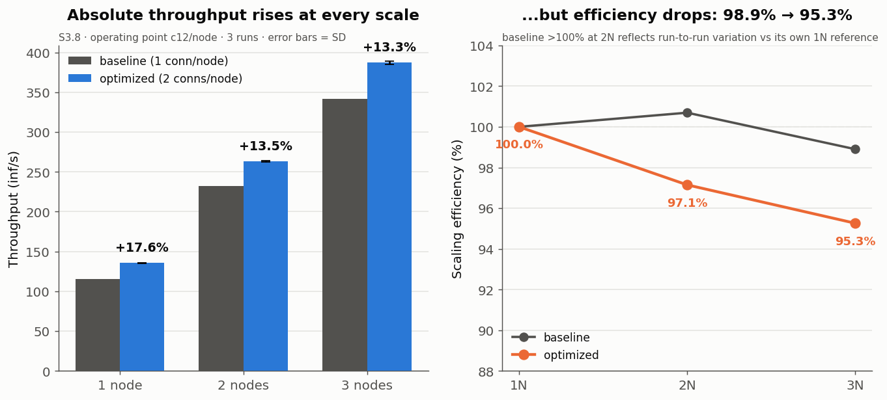

# S3.8 — Optimized gRPC Scale-out

- 실험 ID: **S3.8**
- 측정일: 2026-08-20
- 코드: `0af696d` + `[transport] node_connections = 2`
- 상태: **완료 (36 run, 9/9 구성 노드 수 검증 통과)**
- 원본: [`../../results/scaleout-optimized-20260820/`](../../results/scaleout-optimized-20260820/)
- 선행: [`S3_7_CONNECTION_TUNING.md`](S3_7_CONNECTION_TUNING.md)

---

## 1. Research Question

> **S3.7 이 찾은 노드당 운영점(커넥션 2개 @ c12)이 scale-out 을 해치지 않는가?**

S3.7 은 **1노드** 결과다. 3노드가 되면 스케줄러가 커넥션을 2×3 = 6개 들고
전송량도 3배가 된다. 서버 쪽에 새 병목이 생길 수 있다.

## 2. Method

- **노드 수마다 concurrency 를 다시 훑어 각자의 운영점을 찾는다.**
  고정 concurrency 로 비교하면 configuration effect 가 아니라 overload
  behavior 를 보게 된다(S3.7 §4.3 에서 실제로 겪었다).
- 커넥션은 **노드당 2개** — 1N→2, 2N→4, 3N→6 total.
- 1N: c8/12/16/20 · 2N: c16/24/32/40 · 3N: c24/36/48/60, 각 **3 run**, 60초.
- rep 마다 노드 수 순서와 concurrency 순서를 모두 회전.
- 운영점 정의는 S3.7 과 동일 — **peak 의 98% 이상을 내는 가장 낮은 concurrency**.

### 2.1 측정 전 노드 수 검증 — 실제로 걸렸다

각 구성마다 짧은 probe bench 를 던져 **응답한 노드 ID 분포**를 세고
`expected ≠ observed` 면 그 구성을 건너뛴다.

**1차 실행에서 2N·3N 6개 구성이 전부 걸렸다.**

```text
!! 노드 수 불일치 — expected=2 observed=1 (king). 이 구성 건너뜀
!! 노드 수 불일치 — expected=3 observed=1 (king). 이 구성 건너뜀
```

원인은 `[transport]` 설정을 쓰는 `npuforge-node.s36` 빌드가 **king 에만**
배포돼 있었던 것이다(S3.6 이후 모든 실험이 1노드라 드러나지 않았다).
기동 로직이 `pgrep || 실행` 이라 파일이 없으면 조용히 실패한다.

> **이 검증이 없었다면 1N 을 세 번 재고 "2N·3N" 으로 기록했을 것이다.**
> 그 결과는 2N 136, 3N 136 — "scale-out 이 완전히 무너졌다" 는 정반대
> 결론이 나왔을 것이다. **프로세스가 떠 있다 ≠ 트래픽을 받는다.**

세 보드에 배포 후(해시 `73227f64…` 동일) 재실행 — **9/9 구성 검증 통과**.

## 3. Results

오류율 전 구간 **0**, 노드 간 분배 편차 전 구간 **0.0%p**.
지연은 run-level percentile 의 run 간 평균(pooled 아님, S2 §7.4.1).

### 3.1 노드 수별 곡선

| conc | 1N tp | 1N p95 | | conc | 2N tp | 2N p95 | | conc | 3N tp | 3N p95 |
|---:|---:|---:|---|---:|---:|---:|---|---:|---:|---:|
| 8 | 120.2 | 94.3 | | 16 | 239.9 | 95.5 | | 24 | 354.3 | 98.3 |
| **12** | **135.5** | **120.7** | | **24** | **263.3** | **140.7** | | **36** | **387.2** | **151.1** |
| 16 | 137.4 | 175.8 | | 32 | 262.5 | 237.0 | | 48 | 385.0 | 288.7 |
| 20 | 134.9 | 245.0 | | 40 | 260.6 | 349.7 | | 60 | 385.8 | 407.3 |

세 구성 모두 **범위 안에서 포화가 확인됐다**(peak 양쪽이 더 낮다).
노드당 concurrency 는 셋 다 12 로 같다 — S3.7b 의 knee 가 다노드에서도 유지된다.

### 3.2 운영점 비교

| Nodes | Tot.conn | Op.conc | Throughput | p95 | p99 | Scaling | Efficiency |
|---:|---:|---:|---:|---:|---:|---:|---:|
| **1** | 2 | 12 | **135.5** | 120.7 | 141.0 | 1.00× | 100.0% |
| **2** | 4 | 24 | **263.3** | 140.7 | 172.7 | **1.94×** | **97.1%** |
| **3** | 6 | 36 | **387.2** | 151.1 | 201.6 | **2.86×** | **95.3%** |

### 3.3 baseline 대비

| | baseline (S3 ceiling, conn1) | optimized (S3.8, conn2/node) | 개선 | per-node |
|---|---:|---:|---:|---:|
| 1N | 115.2 | **135.5** | **+17.6%** | 135.5 |
| 2N | 232.0 | **263.3** | **+13.5%** | 131.7 |
| 3N | 341.8 | **387.2** | **+13.3%** | 129.1 |
| scaling | 2.97× (eff 98.9%) | **2.86× (eff 95.3%)** | | |

## 4. Interpretation

### 4.1 절대 처리량은 올랐다 — 3노드 +13.3%

**387.2 inf/s.** 커넥션 설정 한 줄로 얻었고, 오류 0·분배 편차 0.0%p 로
scale-out 자체는 건강하다.

### 4.2 그러나 scaling efficiency 는 조금 내려갔다 (98.9% → 95.3%)

**이 점을 좋게 포장하지 않는다.** 노드당 이득이 노드 수에 따라 줄어든다.

```text
1N  +17.6%   (115.2 → 135.5)
2N  +13.5%   (232.0 → 263.3)
3N  +13.3%   (341.8 → 387.2)
```

노드당 처리량으로 보면 **135.5 → 131.7 → 129.1** 로 단조 감소한다.
1노드 최적화의 효과가 다노드에서 **온전히 보존되지 않는다.**

이상적 3N(135.5×3 = 406.5) 대비 실제 387.2 — **19.3 inf/s 부족**하다.

### 4.3 유력한 후보: 서버 쪽

> ⚠️ **[2026-08-21 철회 — S3.9a]** 아래 "10G 76%" 는 **계산 오류**다.
> **10GbE 는 full-duplex** 라 요청(TX)과 응답(RX)이 각자의 10 Gbps 를 쓰는데,
> 둘을 한 링크 예산에 합산했다. 실측은 **방향당 40.5%** 다(S3.9a §3).
>
> S3.9a 가 서버 자원을 모두 배제했다 — CPU 42%, 링크 방향당 40%, drop 0,
> 스레드 직렬화 없음. **손실은 전적으로 tail 증가**이며 p50 은 평평하다.
> → [S3.9a](S3_9A_SCALEOUT_PROFILE.md)

~~추론당 스케줄러↔노드 전송량은 2,446,800 byte 다. 3N 운영점에서~~

| | baseline 3N | optimized 3N |
|---|---:|---:|
| 처리량 | 341.8 | **387.2** |
| ~~서버 NIC 부하~~ | ~~6.69 Gbps~~ | ~~7.58 Gbps~~ |
| ~~10G 링크 대비~~ | ~~67%~~ | ~~76%~~ |

**위 두 줄은 철회한다.** 양방향 합산은 full-duplex 링크에 적용할 수 없다.

### 4.4 지연은 노드 수에 따라 늘어난다

노드당 부하가 셋 다 12 로 같은데도 운영점 p95 가
**120.7 → 140.7 → 151.1 ms** 로 늘어난다. 노드당 조건이 동일하므로
이 증가분은 **스케줄러 팬아웃 경로**에서 온다고 볼 수 있다. 다만 어느
단계인지는 분해하지 않았다.

## 5. Limitations

- **efficiency 하락의 원인은 미확인**(§4.3). 서버 NIC·CPU·스케줄러 팬아웃 중
  무엇인지 분리하지 않았다. S3.5 와 같은 방식의 **서버 쪽 프로파일**이 필요하다.
- 60초 측정이다. **throttling 발현 전 구간**이므로 지속 부하(S0)에서는
  다를 수 있다.
- concurrency 격자가 성기다(1N 4단위, 3N 12단위). 운영점의 절대값보다
  구성 간 비교에 쓴다.
- percentile 은 run-level 평균(S2 §7.4.1).
- 2노드 조합은 king+queen 하나만 봤다.

## 6. Reproduction

```bash
bash scripts/run-scaleout-optimized.sh 3     # 36 run, 약 50분
PYTHONIOENCODING=utf-8 python scripts/analyze-scaleout.py \
    results/scaleout-optimized-20260820/raw/results.csv
```

> 세 보드에 `npuforge-node.s36`(= `[transport]` 지원 빌드)이 배포돼 있어야
> 한다. 없으면 노드 수 검증이 그 구성을 건너뛴다 — 조용히 틀린 결과를 내는
> 대신 큰 소리로 멈춘다.

## 7. Conclusion

**노드당 운영점(커넥션 2개 @ c12)은 3노드까지 유지되며, 절대 처리량을
341.8 → 387.2 inf/s (+13.3%) 로 끌어올린다.** 오류 0, 분배 균등.

다만 **scaling efficiency 는 98.9% → 95.3% 로 소폭 내려갔고**, 노드당
이득이 +17.6%(1N) → +13.3%(3N) 으로 줄어든다. 1노드 최적화가 다노드에서
온전히 보존되지 않는다는 뜻이다. ~~서버 10G 링크가 76% 까지~~ — **S3.9a 에서 철회**(full-duplex 계산 오류,
실제 방향당 40%). S3.9a 는 서버 자원을 모두 배제하고 손실이 **tail 증가**임을
확인했다.

→ 다음은 **서버 쪽 프로파일**이다. 노드 쪽은 S3.5 에서 했고, 이번엔 서버가
후보로 올라왔다. 그 결과가 나오기 전에는 남은 gap 을 노드 쪽 비용
(protobuf·복사·syscall)으로만 돌리면 안 된다.

---

## Figure



**`fig_scaleout_optimized.png`** — 절대값은 모든 규모에서 오르고 efficiency 는 98.9% → 95.3%

재생성: `python scripts/make-experiment-figures.py`
